# Frame Cookbook

*Prompt Engineer: Mark Truluck <mark@frame-lang.org>*

85 recipes showing how to solve real problems with Frame. Each recipe is a complete, runnable Frame spec with an explanation of the key patterns used.

For language syntax details, see the [Frame Language Reference](frame_language.md). For a tutorial introduction, see [Getting Started](frame_getting_started.md).

## Table of Contents

**Fundamentals (1-8)**

1. [Traffic Light](#1-traffic-light) — basic states and transitions
2. [Toggle Switch](#2-toggle-switch) — two-state with return values
3. [Turnstile](#3-turnstile) — event-driven guard logic
4. [Login Flow](#4-login-flow) — multi-step form wizard
5. [Connection Manager](#5-connection-manager) — lifecycle with enter/exit handlers
6. [Retry with Backoff](#6-retry-with-backoff) — state variables as counters
7. [Modal Dialog Stack](#7-modal-dialog-stack) — push/pop for navigation history
8. [State Stack](#8-state-stack-pushpop) — state stack for history

**Patterns (9-17)**

9. [Video Player](#9-video-player) — HSM with sub-states
10. [Order Processor](#10-order-processor) — business process with branches
11. [Approval Chain](#11-approval-chain) — multi-stage with forwarding
12. [Character Controller](#12-character-controller) — game state machine
13. [AI Agent](#13-ai-agent) — behavioral states with action logging
14. [LED Blink Controller](#14-led-blink-controller) — timer-driven state cycling
15. [Switch Debouncer](#15-switch-debouncer) — noise filtering
16. [Mealy Machine](#16-mealy-machine) — output depends on state + input
17. [Moore Machine](#17-moore-machine) — output depends on state only

**Advanced Features (18-22)**

18. [Session Persistence](#18-session-persistence) — save/restore with @@persist
19. [Async HTTP Client](#19-async-http-client) — async interface with two-phase init
20. [Multi-System Composition](#20-multi-system-composition) — two systems interacting
21. [Configurable Worker Pool](#21-configurable-worker-pool-parameterized-systems) — parameterized systems
22. [Self-Calibrating Sensor](#22-self-calibrating-sensor-self-interface-call) — `@@:self` reentrant dispatch

**Operations and Coverage (23-27)**

23. [Vending Machine](#23-vending-machine--operations-and-system-params) — operations and system params
24. [Circuit Breaker](#24-circuit-breaker--state-variable-reset-on-reentry) — state variable reset on reentry
25. [Rate Limiter](#25-rate-limiter--static-operations) — static operations
26. [Thermostat](#26-thermostat--3-level-hsm) — 3-level HSM
27. [Deployment Pipeline](#27-deployment-pipeline--push-and-enter-args) — push$ and enter args + decorated pop

**System-Managed States (28-29)**

28. [Auth Flow](#28-auth-flow--managed-loginsession) — managed login/session
29. [Game Level Manager](#29-game-level-manager--polymorphic-delegation) — polymorphic delegation

**Advanced Patterns (30-33)**

30. [Graceful Shutdown Service](#30-graceful-shutdown-service--hsm--enter-handler-chain) — HSM + enter-handler chain
31. [Pipeline Processor](#31-pipeline-processor--kernel-loop-validation) — kernel loop validation
32. [Test Harness](#32-test-harness--white-box-testing-with-operations) — white-box testing with operations
33. [AI Coding Agent](#33-ai-coding-agent--capstone) — capstone

**Enterprise Integration Patterns (34-45)**

34. [Idempotent Receiver](#34-idempotent-receiver) — dedupe by message ID
35. [Content-Based Router](#35-content-based-router) — route by message content
36. [Message Filter](#36-message-filter) — accept or drop by predicate
37. [Aggregator](#37-aggregator) — collect a correlation set, emit one message
38. [Resequencer](#38-resequencer) — buffer out-of-order messages, release in order
39. [Circuit Breaker](#39-circuit-breaker) — closed/open/half-open fault isolation
40. [Dead Letter Channel](#40-dead-letter-channel) — bounded retry with persistence
41. [Polling Consumer](#41-polling-consumer) — pull-driven message loop
42. [Process Manager (Saga)](#42-process-manager-saga) — multi-step orchestration with compensation
43. [Competing Consumers](#43-competing-consumers) — dispatcher + worker pool
44. [Message Store](#44-message-store) — audit log persisted across restarts
45. [Migrating Machine](#45-migrating-machine) — state machine as the message

**Protocol & Systems Stress Tests (46-49)**

46. [FIX Buy-Side Order](#46-fix-protocol--buy-side-order-lifecycle) — FIX OrdStatus state machine
47. [FIX Sell-Side Manager](#47-fix-protocol--sell-side-order-manager) — broker-side with buy-side interaction
48. [Launch Sequence Controller](#48-launch-sequence-controller--abort-from-any-phase) — 3-system flight computer with abort
49. [Robot Arm Controller](#49-robot-arm-controller--safety-overlay-with-hsm) — 3-level HSM safety overlay

**Deferred Event Processing (50-52)**

50. [Print Spooler](#50-print-spooler--basic-work-queue) — basic work queue with FIFO dequeue
51. [Manufacturing Cell](#51-manufacturing-cell--priority-queue-with-sub-phases) — priority queue with HSM sub-phases
52. [Elevator](#52-elevator--directional-scan-algorithm) — SCAN algorithm with request accumulation

**Scanner and Parser (53-54)**

53. [Byte Scanner](#53-byte-scanner--tokenize-a-simple-language) — tokenize a simple language
54. [Pushdown Parser](#54-pushdown-parser--nested-structure-with-push--pop) — nested structure with `push$` / `pop$`

**OS Internals (55-63)**

55. [Process Lifecycle](#55-process-lifecycle) — task states, signals, HSM for non-runnable states
56. [Runtime Power Management](#56-runtime-power-management) — enter/exit for timer management, usage counting
57. [Block I/O Request](#57-block-io-request) — request pipeline with timeout and retry
58. [USB Device Enumeration](#58-usb-device-enumeration) — multi-stage pipeline with compensation
59. [Watchdog Timer](#59-watchdog-timer) — magic close guard, high-consequence two-state machine
60. [OOM Killer](#60-oom-killer) — safety by construction, mutual exclusion without locks
61. [Filesystem Freeze](#61-filesystem-freeze) — 3-level HSM for freeze/thaw under a mounted parent
62. [Kernel Module Loader](#62-kernel-module-loader) — pipeline with rollback (saga pattern)
63. [Signal Handler Stack](#63-signal-handler-stack) — `push$` / `pop$` for nested signal frames

**Internet Protocols (64-71)**

64. [DHCP Client](#64-dhcp-client) — timer-driven lease lifecycle from RFC 2131
65. [TLS Handshake](#65-tls-handshake) — two-party protocol with HSM alert handling
66. [Wi-Fi Station Management](#66-wi-fi-station-management) — HSM deauth from any state
67. [BGP Finite State Machine](#67-bgp-finite-state-machine) — RFC 4271 event table transcription
68. [PPP Link Control Protocol](#68-ppp-link-control-protocol) — RFC 1661 state table, layered composition
69. [NTP Client Association](#69-ntp-client-association) — polling backoff and reachability tracking
70. [HTTP/1.1 Connection](#70-http11-connection) — keep-alive lifecycle with HSM error handling
71. [SMTP Conversation](#71-smtp-conversation) — command-response protocol with STARTTLS upgrade

**Scientific and Medical (72-85)**

72. [Phases of Matter](#72-phases-of-matter) — solid/liquid/gas/plasma with latent-heat plateaus
73. [Water with Supercooling](#73-water-with-supercooling) — metastable states
74. [Radioactive Decay Chain](#74-radioactive-decay-chain) — U-238 → Pb-206 sequential states
75. [Cell Cycle with Checkpoints](#75-cell-cycle-with-checkpoints) — G1/S/G2/M with arrest states
76. [Enzyme Kinetics](#76-enzyme-kinetics-michaelis-menten) — E + S ⇌ ES → E + P
77. [Neuron Action Potential](#77-neuron-action-potential) — resting/depolarizing/repolarizing/refractory
78. [Virus Infection Lifecycle (SIR)](#78-virus-infection-lifecycle-sir) — susceptible/infected/recovered
79. [Titration Protocol](#79-titration-protocol) — lab procedure with endpoint as structural gate
80. [PCR Thermal Cycler](#80-pcr-thermal-cycler) — denature/anneal/extend with cycle counting
81. [Infusion Pump](#81-infusion-pump) — safety-critical delivery with HSM alarms
82. [Ventilator Breath Cycle](#82-ventilator-breath-cycle) — inspiration/expiration with assist modes
83. [Defibrillator / AED](#83-defibrillator--aed) — analyze → charge → shock, impossible-by-construction
84. [ACLS Cardiac Arrest Algorithm](#84-acls-cardiac-arrest-algorithm) — shockable vs non-shockable branches
85. [Sepsis Hour-1 Bundle](#85-sepsis-hour-1-bundle) — time-boxed treatment protocol

**Security Protocols (86-95)**

86. [TLS 1.3 Handshake (Client Side)](#86-tls-13-handshake-client-side) — single round-trip with downgrade sentinel detection
87. [OAuth 2.0 Authorization Code + PKCE](#87-oauth-20-authorization-code--pkce) — public-client auth with CSRF + code-stealing defense
88. [WebAuthn / FIDO2 Registration + Authentication](#88-webauthn--fido2-registration--authentication) — passwordless, origin-bound credentials
89. [Multi-Factor Authentication with Lockout](#89-multi-factor-authentication-with-lockout) — password + 2FA + structural lockout
90. [Kerberos Ticket Lifecycle](#90-kerberos-ticket-lifecycle) — TGT/ST issuance with HSM expiry handling
91. [Noise Protocol (XX Handshake)](#91-noise-protocol-xx-handshake) — three-message mutual auth without prior keys
92. [Signal / Double Ratchet Session](#92-signal--double-ratchet-session) — DH + symmetric ratchet with inline rekey
93. [Capability Token (Macaroon-Style)](#93-capability-token-macaroon-style) — bearer token with caveats and discharges
94. [Zero-Trust Session with Continuous Verification](#94-zero-trust-session-with-continuous-verification) — risk-driven session with channel binding
95. [Secure Boot / Measured Boot Chain](#95-secure-boot--measured-boot-chain) — verify-measure-antirollback chain from CRTM

[Why state machines fit security](#why-state-machines-fit-security)

**Robotics and Control (96-109)**

96. [Stepper Motor Driver](#96-stepper-motor-driver--trapezoidal-motion-profile) — trapezoidal motion profile
97. [Servo Homing Sequence](#97-servo-homing-sequence--enter-handler-chain-with-retry) — enter-handler chain with retry
98. [Quadrature Encoder Decoder](#98-quadrature-encoder-decoder--mealy-machine-with-direction) — Mealy machine with direction
99. [PID Loop Supervisor](#99-pid-loop-supervisor--mode-control-around-a-native-control-loop) — mode control around a native control loop
100. [Mobile Base — Teleop/Autonomy with Safety](#100-mobile-base--teleopautonomy-with-safety-bumper) — bumper/cliff as safety overlay
101. [Go-To-Goal with Obstacle Avoidance](#101-go-to-goal-with-obstacle-avoidance--deliberative--reactive-split) — deliberative + reactive split
102. [Dock-and-Charge](#102-dock-and-charge--negotiated-resource-lifecycle) — negotiated resource lifecycle
103. [Multi-Floor Delivery Robot](#103-multi-floor-delivery-robot--elevator-user) — elevator user, multi-system composition
104. [Pick-and-Place with Vision Retry](#104-pick-and-place-with-vision-retry) — capstone manipulation workflow
105. [Tool Changer](#105-tool-changer--interlocked-coupling-sequence) — interlocked coupling sequence
106. [Force-Controlled Insertion](#106-force-controlled-insertion--peg-in-hole) — peg-in-hole with jam detection
107. [Mission Controller (BT Alternative)](#107-mission-controller--bt-alternative-with-persistence) — with `@@persist` for resume
108. [Drone Flight Modes](#108-drone-flight-modes--failsafe-from-any-phase) — failsafe from any phase
109. [Fleet Dispatcher](#109-fleet-dispatcher--n-robots-competing-consumers-for-tasks) — N robots, competing consumers for tasks

[Cross-references to existing cookbook patterns](#cross-references-to-existing-cookbook-patterns)

**Parser Specialists (110)**

110. [Statement Disambiguator](#110-statement-disambiguator--bounded-lookahead-oracle) — bounded-lookahead oracle, kernel-loop chain returning a verdict

-----

## 1. Traffic Light

[top](#table-of-contents) · [↓ down](#2-toggle-switch)

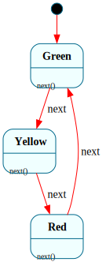

**Problem:** Cycle through a fixed sequence of states on each event.

```frame
@@target python_3

@@system TrafficLight {
    interface:
        next(): str

    machine:
        $Green {
            next(): str {
                @@:("green")
                -> $Yellow
            }
        }
        $Yellow {
            next(): str {
                @@:("yellow")
                -> $Red
            }
        }
        $Red {
            next(): str {
                @@:("red")
                -> $Green
            }
        }
}

if __name__ == '__main__':
    light = @@TrafficLight()
    for _ in range(6):
        print(light.next())
```

**How it works:** Three states form a cycle. Each `next()` call sets the return value via `@@:(expr)` and transitions to the next state. The return value is delivered to the caller after the transition completes.

**Features used:** transitions (`->`), return values

-----

## 2. Toggle Switch

[↑ up](#1-traffic-light) · [top](#table-of-contents) · [↓ down](#3-turnstile)

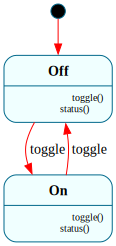

**Problem:** A switch that alternates between on and off.

```frame
@@target python_3

@@system Switch {
    interface:
        toggle(): str
        status(): str

    machine:
        $Off {
            toggle(): str {
                @@:("on")
                -> $On
            }
            status(): str { @@:("off") }
        }
        $On {
            toggle(): str {
                @@:("off")
                -> $Off
            }
            status(): str { @@:("on") }
        }
}

if __name__ == '__main__':
    sw = @@Switch()
    print(sw.status())   # off
    print(sw.toggle())   # on
    print(sw.toggle())   # off
```

**How it works:** Two states, each handling the same events differently. The same `toggle()` call produces different behavior depending on which state the system is in — the core value of state machines.

**Features used:** transitions, return values, multiple states handling the same event

-----

## 3. Turnstile

[↑ up](#2-toggle-switch) · [top](#table-of-contents) · [↓ down](#4-login-flow)

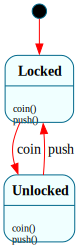

**Problem:** A coin-operated turnstile that locks after each passage.

```frame
@@target python_3

@@system Turnstile {
    interface:
        coin()
        push(): str

    machine:
        $Locked {
            coin() { -> $Unlocked }
            push(): str { @@:("locked - insert coin") }
        }
        $Unlocked {
            coin() { }
            push(): str {
                @@:("welcome")
                -> $Locked
            }
        }
}

if __name__ == '__main__':
    t = @@Turnstile()
    print(t.push())   # locked - insert coin
    t.coin()
    print(t.push())   # welcome
    print(t.push())   # locked - insert coin
```

**How it works:** `coin()` in `$Locked` transitions to `$Unlocked`. `push()` in `$Unlocked` lets you through and re-locks. `coin()` in `$Unlocked` is a no-op (empty handler). `push()` in `$Locked` doesn't transition — just returns a message.

**Features used:** events with no effect (empty handler), guard-by-state

-----

## 4. Login Flow

[↑ up](#3-turnstile) · [top](#table-of-contents) · [↓ down](#5-connection-manager)

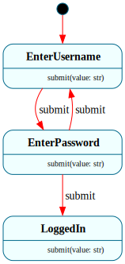

**Problem:** A multi-step login: enter username, enter password, authenticate.

```frame
@@target python_3

@@system LoginFlow {
    interface:
        submit(value: str): str

    machine:
        $EnterUsername {
            submit(value: str): str {
                self.username = value
                @@:("enter password")
                -> $EnterPassword
            }
        }
        $EnterPassword {
            submit(value: str): str {
                if self.authenticate(self.username, value):
                    @@:("welcome")
                    -> "authenticated" $LoggedIn
                else:
                    @@:("invalid - try again")
                    -> "bad credentials" $EnterUsername
            }
        }
        $LoggedIn {
            submit(value: str): str { @@:("already logged in") }
        }

    actions:
        authenticate(user, password) {
            return user == "admin" and password == "secret"
        }

    domain:
        username: str = ""
}

if __name__ == '__main__':
    login = @@LoginFlow()
    print(login.submit("admin"))    # enter password
    print(login.submit("wrong"))    # invalid - try again
    print(login.submit("admin"))    # enter password
    print(login.submit("secret"))   # welcome
```

**How it works:** Each state represents a step in the flow. `submit()` means different things in each state. Domain variable `username` persists across states. The action `authenticate` keeps validation logic out of the handler.

**Features used:** domain variables, actions, conditional transitions

-----

## 5. Connection Manager

[↑ up](#4-login-flow) · [top](#table-of-contents) · [↓ down](#6-retry-with-backoff)

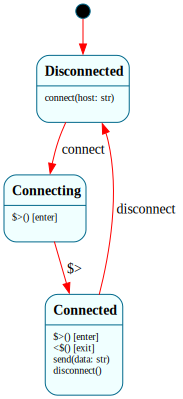

**Problem:** A network connection with proper setup/teardown lifecycle.

```frame
@@target python_3

@@system Connection {
    interface:
        connect(host: str)
        send(data: str): str
        disconnect()

    machine:
        $Disconnected {
            connect(host: str) {
                self.host = host
                -> $Connecting
            }
        }
        $Connecting {
            $>() {
                print(f"Connecting to {self.host}...")
                -> "connected" $Connected
            }
        }
        $Connected {
            $>() { print(f"Connected to {self.host}") }
            <$() { print(f"Disconnecting from {self.host}") }

            send(data: str): str {
                @@:(f"sent '{data}' to {self.host}")
            }
            disconnect() { -> $Disconnected }
        }

    domain:
        host: str = ""
}

if __name__ == '__main__':
    c = @@Connection()
    c.connect("example.com")   # Connecting... Connected
    print(c.send("hello"))     # sent 'hello' to example.com
    c.disconnect()             # Disconnecting...
```

**How it works:** `$>()` (enter) and `<$()` (exit) handlers run automatically during transitions. `$Connecting` transitions immediately in its enter handler — a common "transient state" pattern for setup work. The exit handler on `$Connected` ensures cleanup always happens.

**Features used:** enter/exit handlers, transient states, domain variables

-----

## 6. Retry with Backoff

[↑ up](#5-connection-manager) · [top](#table-of-contents) · [↓ down](#7-modal-dialog-stack)

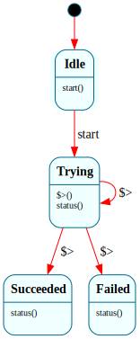

**Problem:** Retry an operation up to N times before failing.

```frame
@@target python_3

@@system Retrier {
    interface:
        start()
        status(): str

    machine:
        $Idle {
            start() {
                self.attempts = 0
                -> $Trying
            }
        }
        $Trying {
            $>() {
                self.attempts = self.attempts + 1
                if self.try_operation():
                    -> "success" $Succeeded
                else:
                    if self.attempts >= self.max_retries:
                        -> "exhausted" $Failed
                    else:
                        -> "retry" $Trying
            }
            status(): str { @@:("trying") }
        }
        $Succeeded {
            status(): str { @@:("succeeded") }
        }
        $Failed {
            status(): str { @@:("failed after max retries") }
        }

    actions:
        try_operation() {
            return False
        }

    domain:
        attempts: int = 0
        max_retries: int = 3
}

if __name__ == '__main__':
    r = @@Retrier()
    r.start()
    print(r.status())
```

**How it works:** The retry counter uses a **domain variable** (`self.attempts`), not a state variable, because state variables reset on every state entry. The enter handler increments the counter and either transitions to success, re-enters `$Trying` for another attempt, or gives up after `max_retries`. Each `-> $Trying` triggers a fresh enter handler call — the domain variable persists across re-entries.

**Features used:** domain variables for cross-state persistence, enter handler logic, self-transition for retry

-----

## 7. Modal Dialog Stack

[↑ up](#6-retry-with-backoff) · [top](#table-of-contents) · [↓ down](#8-state-stack-pushpop)

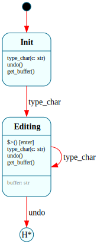

**Problem:** Open nested modal dialogs and return to the previous one on close.

```frame
@@target python_3

@@system DialogManager {
    interface:
        open(name: str)
        close(): str
        current(): str

    machine:
        $Main {
            open(name: str) {
                push$
                -> (name) $Dialog
            }
            current(): str { @@:("main") }
        }
        $Dialog {
            $.name: str = ""

            $>(name: str) { $.name = name }

            open(name: str) {
                push$
                -> (name) $Dialog
            }
            close(): str {
                @@:($.name)
                -> pop$
            }
            current(): str { @@:($.name) }
        }
}

if __name__ == '__main__':
    dm = @@DialogManager()
    print(dm.current())    # main
    dm.open("Settings")
    print(dm.current())    # Settings
    dm.open("Confirm")
    print(dm.current())    # Confirm
    print(dm.close())      # Confirm (closed)
    print(dm.current())    # Settings (restored)
    print(dm.close())      # Settings (closed)
    print(dm.current())    # main (restored)
```

**How it works:** `push$` saves the entire compartment (including state variables) onto the state stack before transitioning. `-> pop$` restores the previously saved compartment. Each dialog instance has its own `$.name` because state variables are per-compartment.

**Features used:** `push$`, `-> pop$`, enter args (`-> (name) $Dialog`), state variables

-----

## 8. State Stack (Push/Pop)

[↑ up](#7-modal-dialog-stack) · [top](#table-of-contents) · [↓ down](#9-video-player)

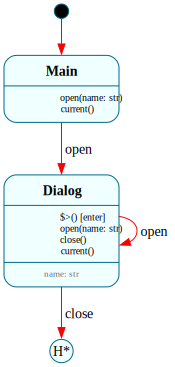

**Problem:** Track state history and allow stepping backward.

```frame
@@target python_3

@@system Editor {
    interface:
        type_char(c: str)
        undo()
        get_buffer(): str

    machine:
        $Editing {
            $.buffer: str = ""

            type_char(c: str) {
                push$
                $.buffer = $.buffer + c
            }
            undo() {
                -> pop$
            }
            get_buffer(): str { @@:($.buffer) }
        }
}

if __name__ == '__main__':
    e = @@Editor()
    e.type_char("H")
    e.type_char("i")
    print(e.get_buffer())   # Hi
    e.undo()
    print(e.get_buffer())   # Hi (reference semantics — same compartment)
```

**How it works:** `push$` saves a **reference** to the current compartment, not a copy. After `push$`, both the stack entry and the current compartment point to the same object. Modifying `$.buffer` after push$ changes the shared compartment, so `-> pop$` restores the same object — the buffer retains its modified value.

For true snapshot undo, use `push$` with a transition (`push$ -> $Editing`) to create a new compartment. The old compartment on the stack preserves its pre-transition state.

**Features used:** `push$`, `-> pop$`, reference semantics

-----

## 9. Video Player

[↑ up](#8-state-stack-pushpop) · [top](#table-of-contents) · [↓ down](#10-order-processor)

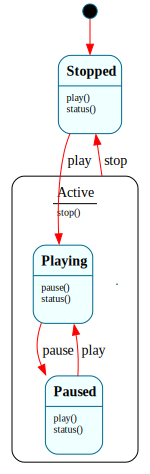

**Problem:** A media player with play/pause/stop, where playing and paused are sub-states of "active."

```frame
@@target python_3

@@system VideoPlayer {
    interface:
        play()
        pause()
        stop()
        status(): str

    machine:
        $Stopped {
            play() { -> $Playing }
            status(): str { @@:("stopped") }
        }
        $Playing => $Active {
            pause() { -> $Paused }
            status(): str { @@:("playing") }
            => $^
        }
        $Paused => $Active {
            play() { -> $Playing }
            status(): str { @@:("paused") }
            => $^
        }
        $Active {
            stop() { -> $Stopped }
        }
}

if __name__ == '__main__':
    vp = @@VideoPlayer()
    print(vp.status())   # stopped
    vp.play()
    print(vp.status())   # playing
    vp.pause()
    print(vp.status())   # paused
    vp.stop()             # handled by $Active (parent)
    print(vp.status())   # stopped
```

**How it works:** `$Playing` and `$Paused` are children of `$Active` (declared with `=>`). The `stop()` event is only handled by `$Active` — children forward it via `=> $^` (default forward). This avoids duplicating the `stop()` handler in both child states.

**Features used:** HSM (`=> $Parent`), default forward (`=> $^`), event delegation

-----

## 10. Order Processor

[↑ up](#9-video-player) · [top](#table-of-contents) · [↓ down](#11-approval-chain)

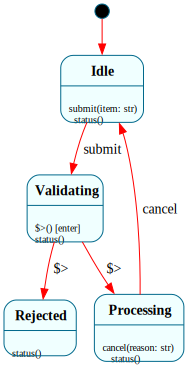

**Problem:** Process an order through validation, processing, and completion — with cancellation support.

```frame
@@target python_3

@@system OrderProcessor {
    interface:
        submit(item: str)
        cancel(reason: str)
        status(): str

    machine:
        $Idle {
            submit(item: str) {
                self.item = item
                -> $Validating
            }
            status(): str { @@:("idle") }
        }
        $Validating {
            $>() {
                if self.validate(self.item):
                    -> "valid" $Processing
                else:
                    -> "invalid" $Rejected
            }
            status(): str { @@:("validating") }
        }
        $Processing {
            cancel(reason: str) {
                print(f"Cancelled: {reason}")
                -> $Idle
            }
            status(): str { @@:("processing") }
        }
        $Rejected {
            status(): str { @@:("rejected") }
        }

    actions:
        validate(item) {
            return item is not None and len(item) > 0
        }

    domain:
        item: str = ""
}

if __name__ == '__main__':
    op = @@OrderProcessor()
    op.submit("widget")
    print(op.status())     # processing
    op.cancel("changed mind")
    print(op.status())     # idle
```

**How it works:** `$Validating` is a transient state — its enter handler immediately transitions based on validation. `cancel()` is only handled in `$Processing` — calling it in other states is a no-op (ignored). This is a key benefit of state machines: events are naturally ignored when they don't apply.

**Features used:** transient states, actions, events ignored in wrong state

-----

## 11. Approval Chain

[↑ up](#10-order-processor) · [top](#table-of-contents) · [↓ down](#12-character-controller)

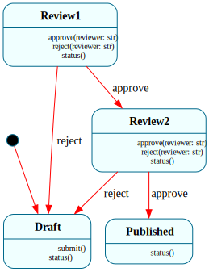

**Problem:** A document requires approval from two reviewers before it's published.

```frame
@@target python_3

@@system ApprovalChain {
    interface:
        submit()
        approve(reviewer: str)
        reject(reviewer: str)
        status(): str

    machine:
        $Draft {
            submit() { -> $Review1 }
            status(): str { @@:("draft") }
        }
        $Review1 {
            approve(reviewer: str) {
                print(f"Approved by {reviewer}")
                -> $Review2
            }
            reject(reviewer: str) {
                print(f"Rejected by {reviewer}")
                -> $Draft
            }
            status(): str { @@:("awaiting first review") }
        }
        $Review2 {
            approve(reviewer: str) {
                print(f"Approved by {reviewer}")
                -> $Published
            }
            reject(reviewer: str) {
                print(f"Rejected by {reviewer}")
                -> $Draft
            }
            status(): str { @@:("awaiting second review") }
        }
        $Published {
            status(): str { @@:("published") }
        }
}

if __name__ == '__main__':
    doc = @@ApprovalChain()
    doc.submit()
    print(doc.status())            # awaiting first review
    doc.approve("Alice")
    print(doc.status())            # awaiting second review
    doc.reject("Bob")
    print(doc.status())            # draft (back to start)
```

**How it works:** Each review stage is a separate state. Rejection at any stage returns to `$Draft`. The same `approve`/`reject` interface serves different stages — the state determines what happens. Events like `submit()` are silently ignored in states that don't handle them.

**Features used:** multi-stage workflow, rejection loops, silent event ignoring

-----

## 12. Character Controller

[↑ up](#11-approval-chain) · [top](#table-of-contents) · [↓ down](#13-ai-agent)

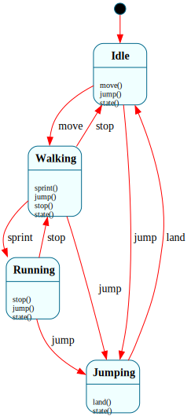

**Problem:** A game character with idle, walking, running, and jumping states.

```frame
@@target python_3

@@system Character {
    interface:
        move()
        sprint()
        jump()
        land()
        stop()
        state(): str

    machine:
        $Idle {
            move() { -> $Walking }
            jump() { -> $Jumping }
            state(): str { @@:("idle") }
        }
        $Walking {
            sprint() { -> $Running }
            jump() { -> $Jumping }
            stop() { -> $Idle }
            state(): str { @@:("walking") }
        }
        $Running {
            stop() { -> $Walking }
            jump() { -> $Jumping }
            state(): str { @@:("running") }
        }
        $Jumping {
            land() { -> $Idle }
            state(): str { @@:("jumping") }
        }
}

if __name__ == '__main__':
    c = @@Character()
    print(c.state())    # idle
    c.move()
    print(c.state())    # walking
    c.sprint()
    print(c.state())    # running
    c.jump()
    print(c.state())    # jumping
    c.move()            # ignored while jumping
    print(c.state())    # jumping
    c.land()
    print(c.state())    # idle
```

**How it works:** The state determines which inputs are accepted. `move()` while jumping is silently ignored — no special code needed. `sprint()` only works from `$Walking`. This is much cleaner than `if (state == "jumping") return;` scattered through imperative code.

**Features used:** state-based input filtering, multiple states with overlapping events

-----

## 13. AI Agent

[↑ up](#12-character-controller) · [top](#table-of-contents) · [↓ down](#14-led-blink-controller)

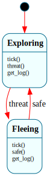

**Problem:** An AI agent that explores, flees from threats, and tracks its actions.

```frame
@@target python_3

@@system Agent {
    interface:
        tick()
        threat()
        safe()
        get_log(): str

    machine:
        $Exploring {
            tick() {
                self.action_log = self.action_log + "explore,"
            }
            threat() {
                self.action_log = self.action_log + "flee,"
                -> $Fleeing
            }
            get_log(): str { @@:(self.action_log) }
        }
        $Fleeing {
            tick() {
                self.action_log = self.action_log + "run,"
            }
            safe() {
                self.action_log = self.action_log + "resume,"
                -> $Exploring
            }
            get_log(): str { @@:(self.action_log) }
        }

    domain:
        action_log: str = ""
}

if __name__ == '__main__':
    a = @@Agent()
    a.tick()
    a.tick()
    a.threat()
    a.tick()
    a.safe()
    print(a.get_log())  # explore,explore,flee,run,resume,
```

**How it works:** Domain variable `action_log` persists across all states. Each state appends its action on `tick()`. Threat/safe events trigger state transitions. Both states handle `get_log()` to return the accumulated log.

**Features used:** domain variables as accumulators, event-driven state transitions

-----

## 14. LED Blink Controller

[↑ up](#13-ai-agent) · [top](#table-of-contents) · [↓ down](#15-switch-debouncer)

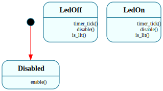

**Problem:** An LED that blinks on a timer, with on/off control.

```frame
@@target python_3

@@system LedBlinker {
    interface:
        enable()
        disable()
        timer_tick()
        is_lit(): bool

    machine:
        $Disabled {
            enable() { -> $LedOff }
        }
        $LedOff {
            timer_tick() { -> $LedOn }
            disable() { -> $Disabled }
            is_lit(): bool { @@:(False) }
        }
        $LedOn {
            timer_tick() { -> $LedOff }
            disable() { -> $Disabled }
            is_lit(): bool { @@:(True) }
        }
}

if __name__ == '__main__':
    led = @@LedBlinker()
    led.enable()
    for i in range(5):
        print(f"tick {i}: {'ON' if led.is_lit() else 'off'}")
        led.timer_tick()
```

**How it works:** External timer calls `timer_tick()`, which toggles between `$LedOn` and `$LedOff`. `disable()` works from either on or off state, returning to `$Disabled` where timer ticks are ignored.

**Features used:** timer-driven transitions, shared events across states

-----

## 15. Switch Debouncer

[↑ up](#14-led-blink-controller) · [top](#table-of-contents) · [↓ down](#16-mealy-machine)

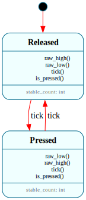

**Problem:** Filter noisy switch input — only register a press after the signal stabilizes.

```frame
@@target python_3

@@system Debouncer {
    interface:
        raw_high()
        raw_low()
        tick()
        is_pressed(): bool

    machine:
        $Released {
            $.stable_count: int = 0

            raw_high() { $.stable_count = $.stable_count + 1 }
            raw_low() { $.stable_count = 0 }
            tick() {
                if $.stable_count >= 3:
                    -> "stable high" $Pressed
            }
            is_pressed(): bool { @@:(False) }
        }
        $Pressed {
            $.stable_count: int = 0

            raw_low() { $.stable_count = $.stable_count + 1 }
            raw_high() { $.stable_count = 0 }
            tick() {
                if $.stable_count >= 3:
                    -> "stable low" $Released
            }
            is_pressed(): bool { @@:(True) }
        }
}

if __name__ == '__main__':
    d = @@Debouncer()
    # Noisy signal: high, low, high, high, high (stabilizes after 3)
    for signal in [1, 0, 1, 1, 1]:
        if signal:
            d.raw_high()
        else:
            d.raw_low()
        d.tick()
    print(d.is_pressed())   # True
```

**How it works:** State variables `$.stable_count` track consecutive consistent readings. A bouncy signal resets the counter. Only after 3 consecutive stable readings does the state transition. State variables reset on entry, so both directions start clean.

**Features used:** state variables as counters, threshold-based transitions

-----

## 16. Mealy Machine

[↑ up](#15-switch-debouncer) · [top](#table-of-contents) · [↓ down](#17-moore-machine)

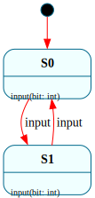

**Problem:** Output depends on both the current state AND the input (classic Mealy machine).

```frame
@@target python_3

@@system MealyDetector {
    interface:
        input(bit: int): str

    machine:
        $S0 {
            input(bit: int): str {
                if bit == 1:
                    @@:("0")
                    -> "bit=1" $S1
                else:
                    @@:("0")
            }
        }
        $S1 {
            input(bit: int): str {
                if bit == 0:
                    @@:("1")
                    -> "bit=0" $S0
                else:
                    @@:("0")
            }
        }
}

if __name__ == '__main__':
    m = @@MealyDetector()
    for bit in [1, 0, 1, 1, 0]:
        print(f"in={bit} out={m.input(bit)}")
```

**How it works:** The output ("0" or "1") depends on BOTH the current state and the input bit. In `$S1`, receiving `0` outputs "1" (detected the pattern "10"). This is a sequence detector — it finds "10" patterns in a bitstream.

**Features used:** conditional transitions with different return values per branch

-----

## 17. Moore Machine

[↑ up](#16-mealy-machine) · [top](#table-of-contents) · [↓ down](#18-session-persistence)


**Problem:** Output depends only on the current state (classic Moore machine).

```frame
@@target python_3

@@system MooreParity {
    interface:
        input(bit: int)
        output(): str

    machine:
        $Even {
            input(bit: int) {
                if bit == 1:
                    -> "bit=1" $Odd
            }
            output(): str { @@:("even") }
        }
        $Odd {
            input(bit: int) {
                if bit == 1:
                    -> "bit=1" $Even
            }
            output(): str { @@:("odd") }
        }
}

if __name__ == '__main__':
    m = @@MooreParity()
    for bit in [1, 0, 1, 1, 0]:
        m.input(bit)
        print(f"in={bit} parity={m.output()}")
```

**How it works:** `output()` returns the same value regardless of input — it only depends on which state the system is in. This is a parity checker: it tracks whether an even or odd number of 1s have been seen.

**Features used:** state-determined output, input processing separated from output

-----

## 18. Session Persistence

[↑ up](#17-moore-machine) · [top](#table-of-contents) · [↓ down](#19-async-http-client)

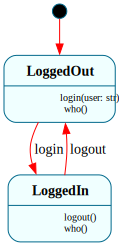

**Problem:** Save a user session to disk and restore it later.

```frame
@@target python_3

@@persist
@@system Session {
    interface:
        login(user: str)
        logout()
        who(): str

    machine:
        $LoggedOut {
            login(user: str) {
                self.user = user
                -> $LoggedIn
            }
            who(): str { @@:("nobody") }
        }
        $LoggedIn {
            logout() {
                self.user = ""
                -> $LoggedOut
            }
            who(): str { @@:(self.user) }
        }

    domain:
        user: str = ""
}

if __name__ == '__main__':
    s = @@Session()
    s.login("alice")
    print(s.who())               # alice

    # Save
    data = s.save_state()

    # Restore into a new instance
    s2 = Session.restore_state(data)
    print(s2.who())              # alice (state preserved)
```

**How it works:** `@@persist` generates `save_state()` and `restore_state()`. The saved data includes the current state (`$LoggedIn`), domain variables (`user = "alice"`), and the state stack. Restore does NOT fire the enter handler — it reconstructs the exact state.

**Features used:** `@@persist`, save/restore, domain variables

-----

## 19. Async HTTP Client

[↑ up](#18-session-persistence) · [top](#table-of-contents) · [↓ down](#20-multi-system-composition)

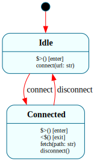

**Problem:** An HTTP client with async connect/fetch/disconnect.

```frame
@@target python_3

import aiohttp
import asyncio

@@system HttpClient {
    interface:
        async connect(url: str)
        async fetch(path: str): str
        async disconnect()

    machine:
        $Idle {
            $>() {
                print("Ready")
            }
            connect(url: str) {
                self.base_url = url
                -> $Connected
            }
        }
        $Connected {
            $>() { print(f"Connected to {self.base_url}") }
            <$() { print("Closing connection") }

            fetch(path: str): str {
                async with aiohttp.ClientSession() as session:
                    async with session.get(self.base_url + path) as resp:
                        return await resp.text()
            }
            disconnect() { -> $Idle }
        }

    domain:
        base_url: str = ""
}

async def main():
    client = @@HttpClient()
    await client.init()          # async two-phase init
    await client.connect("https://example.com")
    html = await client.fetch("/")
    print(f"Got {len(html)} bytes")
    await client.disconnect()

asyncio.run(main())
```

**How it works:** `async` on interface methods makes the entire dispatch chain async. The constructor is synchronous — `await client.init()` fires the enter event separately (two-phase init). Native `await` in handler bodies works because the generated methods are async.

**Features used:** `async` interface methods, two-phase init, native async code in handlers

-----

## 20. Multi-System Composition

[↑ up](#19-async-http-client) · [top](#table-of-contents) · [↓ down](#21-configurable-worker-pool-parameterized-systems)


**Problem:** A logger and an app as separate systems, with the app using the logger.

```frame
@@target python_3

@@system Logger {
    interface:
        log(msg: str)

    machine:
        $Active {
            log(msg: str) {
                print(f"[LOG] {msg}")
            }
        }
}

@@system App {
    interface:
        start()
        stop()

    machine:
        $Idle {
            start() {
                self.logger.log("App starting")
                -> $Running
            }
        }
        $Running {
            $>() { self.logger.log("App running") }
            stop() {
                self.logger.log("App stopping")
                -> $Idle
            }
        }

    domain:
        logger = @@Logger()
}

if __name__ == '__main__':
    app = @@App()
    app.start()
    app.stop()
```

**How it works:** Two `@@system` blocks in one file generate two independent classes. `@@Logger()` in the domain section instantiates the logger as a domain variable. Systems interact through their public interfaces — they don't share state.

**Features used:** multi-system files, `@@SystemName()` instantiation, domain variable initialization

> **Note:** Java and Erlang require one system per file. For these targets, split Logger and App into separate source files and import/require the dependency.

-----

## 21. Configurable Worker Pool (Parameterized Systems)

[↑ up](#20-multi-system-composition) · [top](#table-of-contents) · [↓ down](#22-self-calibrating-sensor-self-interface-call)

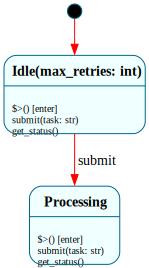

A task executor whose pool size and retry policy are set at construction time. Domain, state, and enter parameters flow through the constructor to initialize the machine.

```frame
@@target python_3

@@system WorkerPool($(max_retries: int), $>(start_msg: str), pool_size: int) {
    interface:
        submit(task: str)
        get_status(): str

    machine:
        $Idle(max_retries: int) {
            $>(start_msg: str) {
                print(f"Pool ready: {start_msg}")
            }

            submit(task: str) {
                self.pending.append(task)
                if len(self.pending) >= self.pool_size:
                    -> "batch full" $Processing
            }

            get_status(): str {
                @@:(f"idle ({len(self.pending)}/{self.pool_size} pending)")
            }
        }

        $Processing {
            $>() {
                print(f"Processing batch of {len(self.pending)} tasks")
                self.pending.clear()
            }

            submit(task: str) {
                self.pending.append(task)
            }

            get_status(): str {
                @@:("processing")
            }
        }

    domain:
        pool_size: int = pool_size
        pending: list = []
}

if __name__ == '__main__':
    pool = @@WorkerPool($(5), $>("v1.0"), 3)
    pool.submit("task_a")
    print(pool.get_status())    # "idle (1/3 pending)"
    pool.submit("task_b")
    pool.submit("task_c")
    print(pool.get_status())    # "processing"
```

**Features used:** system parameters (state, enter, domain), sigil-tagged call-site syntax, `@@:(expr)` context return, state transitions triggered by threshold

-----

## 22. Self-Calibrating Sensor (@@:self Interface Call)

[↑ up](#21-configurable-worker-pool-parameterized-systems) · [top](#table-of-contents) · [↓ down](#23-vending-machine--operations-and-system-params)

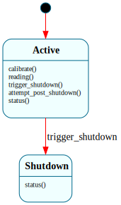

**Problem:** A sensor that calibrates itself by reading its own value through the interface, then applying an offset.

```frame
@@target python_3

@@system Sensor {
    interface:
        calibrate(): str
        reading(): float
        trigger_shutdown()
        attempt_post_shutdown(): str
        status(): str

    machine:
        $Active {
            calibrate(): str {
                baseline = @@:self.reading()
                self.offset = baseline * -1
                @@:(f"calibrated: offset={self.offset}")
            }

            reading(): float {
                @@:(self.raw_value + self.offset)
            }

            trigger_shutdown() {
                -> $Shutdown
            }

            attempt_post_shutdown(): str {
                self.trace = "before"
                @@:self.trigger_shutdown()
                self.trace = "after"
                @@:(self.trace)
            }

            status(): str { @@:(@@:system.state) }
        }

        $Shutdown {
            status(): str { @@:(@@:system.state) }
        }

    domain:
        raw_value: float = 42.0
        offset: float = 0.0
        trace: str = ""
}

if __name__ == '__main__':
    s = @@Sensor()
    print(s.reading())       # 42.0
    print(s.calibrate())     # calibrated: offset=-42.0
    print(s.reading())       # 0.0

    s2 = @@Sensor()
    s2.attempt_post_shutdown()
    print(s2.trace)          # "before" — "after" was suppressed
    print(s2.status())       # "Shutdown" (via @@:system.state)
```

**How it works:** `@@:self.reading()` dispatches through the full kernel pipeline. The return value is available as a native expression.

**Transition guard:** In `attempt_post_shutdown()`, calling `@@:self.trigger_shutdown()` transitions to `$Shutdown`. When control returns, the guard detects the transition and suppresses remaining code — `self.trace = "after"` never executes because the system is no longer in `$Active`.

**Features used:** `@@:self.method()`, reentrant dispatch, return value from self-call, transition guard, `@@:system.state`

-----

## 23. Vending Machine — Operations and System Params

[↑ up](#22-self-calibrating-sensor-self-interface-call) · [top](#table-of-contents) · [↓ down](#24-circuit-breaker--state-variable-reset-on-reentry)

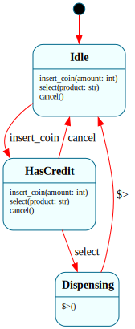

**Problem:** A vending machine with admin operations that bypass the state machine.

```frame
@@target python_3

@@system VendingMachine(inventory: dict = {}) {
    operations:
        stock(product: str, qty: int) {
            self.inventory[product] = self.inventory.get(product, 0) + qty
        }
        check_stock(product: str): int {
            return self.inventory.get(product, 0)
        }

    interface:
        insert_coin(amount: int)
        select(product: str): str = "error"
        cancel(): int = 0

    machine:
        $Idle {
            insert_coin(amount: int) {
                self.balance = amount
                -> $HasCredit
            }
            select(product: str): str { @@:("insert coin first") }
            cancel(): int { @@:(0) }
        }
        $HasCredit {
            insert_coin(amount: int) {
                self.balance = self.balance + amount
            }
            select(product: str): str {
                price = self.get_price(product)
                if price is None:
                    @@:("unknown product")
                elif self.balance < price:
                    @@:(f"need {price - self.balance} more")
                elif self.inventory.get(product, 0) <= 0:
                    @@:("sold out")
                else:
                    self.inventory[product] = self.inventory[product] - 1
                    self.balance = self.balance - price
                    @@:(f"dispensing {product}")
                    -> "paid" $Dispensing
            }
            cancel(): int {
                refund = self.balance
                self.balance = 0
                @@:(refund)
                -> "refund" $Idle
            }
        }
        $Dispensing {
            $>() {
                change = self.balance
                self.balance = 0
                if change > 0:
                    print(f"Change: {change}")
                -> "give change" $Idle
            }
        }

    actions:
        get_price(product) {
            prices = {"cola": 100, "chips": 75, "water": 50}
            return prices.get(product)
        }

    domain:
        balance: int = 0
        inventory: dict = {}
}

if __name__ == '__main__':
    vm = @@VendingMachine(inventory={"cola": 2, "chips": 1})
    vm.stock("water", 5)
    print(f"Water stock: {vm.check_stock('water')}")  # 5
    print(vm.select("cola"))       # insert coin first
    vm.insert_coin(100)
    print(vm.select("cola"))       # dispensing cola
```

**Features stressed:** operations (bypass state machine), system params (domain overrides), transient state (`$Dispensing`), actions with native return

-----

## 24. Circuit Breaker — State Variable Reset on Reentry

[↑ up](#23-vending-machine--operations-and-system-params) · [top](#table-of-contents) · [↓ down](#25-rate-limiter--static-operations)

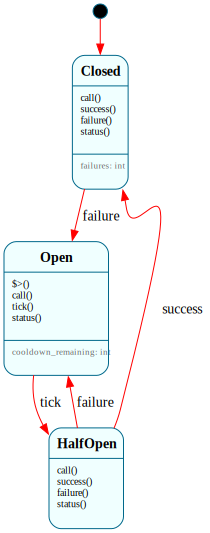

**Problem:** A circuit breaker where the failure counter resets each time we re-enter the closed state.

```frame
@@target python_3

@@system CircuitBreaker {
    interface:
        call(): str = "error"
        success()
        failure()
        tick()
        status(): str = ""

    machine:
        $Closed {
            $.failures: int = 0

            call(): str { @@:("allowed") }
            success() { $.failures = 0 }
            failure() {
                $.failures = $.failures + 1
                if $.failures >= self.threshold:
                    -> "tripped" $Open
            }
            status(): str { @@:(f"closed ({$.failures} failures)") }
        }
        $Open {
            $.cooldown_remaining: int = 0

            $>() {
                $.cooldown_remaining = self.cooldown
                print(f"Circuit OPEN — cooling down for {self.cooldown} ticks")
            }
            call(): str { @@:("blocked") }
            tick() {
                $.cooldown_remaining = $.cooldown_remaining - 1
                if $.cooldown_remaining <= 0:
                    -> "cooled down" $HalfOpen
            }
            status(): str { @@:(f"open ({$.cooldown_remaining} ticks left)") }
        }
        $HalfOpen {
            call(): str { @@:("testing") }
            success() {
                print("Circuit recovered")
                -> "recovered" $Closed
            }
            failure() {
                print("Still failing")
                -> "relapse" $Open
            }
            status(): str { @@:("half-open") }
        }

    domain:
        threshold: int = 3
        cooldown: int = 5
}

if __name__ == '__main__':
    cb = @@CircuitBreaker()
    cb.failure(); cb.failure(); cb.failure()  # Circuit OPEN
    print(cb.call())       # blocked
    for _ in range(5): cb.tick()
    cb.success()            # recovered
    print(cb.status())     # closed (0 failures)
```

**Features stressed:** state variable reset on reentry, state vars vs domain vars contrast

-----

## 25. Rate Limiter — Static Operations

[↑ up](#24-circuit-breaker--state-variable-reset-on-reentry) · [top](#table-of-contents) · [↓ down](#26-thermostat--3-level-hsm)

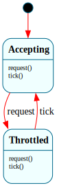

**Problem:** A token bucket rate limiter with a static utility function.

```frame
@@target python_3

@@system RateLimiter {
    operations:
        static tokens_for_rate(rps: int, interval_ms: int): int {
            return max(1, (rps * interval_ms) // 1000)
        }
        tokens_remaining(): int {
            return self.tokens
        }

    interface:
        request(): str = "error"
        tick()

    machine:
        $Accepting {
            request(): str {
                self.tokens = self.tokens - 1
                @@:("accepted")
                if self.tokens <= 0:
                    -> "exhausted" $Throttled
            }
            tick() { self.tokens = min(self.tokens + 1, self.max_tokens) }
        }
        $Throttled {
            request(): str { @@:("throttled") }
            tick() {
                self.tokens = self.tokens + 1
                if self.tokens > 0:
                    -> "replenished" $Accepting
            }
        }

    domain:
        tokens: int = 10
        max_tokens: int = 10
}

if __name__ == '__main__':
    print(RateLimiter.tokens_for_rate(100, 50))  # static — no instance needed
    rl = @@RateLimiter()
    for i in range(12):
        print(f"{i+1}: {rl.request()} ({rl.tokens_remaining()} left)")
```

**Features stressed:** `static` keyword on operations, instance operations, `@@:(expr)` return

-----

## 26. Thermostat — 3-Level HSM

[↑ up](#25-rate-limiter--static-operations) · [top](#table-of-contents) · [↓ down](#27-deployment-pipeline--push-and-enter-args)

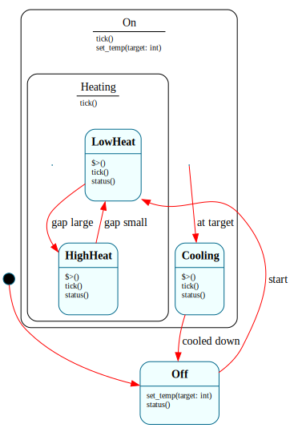

**Problem:** A smart thermostat with three hierarchy levels.

```frame
@@target python_3

@@system Thermostat {
    interface:
        set_temp(target: int)
        tick()
        status(): str = "unknown"

    machine:
        $Off {
            set_temp(target: int) {
                self.target = target
                -> "start" $LowHeat
            }
            status(): str { @@:("off") }
        }
        $LowHeat => $Heating {
            $>() { print("Low heat on") }
            tick() {
                if self.target - self.current > 5:
                    -> "gap large" $HighHeat
            }
            status(): str { @@:(f"low heat ({self.current} to {self.target})") }
            => $^
        }
        $HighHeat => $Heating {
            $>() { print("High heat on") }
            tick() {
                if self.target - self.current <= 3:
                    -> "gap small" $LowHeat
            }
            status(): str { @@:(f"high heat ({self.current} to {self.target})") }
            => $^
        }
        $Heating => $On {
            tick() {
                self.current = self.current + 1
                => $^
            }
        }
        $On {
            tick() {
                if self.current >= self.target:
                    -> "at target" $Cooling
            }
            set_temp(target: int) { self.target = target }
        }
        $Cooling => $On {
            $>() { print("Cooling") }
            tick() {
                self.current = self.current - 1
                if self.current <= self.target:
                    -> "cooled down" $Off
            }
            status(): str { @@:(f"cooling ({self.current} to {self.target})") }
            => $^
        }

    domain:
        current: int = 65
        target: int = 65
}

if __name__ == '__main__':
    t = @@Thermostat()
    t.set_temp(75)
    for _ in range(12):
        t.tick()
        print(t.status())
```

**Features stressed:** 3-level HSM hierarchy, default forward vs in-handler forward, event inheritance through parent chain

-----

## 27. Deployment Pipeline — push$ and Enter Args

[↑ up](#26-thermostat--3-level-hsm) · [top](#table-of-contents) · [↓ down](#28-auth-flow--managed-loginsession)

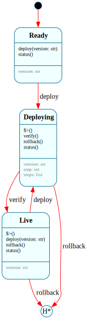

**Problem:** A deployment pipeline with rollback via push$/pop$, using decorated pop to signal rollback reason.

```frame
@@target python_3

@@system Deployer {
    interface:
        deploy(version: str)
        verify(): str = ""
        rollback(): str = ""
        status(): str = ""

    machine:
        $Ready {
            $.version: str = "none"
            deploy(version: str) {
                push$
                -> (version) $Deploying
            }
            status(): str { @@:(f"ready (v{$.version})") }
        }
        $Deploying {
            $.version: str = ""
            $.step: int = 0
            $.steps: list = []

            $>(version: str) {
                $.version = version
                $.steps = ["provision", "configure", "migrate", "healthcheck"]
                print(f"Deploying v{version}...")
            }
            verify(): str {
                if $.step < len($.steps):
                    current = $.steps[$.step]
                    $.step = $.step + 1
                    @@:(f"ok {current}")
                else:
                    @@:("all passed")
                    -> ($.version) $Live
            }
            rollback(): str {
                @@:(f"rolling back v{$.version}")
                ("deployment_aborted") -> pop$
            }
            status(): str { @@:(f"deploying v{$.version}") }
        }
        $Live {
            $.version: str = ""
            $>(version: str) {
                $.version = version
                print(f"v{version} is live")
            }
            deploy(version: str) {
                push$
                -> (version) $Deploying
            }
            rollback(): str {
                @@:(f"rolling back from v{$.version}")
                ("version_reverted") -> pop$
            }
            status(): str { @@:(f"live (v{$.version})") }
        }
}

if __name__ == '__main__':
    d = @@Deployer()
    d.deploy("1.0")
    for _ in range(4): print(d.verify())
    print(d.status())      # live (v1.0)
    d.deploy("2.0")
    print(d.verify())      # ok provision
    print(d.rollback())    # rolling back v2.0
    print(d.status())      # live (v1.0)
```

**How it works:** `push$` saves the current compartment before deploying. `-> (version) $Deploying` passes the version as enter args. `("deployment_aborted") -> pop$` is a **decorated pop** — it writes exit args on the leaving compartment before popping. The restored state gets back its original state variables intact.

**Other decorated pop forms:**
- `-> (enter_args) pop$` — replace the popped compartment's enter args
- `-> => pop$` — forward the current event to the restored state
- `(exit) -> (enter) => pop$` — all three combined

**Features stressed:** `push$`, `-> pop$`, enter args, decorated pop with exit args, state variables with list type

-----

## 28. Auth Flow — Managed Login/Session

[↑ up](#27-deployment-pipeline--push-and-enter-args) · [top](#table-of-contents) · [↓ down](#29-game-level-manager--polymorphic-delegation)

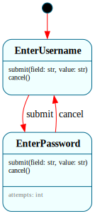

**Problem:** `$LoggedOut` creates a LoginManager; `$LoggedIn` creates a SessionManager. Managers are state variables — their lifecycle matches the state.

```frame
@@target python_3

@@system LoginManager {
    interface:
        submit(field: str, value: str): str = ""
        cancel()

    machine:
        $EnterUsername {
            submit(field: str, value: str): str {
                if field == "username":
                    self.username = value
                    @@:("enter password")
                    -> "accepted" $EnterPassword
                @@:("enter username")
            }
            cancel() { self.parent.auth_cancelled() }
        }
        $EnterPassword {
            $.attempts: int = 0
            submit(field: str, value: str): str {
                if field == "password":
                    if self.username == "admin" and value == "secret":
                        self.parent.auth_succeeded(self.username)
                        @@:return("authenticated")
                    $.attempts = $.attempts + 1
                    if $.attempts >= 3:
                        self.parent.auth_locked(self.username)
                        @@:return("account locked")
                    @@:return(f"wrong ({3 - $.attempts} left)")
                @@:("enter password")
            }
            cancel() { -> $EnterUsername }
        }

    domain:
        parent = None
        username: str = ""
}

@@system SessionManager {
    interface:
        tick()
        activity()
        request_logout()

    machine:
        $Active {
            $.idle_ticks: int = 0
            tick() {
                $.idle_ticks = $.idle_ticks + 1
                if $.idle_ticks >= self.timeout_ticks:
                    self.parent.session_ended("timeout")
            }
            activity() { $.idle_ticks = 0 }
            request_logout() { self.parent.session_ended("logout") }
        }

    domain:
        parent = None
        timeout_ticks: int = 10
}

@@system App {
    interface:
        submit(field: str, value: str): str = ""
        cancel()
        tick()
        activity()
        logout()
        auth_succeeded(username: str)
        auth_cancelled()
        auth_locked(username: str)
        session_ended(reason: str)
        status(): str = ""

    machine:
        $LoggedOut {
            $.login_mgr = None
            $>() {
                $.login_mgr = @@LoginManager()
                $.login_mgr.parent = self
            }
            <$() { $.login_mgr = None }

            submit(field: str, value: str): str { @@:($.login_mgr.submit(field, value)) }
            cancel() { $.login_mgr.cancel() }
            auth_succeeded(username: str) {
                self.current_user = username
                -> "login ok" $LoggedIn
            }
            auth_cancelled() { print("[App] Cancelled") }
            auth_locked(username: str) { -> "locked out" $Locked }
            status(): str { @@:("logged out") }
        }
        $LoggedIn {
            $.session_mgr = None
            $>() {
                $.session_mgr = @@SessionManager()
                $.session_mgr.parent = self
            }
            <$() { $.session_mgr = None }

            tick() { $.session_mgr.tick() }
            activity() { $.session_mgr.activity() }
            logout() { $.session_mgr.request_logout() }
            session_ended(reason: str) {
                self.current_user = ""
                -> $LoggedOut
            }
            status(): str { @@:(f"logged in as {self.current_user}") }
        }
        $Locked {
            status(): str { @@:("locked") }
        }

    domain:
        current_user: str = ""
}

if __name__ == '__main__':
    app = @@App()
    print(app.submit("username", "admin"))   # enter password
    print(app.submit("password", "secret"))  # authenticated
    print(app.status())                       # logged in as admin
    app.logout()
    print(app.status())                       # logged out
```

**Features stressed:** state variables for manager refs, multi-system composition, `@@:return(expr)` exit sugar, manager-to-parent callback

-----

## 29. Game Level Manager — Polymorphic Delegation

[↑ up](#28-auth-flow--managed-loginsession) · [top](#table-of-contents) · [↓ down](#30-graceful-shutdown-service--hsm--enter-handler-chain)

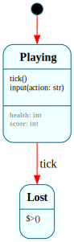

**Problem:** Different level types created per config. Re-entering `$InLevel` automatically swaps managers.

```frame
@@target python_3

import random

@@system SurvivalLevel {
    interface:
        tick()
        input(action: str): str = ""

    machine:
        $Playing {
            $.health: int = 100
            $.score: int = 0

            tick() {
                $.health = $.health - random.randint(0, 10)
                if $.health <= 0:
                    self.final_score = $.score
                    -> "died" $Lost
            }
            input(action: str): str {
                if action == "attack":
                    $.score = $.score + 10
                    @@:(f"attack! score={$.score}")
            }
        }
        $Lost {
            $>() {
                print("You died!")
                self.parent.level_complete(False, self.final_score)
            }
        }

    domain:
        parent = None
        final_score: int = 0
}

@@system Game {
    interface:
        start()
        tick()
        input(action: str): str = ""
        level_complete(won: bool, score: int)
        status(): str = ""

    machine:
        $MainMenu {
            start() {
                self.total_score = 0
                -> $InLevel
            }
            status(): str { @@:("main menu") }
        }
        $InLevel {
            $.level_mgr = None
            $>() {
                print(f"\n=== Level {self.level_index + 1} ===")
                $.level_mgr = @@SurvivalLevel()
                $.level_mgr.parent = self
            }
            <$() { $.level_mgr = None }

            tick() { $.level_mgr.tick() }
            input(action: str): str { @@:($.level_mgr.input(action)) }
            level_complete(won: bool, score: int) {
                self.total_score = self.total_score + score
                if won:
                    self.level_index = self.level_index + 1
                    -> "next level" $InLevel
                else:
                    -> "game over" $GameOver
            }
        }
        $GameOver {
            $>() { print(f"\nGAME OVER — Score: {self.total_score}") }
            status(): str { @@:(f"game over ({self.total_score})") }
        }

    domain:
        level_index: int = 0
        total_score: int = 0
}

if __name__ == '__main__':
    random.seed(42)
    game = @@Game()
    game.start()
    for _ in range(10):
        game.tick()
        print(game.input("attack"))
    print(game.status())
```

**Features stressed:** `$.level_mgr` state variable, re-entry (`-> $InLevel`) creates fresh manager, polymorphic delegation

-----

## 30. Graceful Shutdown Service — HSM + Enter-Handler Chain

[↑ up](#29-game-level-manager--polymorphic-delegation) · [top](#table-of-contents) · [↓ down](#31-pipeline-processor--kernel-loop-validation)

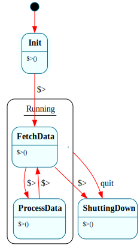

**Problem:** A long-running service where the constructor never returns. HSM provides shared quit logic.

```frame
@@target python_3

@@system Worker {
    interface:
        quit()

    machine:
        $Init {
            $>() {
                print("[Worker] Starting...")
                -> "begin" $FetchData
            }
        }
        $FetchData => $Running {
            $>() {
                if self.cycles >= self.max_cycles:
                    -> "done" $ShuttingDown
                print(f"[Worker] Fetch (cycle {self.cycles + 1})")
                self.cycles = self.cycles + 1
                -> "process" $ProcessData
            }
            => $^
        }
        $ProcessData => $Running {
            $>() {
                print(f"[Worker] Process (cycle {self.cycles})")
                -> "fetch next" $FetchData
            }
            => $^
        }
        $Running {
            quit() {
                print(f"[Worker] Quit after {self.cycles} cycles")
                -> $ShuttingDown
            }
        }
        $ShuttingDown {
            $>() {
                print("[Worker] Cleanup...")
                print("[Worker] Goodbye.")
            }
        }

    domain:
        cycles: int = 0
        max_cycles: int = 3
}

if __name__ == '__main__':
    w = @@Worker()
    print(f"Worker ran {w.cycles} cycles")
```

**How it works:** The constructor triggers `$Init.$>()` which chains to `$FetchData.$>()` -> `$ProcessData.$>()` -> `$FetchData.$>()` -> ... through the kernel loop. The call stack stays flat — each enter handler sets `__next_compartment` and returns; the kernel processes transitions iteratively. After `max_cycles`, `$FetchData` transitions to `$ShuttingDown` instead. HSM means `$FetchData` and `$ProcessData` both forward `quit()` to `$Running` via `=> $^` — add more stages without touching quit logic.

**Features stressed:** enter-handler chain (kernel loop), HSM for shared `quit()`, cycle-bounded service pattern

-----

## 31. Pipeline Processor — Kernel Loop Validation

[↑ up](#30-graceful-shutdown-service--hsm--enter-handler-chain) · [top](#table-of-contents) · [↓ down](#32-test-harness--white-box-testing-with-operations)

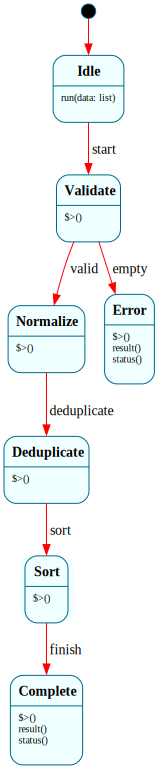

**Problem:** Data flows through 5 stages via enter-handler transitions in a single interface call.

```frame
@@target python_3

@@system Pipeline {
    interface:
        run(data: list)
        result(): list = []
        status(): str = ""

    machine:
        $Idle {
            run(data: list) {
                self.data = data
                self.log = []
                -> "start" $Validate
            }
        }
        $Validate {
            $>() {
                self.log.append("validate")
                self.data = [x for x in self.data if x is not None and x != ""]
                if len(self.data) == 0:
                    -> "empty" $Error
                else:
                    -> "valid" $Normalize
            }
        }
        $Normalize {
            $>() {
                self.log.append("normalize")
                self.data = [str(x).lower().strip() for x in self.data]
                -> "deduplicate" $Deduplicate
            }
        }
        $Deduplicate {
            $>() {
                self.log.append("deduplicate")
                seen = set()
                unique = []
                for item in self.data:
                    if item not in seen:
                        seen.add(item)
                        unique.append(item)
                self.data = unique
                -> "sort" $Sort
            }
        }
        $Sort {
            $>() {
                self.log.append("sort")
                self.data = sorted(self.data)
                -> "finish" $Complete
            }
        }
        $Complete {
            $>() { print(f"Pipeline: {len(self.data)} items") }
            result(): list { @@:(self.data) }
            status(): str { @@:(' -> '.join(self.log)) }
        }
        $Error {
            $>() { print("Pipeline error: empty input") }
            result(): list { @@:([]) }
            status(): str { @@:("error") }
        }

    domain:
        data: list = []
        log: list = []
}

if __name__ == '__main__':
    p = @@Pipeline()
    p.run(["Banana", " apple ", "CHERRY", "apple", None, "banana"])
    print(p.result())    # ['apple', 'banana', 'cherry']
    print(p.status())    # validate -> normalize -> deduplicate -> sort -> complete
```

**Features stressed:** 5-stage enter-handler chain, kernel loop validation, conditional early exit to `$Error`

-----

## 32. Test Harness — White-Box Testing with Operations

[↑ up](#31-pipeline-processor--kernel-loop-validation) · [top](#table-of-contents) · [↓ down](#33-ai-coding-agent--capstone)

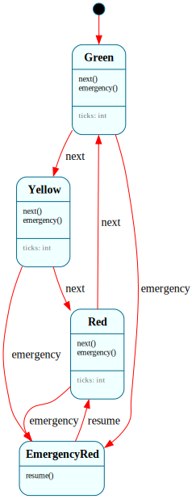

**Problem:** A system with operations for test inspection. `@@:system.state` is a read-only accessor — allowed in operations because it doesn't mutate the state machine.

```frame
@@target python_3

@@system TrafficLight {
    operations:
        current_state(): str {
            return @@:system.state
        }
        is_in_state(name: str): bool {
            return @@:system.state == name
        }
        get_config(): dict {
            return {"green": self.green_dur, "yellow": self.yellow_dur, "red": self.red_dur}
        }

    interface:
        next()
        emergency()
        resume()

    machine:
        $Green {
            $.ticks: int = 0
            next() {
                $.ticks = $.ticks + 1
                if $.ticks >= self.green_dur: -> "expired" $Yellow
            }
            emergency() { -> $EmergencyRed }
        }
        $Yellow {
            $.ticks: int = 0
            next() {
                $.ticks = $.ticks + 1
                if $.ticks >= self.yellow_dur: -> "expired" $Red
            }
            emergency() { -> $EmergencyRed }
        }
        $Red {
            $.ticks: int = 0
            next() {
                $.ticks = $.ticks + 1
                if $.ticks >= self.red_dur: -> "expired" $Green
            }
            emergency() { -> $EmergencyRed }
        }
        $EmergencyRed {
            resume() { -> $Red }
        }

    domain:
        green_dur: int = 3
        yellow_dur: int = 1
        red_dur: int = 2
}

if __name__ == '__main__':
    tl = @@TrafficLight()
    assert tl.is_in_state("Green")

    for _ in range(3): tl.next()
    assert tl.is_in_state("Yellow")

    tl.next()
    assert tl.is_in_state("Red")

    tl.emergency()
    assert tl.is_in_state("EmergencyRed")
    tl.next()
    assert tl.is_in_state("EmergencyRed")
    tl.resume()
    assert tl.is_in_state("Red")

    config = tl.get_config()
    assert config["green"] == 3

    print("All tests passed!")
```

**Features stressed:** `@@:system.state` in operations, white-box testing pattern, events ignored in wrong state, state variable reset (`$.ticks`)

-----

## 33. AI Coding Agent — Capstone

[↑ up](#32-test-harness--white-box-testing-with-operations) · [top](#table-of-contents) · [↓ down](#34-idempotent-receiver)

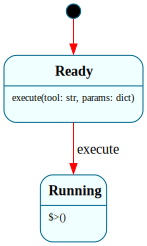

**Problem:** An AI coding agent with planning, approval, tool execution, testing, and retry.

```frame
@@target python_3

@@system ToolRunner {
    interface:
        execute(tool: str, params: dict)

    machine:
        $Ready {
            execute(tool: str, params: dict) {
                self.current_tool = tool
                self.current_params = params
                -> $Running
            }
        }
        $Running {
            $>() {
                print(f"  [tool] [{self.current_tool}] executing...")
                result = self.simulate(self.current_tool, self.current_params)
                self.parent.tool_completed(
                    self.current_tool, result["success"], result["data"]
                )
            }
        }

    actions:
        simulate(tool, params) {
            if tool == "read_file":
                return {"success": True, "data": f"read {params.get('path', '?')}"}
            elif tool == "write_file":
                return {"success": True, "data": f"wrote {params.get('path', '?')}"}
            elif tool == "run_terminal":
                import random
                if random.random() < 0.7:
                    return {"success": True, "data": "tests passed"}
                return {"success": False, "data": "2 tests failed"}
            return {"success": False, "data": f"unknown: {tool}"}
        }

    domain:
        parent = None
        current_tool: str = ""
        current_params: dict = {}
}

@@system Agent {
    interface:
        task(description: str)
        approve()
        reject(feedback: str)
        abort()
        tool_completed(tool: str, success: bool, data: str)
        plan_ready(steps: list)
        coding_done()
        tests_passed()
        tests_failed(failures: str)
        status(): str = ""

    machine:
        $Idle {
            task(description: str) {
                self.task_desc = description
                print(f"\n[task] Task: {description}")
                -> $Planning
            }
            status(): str { @@:("idle") }
        }
        $Planning => $Active {
            $>() {
                print("[plan] Planning...")
                steps = self.make_plan(self.task_desc)
                @@:self.plan_ready(steps)
            }
            plan_ready(steps: list) {
                self.plan = steps
                for i, s in enumerate(steps):
                    print(f"   {i+1}. {s}")
                -> "review" $AwaitingApproval
            }
            => $^
        }
        $AwaitingApproval => $Active {
            approve() {
                self.step = 0
                -> "begin" $Coding
            }
            reject(feedback: str) { -> "revise" $Planning }
            => $^
        }
        $Coding => $Active {
            $>() {
                if self.step >= len(self.plan):
                    @@:self.coding_done()
                    return
                print(f"\n[code] Step {self.step + 1}: {self.plan[self.step]}")
                tool = self.step_to_tool(self.plan[self.step])
                self.tool_runner = @@ToolRunner()
                self.tool_runner.parent = self
                self.tool_runner.execute(tool["tool"], tool["params"])
            }
            coding_done() { -> "run tests" $Testing }
            tool_completed(tool: str, success: bool, data: str) {
                if success:
                    print(f"  ok {data}")
                    self.step = self.step + 1
                    -> "next step" $Coding
                else:
                    print(f"  err {data}")
                    self.last_error = data
                    -> "error" $ErrorRecovery
            }
            => $^
        }
        $Testing => $Active {
            $>() {
                print("\n[test] Testing...")
                self.tool_runner = @@ToolRunner()
                self.tool_runner.parent = self
                self.tool_runner.execute("run_terminal", {"command": "pytest"})
            }
            tool_completed(tool: str, success: bool, data: str) {
                if success:
                    @@:self.tests_passed()
                else:
                    @@:self.tests_failed(data)
            }
            tests_passed() { -> "passed" $Complete }
            tests_failed(failures: str) {
                self.retries = self.retries + 1
                if self.retries >= 2:
                    -> "give up" $Failed
                else:
                    self.task_desc = f"Fix: {failures}"
                    -> "retry" $Planning
            }
            => $^
        }
        $ErrorRecovery => $Active {
            $>() { print(f"  [warn] {self.last_error}") }
            approve() { -> "retry" $Coding }
            reject(feedback: str) { -> "replan" $Planning }
            => $^
        }
        $Active {
            abort() {
                print("\n[abort] Aborted")
                -> $Idle
            }
        }
        $Complete {
            $>() { print("\n[done] Done!") }
            task(description: str) {
                self.reset()
                self.task_desc = description
                -> "new task" $Planning
            }
            status(): str { @@:("complete") }
        }
        $Failed {
            $>() { print("\n[fail] Failed") }
            task(description: str) {
                self.reset()
                self.task_desc = description
                -> "new task" $Planning
            }
            status(): str { @@:("failed") }
        }

    actions:
        make_plan(desc) {
            return ["Read files", f"Implement: {desc[:40]}", "Write files"]
        }
        step_to_tool(step_text) {
            lower = step_text.lower()
            if "read" in lower:
                return {"tool": "read_file", "params": {"path": "src/main.py"}}
            elif "write" in lower:
                return {"tool": "write_file", "params": {"path": "src/main.py"}}
            return {"tool": "run_terminal", "params": {"command": f"echo '{step_text}'"}}
        }
        reset() {
            self.plan = []
            self.step = 0
            self.retries = 0
            self.last_error = ""
        }

    domain:
        task_desc: str = ""
        plan: list = []
        step: int = 0
        retries: int = 0
        last_error: str = ""
        tool_runner = None
}

if __name__ == '__main__':
    import random
    random.seed(42)
    agent = @@Agent()
    agent.task("Add input validation")
    agent.approve()
    print(agent.status())
```

**Features stressed:** HSM with shared `abort()`, `@@:self.method()` transition guard, system-managed `ToolRunner`, state re-entry, enter-handler chains, retry loops

-----

## Enterprise Integration Patterns

Recipes 34-45 implement patterns from *Enterprise Integration Patterns* (Hohpe & Woolf, 2003) as Frame state machines. Each maps a named EIP pattern onto the same shape as the recipes above. These are single-node implementations of the pattern's *logic* — the part a message broker, integration framework, or service would host. The transport is your host code; the state machine is what you hand to the host.

All recipes target Python 3 for readability; the patterns generate identically for all 17 Frame targets. For the canonical pattern catalog, see [enterpriseintegrationpatterns.com](https://www.enterpriseintegrationpatterns.com/patterns/messaging/).

-----

## 34. Idempotent Receiver

[↑ up](#33-ai-coding-agent--capstone) · [top](#table-of-contents) · [↓ down](#35-content-based-router)

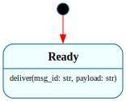

**Problem:** A sender may redeliver the same message. The receiver must process each business message exactly once, even if it arrives multiple times.

```frame
@@target python_3

@@system IdempotentReceiver {
    interface:
        deliver(msg_id: str, payload: str): str

    machine:
        $Ready {
            deliver(msg_id: str, payload: str): str {
                if msg_id in self.seen:
                    @@:("duplicate")
                else:
                    self.seen.add(msg_id)
                    self.process(payload)
                    @@:("accepted")
            }
        }

    actions:
        process(payload) {
            print(f"processing: {payload}")
        }

    domain:
        seen: set = set()
}

if __name__ == '__main__':
    r = @@IdempotentReceiver()
    print(r.deliver("m1", "hello"))    # accepted
    print(r.deliver("m1", "hello"))    # duplicate
    print(r.deliver("m2", "world"))    # accepted
```

**How it works:** The `seen` set in the domain is the idempotency key store. On redelivery, the handler branches on set membership before doing any work. A single `$Ready` state is enough because the dedupe decision is data-driven, not state-driven.

**Features used:** domain variables as a dedupe store, data-driven branching, actions

-----

## 35. Content-Based Router

[↑ up](#34-idempotent-receiver) · [top](#table-of-contents) · [↓ down](#36-message-filter)

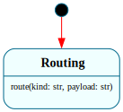

**Problem:** A single inbound stream contains messages of different kinds. Each kind should be routed to a different downstream destination.

```frame
@@target python_3

@@system ContentBasedRouter {
    interface:
        route(kind: str, payload: str): str

    machine:
        $Routing {
            route(kind: str, payload: str): str {
                if kind == "order":
                    self.to_orders(payload)
                    @@:("orders")
                else:
                    if kind == "refund":
                        self.to_refunds(payload)
                        @@:("refunds")
                    else:
                        self.to_dlq(payload)
                        @@:("dlq")
            }
        }

    actions:
        to_orders(p)  { print(f"-> orders:  {p}") }
        to_refunds(p) { print(f"-> refunds: {p}") }
        to_dlq(p)     { print(f"-> dlq:     {p}") }
}

if __name__ == '__main__':
    r = @@ContentBasedRouter()
    r.route("order",   "SKU-1")
    r.route("refund",  "INV-7")
    r.route("unknown", "???")
```

**How it works:** The routing decision is a pure function of the message, so one state suffices. The router's contract (`route()`) and its decision table sit next to each other in one block, generating a class your host code can instantiate and call. Routers that learn downstream health graduate to multi-state — see [Circuit Breaker](#39-circuit-breaker).

**Features used:** single-state dispatcher, actions as routing sinks, content-driven branching

-----

## 36. Message Filter

[↑ up](#35-content-based-router) · [top](#table-of-contents) · [↓ down](#37-aggregator)

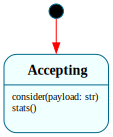

**Problem:** Drop messages that don't match a predicate. Count both accepted and rejected messages for observability.

```frame
@@target python_3

@@system MessageFilter {
    interface:
        consider(payload: str): str
        stats(): str

    machine:
        $Accepting {
            consider(payload: str): str {
                if self.matches(payload):
                    self.passed = self.passed + 1
                    self.forward(payload)
                    @@:("passed")
                else:
                    self.dropped = self.dropped + 1
                    @@:("dropped")
            }
            stats(): str {
                @@:(f"passed={self.passed} dropped={self.dropped}")
            }
        }

    actions:
        matches(payload) {
            return "urgent" in payload
        }
        forward(payload) {
            print(f"-> {payload}")
        }

    domain:
        passed: int = 0
        dropped: int = 0
}

if __name__ == '__main__':
    f = @@MessageFilter()
    f.consider("urgent: reboot")
    f.consider("weekly digest")
    f.consider("urgent: patch")
    print(f.stats())        # passed=2 dropped=1
```

**How it works:** Structurally identical to the router but with a boolean predicate instead of an N-way branch. The filter's policy (`matches`) is a named action, making it easy to swap or test in isolation.

**Features used:** predicate action, domain counters, observability via a second interface method

-----

## 37. Aggregator

[↑ up](#36-message-filter) · [top](#table-of-contents) · [↓ down](#38-resequencer)

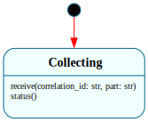

**Problem:** Correlated messages arrive separately. Wait until the full set has arrived, then emit a single combined message.

```frame
@@target python_3

@@system Aggregator {
    interface:
        receive(correlation_id: str, part: str): str
        status(): str

    machine:
        $Collecting {
            receive(correlation_id: str, part: str): str {
                if correlation_id not in self.groups:
                    self.groups[correlation_id] = []
                self.groups[correlation_id].append(part)

                if len(self.groups[correlation_id]) >= self.expected_parts:
                    combined = ",".join(self.groups[correlation_id])
                    del self.groups[correlation_id]
                    self.emit(correlation_id, combined)
                    @@:("complete")
                else:
                    @@:("collecting")
            }
            status(): str {
                @@:(f"in_flight={len(self.groups)}")
            }
        }

    actions:
        emit(cid, combined) {
            print(f"[{cid}] -> {combined}")
        }

    domain:
        groups: dict = {}
        expected_parts: int = 3
}

if __name__ == '__main__':
    a = @@Aggregator()
    print(a.receive("A", "p1"))   # collecting
    print(a.receive("B", "p1"))   # collecting
    print(a.receive("A", "p2"))   # collecting
    print(a.receive("A", "p3"))   # complete  -> emits "p1,p2,p3"
    print(a.status())             # in_flight=1   (B still open)
```

**How it works:** `groups` is a correlation map from ID to parts-so-far. When a group reaches `expected_parts`, the aggregator emits the combined payload and removes the entry. One state is correct because the branching is driven by the correlation ID, not by where the aggregator "is."

**Features used:** correlation-keyed domain state, completeness check, emit-and-cleanup

-----

## 38. Resequencer

[↑ up](#37-aggregator) · [top](#table-of-contents) · [↓ down](#39-circuit-breaker)

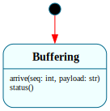

**Problem:** Messages arrive out of order (each tagged with a sequence number). Release them downstream strictly in order, buffering anything premature.

```frame
@@target python_3

@@system Resequencer {
    interface:
        arrive(seq: int, payload: str): str
        status(): str

    machine:
        $Buffering {
            arrive(seq: int, payload: str): str {
                self.buffer[seq] = payload
                released = 0
                while self.next_seq in self.buffer:
                    p = self.buffer[self.next_seq]
                    del self.buffer[self.next_seq]
                    self.release(self.next_seq, p)
                    self.next_seq = self.next_seq + 1
                    released = released + 1
                if released > 0:
                    @@:(f"released {released}")
                else:
                    @@:("buffered")
            }
            status(): str {
                @@:(f"next={self.next_seq} buffered={len(self.buffer)}")
            }
        }

    actions:
        release(seq, payload) {
            print(f"  out #{seq}: {payload}")
        }

    domain:
        buffer: dict = {}
        next_seq: int = 1
}

if __name__ == '__main__':
    rs = @@Resequencer()
    print(rs.arrive(3, "c"))    # buffered  (waiting for 1)
    print(rs.arrive(1, "a"))    # released 1
    print(rs.arrive(2, "b"))    # released 2  (drains 2 and 3)
    print(rs.status())          # next=4 buffered=0
```

**How it works:** `next_seq` is the watermark. Every `arrive()` call adds to the buffer, then drains every contiguous run that's ready. The drain loop is native Python; Frame owns the buffer, the watermark, and the handler contract.

**Features used:** native loop in a handler, contiguous-range release, watermark progression

-----

## 39. Circuit Breaker

[↑ up](#38-resequencer) · [top](#table-of-contents) · [↓ down](#40-dead-letter-channel)

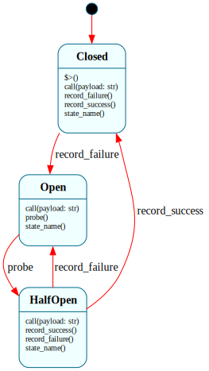

**Problem:** A downstream dependency is failing. Stop hammering it; let it recover. Periodically probe; resume full traffic only after probes succeed.

```frame
@@target python_3

@@system CircuitBreaker {
    interface:
        call(payload: str): str
        record_failure()
        record_success()
        probe()
        state_name(): str

    machine:
        $Closed {
            $>() {
                self.failures = 0
            }
            call(payload: str): str {
                @@:(self.invoke(payload))
            }
            record_failure() {
                self.failures = self.failures + 1
                if self.failures >= self.threshold:
                    -> "trip" $Open
            }
            record_success() {
                self.failures = 0
            }
            state_name(): str { @@:("closed") }
        }

        $Open {
            call(payload: str): str {
                @@:("rejected: circuit open")
            }
            probe() {
                -> $HalfOpen
            }
            state_name(): str { @@:("open") }
        }

        $HalfOpen {
            call(payload: str): str {
                @@:(self.invoke(payload))
            }
            record_success() {
                -> "recover" $Closed
            }
            record_failure() {
                -> "re-trip" $Open
            }
            state_name(): str { @@:("half_open") }
        }

    actions:
        invoke(payload) {
            return f"ok:{payload}"
        }

    domain:
        failures: int = 0
        threshold: int = 3
}

if __name__ == '__main__':
    cb = @@CircuitBreaker()
    for _ in range(3):
        cb.call("x")
        cb.record_failure()
    print(cb.state_name())         # open
    print(cb.call("x"))            # rejected: circuit open
    cb.probe()
    print(cb.state_name())         # half_open
    cb.call("x")
    cb.record_success()
    print(cb.state_name())         # closed
```

**How it works:** The three canonical breaker states map directly. `call()` means different things in each: full pass-through in `$Closed`, immediate rejection in `$Open`, guarded pass-through in `$HalfOpen`. Failure and success arrive as separate interface methods because the breaker doesn't know whether a call succeeded — the host does. `$Closed`'s enter handler resets `failures` on every close, including after half-open recovery.

**Features used:** three-state lifecycle, enter handler as reset point, external observability signals

-----

## 40. Dead Letter Channel

[↑ up](#39-circuit-breaker) · [top](#table-of-contents) · [↓ down](#41-polling-consumer)

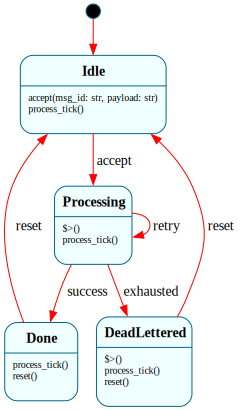

**Problem:** A message that can't be processed after N attempts must not block the pipeline. Move it to a dead-letter channel for inspection. The processor must survive restarts without losing retry state.

```frame
@@target python_3

@@persist

@@system DeadLetterProcessor {
    interface:
        accept(msg_id: str, payload: str): str
        process_tick(): str
        reset()

    machine:
        $Idle {
            accept(msg_id: str, payload: str): str {
                self.msg_id = msg_id
                self.payload = payload
                self.attempts = 0
                @@:("accepted")
                -> $Processing
            }
            process_tick(): str { @@:("idle") }
        }

        $Processing {
            $>() {
                self.attempts = self.attempts + 1
            }
            process_tick(): str {
                if self.try_process(self.payload):
                    @@:("ok")
                    -> "success" $Done
                else:
                    if self.attempts >= self.max_attempts:
                        @@:("dead_lettered")
                        -> "exhausted" $DeadLettered
                    else:
                        @@:("retrying")
                        -> "retry" $Processing
            }
        }

        $Done {
            process_tick(): str { @@:("done") }
            reset() { -> $Idle }
        }

        $DeadLettered {
            $>() {
                self.to_dlq(self.msg_id, self.payload)
            }
            process_tick(): str { @@:("dead_lettered") }
            reset() { -> $Idle }
        }

    actions:
        try_process(payload) {
            return False
        }
        to_dlq(msg_id, payload) {
            print(f"DLQ <- {msg_id}: {payload}")
        }

    domain:
        msg_id: str = ""
        payload: str = ""
        attempts: int = 0
        max_attempts: int = 3
}

if __name__ == '__main__':
    p = @@DeadLetterProcessor()
    p.accept("m-42", "flaky work")
    p.process_tick()        # retrying
    p.process_tick()        # retrying

    snapshot = p.save_state()
    p2 = DeadLetterProcessor.restore_state(snapshot)
    p2.process_tick()        # dead_lettered
```

**How it works:** `@@persist` makes the whole machine serializable — including `attempts`, the current payload, and which state it's in. Crashing halfway through a retry sequence doesn't reset the counter. `$Processing`'s enter handler increments `attempts` and the handler re-enters itself on failure (`-> $Processing`) — the enter handler fires each time because a self-transition fully exits and re-enters.

**Features used:** `@@persist` for crash-safe retry state, self-transition for retry loop, enter handler as side effect

-----

## 41. Polling Consumer

[↑ up](#40-dead-letter-channel) · [top](#table-of-contents) · [↓ down](#42-process-manager-saga)

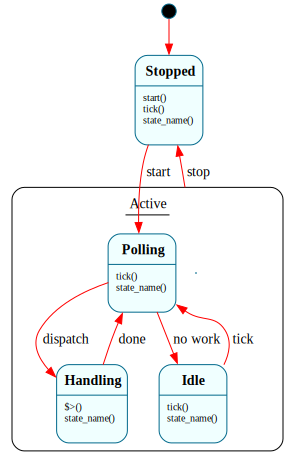

**Problem:** No push transport available. Poll a source for messages, process them, pause on empty, and stop cleanly when asked.

```frame
@@target python_3

@@system PollingConsumer {
    operations:
        supply(msg: str) {
            self.pending.append(msg)
        }

    interface:
        start()
        stop()
        tick(): str
        state_name(): str

    machine:
        $Stopped {
            start() { -> $Polling }
            tick(): str { @@:("stopped") }
            state_name(): str { @@:("stopped") }
        }

        $Polling => $Active {
            tick(): str {
                msg = self.poll_source()
                if msg is None:
                    @@:("empty")
                    -> "no work" $Idle
                else:
                    self.current = msg
                    @@:("got_msg")
                    -> "dispatch" $Handling
            }
            state_name(): str { @@:("polling") }
            => $^
        }

        $Handling => $Active {
            $>() {
                self.handle(self.current)
                -> "done" $Polling
            }
            state_name(): str { @@:("handling") }
            => $^
        }

        $Idle => $Active {
            tick(): str {
                @@:("woke")
                -> $Polling
            }
            state_name(): str { @@:("idle") }
            => $^
        }

        $Active {
            stop() { -> $Stopped }
        }

    actions:
        poll_source() {
            if self.pending:
                return self.pending.pop(0)
            return None
        }
        handle(msg) {
            print(f"handled: {msg}")
        }

    domain:
        pending: list = []
        current: str = ""
}

if __name__ == '__main__':
    c = @@PollingConsumer()
    c.supply("a"); c.supply("b")
    c.start()
    print(c.tick())         # got_msg -> handles "a"
    print(c.tick())         # got_msg -> handles "b"
    print(c.tick())         # empty -> idle
    print(c.tick())         # woke  -> polling
    c.stop()
    print(c.state_name())   # stopped
```

**How it works:** Four states: `$Stopped`, `$Polling`, `$Handling`, `$Idle`. All three active states are children of `$Active`, which owns `stop()` — so any `stop()` from any active state reaches `$Stopped` without duplication. `$Handling`'s enter handler does the work and transitions back immediately (the transient state pattern). `supply()` is an operation — infrastructure plumbing that bypasses the state machine.

**Features used:** HSM for shared `stop()`, transient processing state, operations for non-dispatched utility

-----

## 42. Process Manager (Saga)

[↑ up](#41-polling-consumer) · [top](#table-of-contents) · [↓ down](#43-competing-consumers)

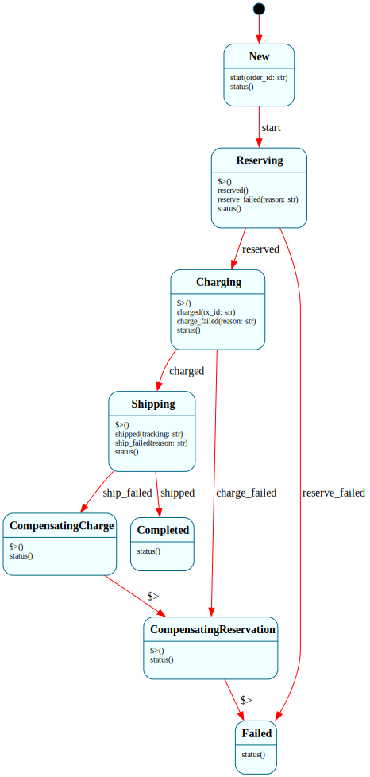

**Problem:** Orchestrate a multi-step business transaction across services with no distributed transaction. If any step fails, compensate the prior steps in reverse order.

```frame
@@target python_3

@@system OrderSaga {
    interface:
        start(order_id: str)
        reserved()
        reserve_failed(reason: str)
        charged(tx_id: str)
        charge_failed(reason: str)
        shipped(tracking: str)
        ship_failed(reason: str)
        status(): str

    machine:
        $New {
            start(order_id: str) {
                self.order_id = order_id
                -> $Reserving
            }
            status(): str { @@:("new") }
        }

        $Reserving {
            $>() { self.call_reserve(self.order_id) }
            reserved() { -> $Charging }
            reserve_failed(reason: str) {
                self.failure = reason
                -> "abort" $Failed
            }
            status(): str { @@:("reserving") }
        }

        $Charging {
            $>() { self.call_charge(self.order_id) }
            charged(tx_id: str) {
                self.tx_id = tx_id
                -> $Shipping
            }
            charge_failed(reason: str) {
                self.failure = reason
                -> "compensate" $CompensatingReservation
            }
            status(): str { @@:("charging") }
        }

        $Shipping {
            $>() { self.call_ship(self.order_id) }
            shipped(tracking: str) {
                self.tracking = tracking
                -> $Completed
            }
            ship_failed(reason: str) {
                self.failure = reason
                -> "compensate" $CompensatingCharge
            }
            status(): str { @@:("shipping") }
        }

        $CompensatingCharge {
            $>() {
                self.call_refund(self.tx_id)
                -> "refunded" $CompensatingReservation
            }
            status(): str { @@:("compensating_charge") }
        }

        $CompensatingReservation {
            $>() {
                self.call_release(self.order_id)
                -> "released" $Failed
            }
            status(): str { @@:("compensating_reservation") }
        }

        $Completed {
            status(): str { @@:("completed") }
        }

        $Failed {
            status(): str { @@:(f"failed: {self.failure}") }
        }

    actions:
        call_reserve(oid)  { print(f"reserve {oid}") }
        call_charge(oid)   { print(f"charge {oid}") }
        call_ship(oid)     { print(f"ship {oid}") }
        call_refund(tx)    { print(f"refund {tx}") }
        call_release(oid)  { print(f"release reservation for {oid}") }

    domain:
        order_id: str = ""
        tx_id: str = ""
        tracking: str = ""
        failure: str = ""
}

if __name__ == '__main__':
    # Happy path
    s = @@OrderSaga()
    s.start("O-1")
    s.reserved()
    s.charged("T-9")
    s.shipped("UPS-42")
    print(s.status())   # completed

    # Compensating path: charge succeeds, ship fails
    s2 = @@OrderSaga()
    s2.start("O-2")
    s2.reserved()
    s2.charged("T-10")
    s2.ship_failed("carrier down")
    print(s2.status())  # failed: carrier down
```

**How it works:** Each forward step is a state with an enter handler that calls the external service. Success and failure events are separate interface methods so the host can call back exactly one. Compensation states do their undo work in the enter handler and transition to the next compensation. A failure at `$Shipping` cascades through `$CompensatingCharge` (refunds the charge) then `$CompensatingReservation` (releases inventory) then `$Failed`. A failure at `$Charging` skips straight to `$CompensatingReservation` because there's no charge to refund yet.

**Features used:** transient compensation states with enter-handler work, separate success/failure events per step, explicit rollback topology

-----

## 43. Competing Consumers

[↑ up](#42-process-manager-saga) · [top](#table-of-contents) · [↓ down](#44-message-store)

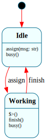

**Problem:** One queue of work, multiple workers pulling from it. The dispatcher hands each message to exactly one worker; workers process in parallel.

```frame
@@target python_3

@@system Worker {
    interface:
        assign(msg: str)
        finish()
        busy(): bool

    machine:
        $Idle {
            assign(msg: str) {
                self.current = msg
                -> $Working
            }
            busy(): bool { @@:(False) }
        }
        $Working {
            $>() { print(f"worker[{self.name}] start: {self.current}") }
            finish() {
                print(f"worker[{self.name}] done")
                self.current = ""
                -> $Idle
            }
            busy(): bool { @@:(True) }
        }

    domain:
        name: str = ""
        current: str = ""
}

@@system Dispatcher {
    interface:
        submit(msg: str): str
        worker_free(idx: int)

    machine:
        $Running {
            submit(msg: str): str {
                i = 0
                while i < len(self.workers):
                    if not self.workers[i].busy():
                        self.workers[i].assign(msg)
                        @@:(f"dispatched to {i}")
                        return
                    i = i + 1
                self.backlog.append(msg)
                @@:("queued")
            }
            worker_free(idx: int) {
                if self.backlog:
                    msg = self.backlog.pop(0)
                    self.workers[idx].assign(msg)
            }
        }

    domain:
        workers: list = []
        backlog: list = []
}

if __name__ == '__main__':
    d = @@Dispatcher()
    w0 = @@Worker(); w0.name = "A"
    w1 = @@Worker(); w1.name = "B"
    d.workers = [w0, w1]

    print(d.submit("job-1"))   # dispatched to 0
    print(d.submit("job-2"))   # dispatched to 1
    print(d.submit("job-3"))   # queued
    w0.finish(); d.worker_free(0)
    w1.finish()
    w0.finish()
```

**How it works:** Two systems composed — the dispatcher holds a list of workers in its domain. Each worker is a two-state machine (`$Idle` / `$Working`) exposing `busy()` so the dispatcher can pick one. The host tells the dispatcher when a worker frees up (`worker_free(idx)`); the dispatcher has no threading model. Frame systems are passive — the competing-consumers topology lives in whatever runtime the host chooses.

**Features used:** multi-system composition, list-of-systems in domain, read-only interface method for decision-making

-----

## 44. Message Store

[↑ up](#43-competing-consumers) · [top](#table-of-contents) · [↓ down](#45-migrating-machine)

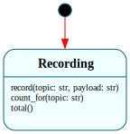

**Problem:** Every message that flows through an integration should be persisted for audit, replay, and debugging. The store survives restarts.

```frame
@@target python_3

@@persist

@@system MessageStore {
    interface:
        record(topic: str, payload: str)
        count_for(topic: str): int
        total(): int

    machine:
        $Recording {
            record(topic: str, payload: str) {
                entry = {"topic": topic, "payload": payload, "seq": self.next_seq}
                self.log.append(entry)
                self.next_seq = self.next_seq + 1
            }
            count_for(topic: str): int {
                c = 0
                for e in self.log:
                    if e["topic"] == topic:
                        c = c + 1
                @@:(c)
            }
            total(): int { @@:(len(self.log)) }
        }

    domain:
        log: list = []
        next_seq: int = 1
}

if __name__ == '__main__':
    s = @@MessageStore()
    s.record("orders", "O-1")
    s.record("orders", "O-2")
    s.record("refunds", "R-1")

    snap = s.save_state()
    s2 = MessageStore.restore_state(snap)
    print(s2.total())             # 3
    print(s2.count_for("orders")) # 2
    s2.record("orders", "O-3")
    print(s2.total())             # 4
```

**How it works:** The entire audit log is a domain variable. `@@persist` serializes it along with `next_seq` so the store's identity survives restarts. A one-state machine is sufficient because storage is always open. A production store would write-through to durable storage per record, but the snapshot approach demonstrates that Frame's persistence covers the full domain payload, not just the current state.

**Features used:** `@@persist` across a large domain payload, list-of-dicts as log, single-state store

-----

## 45. Migrating Machine

[↑ up](#44-message-store) · [top](#table-of-contents) · [↓ down](#46-fix-protocol--buy-side-order-lifecycle)

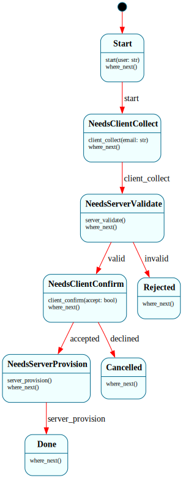

**Problem:** A state machine drives a workflow that spans a client and a server. Each side has work only it can do. The machine persists itself, travels across the wire, and resumes on the other side.

```frame
@@target python_3

import json

@@persist

@@system WizardMachine {
    operations:
        next_event(): str {
            s = self.__compartment.state
            if s == "NeedsServerValidate":   return "server_validate"
            if s == "NeedsServerProvision":  return "server_provision"
            if s == "NeedsClientCollect":    return "client_collect"
            if s == "NeedsClientConfirm":    return "client_confirm"
            return ""
        }

        summary(): str {
            return (
                f"user={self.user} email={self.email} "
                f"notes={self.server_notes} acct={self.account_id}"
            )
        }

    interface:
        start(user: str)
        client_collect(email: str)
        server_validate()
        client_confirm(accept: bool)
        server_provision()
        where_next(): str

    machine:
        $Start {
            start(user: str) {
                self.user = user
                -> $NeedsClientCollect
            }
            where_next(): str { @@:("start") }
        }

        $NeedsClientCollect {
            client_collect(email: str) {
                self.email = email
                -> $NeedsServerValidate
            }
            where_next(): str { @@:("client") }
        }

        $NeedsServerValidate {
            server_validate() {
                if "@" in self.email:
                    self.server_notes = "email syntax ok"
                    -> "valid" $NeedsClientConfirm
                else:
                    self.server_notes = "email rejected"
                    -> "invalid" $Rejected
            }
            where_next(): str { @@:("server") }
        }

        $NeedsClientConfirm {
            client_confirm(accept: bool) {
                if accept:
                    -> "accepted" $NeedsServerProvision
                else:
                    -> "declined" $Cancelled
            }
            where_next(): str { @@:("client") }
        }

        $NeedsServerProvision {
            server_provision() {
                self.account_id = f"acct-{self.user}"
                -> $Done
            }
            where_next(): str { @@:("server") }
        }

        $Done      { where_next(): str { @@:("done") } }
        $Cancelled { where_next(): str { @@:("done") } }
        $Rejected  { where_next(): str { @@:("done") } }

    domain:
        user: str = ""
        email: str = ""
        server_notes: str = ""
        account_id: str = ""
}


def handle_on_server(blob: bytes) -> bytes:
    m = WizardMachine.restore_state(blob)
    while m.where_next() == "server":
        evt = m.next_event()
        if evt == "server_validate":
            m.server_validate()
        elif evt == "server_provision":
            m.server_provision()
        else:
            break
    return m.save_state()


if __name__ == '__main__':
    m = @@WizardMachine()
    m.start("alice")
    m.client_collect("alice@example.com")

    blob = handle_on_server(m.save_state())
    m = WizardMachine.restore_state(blob)
    print(m.where_next())           # client

    m.client_confirm(True)

    blob = handle_on_server(m.save_state())
    m = WizardMachine.restore_state(blob)

    print(m.where_next())           # done
    print(m.summary())
```

**How it works:** Each state is tagged via `where_next()` with which side of the wire drives the next step. The client calls `save_state()`, ships the bytes, and the server calls `restore_state()`, drives its steps, and ships back. The state machine *is* the message — correlation IDs, per-request context, and partial-progress tracking all collapse into "the state of the machine."

`next_event()` is an operation that reads `self.__compartment.state` directly. Operations bypass the state machine dispatch, making them suitable for read-only introspection. The host asks the machine what it wants next without knowing the machine's internals.

**Features used:** `@@persist` as a transport payload, operations for introspection, side-tagged states, symmetric client/server code generation

-----

## Protocol & Systems Stress Tests

Recipes 46-49 model real-world protocols and safety-critical systems at full fidelity. Each exercises multiple Frame features simultaneously at production scale.

-----

## 46. FIX Protocol — Buy-Side Order Lifecycle

[↑ up](#45-migrating-machine) · [top](#table-of-contents) · [↓ down](#47-fix-protocol--sell-side-order-manager)

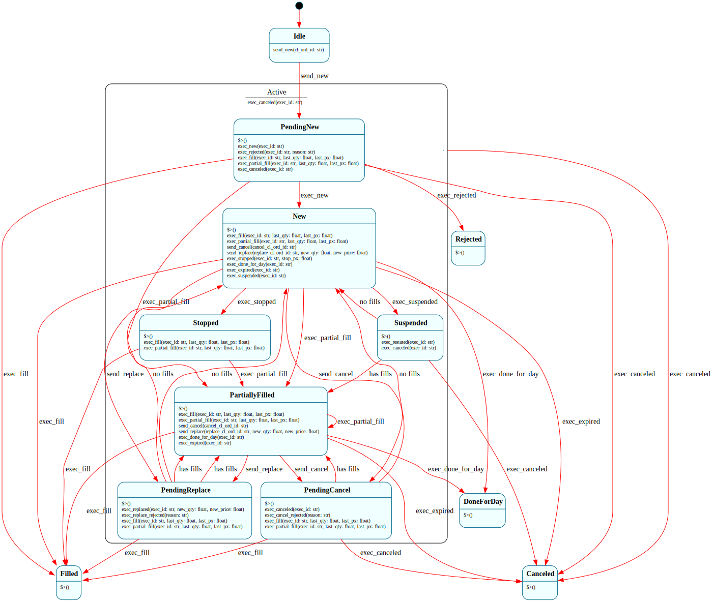

**Problem:** Model the complete FIX protocol OrdStatus state machine from the buy-side (order sender) perspective. All 10 active states, full quantity tracking, precedence rules.

**Reference:** FIX Trading Community, Order State Change Matrices (FIX 4.4 / FIX Latest)

```frame
@@target python_3

@@system FixBuySideOrder(symbol: str, side: str, order_qty: float) {
    operations:
        static ord_status_precedence(status: str): int {
            # Higher number = higher precedence when order is in multiple states
            prec = {
                "PendingReplace": 10, "PendingCancel": 9, "PendingNew": 8,
                "Stopped": 7, "New": 6, "PartiallyFilled": 5,
                "Rejected": 4, "DoneForDay": 3, "Canceled": 2, "Filled": 1
            }
            return prec.get(status, 0)
        }
        get_order_qty(): float { return self.order_qty }
        get_cum_qty(): float { return self.cum_qty }
        get_leaves_qty(): float { return self.leaves_qty }
        get_avg_px(): float { return self.avg_px }
        get_cl_ord_id(): str { return self.cl_ord_id }
        get_status(): str { return @@:system.state }
        is_terminal(): bool {
            return @@:system.state in ["Filled", "Canceled", "Rejected"]
        }

    interface:
        # --- Outbound: buy-side sends to sell-side ---
        send_new(cl_ord_id: str)
        send_cancel(cancel_cl_ord_id: str)
        send_replace(replace_cl_ord_id: str, new_qty: float, new_price: float)

        # --- Inbound: execution reports from sell-side ---
        exec_new(exec_id: str)
        exec_rejected(exec_id: str, reason: str)
        exec_fill(exec_id: str, last_qty: float, last_px: float)
        exec_partial_fill(exec_id: str, last_qty: float, last_px: float)
        exec_canceled(exec_id: str)
        exec_replaced(exec_id: str, new_qty: float, new_price: float)
        exec_cancel_rejected(reason: str)
        exec_replace_rejected(reason: str)
        exec_stopped(exec_id: str, stop_px: float)
        exec_done_for_day(exec_id: str)
        exec_expired(exec_id: str)
        exec_suspended(exec_id: str)
        exec_restated(exec_id: str)

    machine:
        # =============================================
        #  IDLE — order not yet submitted
        # =============================================
        $Idle {
            send_new(cl_ord_id: str) {
                self.cl_ord_id = cl_ord_id
                self.orig_cl_ord_id = cl_ord_id
                print(f"[BUY] NewOrderSingle: {self.symbol} {self.side} {self.order_qty} clOrdId={cl_ord_id}")
                -> $PendingNew
            }
        }

        # =============================================
        #  PENDING NEW — awaiting acknowledgment
        # =============================================
        $PendingNew => $Active {
            $>() { print(f"[BUY] → PendingNew") }

            exec_new(exec_id: str) {
                print(f"[BUY] Order acknowledged: execId={exec_id}")
                -> $New
            }
            exec_rejected(exec_id: str, reason: str) {
                print(f"[BUY] Order REJECTED: {reason}")
                self.reject_reason = reason
                -> $Rejected
            }
            # IOC/FOK: immediate fill before New ack
            exec_fill(exec_id: str, last_qty: float, last_px: float) {
                self.apply_fill(last_qty, last_px)
                print(f"[BUY] Immediate fill: {last_qty}@{last_px}")
                -> $Filled
            }
            exec_partial_fill(exec_id: str, last_qty: float, last_px: float) {
                self.apply_fill(last_qty, last_px)
                print(f"[BUY] Immediate partial: {last_qty}@{last_px}")
                -> $PartiallyFilled
            }
            # IOC not filled → canceled
            exec_canceled(exec_id: str) {
                print(f"[BUY] IOC/FOK canceled immediately")
                -> $Canceled
            }
            => $^
        }

        # =============================================
        #  NEW — order acknowledged, resting on book
        # =============================================
        $New => $Active {
            $>() { print(f"[BUY] → New") }

            exec_fill(exec_id: str, last_qty: float, last_px: float) {
                self.apply_fill(last_qty, last_px)
                -> $Filled
            }
            exec_partial_fill(exec_id: str, last_qty: float, last_px: float) {
                self.apply_fill(last_qty, last_px)
                -> $PartiallyFilled
            }
            send_cancel(cancel_cl_ord_id: str) {
                self.pending_cl_ord_id = cancel_cl_ord_id
                print(f"[BUY] CancelRequest: clOrdId={cancel_cl_ord_id}")
                -> $PendingCancel
            }
            send_replace(replace_cl_ord_id: str, new_qty: float, new_price: float) {
                self.pending_cl_ord_id = replace_cl_ord_id
                self.pending_qty = new_qty
                self.pending_price = new_price
                print(f"[BUY] ReplaceRequest: clOrdId={replace_cl_ord_id} qty={new_qty} px={new_price}")
                -> $PendingReplace
            }
            exec_stopped(exec_id: str, stop_px: float) {
                self.stop_px = stop_px
                -> $Stopped
            }
            exec_done_for_day(exec_id: str) { -> $DoneForDay }
            exec_expired(exec_id: str) { -> $Canceled }
            exec_suspended(exec_id: str) { -> $Suspended }
            => $^
        }

        # =============================================
        #  PARTIALLY FILLED — has executions, leaves > 0
        # =============================================
        $PartiallyFilled => $Active {
            $>() {
                print(f"[BUY] → PartiallyFilled: cum={self.cum_qty} leaves={self.leaves_qty} avgPx={self.avg_px:.2f}")
            }

            exec_fill(exec_id: str, last_qty: float, last_px: float) {
                self.apply_fill(last_qty, last_px)
                -> $Filled
            }
            exec_partial_fill(exec_id: str, last_qty: float, last_px: float) {
                self.apply_fill(last_qty, last_px)
                # Stay in PartiallyFilled — re-enter for updated quantities
                -> $PartiallyFilled
            }
            send_cancel(cancel_cl_ord_id: str) {
                self.pending_cl_ord_id = cancel_cl_ord_id
                print(f"[BUY] CancelRequest (partial): clOrdId={cancel_cl_ord_id}")
                -> $PendingCancel
            }
            send_replace(replace_cl_ord_id: str, new_qty: float, new_price: float) {
                self.pending_cl_ord_id = replace_cl_ord_id
                self.pending_qty = new_qty
                self.pending_price = new_price
                -> $PendingReplace
            }
            exec_done_for_day(exec_id: str) { -> $DoneForDay }
            exec_expired(exec_id: str) { -> $Canceled }
            => $^
        }

        # =============================================
        #  PENDING CANCEL — cancel request sent, awaiting response
        #  Can still receive fills while cancel is pending
        # =============================================
        $PendingCancel => $Active {
            $>() { print(f"[BUY] → PendingCancel") }

            exec_canceled(exec_id: str) {
                self.cl_ord_id = self.pending_cl_ord_id
                print(f"[BUY] Cancel confirmed. cum={self.cum_qty}")
                -> $Canceled
            }
            exec_cancel_rejected(reason: str) {
                print(f"[BUY] Cancel REJECTED: {reason}")
                self.pending_cl_ord_id = ""
                # Return to previous effective state
                if self.cum_qty > 0:
                    -> "has fills" $PartiallyFilled
                else:
                    -> "no fills" $New
            }
            # Fills can arrive while cancel is pending
            exec_fill(exec_id: str, last_qty: float, last_px: float) {
                self.apply_fill(last_qty, last_px)
                # Filled supersedes cancel
                -> $Filled
            }
            exec_partial_fill(exec_id: str, last_qty: float, last_px: float) {
                self.apply_fill(last_qty, last_px)
                # Stay in PendingCancel — cancel still outstanding
                print(f"[BUY] Fill during PendingCancel: cum={self.cum_qty}")
            }
            => $^
        }

        # =============================================
        #  PENDING REPLACE — replace request sent
        # =============================================
        $PendingReplace => $Active {
            $>() { print(f"[BUY] → PendingReplace") }

            exec_replaced(exec_id: str, new_qty: float, new_price: float) {
                self.cl_ord_id = self.pending_cl_ord_id
                self.order_qty = new_qty
                self.price = new_price
                self.leaves_qty = new_qty - self.cum_qty
                print(f"[BUY] Replaced: qty={new_qty} px={new_price}")
                if self.cum_qty > 0:
                    -> "has fills" $PartiallyFilled
                else:
                    -> "no fills" $New
            }
            exec_replace_rejected(reason: str) {
                print(f"[BUY] Replace REJECTED: {reason}")
                self.pending_cl_ord_id = ""
                if self.cum_qty > 0:
                    -> "has fills" $PartiallyFilled
                else:
                    -> "no fills" $New
            }
            # Fills during pending replace
            exec_fill(exec_id: str, last_qty: float, last_px: float) {
                self.apply_fill(last_qty, last_px)
                -> $Filled
            }
            exec_partial_fill(exec_id: str, last_qty: float, last_px: float) {
                self.apply_fill(last_qty, last_px)
                print(f"[BUY] Fill during PendingReplace: cum={self.cum_qty}")
            }
            => $^
        }

        # =============================================
        #  STOPPED — guaranteed price by specialist/MM
        # =============================================
        $Stopped => $Active {
            $>() { print(f"[BUY] → Stopped at {self.stop_px}") }

            exec_fill(exec_id: str, last_qty: float, last_px: float) {
                self.apply_fill(last_qty, last_px)
                -> $Filled
            }
            exec_partial_fill(exec_id: str, last_qty: float, last_px: float) {
                self.apply_fill(last_qty, last_px)
                -> $PartiallyFilled
            }
            => $^
        }

        # =============================================
        #  SUSPENDED — order suspended by exchange
        # =============================================
        $Suspended => $Active {
            $>() { print(f"[BUY] → Suspended") }

            exec_restated(exec_id: str) {
                if self.cum_qty > 0:
                    -> "has fills" $PartiallyFilled
                else:
                    -> "no fills" $New
            }
            exec_canceled(exec_id: str) { -> $Canceled }
            => $^
        }

        # =============================================
        #  ACTIVE — parent for all non-terminal, non-idle states
        #  Handles events common to all active order states
        # =============================================
        $Active {
            # Unsolicited cancel by exchange
            exec_canceled(exec_id: str) {
                print(f"[BUY] Unsolicited cancel")
                -> $Canceled
            }
        }

        # =============================================
        #  TERMINAL STATES — Filled, Canceled, Rejected, DoneForDay
        # =============================================
        $Filled {
            $>() {
                print(f"[BUY] FILLED: {self.cum_qty}@{self.avg_px:.2f}")
            }
            # Terminal — all events ignored
        }
        $Canceled {
            $>() {
                print(f"[BUY] CANCELED: filled={self.cum_qty}/{self.order_qty}")
            }
        }
        $Rejected {
            $>() {
                print(f"[BUY] REJECTED: {self.reject_reason}")
            }
        }
        $DoneForDay {
            $>() {
                print(f"[BUY] DONE FOR DAY: filled={self.cum_qty}/{self.order_qty}")
            }
        }

    actions:
        apply_fill(last_qty, last_px) {
            # VWAP calculation
            total_value = self.avg_px * self.cum_qty + last_px * last_qty
            self.cum_qty = self.cum_qty + last_qty
            self.leaves_qty = self.order_qty - self.cum_qty
            if self.cum_qty > 0:
                self.avg_px = total_value / self.cum_qty
            self.fill_count = self.fill_count + 1
        }

    domain:
        symbol: str = symbol
        side: str = side
        order_qty: float = order_qty
        cum_qty: float = 0.0
        leaves_qty: float = order_qty
        avg_px: float = 0.0
        price: float = 0.0
        stop_px: float = 0.0
        cl_ord_id: str = ""
        orig_cl_ord_id: str = ""
        pending_cl_ord_id: str = ""
        pending_qty: float = 0.0
        pending_price: float = 0.0
        reject_reason: str = ""
        fill_count: int = 0
}

if __name__ == '__main__':
    # --- Scenario 1: Simple fill ---
    order = @@FixBuySideOrder("AAPL", "Buy", 1000)
    order.send_new("ORD-001")
    order.exec_new("E1")
    order.exec_partial_fill("E2", 400, 150.25)
    order.exec_fill("E3", 600, 150.50)
    print(f"AvgPx: {order.get_avg_px():.4f}")  # 150.40

    # --- Scenario 2: Cancel after partial fill ---
    order2 = @@FixBuySideOrder("GOOG", "Sell", 500)
    order2.send_new("ORD-002")
    order2.exec_new("E4")
    order2.exec_partial_fill("E5", 200, 2800.00)
    order2.send_cancel("CXL-002")
    # Fill arrives while cancel is pending
    order2.exec_partial_fill("E6", 100, 2801.00)
    order2.exec_canceled("E7")
    print(f"Filled: {order2.get_cum_qty()}/{order2.get_order_qty()}")

    # --- Scenario 3: Replace ---
    order3 = @@FixBuySideOrder("MSFT", "Buy", 1000)
    order3.send_new("ORD-003")
    order3.exec_new("E8")
    order3.send_replace("RPL-003", 1500, 400.00)
    order3.exec_replaced("E9", 1500, 400.00)
    print(f"New qty: {order3.get_order_qty()}")  # 1500

    # --- Scenario 4: Rejection ---
    order4 = @@FixBuySideOrder("???", "Buy", -100)
    order4.send_new("ORD-004")
    order4.exec_rejected("E10", "Invalid quantity")
    print(f"Terminal: {order4.is_terminal()}")  # True
```

**How it works:**

**10 states matching FIX OrdStatus values.** `$PendingNew`, `$New`, `$PartiallyFilled`, `$PendingCancel`, `$PendingReplace`, `$Stopped`, `$Suspended`, `$Filled`, `$Canceled`, `$Rejected`, plus `$DoneForDay` and `$Idle`.

**HSM with `$Active` parent.** All non-terminal, non-idle states are children of `$Active`. Unsolicited cancel (exchange removes order without request) is handled once in `$Active` and inherited by all children.

**Fills during pending cancel/replace.** The FIX spec explicitly allows fills to arrive while a cancel or replace request is outstanding. `$PendingCancel` and `$PendingReplace` handle `exec_fill` and `exec_partial_fill` — a full fill supersedes the pending action, while a partial fill is recorded but the pending action stays outstanding.

**VWAP calculation in `apply_fill()`.** The action computes volume-weighted average price across multiple partial fills — `(oldAvgPx * oldCumQty + lastPx * lastQty) / newCumQty`.

**Operations for inspection.** `get_cum_qty()`, `get_leaves_qty()`, `get_avg_px()`, `is_terminal()` bypass the state machine for clean test access.

**Features stressed:** 13-state machine, HSM, system params (3 domain overrides), operations with `@@:system.state`, domain arithmetic (VWAP), conditional transitions based on quantity, fills during pending states, terminal states ignoring all events, actions modifying domain vars

---

## 47. FIX Protocol — Sell-Side Order Manager

[↑ up](#46-fix-protocol--buy-side-order-lifecycle) · [top](#table-of-contents) · [↓ down](#48-launch-sequence-controller--abort-from-any-phase)

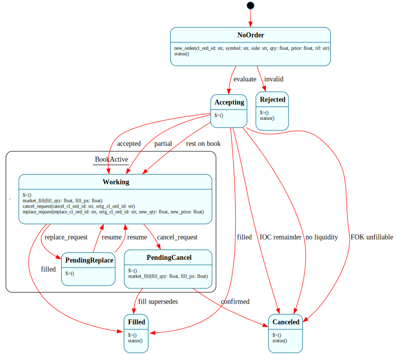

**Problem:** The broker/exchange side of FIX. Receives orders from the buy-side, manages the book, and sends execution reports back. Interacts with the buy-side system.

```frame
@@target python_3

@@system FixSellSide {
    interface:
        # Inbound from buy-side
        new_order(cl_ord_id: str, symbol: str, side: str, qty: float, price: float, tif: str)
        cancel_request(cancel_cl_ord_id: str, orig_cl_ord_id: str)
        replace_request(replace_cl_ord_id: str, orig_cl_ord_id: str, new_qty: float, new_price: float)

        # Market simulation
        market_fill(fill_qty: float, fill_px: float)

        # Inspection
        status(): str = ""

    machine:
        $NoOrder {
            new_order(cl_ord_id: str, symbol: str, side: str, qty: float, price: float, tif: str) {
                self.cl_ord_id = cl_ord_id
                self.symbol = symbol
                self.side = side
                self.order_qty = qty
                self.leaves_qty = qty
                self.price = price
                self.tif = tif
                self.exec_seq = 0

                if not self.validate_order(symbol, qty, price):
                    self.send_exec_report("Rejected", "rejected", "Invalid order params")
                    -> "invalid" $Rejected
                else:
                    -> "evaluate" $Accepting
            }
            status(): str { @@:("no order") }
        }

        $Accepting {
            $>() {
                # Check for immediate execution (IOC/FOK/marketable limit)
                if self.tif == "IOC" or self.tif == "FOK":
                    # Try immediate fill
                    available = self.get_market_liquidity()
                    if self.tif == "FOK" and available < self.order_qty:
                        self.send_exec_report("Canceled", "canceled", "FOK not fillable")
                        -> "FOK unfillable" $Canceled
                    elif available > 0:
                        fill_qty = min(available, self.leaves_qty)
                        self.execute_fill(fill_qty, self.price)
                        if self.leaves_qty <= 0:
                            self.send_exec_report("Filled", "fill", "")
                            -> "filled" $Filled
                        else:
                            if self.tif == "IOC":
                                self.send_exec_report("Canceled", "canceled", "IOC partial cancel")
                                -> "IOC remainder" $Canceled
                            else:
                                self.send_exec_report("PartiallyFilled", "partial_fill", "")
                                -> "partial" $Working
                    else:
                        if self.tif == "IOC" or self.tif == "FOK":
                            self.send_exec_report("Canceled", "canceled", f"{self.tif} no liquidity")
                            -> "no liquidity" $Canceled
                        else:
                            self.send_exec_report("New", "new", "")
                            -> "rest on book" $Working
                else:
                    self.send_exec_report("New", "new", "")
                    -> "accepted" $Working
            }
        }

        $Working => $BookActive {
            $>() { print(f"[SELL] Order working: {self.symbol} {self.side} leaves={self.leaves_qty}") }

            market_fill(fill_qty: float, fill_px: float) {
                actual = min(fill_qty, self.leaves_qty)
                self.execute_fill(actual, fill_px)
                if self.leaves_qty <= 0:
                    self.send_exec_report("Filled", "fill", "")
                    -> "filled" $Filled
                else:
                    self.send_exec_report("PartiallyFilled", "partial_fill", "")
            }
            cancel_request(cancel_cl_ord_id: str, orig_cl_ord_id: str) {
                if orig_cl_ord_id != self.cl_ord_id:
                    self.send_cancel_reject(cancel_cl_ord_id, "Unknown origClOrdId")
                else:
                    self.pending_action_id = cancel_cl_ord_id
                    -> $PendingCancel
            }
            replace_request(replace_cl_ord_id: str, orig_cl_ord_id: str, new_qty: float, new_price: float) {
                if orig_cl_ord_id != self.cl_ord_id:
                    self.send_replace_reject(replace_cl_ord_id, "Unknown origClOrdId")
                elif new_qty < self.cum_qty:
                    self.send_replace_reject(replace_cl_ord_id, "New qty less than cumQty")
                else:
                    self.pending_action_id = replace_cl_ord_id
                    self.pending_qty = new_qty
                    self.pending_price = new_price
                    -> $PendingReplace
            }
            => $^
        }

        $PendingCancel => $BookActive {
            $>() {
                print(f"[SELL] Processing cancel request")
                # Auto-accept cancel (in production: may queue or delay)
                self.cl_ord_id = self.pending_action_id
                self.send_exec_report("Canceled", "canceled", "")
                -> "confirmed" $Canceled
            }
            # Fills can still arrive
            market_fill(fill_qty: float, fill_px: float) {
                actual = min(fill_qty, self.leaves_qty)
                self.execute_fill(actual, fill_px)
                if self.leaves_qty <= 0:
                    # Filled supersedes cancel
                    self.send_exec_report("Filled", "fill", "")
                    -> "fill supersedes" $Filled
            }
            => $^
        }

        $PendingReplace => $BookActive {
            $>() {
                # Process the replace
                self.cl_ord_id = self.pending_action_id
                self.order_qty = self.pending_qty
                self.price = self.pending_price
                self.leaves_qty = self.pending_qty - self.cum_qty
                self.send_exec_report("Replaced", "replaced", "")
                if self.cum_qty > 0:
                    -> "resume" $Working
                else:
                    -> "resume" $Working
            }
            => $^
        }

        $BookActive {
            # Common handling for all orders on the book
        }

        # --- Terminal States ---
        $Filled {
            $>() { print(f"[SELL] FILLED: {self.cum_qty}@{self.avg_px:.2f}") }
            status(): str { @@:(f"filled {self.cum_qty}@{self.avg_px:.2f}") }
        }
        $Canceled {
            $>() { print(f"[SELL] CANCELED: filled={self.cum_qty}/{self.order_qty}") }
            status(): str { @@:(f"canceled cum={self.cum_qty}") }
        }
        $Rejected {
            $>() { print(f"[SELL] REJECTED") }
            status(): str { @@:("rejected") }
        }

    actions:
        validate_order(symbol, qty, price) {
            return qty > 0 and price >= 0 and len(symbol) > 0
        }
        execute_fill(qty, px) {
            total_value = self.avg_px * self.cum_qty + px * qty
            self.cum_qty = self.cum_qty + qty
            self.leaves_qty = self.order_qty - self.cum_qty
            if self.cum_qty > 0:
                self.avg_px = total_value / self.cum_qty
        }
        get_market_liquidity() {
            # Simulated: return available liquidity at limit price
            return 500
        }
        send_exec_report(ord_status, exec_type, text) {
            self.exec_seq = self.exec_seq + 1
            exec_id = f"EX-{self.exec_seq}"
            print(f"  [SELL→BUY] ExecReport: status={ord_status} type={exec_type} cum={self.cum_qty} leaves={self.leaves_qty}")
            if self.buy_side is not None:
                if exec_type == "new":
                    self.buy_side.exec_new(exec_id)
                elif exec_type == "fill":
                    self.buy_side.exec_fill(exec_id, self.cum_qty, self.avg_px)
                elif exec_type == "partial_fill":
                    last_qty = self.cum_qty  # simplified
                    self.buy_side.exec_partial_fill(exec_id, last_qty, self.avg_px)
                elif exec_type == "canceled":
                    self.buy_side.exec_canceled(exec_id)
                elif exec_type == "rejected":
                    self.buy_side.exec_rejected(exec_id, text)
                elif exec_type == "replaced":
                    self.buy_side.exec_replaced(exec_id, self.order_qty, self.price)
        }
        send_cancel_reject(cl_ord_id, reason) {
            print(f"  [SELL→BUY] CancelReject: {reason}")
            if self.buy_side is not None:
                self.buy_side.exec_cancel_rejected(reason)
        }
        send_replace_reject(cl_ord_id, reason) {
            print(f"  [SELL→BUY] ReplaceReject: {reason}")
            if self.buy_side is not None:
                self.buy_side.exec_replace_rejected(reason)
        }

    domain:
        buy_side = None
        cl_ord_id: str = ""
        symbol: str = ""
        side: str = ""
        order_qty: float = 0.0
        cum_qty: float = 0.0
        leaves_qty: float = 0.0
        avg_px: float = 0.0
        price: float = 0.0
        tif: str = "Day"
        exec_seq: int = 0
        pending_action_id: str = ""
        pending_qty: float = 0.0
        pending_price: float = 0.0
}

if __name__ == '__main__':
    sell = @@FixSellSide()

    # Submit a Day order — accepted, resting on book
    sell.new_order("ORD-001", "AAPL", "Buy", 1000, 150.00, "Day")

    # Partial fill from market
    sell.market_fill(400, 150.25)
    sell.market_fill(600, 150.50)

    print(f"Sell side: {sell.status()}")
```

**How it works:**

**Two systems interacting.** `FixSellSide.send_exec_report()` calls methods on `self.buy_side` when wired up — a reference to a `FixBuySideOrder` instance (Recipe 46). This is the managed-state callback pattern applied to protocol simulation. The test above exercises the sell-side standalone; wire `sell.buy_side = buy` to drive both sides together.

**`$Accepting` is a transient state.** Its enter handler evaluates TIF (Time In Force) rules: IOC orders get immediate partial fill then cancel of remainder; FOK orders are all-or-nothing; Day orders rest on the book. Each path leads to a different state.

**HSM with `$BookActive`.** `$Working`, `$PendingCancel`, and `$PendingReplace` are children. Shared cancel logic could go in the parent.

**Features stressed:** multi-system interaction (buy-side ↔ sell-side), transient state with complex branching, domain arithmetic, actions calling interface on other system, HSM, system params

---

## 48. Launch Sequence Controller — Abort from Any Phase

[↑ up](#47-fix-protocol--sell-side-order-manager) · [top](#table-of-contents) · [↓ down](#49-robot-arm-controller--safety-overlay-with-hsm)

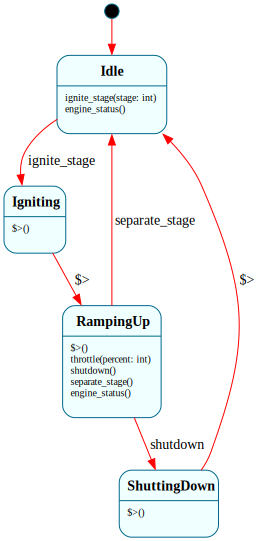

**Problem:** A two-stage rocket launch with abort capability from every flight phase. Different abort modes depending on altitude. Enter-handler chain for the flight sequence. Three coordinating systems: FlightComputer, PropulsionController, RangeOfficer.

**Reference:** Apollo/Shuttle abort modes, SpaceX Falcon 9 flight profile

```frame
@@target python_3

# --- Propulsion Controller ---
@@system PropulsionController {
    interface:
        ignite_stage(stage: int)
        throttle(percent: int)
        shutdown()
        separate_stage()
        engine_status(): str = ""

    machine:
        $Idle {
            ignite_stage(stage: int) {
                self.active_stage = stage
                -> $Igniting
            }
            engine_status(): str { @@:("idle") }
        }
        $Igniting {
            $>() {
                print(f"  Stage {self.active_stage} ignition sequence...")
                self.thrust_pct = 0
                -> "ramp up" $RampingUp
            }
        }
        $RampingUp {
            $>() {
                self.thrust_pct = 100
                print(f"  Stage {self.active_stage} full thrust ({self.thrust_pct}%)")
                self.parent.engine_ready(self.active_stage)
            }
            throttle(percent: int) {
                self.thrust_pct = percent
                print(f"  Throttle: {percent}%")
            }
            shutdown() {
                -> $ShuttingDown
            }
            separate_stage() {
                print(f"  Stage {self.active_stage} separated")
                self.active_stage = self.active_stage + 1
                -> $Idle
            }
            engine_status(): str { @@:(f"stage {self.active_stage} at {self.thrust_pct}%") }
        }
        $ShuttingDown {
            $>() {
                print(f"  Stage {self.active_stage} shutdown")
                self.thrust_pct = 0
                -> "engines off" $Idle
            }
        }

    domain:
        parent = None
        active_stage: int = 0
        thrust_pct: int = 0
}

# --- Range Safety Officer ---
@@system RangeOfficer {
    interface:
        telemetry(altitude_km: float, velocity_ms: float, deviation_deg: float)
        status(): str = ""

    machine:
        $Nominal {
            telemetry(altitude_km: float, velocity_ms: float, deviation_deg: float) {
                if deviation_deg > 30:
                    print(f"  Range: ABORT COMMANDED ({deviation_deg} deg)")
                    self.parent.abort("range_safety")
                    -> "abort" $AbortCommanded
                elif deviation_deg > 10:
                    print(f"  Range: Trajectory deviation {deviation_deg} deg")
                    -> "deviation" $Caution
            }
            status(): str { @@:("nominal") }
        }
        $Caution {
            telemetry(altitude_km: float, velocity_ms: float, deviation_deg: float) {
                if deviation_deg <= 5:
                    print(f"  Range: Trajectory nominal")
                    -> "recovered" $Nominal
                elif deviation_deg > 30:
                    print(f"  Range: FLIGHT TERMINATION")
                    self.parent.abort("flight_termination")
                    -> "terminate" $AbortCommanded
            }
            status(): str { @@:("caution") }
        }
        $AbortCommanded {
            status(): str { @@:("abort commanded") }
        }

    domain:
        parent = None
}

# --- Flight Computer (main controller) ---
@@system FlightComputer {
    interface:
        start_countdown()
        engine_ready(stage: int)
        telemetry_tick(altitude_km: float, velocity_ms: float, deviation_deg: float)
        abort(reason: str)
        status(): str = ""

    machine:
        # =============================================
        #  PRE-FLIGHT
        # =============================================
        $PreFlight {
            start_countdown() {
                print("\n=== LAUNCH SEQUENCE INITIATED ===")
                -> $Countdown
            }
            status(): str { @@:("pre-flight") }
        }

        $Countdown => $InFlight {
            $.t_minus: int = 10

            $>() {
                print(f"  T-{$.t_minus}...")
                $.t_minus = $.t_minus - 1
                if $.t_minus <= 0:
                    -> "T-zero" $EngineIgnition
            }
            telemetry_tick(altitude_km: float, velocity_ms: float, deviation_deg: float) {
                $.t_minus = $.t_minus - 1
                print(f"  T-{$.t_minus}...")
                if $.t_minus <= 0:
                    -> "T-zero" $EngineIgnition
            }
            => $^
        }

        $EngineIgnition => $InFlight {
            $>() {
                print("  Engine ignition command")
                self.propulsion = @@PropulsionController()
                self.propulsion.parent = self
                self.range_officer = @@RangeOfficer()
                self.range_officer.parent = self
                self.propulsion.ignite_stage(1)
            }
            engine_ready(stage: int) {
                print("  All engines nominal")
                -> $Liftoff
            }
            => $^
        }

        # =============================================
        #  ASCENT PHASES — enter-handler chain
        # =============================================
        $Liftoff => $InFlight {
            $>() {
                self.altitude = 0
                print("\nLIFTOFF!")
                self.phase = "liftoff"
            }
            telemetry_tick(altitude_km: float, velocity_ms: float, deviation_deg: float) {
                self.altitude = altitude_km
                self.velocity = velocity_ms
                self.range_officer.telemetry(altitude_km, velocity_ms, deviation_deg)
                if altitude_km >= 11:
                    -> $MaxQ
            }
            => $^
        }

        $MaxQ => $InFlight {
            $>() {
                print("  MAX-Q — throttle down")
                self.propulsion.throttle(70)
                self.phase = "max-q"
            }
            telemetry_tick(altitude_km: float, velocity_ms: float, deviation_deg: float) {
                self.altitude = altitude_km
                self.velocity = velocity_ms
                self.range_officer.telemetry(altitude_km, velocity_ms, deviation_deg)
                if altitude_km >= 15:
                    self.propulsion.throttle(100)
                    print("  Throttle up")
                    -> $Stage1Ascent
            }
            => $^
        }

        $Stage1Ascent => $InFlight {
            $>() {
                self.phase = "stage1-ascent"
                print("  Stage 1 ascent")
            }
            telemetry_tick(altitude_km: float, velocity_ms: float, deviation_deg: float) {
                self.altitude = altitude_km
                self.velocity = velocity_ms
                self.range_officer.telemetry(altitude_km, velocity_ms, deviation_deg)
                if altitude_km >= 80:
                    -> $MECO
            }
            => $^
        }

        $MECO => $InFlight {
            $>() {
                print("  MECO — Main Engine Cut-Off")
                self.propulsion.shutdown()
                self.phase = "meco"
                -> "separate" $StageSeparation
            }
            => $^
        }

        $StageSeparation => $InFlight {
            $>() {
                print("  Stage separation")
                self.propulsion.separate_stage()
                self.phase = "separation"
                -> "ignite S2" $Stage2Ignition
            }
            => $^
        }

        $Stage2Ignition => $InFlight {
            $>() {
                print("  Stage 2 ignition")
                self.propulsion.ignite_stage(2)
                self.phase = "stage2-ignition"
            }
            engine_ready(stage: int) {
                print("  Stage 2 nominal")
                -> $Stage2Ascent
            }
            => $^
        }

        $Stage2Ascent => $InFlight {
            $>() {
                self.phase = "stage2-ascent"
                print("  Stage 2 ascent to orbit")
            }
            telemetry_tick(altitude_km: float, velocity_ms: float, deviation_deg: float) {
                self.altitude = altitude_km
                self.velocity = velocity_ms
                self.range_officer.telemetry(altitude_km, velocity_ms, deviation_deg)
                if altitude_km >= 200 and velocity_ms >= 7800:
                    -> $SECO
            }
            => $^
        }

        $SECO => $InFlight {
            $>() {
                print("  SECO — Second Engine Cut-Off")
                self.propulsion.shutdown()
                self.phase = "seco"
                -> "insert orbit" $OrbitInsertion
            }
            => $^
        }

        $OrbitInsertion => $InFlight {
            $>() {
                print(f"\nORBIT INSERTION at {self.altitude:.0f} km, {self.velocity:.0f} m/s")
                self.phase = "orbit"
                -> "nominal" $OnOrbit
            }
            => $^
        }

        # =============================================
        #  IN-FLIGHT parent — handles abort for ALL phases
        # =============================================
        $InFlight {
            abort(reason: str) {
                self.abort_reason = reason
                print(f"\nABORT: {reason} at altitude {self.altitude:.1f} km")
                self.propulsion.shutdown()
                if self.altitude < 30:
                    -> "pad escape" $AbortPadEscape
                elif self.altitude < 100:
                    -> "downrange" $AbortDownrange
                else:
                    -> "abort to orbit" $AbortToOrbit
            }
        }

        # =============================================
        #  ABORT MODES
        # =============================================
        $AbortPadEscape {
            $>() {
                print("  PAD ABORT — Launch escape system activated")
                print("  Capsule separation, parachute deployment")
                self.phase = "abort-pad"
                -> "complete" $AbortComplete
            }
        }
        $AbortDownrange {
            $>() {
                print("  DOWNRANGE ABORT — Capsule separation")
                print(f"  Ballistic trajectory from {self.altitude:.0f} km")
                self.phase = "abort-downrange"
                -> "complete" $AbortComplete
            }
        }
        $AbortToOrbit {
            $>() {
                print(f"  ABORT TO ORBIT — Inserting at {self.altitude:.0f} km")
                print("  Degraded orbit achieved")
                self.phase = "abort-to-orbit"
                -> "complete" $AbortComplete
            }
        }
        $AbortComplete {
            $>() {
                print(f"\nAbort sequence complete. Reason: {self.abort_reason}")
            }
            status(): str { @@:(f"aborted: {self.abort_reason}") }
        }

        # =============================================
        #  ON ORBIT — mission continues
        # =============================================
        $OnOrbit {
            $>() {
                print("  On orbit — mission nominal")
            }
            status(): str { @@:(f"on orbit at {self.altitude:.0f} km") }
        }

    domain:
        propulsion = None
        range_officer = None
        altitude: float = 0.0
        velocity: float = 0.0
        phase: str = "pre-flight"
        abort_reason: str = ""
}

if __name__ == '__main__':
    fc = @@FlightComputer()
    fc.start_countdown()

    # Countdown
    for t in range(10):
        fc.telemetry_tick(0, 0, 0)

    # Ascent
    profiles = [
        (5, 300, 0.5), (8, 500, 0.3), (11, 700, 0.2),     # liftoff → max-q
        (13, 800, 0.1), (15, 1000, 0.4),                    # max-q → stage1
        (30, 2000, 0.2), (50, 3500, 0.1), (80, 5000, 0.3),  # stage1 → MECO
        # MECO, separation, stage2 ignition happen in enter handlers
        (120, 6000, 0.2), (160, 7000, 0.1),                  # stage2 ascent
        (200, 7800, 0.05),                                     # orbit insertion
    ]
    for alt, vel, dev in profiles:
        fc.telemetry_tick(alt, vel, dev)

    print(f"\nFinal: {fc.status()}")
```

**How it works:**

**11 flight phases chain through enter handlers.** `$Countdown → $EngineIgnition → $Liftoff → $MaxQ → $Stage1Ascent → $MECO → $StageSeparation → $Stage2Ignition → $Stage2Ascent → $SECO → $OrbitInsertion → $OnOrbit`. Some transitions are driven by telemetry (altitude thresholds); others are immediate enter-handler chains (`$MECO → $StageSeparation → $Stage2Ignition`). The kernel loop handles all of them.

**HSM: abort from any phase.** All flight phases are children of `$InFlight`. `abort()` is handled once in `$InFlight` and inherited by every phase via `=> $^`. The abort handler selects the abort mode based on altitude: pad escape (<30km), downrange (30–100km), or abort-to-orbit (>100km). This matches real abort mode logic from Apollo and Shuttle.

**Three coordinating systems.** `FlightComputer` creates `PropulsionController` and `RangeOfficer` as managed children in `$EngineIgnition`. The propulsion controller manages engine states independently. The range officer monitors telemetry and can trigger abort via `self.parent.abort("range_safety")`.

**Features stressed:** 15+ states, deep HSM, 3-system composition, enter-handler chains (kernel loop at scale), conditional abort routing, managed children, domain variables for telemetry accumulation

---

## 49. Robot Arm Controller — Safety Overlay with HSM

[↑ up](#48-launch-sequence-controller--abort-from-any-phase) · [top](#table-of-contents) · [↓ down](#50-print-spooler--basic-work-queue)

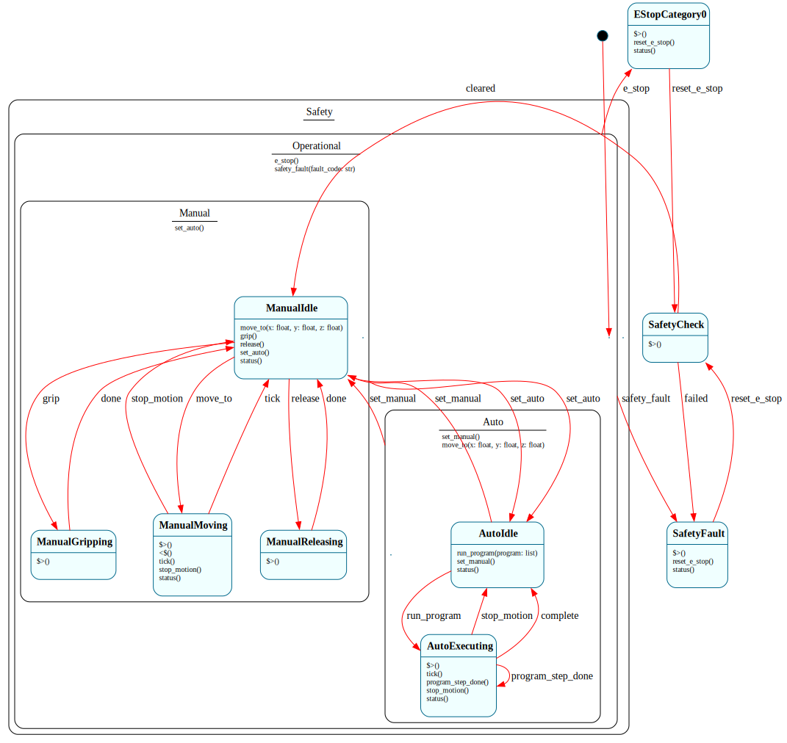

**Problem:** An industrial robot arm with three concerns layered via HSM: safety (emergency stop), operational mode (manual/auto), and motion states (idle/moving/gripping). Safety overrides everything.

**Reference:** IEC 61800-5-2 safe stop categories, ISO 10218 robot safety

```frame
@@target python_3

@@system RobotArm {
    operations:
        get_position(): dict {
            return {"x": self.pos_x, "y": self.pos_y, "z": self.pos_z}
        }
        get_velocity(): float {
            return self.current_velocity
        }
        get_state(): str {
            return @@:system.state
        }

    interface:
        # Mode control
        set_auto()
        set_manual()

        # Motion commands
        move_to(x: float, y: float, z: float)
        grip()
        release()
        stop_motion()

        # Program execution (auto mode only)
        run_program(program: list)
        program_step_done()

        # Safety
        e_stop()
        reset_e_stop()
        safety_fault(fault_code: str)

        # Telemetry
        tick()
        status(): str = ""

    machine:
        # =============================================
        #  SAFETY LAYER — top of HSM hierarchy
        #  E-stop overrides EVERYTHING
        # =============================================
        $Operational => $Safety {
            e_stop() {
                print("E-STOP ACTIVATED")
                self.e_stop_active = True
                self.current_velocity = 0
                -> $EStopCategory0
            }
            safety_fault(fault_code: str) {
                print(f"Safety fault: {fault_code}")
                self.current_velocity = 0
                -> $SafetyFault
            }
            => $^
        }

        $EStopCategory0 {
            $>() {
                print("  CAT-0: Immediate power removal")
                print("  Brakes engaged, drives disabled")
                self.drives_enabled = False
            }
            reset_e_stop() {
                print("  E-stop reset — performing safety check")
                -> $SafetyCheck
            }
            status(): str { @@:("E-STOP") }
        }

        $SafetyFault {
            $>() {
                print("  Safety fault active — motion disabled")
                self.drives_enabled = False
            }
            reset_e_stop() {
                -> $SafetyCheck
            }
            status(): str { @@:("safety fault") }
        }

        $SafetyCheck {
            $>() {
                print("  Running safety checks...")
                # In production: verify encoder positions, brake status, etc.
                if self.validate_safety():
                    self.drives_enabled = True
                    self.e_stop_active = False
                    print("  Safety check passed — drives enabled")
                    -> "cleared" $ManualIdle
                else:
                    print("  Safety check FAILED")
                    -> "failed" $SafetyFault
            }
        }

        $Safety {
            # Top-level parent — nothing here by default
        }

        # =============================================
        #  MANUAL MODE — jogging, teach pendant
        # =============================================
        $ManualIdle => $Manual {
            move_to(x: float, y: float, z: float) {
                self.target_x = x
                self.target_y = y
                self.target_z = z
                -> $ManualMoving
            }
            grip() { -> $ManualGripping }
            release() { -> $ManualReleasing }
            set_auto() { -> $AutoIdle }
            status(): str { @@:("manual idle") }
            => $^
        }

        $ManualMoving => $Manual {
            $>() {
                self.current_velocity = self.manual_speed_limit
                print(f"  Moving to ({self.target_x},{self.target_y},{self.target_z}) at {self.current_velocity} mm/s")
            }
            <$() { self.current_velocity = 0 }

            tick() {
                # Simulate motion
                self.pos_x = self.pos_x + (self.target_x - self.pos_x) * 0.3
                self.pos_y = self.pos_y + (self.target_y - self.pos_y) * 0.3
                self.pos_z = self.pos_z + (self.target_z - self.pos_z) * 0.3
                dist = ((self.target_x - self.pos_x)**2 + (self.target_y - self.pos_y)**2 + (self.target_z - self.pos_z)**2) ** 0.5
                if dist < 0.1:
                    self.pos_x = self.target_x
                    self.pos_y = self.target_y
                    self.pos_z = self.target_z
                    print(f"  Arrived at ({self.pos_x},{self.pos_y},{self.pos_z})")
                    -> $ManualIdle
            }
            stop_motion() {
                print("  Motion stopped")
                -> $ManualIdle
            }
            status(): str { @@:("manual moving") }
            => $^
        }

        $ManualGripping => $Manual {
            $>() {
                self.gripper_closed = True
                print("  Gripper closed")
                -> "done" $ManualIdle
            }
            => $^
        }

        $ManualReleasing => $Manual {
            $>() {
                self.gripper_closed = False
                print("  Gripper opened")
                -> "done" $ManualIdle
            }
            => $^
        }

        $Manual => $Operational {
            # Shared for all manual states
            set_auto() { -> $AutoIdle }
            => $^
        }

        # =============================================
        #  AUTO MODE — program execution
        # =============================================
        $AutoIdle => $Auto {
            run_program(program: list) {
                self.program = program
                self.program_step = 0
                print(f"  Auto: running program ({len(program)} steps)")
                -> $AutoExecuting
            }
            set_manual() { -> $ManualIdle }
            status(): str { @@:("auto idle") }
            => $^
        }

        $AutoExecuting => $Auto {
            $>() {
                if self.program_step >= len(self.program):
                    print("  Program complete")
                    -> "complete" $AutoIdle
                    return

                step = self.program[self.program_step]
                cmd = step["cmd"]
                print(f"  Step {self.program_step + 1}: {cmd}")
                self.current_velocity = self.auto_speed_limit

                if cmd == "move":
                    self.target_x = step["x"]
                    self.target_y = step["y"]
                    self.target_z = step["z"]
                elif cmd == "grip":
                    self.gripper_closed = True
                    self.program_step = self.program_step + 1
                    @@:self.program_step_done()
                elif cmd == "release":
                    self.gripper_closed = False
                    self.program_step = self.program_step + 1
                    @@:self.program_step_done()
            }

            tick() {
                # Simulate auto motion
                self.pos_x = self.pos_x + (self.target_x - self.pos_x) * 0.5
                self.pos_y = self.pos_y + (self.target_y - self.pos_y) * 0.5
                self.pos_z = self.pos_z + (self.target_z - self.pos_z) * 0.5
                dist = ((self.target_x - self.pos_x)**2 + (self.target_y - self.pos_y)**2 + (self.target_z - self.pos_z)**2) ** 0.5
                if dist < 0.1:
                    self.pos_x = self.target_x
                    self.pos_y = self.target_y
                    self.pos_z = self.target_z
                    self.program_step = self.program_step + 1
                    @@:self.program_step_done()
            }

            program_step_done() {
                -> $AutoExecuting
            }

            stop_motion() {
                print("  Auto motion stopped")
                self.current_velocity = 0
                -> $AutoIdle
            }
            status(): str { @@:(f"auto executing step {self.program_step + 1}/{len(self.program)}") }
            => $^
        }

        $Auto => $Operational {
            # Shared for all auto states
            set_manual() { -> $ManualIdle }
            # Reject motion commands in auto mode
            move_to(x: float, y: float, z: float) {
                print("  Manual move rejected — in auto mode")
            }
            => $^
        }

    actions:
        validate_safety() {
            # In production: check encoders, brakes, limits
            return True
        }

    domain:
        # Position
        pos_x: float = 0.0
        pos_y: float = 0.0
        pos_z: float = 0.0
        target_x: float = 0.0
        target_y: float = 0.0
        target_z: float = 0.0
        current_velocity: float = 0.0

        # Gripper
        gripper_closed: bool = False

        # Mode limits (mm/s)
        manual_speed_limit: float = 250.0
        auto_speed_limit: float = 1000.0

        # Safety
        drives_enabled: bool = True
        e_stop_active: bool = False

        # Program
        program: list = []
        program_step: int = 0
}

if __name__ == '__main__':
    arm = @@RobotArm()

    # --- Manual operation ---
    arm.move_to(100, 50, 200)
    for _ in range(10): arm.tick()
    print(f"Position: {arm.get_position()}")

    arm.grip()
    print(f"State: {arm.get_state()}")

    # --- Switch to auto ---
    arm.set_auto()
    program = [
        {"cmd": "move", "x": 200, "y": 100, "z": 50},
        {"cmd": "grip"},
        {"cmd": "move", "x": 0, "y": 0, "z": 200},
        {"cmd": "release"},
    ]
    arm.run_program(program)
    for _ in range(20): arm.tick()

    # --- E-stop during operation ---
    arm2 = @@RobotArm()
    arm2.move_to(500, 500, 500)
    arm2.tick()
    arm2.e_stop()
    print(f"After e-stop: {arm2.get_state()}")
    arm2.reset_e_stop()
    print(f"After reset: {arm2.get_state()}")
```

**How it works:**

**3-level HSM: Safety → Mode → Motion.**

```
$Safety
  └── $Operational
        ├── $Manual
        │     ├── $ManualIdle
        │     ├── $ManualMoving
        │     ├── $ManualGripping
        │     └── $ManualReleasing
        └── $Auto
              ├── $AutoIdle
              └── $AutoExecuting
$EStopCategory0
$SafetyFault
$SafetyCheck
```

`$Operational` handles `e_stop()` and `safety_fault()` — inherited by ALL operational states. E-stop works from `$ManualMoving`, `$AutoExecuting`, or any other operational state. This is the ISO 10218 safety overlay: the safety controller can override any operational state.

**Mode rejection.** `$Auto` rejects `move_to()` with a message — you can't jog in auto mode. `$Manual` doesn't handle `run_program()` — it's silently ignored. The state machine enforces mode-dependent command availability.

**Auto program execution.** `$AutoExecuting` reads the program step list, dispatches each command, and uses `@@:self.program_step_done()` to re-enter itself for the next step. This is the enter-handler chain pattern applied to program execution.

**Features stressed:** 14 states, 3-level HSM (deepest in the cookbook), operations with `@@:system.state`, mode-based event rejection, `@@:self.method()` for program stepping, transient states, enter/exit handlers for velocity management, domain variables for 3D position

---

## Deferred Event Processing

Recipes 50-52 demonstrate the **work queue pattern**: a system receives events it can't handle immediately, queues them, and processes them when it returns to an idle state. The enter handler on `$Idle` is the dequeue point — every transition back to idle checks for pending work. This is fundamentally different from "events ignored in wrong state." Here, events are *accepted* in every state but *deferred* until the system is ready.

-----

## 50. Print Spooler — Basic Work Queue

[↑ up](#49-robot-arm-controller--safety-overlay-with-hsm) · [top](#table-of-contents) · [↓ down](#51-manufacturing-cell--priority-queue-with-sub-phases)

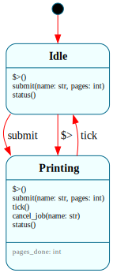

**Problem:** A printer that accepts jobs while busy. Jobs are queued and printed in FIFO order. The printer processes one job at a time.

```frame
@@target python_3

@@system PrintSpooler {
    operations:
        queue_depth(): int {
            return len(self.queue)
        }
        peek_queue(): list {
            return [j["name"] for j in self.queue]
        }

    interface:
        submit(name: str, pages: int)
        tick()
        cancel_job(name: str): bool = False
        status(): str = ""

    machine:
        $Idle {
            $>() {
                if len(self.queue) > 0:
                    self.current_job = self.queue.pop(0)
                    print(f"[PRINT] Starting: {self.current_job['name']} ({self.current_job['pages']} pages)")
                    -> "dequeue" $Printing
            }

            submit(name: str, pages: int) {
                self.current_job = {"name": name, "pages": pages, "printed": 0}
                print(f"[PRINT] Starting: {name} ({pages} pages)")
                -> $Printing
            }
            status(): str { @@:("idle") }
        }

        $Printing {
            $.pages_done: int = 0

            $>() {
                $.pages_done = self.current_job.get("printed", 0)
            }

            submit(name: str, pages: int) {
                self.queue.append({"name": name, "pages": pages, "printed": 0})
                print(f"  [QUEUE] Added: {name} (queue depth: {len(self.queue)})")
            }

            tick() {
                $.pages_done = $.pages_done + 1
                total = self.current_job["pages"]
                done = $.pages_done
                print(f"  [PAGE] {done}/{total}: {self.current_job['name']}")
                if $.pages_done >= total:
                    self.jobs_completed = self.jobs_completed + 1
                    print(f"  [DONE] {self.current_job['name']}")
                    self.current_job = None
                    -> $Idle
            }

            cancel_job(name: str): bool {
                for i, job in enumerate(self.queue):
                    if job["name"] == name:
                        self.queue.pop(i)
                        @@:(True)
                        return
                @@:(False)
            }

            status(): str {
                total = self.current_job["pages"]
                done = $.pages_done
                @@:(f"printing {self.current_job['name']} ({done}/{total}), {len(self.queue)} queued")
            }
        }

    domain:
        queue: list = []
        current_job = None
        jobs_completed: int = 0
}

if __name__ == '__main__':
    p = @@PrintSpooler()
    p.submit("Report.pdf", 3)
    p.submit("Invoice.pdf", 2)
    p.submit("Photo.jpg", 1)
    print(f"Queue: {p.peek_queue()}")

    for _ in range(20):
        p.tick()
        if p.queue_depth() == 0 and p.status() == "idle":
            break

    print(f"Completed: {p.jobs_completed} jobs")
```

**How it works:** The dequeue point is `$Idle.$>()`. Every transition to `$Idle` triggers the enter handler, which checks `self.queue`. If there's a pending job, it pops the first one and immediately transitions to `$Printing`. The system never rests in `$Idle` while there's queued work.

`submit()` behaves differently per state. In `$Idle`, it starts the job immediately. In `$Printing`, it appends to the queue. Same interface, different behavior — the core value of state machines.

**Features used:** deferred event processing, enter handler as dequeue point, operations for queue inspection, same event with different per-state behavior, state variables for progress tracking

-----

## 51. Manufacturing Cell — Priority Queue with Sub-Phases

[↑ up](#50-print-spooler--basic-work-queue) · [top](#table-of-contents) · [↓ down](#52-elevator--directional-scan-algorithm)

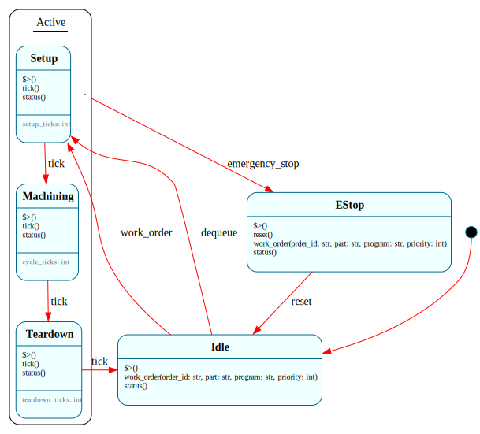

**Problem:** A CNC machine tool that processes work orders through setup, machining, and teardown phases. New orders arrive at any time and are queued with priority. The machine processes the highest-priority job next.

```frame
@@target python_3

@@system ManufacturingCell {
    operations:
        queue_depth(): int {
            return len(self.queue)
        }
        parts_produced(): int {
            return self.completed_count
        }

    interface:
        work_order(order_id: str, part: str, program: str, priority: int)
        tick()
        emergency_stop()
        reset()
        status(): str = ""

    machine:
        $Idle {
            $>() {
                self.phase = "idle"
                if len(self.queue) > 0:
                    self.queue.sort(key=lambda x: -x["priority"])
                    self.current_job = self.queue.pop(0)
                    print(f"[CELL] Next job: {self.current_job['order_id']} (priority {self.current_job['priority']})")
                    -> "dequeue" $Setup
            }

            work_order(order_id: str, part: str, program: str, priority: int) {
                self.current_job = {
                    "order_id": order_id, "part": part,
                    "program": program, "priority": priority
                }
                print(f"[CELL] Starting: {order_id} ({part})")
                -> $Setup
            }
            status(): str { @@:("idle") }
        }

        $Setup => $Active {
            $.setup_ticks: int = 0
            $>() { self.phase = "setup" }
            tick() {
                $.setup_ticks = $.setup_ticks + 1
                if $.setup_ticks >= self.setup_time:
                    -> $Machining
            }
            status(): str { @@:(f"setup ({$.setup_ticks}/{self.setup_time})") }
            => $^
        }

        $Machining => $Active {
            $.cycle_ticks: int = 0
            $>() { self.phase = "machining" }
            tick() {
                $.cycle_ticks = $.cycle_ticks + 1
                if $.cycle_ticks >= self.cycle_time:
                    -> $Teardown
            }
            status(): str { @@:(f"machining ({$.cycle_ticks}/{self.cycle_time})") }
            => $^
        }

        $Teardown => $Active {
            $.teardown_ticks: int = 0
            $>() { self.phase = "teardown" }
            tick() {
                $.teardown_ticks = $.teardown_ticks + 1
                if $.teardown_ticks >= self.teardown_time:
                    self.completed_count = self.completed_count + 1
                    self.current_job = None
                    -> $Idle
            }
            status(): str { @@:(f"teardown ({$.teardown_ticks}/{self.teardown_time})") }
            => $^
        }

        $Active {
            emergency_stop() {
                print(f"  [E-STOP] During {self.phase}")
                if self.current_job is not None:
                    self.current_job["priority"] = 999
                    self.queue.insert(0, self.current_job)
                    self.current_job = None
                -> $EStop
            }
            work_order(order_id: str, part: str, program: str, priority: int) {
                self.queue.append({
                    "order_id": order_id, "part": part,
                    "program": program, "priority": priority
                })
            }
        }

        $EStop {
            $>() { self.phase = "e-stop" }
            reset() { -> $Idle }
            work_order(order_id: str, part: str, program: str, priority: int) {
                self.queue.append({
                    "order_id": order_id, "part": part,
                    "program": program, "priority": priority
                })
            }
            status(): str { @@:(f"e-stop ({len(self.queue)} queued)") }
        }

    domain:
        queue: list = []
        current_job = None
        completed_count: int = 0
        phase: str = "idle"
        setup_time: int = 2
        cycle_time: int = 3
        teardown_time: int = 1
}

if __name__ == '__main__':
    cell = @@ManufacturingCell()
    cell.work_order("WO-001", "Bracket-A", "prog_bracket.nc", 1)
    cell.work_order("WO-002", "Shaft-B", "prog_shaft.nc", 2)
    cell.work_order("WO-003", "Housing-C", "prog_housing.nc", 5)

    for i in range(30):
        cell.tick()
        if cell.queue_depth() == 0 and cell.status() == "idle":
            break

    print(f"Parts produced: {cell.parts_produced()}")
```

**How it works:** Priority queue, not FIFO. `$Idle.$>()` sorts the queue by descending priority before popping. High-priority jobs jump the queue. Three sub-phases (`$Setup`, `$Machining`, `$Teardown`) are children of `$Active`, which handles `emergency_stop()` and `work_order()` for all of them. E-stop re-queues the interrupted job at priority 999 so it resumes first after reset.

**Features used:** priority queue dequeue, HSM with shared e-stop, sub-phase progression, state variables as phase timers, events accepted in all states including e-stop

-----

## 52. Elevator — Directional Scan Algorithm

[↑ up](#51-manufacturing-cell--priority-queue-with-sub-phases) · [top](#table-of-contents) · [↓ down](#53-byte-scanner--tokenize-a-simple-language)

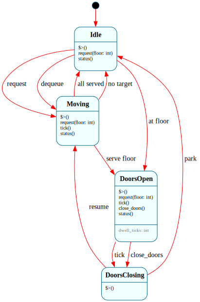

**Problem:** An elevator services floor requests using the SCAN algorithm: continue in the current direction until all requests in that direction are served, then reverse. Requests arrive at any time and are accumulated, not ignored.

```frame
@@target python_3

@@system Elevator {
    operations:
        current_floor(): int {
            return self.floor
        }
        pending_requests(): list {
            return sorted(self.requests)
        }

    interface:
        request(floor: int)
        tick()
        close_doors()
        status(): str = ""

    machine:
        $Idle {
            $>() {
                if len(self.requests) > 0:
                    self.select_direction()
                    -> "dequeue" $Moving
            }

            request(floor: int) {
                if floor == self.floor:
                    -> "at floor" $DoorsOpen
                else:
                    self.requests.add(floor)
                    self.select_direction()
                    -> $Moving
            }
            status(): str { @@:(f"idle at floor {self.floor}") }
        }

        $Moving {
            $>() {
                target = self.next_stop()
                if target is None:
                    -> "no target" $Idle
            }

            request(floor: int) {
                self.requests.add(floor)
            }

            tick() {
                if self.dir == "up":
                    self.floor = self.floor + 1
                else:
                    self.floor = self.floor - 1

                if self.floor in self.requests:
                    self.requests.discard(self.floor)
                    self.stops_made = self.stops_made + 1
                    -> "serve floor" $DoorsOpen
                else:
                    target = self.next_stop()
                    if target is None:
                        self.reverse_direction()
                        target = self.next_stop()
                        if target is None:
                            -> "all served" $Idle
            }

            status(): str { @@:(f"moving {self.dir} at floor {self.floor}") }
        }

        $DoorsOpen {
            $.dwell_ticks: int = 0

            $>() {
                print(f"  [DOORS] Open at floor {self.floor}")
            }

            request(floor: int) {
                if floor == self.floor:
                    $.dwell_ticks = 0
                else:
                    self.requests.add(floor)
            }

            tick() {
                $.dwell_ticks = $.dwell_ticks + 1
                if $.dwell_ticks >= self.dwell_time:
                    -> $DoorsClosing
            }

            close_doors() {
                -> $DoorsClosing
            }

            status(): str { @@:(f"doors open at floor {self.floor}") }
        }

        $DoorsClosing {
            $>() {
                if len(self.requests) > 0:
                    self.select_direction()
                    -> "resume" $Moving
                else:
                    -> "park" $Idle
            }
        }

    actions:
        select_direction() {
            up_requests = [f for f in self.requests if f > self.floor]
            down_requests = [f for f in self.requests if f < self.floor]
            if self.dir == "up":
                if len(up_requests) > 0:
                    self.dir = "up"
                elif len(down_requests) > 0:
                    self.dir = "down"
            else:
                if len(down_requests) > 0:
                    self.dir = "down"
                elif len(up_requests) > 0:
                    self.dir = "up"
        }

        next_stop() {
            if self.dir == "up":
                ahead = sorted([f for f in self.requests if f > self.floor])
                if len(ahead) > 0:
                    return ahead[0]
            else:
                ahead = sorted([f for f in self.requests if f < self.floor], reverse=True)
                if len(ahead) > 0:
                    return ahead[0]
            return None
        }

        reverse_direction() {
            if self.dir == "up":
                self.dir = "down"
            else:
                self.dir = "up"
        }

    domain:
        floor: int = 1
        dir: str = "up"
        requests: set = set()
        dwell_time: int = 2
        stops_made: int = 0
}

if __name__ == '__main__':
    elev = @@Elevator()
    elev.request(5)
    elev.request(3)
    elev.request(8)

    for _ in range(20):
        elev.tick()

    print(f"Stops made: {elev.stops_made}")
    print(f"Final floor: {elev.current_floor()}")
```

**How it works:** The elevator continues in its current direction as long as there are requests ahead, then reverses. Requests are accepted in every state — `$Moving`, `$DoorsOpen`, and `$DoorsClosing` all handle `request()` by adding to `self.requests` (a set, so duplicates are ignored). `$DoorsClosing` is a transient state whose enter handler selects direction and transitions to `$Moving` or `$Idle`. `$Idle.$>()` is the dequeue point — the elevator never idles with pending requests.

**Features used:** SCAN algorithm with directional logic, set as domain variable for deduplication, transient states, enter handler as dequeue and direction-select point, state variables for dwell timer, requests accepted in all states

-----

## Scanner and Parser Recipes

The next two recipes stand alone as a pair: a lexical scanner and a pushdown parser, composed to form a minimal "Frame as parser generator" pipeline. They answer the Ragel-style question — *can Frame do what a dedicated scanner/parser generator does?* — with two small systems totaling fewer than a hundred Frame lines. Every feature used is already in play elsewhere in the cookbook; the scanner uses state variables and `@@:self` for delimiter replay, the parser uses `push$` / `pop$` as a call stack.

-----

## 53. Byte Scanner — Tokenize a Simple Language

[↑ up](#52-elevator--directional-scan-algorithm) · [top](#table-of-contents) · [↓ down](#54-pushdown-parser--nested-structure-with-push--pop)


**Problem:** Tokenize an input string into identifiers, numbers, strings, and punctuation — the scanning half of a parser. The input `set x = 42 "hello"` should emit:

```
IDENT(set) IDENT(x) PUNCT(=) NUMBER(42) STRING(hello) EOF
```

Scanners are the classic state-machine workload. Frame handles it naturally because every scanner is a state machine: you sit in a mode (`$Start`, `$InIdent`, `$InNumber`, `$InString`), consume a byte, decide whether to stay, emit, or change modes, and loop.

```frame
@@target python_3

@@system Scanner {
    interface:
        feed(ch: str)
        eof()
        tokens(): list

    machine:
        $Start {
            feed(ch: str) {
                if ch.isalpha():
                    self.buf = ch
                    -> $InIdent
                elif ch.isdigit():
                    self.buf = ch
                    -> $InNumber
                elif ch == '"':
                    self.buf = ""
                    -> $InString
                elif ch.isspace():
                    return
                else:
                    self.emit("PUNCT", ch)
            }
            eof() {
                self.emit("EOF", "")
            }
            tokens(): list {
                @@:(self.out)
            }
        }

        $InIdent {
            feed(ch: str) {
                if ch.isalnum() or ch == "_":
                    self.buf = self.buf + ch
                else:
                    self.emit("IDENT", self.buf)
                    -> $Start
                    @@:self.feed(ch)      # replay the delimiter byte
            }
            eof() {
                self.emit("IDENT", self.buf)
                self.emit("EOF", "")
            }
        }

        $InNumber {
            feed(ch: str) {
                if ch.isdigit():
                    self.buf = self.buf + ch
                else:
                    self.emit("NUMBER", self.buf)
                    -> $Start
                    @@:self.feed(ch)
            }
            eof() {
                self.emit("NUMBER", self.buf)
                self.emit("EOF", "")
            }
        }

        $InString {
            feed(ch: str) {
                if ch == '"':
                    self.emit("STRING", self.buf)
                    -> $Start
                else:
                    self.buf = self.buf + ch
            }
            eof() {
                self.emit("ERROR", "unterminated string")
            }
        }

    actions:
        emit(kind: str, lexeme: str) {
            self.out.append(f"{kind}({lexeme})")
        }

    domain:
        buf: str = ""
        out: list = []
}

if __name__ == '__main__':
    s = @@Scanner()
    for ch in 'set x = 42 "hello"':
        s.feed(ch)
    s.eof()
    print(s.tokens())
    # ['IDENT(set)', 'IDENT(x)', 'PUNCT(=)', 'NUMBER(42)', 'STRING(hello)', 'EOF()']
```

**How it works:** Each mode is a state. `self.buf` is a domain variable — persistent across transitions so the accumulated token survives the move back to `$Start`. The tokenized output accumulates in `self.out` for the same reason.

The characteristic bit is **delimiter replay**: when `$InIdent` sees a non-identifier byte, it has to emit the identifier *and* let that byte restart scanning as something else. `@@:self.feed(ch)` re-dispatches the byte through the kernel. Because the kernel processes the pending `-> $Start` transition before the replayed `feed` runs, the byte arrives in `$Start` and scanning resumes cleanly. This is the `@@:self` pattern (RFC-0006) — with the transition-guard semantics making the "replay after transition" form safe to write.

**Features used:** domain variables for buffer/output persistence across transitions, `@@:self.method()` for byte replay after a transition, states-as-modes, `return` to stay in the current state without emission.

-----

## 54. Pushdown Parser — Nested Structure with `push$` / `pop$`

[↑ up](#53-byte-scanner--tokenize-a-simple-language) · [top](#table-of-contents) · [↓ down](#55-process-lifecycle)


**Problem:** Recognize balanced bracket structures like `[1, [2, 3], 4]` and rebuild the nested Python list. A flat scanner cannot do this — nested structures need a stack. Frame's `push$` / `pop$` give you one without writing a separate data structure.

This recipe is the natural complement to #53: the scanner handles token recognition, the parser handles structure.

```frame
@@target python_3

@@system BracketParser {
    interface:
        open()
        close()
        value(v: int)
        result(): list

    machine:
        $Flat {
            open() {
                push$
                -> $Nested
            }
            close() {
                self.emit_error("unbalanced close at top level")
            }
            value(v: int) {
                self.items.append(v)
            }
            result(): list {
                @@:(self.items)
            }
        }

        $Nested {
            $.items: list

            open() {
                push$
                -> $Nested
            }
            close() {
                self.bubble_up($.items)
                -> pop$
            }
            value(v: int) {
                $.items.append(v)
            }
            result(): list {
                @@:($.items)
            }
        }

    actions:
        bubble_up(items: list) {
            # pop$ will restore _state_stack[-1] as the current compartment.
            # If it's another $Nested, append our items as a sublist
            # (preserves structure). If we're about to return to $Flat
            # (the outermost frame), spread into the domain so the
            # top-level list is flat at depth 0.
            if len(self._state_stack) > 0:
                parent = self._state_stack[-1]
                if "items" in parent.state_vars:
                    parent.state_vars["items"].append(items)
                else:
                    self.items.extend(items)
            else:
                self.items.extend(items)
        }
        emit_error(msg: str) {
            print(f"parse error: {msg}")
        }

    domain:
        items: list = []
}

if __name__ == '__main__':
    p = @@BracketParser()
    # Input: [1, [2, 3], 4]
    p.open()
    p.value(1)
    p.open()
    p.value(2)
    p.value(3)
    p.close()            # inner list [2, 3] bubbles into outer $Nested
    p.value(4)
    p.close()            # full [1, [2, 3], 4] bubbles out to $Flat's domain
    print(p.result())
    # [1, [2, 3], 4]
```

**How it works:** Each `open()` pushes the current compartment and enters a fresh `$Nested`. The new compartment has its own `$.items` (per-compartment state variable, empty by default for the declared `list` type), so sibling nested lists never alias. When `close()` fires, the action `bubble_up($.items)` delivers the collected list to the compartment that `pop$` is about to restore — peeked via `self._state_stack[-1]` — and only then does the transition happen. `$Nested → $Nested` appends the sub-list as a single element (preserving nesting); `$Nested → $Flat` spreads into the domain list (so the outer bracket pair contributes its contents directly, not as one wrapped element).

The shape of the code is the point: `push$` is `call`, `pop$` is `ret`, the compartment is the activation record, `$.items` is a local. Frame's state stack is a proper pushdown automaton — exactly what's needed to recognize nested grammars that regular state machines (flat ones, like #53) cannot.

**Features used:** `push$` for activation records, `-> pop$` for return, typed per-state variable (`$.items: list`) for compartment-local state, action reading the saved compartment via `self._state_stack[-1]` for cross-frame data transfer.

### Running #53 and #54 Together

```python
src = '[1, [2, 3], 4]'
s = Scanner()
for ch in src: s.feed(ch)
s.eof()

p = BracketParser()
for tok in s.tokens():
    if tok.startswith('PUNCT(['):      p.open()
    elif tok.startswith('PUNCT(]'):    p.close()
    elif tok.startswith('NUMBER('):    p.value(int(tok[7:-1]))
print(p.result())
# [1, [2, 3], 4]
```

Two small Frame systems, composed, produce a scanner + parser pipeline in plain dependency-free Python — and in any of the other sixteen target languages with no codegen changes.

-----

## OS Internals (Kernel & Subsystems)

Nine recipes modeling real kernel subsystems as Frame state machines. Each recipe maps a subsystem whose logic is scattered across the Linux source tree onto a single Frame spec that surfaces the state graph directly. Every recipe is runnable with `@@target python_3`.

-----

## 55. Process Lifecycle

[↑ up](#54-pushdown-parser--nested-structure-with-push--pop) · [top](#table-of-contents) · [↓ down](#56-runtime-power-management)


**Problem:** Model the Linux task states and the transitions driven by signals, I/O, and scheduler decisions. In the kernel, these states are bitmask constants scattered across `kernel/sched/core.c`, `kernel/signal.c`, and `kernel/exit.c`. The transition logic is implicit — you have to trace code paths to determine which states are reachable from which.

```frame
@@target python_3

@@system TaskLifecycle {
    interface:
        fork(): str
        schedule(): str
        block_on_io(): str
        io_complete(): str
        block_uninterruptible(): str
        send_signal(sig: str): str
        wait_by_parent(): str
        status(): str

    machine:
        $New {
            fork(): str {
                self.pid = self.next_pid()
                @@:("forked")
                -> $Ready
            }
            status(): str { @@:("new") }
        }

        $Ready => $Alive {
            schedule(): str {
                @@:("running")
                -> $Running
            }
            status(): str { @@:("ready") }
            => $^
        }

        $Running => $Alive {
            schedule(): str {
                @@:("preempted")
                -> $Ready
            }
            block_on_io(): str {
                @@:("blocked")
                -> $Interruptible
            }
            block_uninterruptible(): str {
                @@:("blocked (D)")
                -> $Uninterruptible
            }
            status(): str { @@:("running") }
            => $^
        }

        $Interruptible => $Blocked {
            io_complete(): str {
                @@:("woke")
                -> $Ready
            }
            send_signal(sig: str): str {
                # Fatal and stop signals take precedence over wake-up.
                # Forward them to $Alive for uniform handling.
                if sig == "SIGKILL" or sig == "SIGTERM" or sig == "SIGSTOP":
                    => $^
                else:
                    @@:("interrupted")
                    -> $Ready
            }
            status(): str { @@:("interruptible") }
            => $^
        }

        $Uninterruptible => $Blocked {
            io_complete(): str {
                @@:("woke")
                -> $Ready
            }
            # send_signal NOT handled here — all signals forward via => $^
            # through $Blocked to $Alive. Non-fatal signals hit the "ignored"
            # branch there, matching the kernel's D-state behavior.
            # SIGKILL still gets through, matching TASK_KILLABLE.
            status(): str { @@:("uninterruptible") }
            => $^
        }

        $Blocked => $Alive {
            status(): str { @@:("blocked") }
            => $^
        }

        $Alive {
            send_signal(sig: str): str {
                if sig == "SIGKILL" or sig == "SIGTERM":
                    @@:("exiting")
                    -> $Zombie
                elif sig == "SIGSTOP":
                    @@:("stopped")
                    -> $Stopped
                else:
                    @@:("signal ignored")
            }
        }

        $Stopped {
            send_signal(sig: str): str {
                if sig == "SIGCONT":
                    @@:("continued")
                    -> $Ready
                elif sig == "SIGKILL":
                    @@:("killed while stopped")
                    -> $Zombie
                else:
                    @@:("signal ignored")
            }
            status(): str { @@:("stopped") }
        }

        $Zombie {
            wait_by_parent(): str {
                @@:("reaped")
                -> $Dead
            }
            status(): str { @@:("zombie") }
        }

        $Dead {
            status(): str { @@:("dead") }
        }

    actions:
        next_pid() {
            self.pid_counter = self.pid_counter + 1
            return self.pid_counter
        }

    domain:
        pid: int = 0
        pid_counter: int = 100
}

if __name__ == '__main__':
    t = @@TaskLifecycle()
    print(t.fork())                      # forked
    print(t.schedule())                  # running
    print(t.block_on_io())               # blocked
    print(t.send_signal("SIGUSR1"))      # interrupted (wakes interruptible)
    print(t.schedule())                  # running
    print(t.block_on_io())               # blocked (back in interruptible)
    print(t.send_signal("SIGKILL"))      # exiting (forwarded to $Alive)
    print(t.status())                    # zombie
    print(t.wait_by_parent())            # reaped
    print(t.status())                    # dead

    # Uninterruptible path — non-fatal signals ignored, SIGKILL kills
    t2 = @@TaskLifecycle()
    t2.fork(); t2.schedule()
    print(t2.block_uninterruptible())    # blocked (D)
    print(t2.send_signal("SIGUSR1"))     # signal ignored (D-state)
    print(t2.send_signal("SIGKILL"))     # exiting (via $Alive)
    print(t2.status())                   # zombie
```

**How it works:** The HSM hierarchy captures a key insight buried in the kernel code: `$Interruptible` and `$Uninterruptible` are both children of `$Blocked`, which is a child of `$Alive`. Signals like SIGKILL and SIGSTOP are handled by `$Alive` and apply uniformly to all living states.

The subtlety: because V4 forwarding is **explicit only**, a child handler that handles `send_signal()` completely shadows the parent. So `$Interruptible.send_signal()` explicitly forwards fatal signals to the parent via an in-handler `=> $^`, while intercepting wake-up signals (SIGUSR1, etc.) locally. `$Uninterruptible` has no `send_signal()` handler at all, so every signal forwards through `$Blocked` (no handler) to `$Alive`. Non-fatal signals hit `$Alive`’s `else` branch and are ignored — matching D-state behavior. SIGKILL still gets through, matching `TASK_KILLABLE`.

The `$Zombie` → `$Dead` transition (via `wait_by_parent()`) models the parent calling `wait()` to reap the zombie. Until that happens, the zombie cannot be reused. In Frame, this is structural: no event in `$Zombie` transitions anywhere except `$Dead`.

**Features used:** 3-level HSM (`$Interruptible` => `$Blocked` => `$Alive`), selective in-handler forwarding (`=> $^` inside `if`), events ignored by absent handler (D-state non-fatal signals), parent forwarding for shared signal handling

-----


## 56. Runtime Power Management

[↑ up](#55-process-lifecycle) · [top](#table-of-contents) · [↓ down](#57-block-io-request)


**Problem:** Model the kernel’s runtime PM framework (`drivers/base/power/runtime.c`). Devices transition through power states based on usage counts and autosuspend timers. The kernel implementation is 1,800 lines of nested conditionals and spinlock-protected flag checks.

```frame
@@target python_3

@@system RuntimePM {
    interface:
        get(): str
        put(): str
        autosuspend_expired(): str
        resume_complete(): str
        suspend_complete(success: bool): str
        status(): str

    machine:
        $Active {
            $>() {
                self.cancel_timer()
                print(f"[rpm] active (usage={self.usage_count})")
            }

            get(): str {
                self.usage_count = self.usage_count + 1
                @@:(f"get: usage={self.usage_count}")
            }
            put(): str {
                self.usage_count = self.usage_count - 1
                @@:(f"put: usage={self.usage_count}")
                if self.usage_count <= 0:
                    -> $Idle
            }
            status(): str { @@:("active") }
        }

        $Idle {
            $>() {
                self.start_autosuspend_timer()
                print(f"[rpm] idle, timer started ({self.autosuspend_delay_ms}ms)")
            }
            <$() {
                self.cancel_timer()
            }

            get(): str {
                self.usage_count = self.usage_count + 1
                @@:(f"get: usage={self.usage_count}")
                -> $Active
            }
            autosuspend_expired(): str {
                @@:("suspending")
                -> $Suspending
            }
            status(): str { @@:("idle") }
        }

        $Suspending {
            $>() {
                print("[rpm] suspending device...")
                self.call_suspend_callback()
            }

            suspend_complete(success: bool): str {
                if success:
                    @@:("suspended")
                    -> $Suspended
                else:
                    @@:("suspend failed")
                    -> $Active
            }
            get(): str {
                self.usage_count = self.usage_count + 1
                @@:("resume requested during suspend")
                -> $Resuming
            }
            status(): str { @@:("suspending") }
        }

        $Suspended {
            $>() {
                print("[rpm] device suspended")
            }

            get(): str {
                self.usage_count = self.usage_count + 1
                @@:("waking")
                -> $Resuming
            }
            status(): str { @@:("suspended") }
        }

        $Resuming {
            $>() {
                print("[rpm] resuming device...")
                self.call_resume_callback()
            }

            resume_complete(): str {
                @@:("resumed")
                -> $Active
            }
            status(): str { @@:("resuming") }
        }

    actions:
        start_autosuspend_timer() {
            print(f"  [timer] start {self.autosuspend_delay_ms}ms")
        }
        cancel_timer() {
            print("  [timer] cancelled")
        }
        call_suspend_callback() {
            print("  [driver] suspend callback")
        }
        call_resume_callback() {
            print("  [driver] resume callback")
        }

    domain:
        usage_count: int = 1
        autosuspend_delay_ms: int = 500
}

if __name__ == '__main__':
    dev = @@RuntimePM()
    print(dev.put())                         # put: usage=0 -> idle
    print(dev.autosuspend_expired())         # suspending
    print(dev.suspend_complete(True))        # suspended
    print(dev.get())                         # waking -> resuming
    print(dev.resume_complete())             # resumed -> active
    print(dev.put())                         # put: usage=0 -> idle
    print(dev.get())                         # get during idle -> active
    print(dev.status())                      # active
```

**How it works:** The enter/exit handlers on `$Idle` manage the autosuspend timer — `$>()` starts it, `<$()` cancels it. This is the pattern that takes 40+ lines of flag-checking in the kernel’s `rpm_idle()` function. The usage count is a domain variable because it must persist across state transitions (a `get()` during `$Suspending` increments it and redirects to `$Resuming`).

The race condition where `get()` arrives during `$Suspending` is handled naturally: `$Suspending` has a `get()` handler that increments the count and transitions to `$Resuming`. In the kernel, this requires careful lock ordering. In Frame, it’s a handler.

**Features used:** enter/exit handlers for timer lifecycle, domain variables (usage count), conditional transitions (suspend success/failure), events handled differently per state (get during active vs. suspended vs. suspending)

-----


## 57. Block I/O Request

[↑ up](#56-runtime-power-management) · [top](#table-of-contents) · [↓ down](#58-usb-device-enumeration)


**Problem:** Model the lifecycle of a block I/O request through the kernel’s blk-mq layer (`block/blk-mq.c`). Requests move through queuing, dispatch, in-flight, completion, and error recovery stages.

```frame
@@target python_3

@@system BlockRequest {
    interface:
        submit(sector: int, size: int): str
        dispatch(): str
        complete(success: bool): str
        timeout(): str
        status(): str

    machine:
        $Idle {
            submit(sector: int, size: int): str {
                self.sector = sector
                self.size = size
                self.attempts = 0
                @@:("queued")
                -> $Queued
            }
            status(): str { @@:("idle") }
        }

        $Queued {
            dispatch(): str {
                @@:("dispatched")
                -> $InFlight
            }
            status(): str { @@:("queued") }
        }

        $InFlight {
            $>() {
                self.attempts = self.attempts + 1
                self.start_timeout()
                print(f"  [blk] dispatched sector={self.sector} attempt={self.attempts}")
            }
            <$() {
                self.cancel_timeout()
            }

            complete(success: bool): str {
                if success:
                    @@:("done")
                    -> $Done
                else:
                    if self.attempts < self.max_retries:
                        @@:("requeued")
                        -> $Queued
                    else:
                        @@:("io error")
                        -> $Error
            }
            timeout(): str {
                if self.attempts < self.max_retries:
                    @@:("timeout, retrying")
                    -> $Queued
                else:
                    @@:("timeout, giving up")
                    -> $Error
            }
            status(): str { @@:("in-flight") }
        }

        $Done {
            $>() {
                print(f"  [blk] complete sector={self.sector}")
            }
            status(): str { @@:("done") }
        }

        $Error {
            $>() {
                print(f"  [blk] ERROR sector={self.sector} after {self.attempts} attempts")
            }
            status(): str { @@:("error") }
        }

    actions:
        start_timeout() {
            print(f"  [timer] request timeout started ({self.timeout_ms}ms)")
        }
        cancel_timeout() {
            print("  [timer] request timeout cancelled")
        }

    domain:
        sector: int = 0
        size: int = 0
        attempts: int = 0
        max_retries: int = 3
        timeout_ms: int = 30000
}

if __name__ == '__main__':
    req = @@BlockRequest()
    print(req.submit(1024, 8))       # queued
    print(req.dispatch())            # dispatched
    print(req.timeout())             # timeout, retrying
    print(req.dispatch())            # dispatched
    print(req.complete(False))       # requeued
    print(req.dispatch())            # dispatched
    print(req.complete(True))        # done
    print(req.status())              # done
```

**How it works:** The enter handler on `$InFlight` starts the timeout timer and increments the attempt count. The exit handler cancels the timer. This pair ensures the timer is always properly managed regardless of whether the request completes, times out, or gets requeued. In the kernel’s blk-mq code, timeout management is spread across `blk_mq_start_request()`, `blk_mq_complete_request()`, and `blk_mq_timeout_work()`.

The retry logic uses a domain variable (`self.attempts`) that persists across the `$InFlight` → `$Queued` → `$InFlight` cycle. Each re-entry to `$InFlight` increments the counter via the enter handler.

**Features used:** enter/exit handlers for timeout management, domain variables for retry counting, conditional transitions (success/failure/timeout paths), terminal states

-----


## 58. USB Device Enumeration

[↑ up](#57-block-io-request) · [top](#table-of-contents) · [↓ down](#59-watchdog-timer)


**Problem:** Model the USB device enumeration sequence (USB 2.0 spec §9.1). When a device is plugged in, the hub driver must reset it, assign an address, read descriptors, and load a driver. Failure at any stage requires cleanup of all prior stages. The kernel implementation (`drivers/usb/core/hub.c`) is 5,800 lines.

```frame
@@target python_3

@@system UsbEnumerator {
    interface:
        plug_in(port: int)
        reset_done(success: bool)
        address_set(success: bool, addr: int)
        descriptors_read(success: bool, product: str)
        driver_bound(success: bool)
        unplug()
        status(): str

    machine:
        $Detached {
            plug_in(port: int) {
                self.port = port
                self.reset_attempts = 0
                -> $Resetting
            }
            status(): str { @@:("detached") }
        }

        $Resetting => $Enumerating {
            $>() {
                self.reset_attempts = self.reset_attempts + 1
                print(f"  [usb] resetting port {self.port} (attempt {self.reset_attempts})")
                self.issue_port_reset(self.port)
            }

            reset_done(success: bool) {
                if success:
                    -> $Addressing
                else:
                    if self.reset_attempts < self.max_reset_attempts:
                        -> $Resetting
                    else:
                        -> $Failed
            }
            status(): str { @@:("resetting") }
            => $^
        }

        $Addressing => $Enumerating {
            $>() {
                print(f"  [usb] assigning address on port {self.port}")
                self.assign_address()
            }

            address_set(success: bool, addr: int) {
                if success:
                    self.address = addr
                    -> $ReadingDescriptors
                else:
                    -> $UndoReset
            }
            status(): str { @@:("addressing") }
            => $^
        }

        $ReadingDescriptors => $Enumerating {
            $>() {
                print(f"  [usb] reading descriptors for device at addr {self.address}")
                self.read_descriptors(self.address)
            }

            descriptors_read(success: bool, product: str) {
                if success:
                    self.product = product
                    -> $BindingDriver
                else:
                    -> $UndoAddress
            }
            status(): str { @@:("reading descriptors") }
            => $^
        }

        $BindingDriver => $Enumerating {
            $>() {
                print(f"  [usb] binding driver for '{self.product}'")
                self.bind_driver(self.product)
            }

            driver_bound(success: bool) {
                if success:
                    -> $Configured
                else:
                    -> $UndoAddress
            }
            status(): str { @@:("binding driver") }
            => $^
        }

        $Enumerating {
            unplug() {
                print(f"  [usb] unplugged during enumeration")
                -> $Detached
            }
        }

        # --- Compensation chain ---
        $UndoAddress {
            $>() {
                print(f"  [usb] releasing address {self.address}")
                self.release_address(self.address)
                -> $UndoReset
            }
        }

        $UndoReset {
            $>() {
                print(f"  [usb] disabling port {self.port}")
                self.disable_port(self.port)
                -> $Failed
            }
        }

        $Configured {
            $>() {
                print(f"  [usb] device '{self.product}' configured at addr {self.address}")
            }
            unplug() {
                self.unbind_driver()
                self.release_address(self.address)
                self.disable_port(self.port)
                -> $Detached
            }
            status(): str { @@:(f"configured: {self.product} @ addr {self.address}") }
        }

        $Failed {
            $>() {
                print(f"  [usb] enumeration failed on port {self.port}")
            }
            plug_in(port: int) {
                self.port = port
                self.reset_attempts = 0
                -> $Resetting
            }
            status(): str { @@:("failed") }
        }

    actions:
        issue_port_reset(port)      { print(f"    -> port_reset({port})") }
        assign_address()            { print("    -> assign_address()") }
        read_descriptors(addr)      { print(f"    -> read_descriptors({addr})") }
        bind_driver(product)        { print(f"    -> bind_driver({product})") }
        release_address(addr)       { print(f"    -> release_address({addr})") }
        disable_port(port)          { print(f"    -> disable_port({port})") }
        unbind_driver()             { print("    -> unbind_driver()") }

    domain:
        port: int = 0
        address: int = 0
        product: str = ""
        reset_attempts: int = 0
        max_reset_attempts: int = 3
}

if __name__ == '__main__':
    usb = @@UsbEnumerator()

    # Happy path
    usb.plug_in(1)
    usb.reset_done(True)
    usb.address_set(True, 7)
    usb.descriptors_read(True, "USB Keyboard")
    usb.driver_bound(True)
    print(usb.status())  # configured: USB Keyboard @ addr 7

    # Failure with compensation
    usb2 = @@UsbEnumerator()
    usb2.plug_in(2)
    usb2.reset_done(True)
    usb2.address_set(True, 8)
    usb2.descriptors_read(False, "")  # descriptor read fails
    # -> UndoAddress -> UndoReset -> Failed
    print(usb2.status())  # failed

    # Unplug during enumeration — forwarded to $Enumerating via => $^
    usb3 = @@UsbEnumerator()
    usb3.plug_in(3)
    usb3.reset_done(True)
    usb3.unplug()
    print(usb3.status()) # detached
```

**How it works:** The forward pipeline (`$Resetting` → `$Addressing` → `$ReadingDescriptors` → `$BindingDriver` → `$Configured`) is the happy path. Each stage is a child of `$Enumerating`, which handles `unplug()`. Each child has a trailing `=> $^` so events it doesn’t handle — including `unplug()` — forward to the parent.

The compensation chain (`$UndoAddress` → `$UndoReset` → `$Failed`) undoes prior stages in reverse order via enter-handler transitions. This is the saga pattern applied to hardware: if descriptor reading fails after an address was assigned, the address must be released and the port disabled.

In the kernel’s `hub_port_connect_change()`, this logic is a 300-line function with goto labels for cleanup. In Frame, each stage is a state and each compensation step is a transient state.

**Features used:** HSM for shared `unplug()` handling, enter-handler chain for compensation, retry with counter (reset attempts), transient states for undo, multi-stage pipeline

-----


## 59. Watchdog Timer

[↑ up](#58-usb-device-enumeration) · [top](#table-of-contents) · [↓ down](#60-oom-killer)


**Problem:** Model the kernel’s watchdog device (`drivers/watchdog/watchdog_dev.c`). A hardware watchdog resets the system unless software periodically pings it. The “magic close” feature prevents accidental disarming: the device stays armed unless the close is preceded by writing a magic character (‘V’).

```frame
@@target python_3

@@system WatchdogDevice {
    interface:
        open(): str
        write(data: str): str
        ping(): str
        close(): str
        timeout_expired(): str
        status(): str

    machine:
        $Inactive {
            open(): str {
                @@:("opened")
                -> $Armed
            }
            status(): str { @@:("inactive") }
        }

        $Armed {
            $>() {
                self.magic_seen = False
                self.start_hw_timer()
                print(f"  [wdog] armed, timeout={self.timeout_sec}s")
            }
            <$() {
                print("  [wdog] state exit")
            }

            ping(): str {
                self.reset_hw_timer()
                @@:("pinged")
            }
            write(data: str): str {
                if "V" in data:
                    self.magic_seen = True
                    @@:("magic character received")
                else:
                    @@:("data written")
                self.reset_hw_timer()
            }
            close(): str {
                if self.magic_seen:
                    self.stop_hw_timer()
                    @@:("disarmed")
                    -> $Inactive
                else:
                    @@:("close ignored — no magic char, watchdog stays armed")
                    # Device stays armed even after close.
                    # The kernel prints: "watchdog did not stop!"
            }
            timeout_expired(): str {
                @@:("SYSTEM RESET")
                -> $Triggered
            }
            status(): str {
                if self.magic_seen:
                    @@:("armed (magic seen, close will disarm)")
                else:
                    @@:("armed")
            }
        }

        $Triggered {
            $>() {
                print("  [wdog] !!! WATCHDOG TIMEOUT — SYSTEM RESET !!!")
            }
            status(): str { @@:("triggered — system reset") }
        }

    actions:
        start_hw_timer() {
            print(f"    -> hw_timer start ({self.timeout_sec}s)")
        }
        reset_hw_timer() {
            print(f"    -> hw_timer reset ({self.timeout_sec}s)")
        }
        stop_hw_timer() {
            print("    -> hw_timer stopped")
        }

    domain:
        timeout_sec: int = 60
        magic_seen: bool = False
}

if __name__ == '__main__':
    wd = @@WatchdogDevice()
    print(wd.open())                    # opened
    print(wd.ping())                    # pinged
    print(wd.ping())                    # pinged

    # Try to close without magic char — stays armed
    print(wd.close())                   # close ignored

    # Write magic character then close
    print(wd.write("goodbye V"))        # magic character received
    print(wd.status())                  # armed (magic seen)
    print(wd.close())                   # disarmed
    print(wd.status())                  # inactive

    # Timeout scenario
    wd2 = @@WatchdogDevice()
    wd2.open()
    print(wd2.timeout_expired())        # SYSTEM RESET
    print(wd2.status())                 # triggered
```

**How it works:** The magic close guard is a domain variable (`self.magic_seen`) checked in the `close()` handler. If the magic character hasn’t been written, `close()` does nothing — the watchdog stays armed. This prevents accidental disarming by applications that open and close the watchdog device without proper shutdown sequences.

The safety property is visible in the code: the only path from `$Armed` to `$Inactive` goes through a `close()` call where `self.magic_seen` is true. There’s no way to reach `$Inactive` without the magic character.

In the kernel, this is implemented with a `WDOG_ALLOW_RELEASE` status bit. The Frame version makes the guard condition obvious.

**Features used:** domain variables as guards, events that conditionally do nothing, enter handler for hardware timer start, terminal state (`$Triggered`)

-----


## 60. OOM Killer

[↑ up](#59-watchdog-timer) · [top](#table-of-contents) · [↓ down](#61-filesystem-freeze)


**Problem:** Model the kernel’s Out-Of-Memory killer (`mm/oom_kill.c`). When the system runs out of memory, it must select a victim process, kill it, and wait for memory to be freed. The critical safety property: the OOM killer must not select a new victim while still waiting for the previous one to die. In the kernel, this is enforced by `oom_lock` and careful flag management. In Frame, it’s structural.

```frame
@@target python_3

@@system OomKiller {
    interface:
        oom_detected(gfp_flags: int): str
        victim_exited(pid: int, freed_kb: int): str
        oom_detected_again(gfp_flags: int): str
        status(): str

    machine:
        $Normal {
            oom_detected(gfp_flags: int): str {
                @@:("selecting victim")
                -> $Selecting
            }
            status(): str { @@:("normal") }
        }

        $Selecting {
            $>() {
                self.victim_pid = self.select_victim()
                if self.victim_pid < 0:
                    print("  [oom] no killable process found")
                    -> $Panic
                else:
                    print(f"  [oom] selected pid {self.victim_pid} (score={self.victim_score})")
                    -> $Killing
            }
            status(): str { @@:("selecting") }
        }

        $Killing {
            $>() {
                self.send_sigkill(self.victim_pid)
                self.start_reaper_timer()
                print(f"  [oom] SIGKILL sent to pid {self.victim_pid}")
            }
            <$() {
                self.cancel_reaper_timer()
            }

            victim_exited(pid: int, freed_kb: int): str {
                if pid == self.victim_pid:
                    self.total_freed_kb = self.total_freed_kb + freed_kb
                    @@:(f"reclaimed {freed_kb}KB")
                    -> $Normal
                else:
                    @@:("wrong pid, still waiting")
            }

            # oom_detected_again is NOT handled here.
            # While waiting for a victim to die, the OOM killer
            # does NOT select another victim. This is the key
            # safety property — enforced by structural absence.

            status(): str { @@:(f"killing pid {self.victim_pid}") }
        }

        $Panic {
            $>() {
                print("  [oom] !!! KERNEL PANIC — OUT OF MEMORY !!!")
            }
            status(): str { @@:("panic") }
        }

    actions:
        select_victim() {
            # In the real kernel, this scores every process by
            # memory usage, oom_score_adj, and other factors.
            self.victim_score = 850
            return 4242
        }
        send_sigkill(pid) {
            print(f"    -> kill -9 {pid}")
        }
        start_reaper_timer() {
            print("    -> reaper timer started")
        }
        cancel_reaper_timer() {
            print("    -> reaper timer cancelled")
        }

    domain:
        victim_pid: int = -1
        victim_score: int = 0
        total_freed_kb: int = 0
}

if __name__ == '__main__':
    oom = @@OomKiller()
    print(oom.oom_detected(0))                   # selecting victim

    # While killing, another OOM event arrives — silently ignored
    print(oom.status())                           # killing pid 4242
    print(oom.oom_detected_again(0))              # None (not handled)

    # Victim exits
    print(oom.victim_exited(4242, 51200))         # reclaimed 51200KB
    print(oom.status())                           # normal
```

**How it works:** The safety-critical property is that `$Killing` doesn’t handle `oom_detected_again()`. While the OOM killer is waiting for a victim to die, additional OOM events are silently dropped. No second victim is selected, no SIGKILL storm occurs. In the kernel, this requires acquiring `oom_lock` and checking `oom_killer_disabled` — convention-based guards. In Frame, the guard is structural: there’s no handler, so there’s no dispatch path.

`$Selecting` is a transient state — its enter handler immediately selects a victim and transitions to either `$Killing` or `$Panic`. This mirrors the kernel’s `out_of_memory()` function, which synchronously selects and kills in one call.

**Features used:** safety by construction (no handler for concurrent OOM), transient state for victim selection, enter/exit handlers for timer management, domain variables for victim tracking

-----


## 61. Filesystem Freeze

[↑ up](#60-oom-killer) · [top](#table-of-contents) · [↓ down](#62-kernel-module-loader)


**Problem:** Model the VFS filesystem freeze/thaw mechanism (`fs/super.c`). A mounted filesystem can be frozen for a consistent snapshot — writes are blocked but reads continue. This recipe uses a **3-level HSM**: `$Active` and `$Frozen` both share the “read-only” capability via an intermediate `$Readable` state.

```frame
@@target python_3

@@system Filesystem {
    interface:
        mount(device: str): str
        unmount(): str
        freeze(): str
        thaw(): str
        write(data: str): str
        read(): str
        sync(): str
        status(): str

    machine:
        $Unmounted {
            mount(device: str): str {
                self.device = device
                @@:("mounted")
                -> $Active
            }
            status(): str { @@:("unmounted") }
        }

        $Active => $Readable {
            write(data: str): str {
                self.write_count = self.write_count + 1
                @@:(f"wrote: {data}")
            }
            freeze(): str {
                @@:("freezing")
                -> $Freezing
            }
            status(): str { @@:("active (read-write)") }
            => $^
        }

        $Freezing => $Mounted {
            $>() {
                self.flush_pending_writes()
                print("  [fs] flushing writes...")
                -> $Frozen
            }
            status(): str { @@:("freezing") }
            => $^
        }

        $Frozen => $Readable {
            write(data: str): str {
                # Writes are blocked during freeze.
                # In the kernel, sb_start_write() blocks here.
                @@:("BLOCKED — filesystem frozen")
            }
            thaw(): str {
                @@:("thawed")
                -> $Active
            }
            status(): str { @@:("frozen (read-only)") }
            => $^
        }

        # Intermediate level — states that allow reads.
        # Both $Active and $Frozen inherit from this.
        $Readable => $Mounted {
            # read() could live here OR in $Mounted; placing it here
            # documents that "readable" is the capability we're grouping.
            => $^
        }

        $Mounted {
            read(): str {
                self.read_count = self.read_count + 1
                @@:(f"read (count={self.read_count})")
            }
            sync(): str {
                @@:("synced")
            }
            unmount(): str {
                @@:("unmounted")
                -> $Unmounting
            }
            # freeze() not handled here — only $Active can freeze.
            # thaw() not handled here — only $Frozen can thaw.
        }

        $Unmounting {
            $>() {
                self.flush_pending_writes()
                self.release_resources()
                print(f"  [fs] unmounting {self.device}")
                -> $Unmounted
            }
            # mount(), freeze(), write(), read() — none handled.
            # During unmount, the filesystem is inaccessible.
        }

    actions:
        flush_pending_writes() {
            print(f"    -> flush ({self.write_count} writes)")
        }
        release_resources() {
            print("    -> release resources")
        }

    domain:
        device: str = ""
        write_count: int = 0
        read_count: int = 0
}

if __name__ == '__main__':
    fs = @@Filesystem()
    print(fs.mount("/dev/sda1"))          # mounted
    print(fs.write("hello"))              # wrote: hello
    print(fs.read())                      # read (count=1)
    print(fs.freeze())                    # freezing
    print(fs.write("blocked"))            # BLOCKED — filesystem frozen
    print(fs.read())                      # read (count=2) — reads still work!
    print(fs.thaw())                      # thawed
    print(fs.write("world"))              # wrote: world
    print(fs.unmount())                   # unmounted
    print(fs.status())                    # unmounted

    # Verify: can't freeze an unmounted filesystem
    print(fs.freeze())                    # None (not handled)
```

**How it works:** The 3-level HSM is: `$Active => $Readable => $Mounted` and `$Frozen => $Readable => $Mounted`. The `$Freezing` transient state is `=> $Mounted` directly (bypassing `$Readable` because flushing-in-progress isn’t really “readable” — it’s in flux).

`$Mounted` provides `read()`, `sync()`, and `unmount()` — available in every mounted sub-state. `$Readable` is a grouping level that documents the “can read” capability; it doesn’t add handlers here but would be the natural place to add read-permission checks, quota enforcement, or access control. `$Active` adds `write()` and `freeze()`; `$Frozen` overrides `write()` to block and adds `thaw()`.

The trailing `=> $^` on every HSM state ensures events propagate up the full 3-level chain when no local handler exists.

**Features used:** **3-level HSM** (`$Active` => `$Readable` => `$Mounted`), transient states for flush/cleanup, events ignored in wrong state (write blocked when frozen, freeze impossible when unmounted), enter-handler chain

-----


## 62. Kernel Module Loader

[↑ up](#61-filesystem-freeze) · [top](#table-of-contents) · [↓ down](#63-signal-handler-stack)


**Problem:** Model the kernel module loading pipeline (`kernel/module/main.c`). Loading proceeds through symbol resolution, memory allocation, relocation, and initialization. Failure at any stage requires unwinding all prior stages.

```frame
@@target python_3

@@system ModuleLoader {
    interface:
        load(name: str)
        unload(): str
        acquire(): str
        release(): str
        resolve_done(success: bool, reason: str)
        alloc_done(success: bool, reason: str)
        relocate_done(success: bool, reason: str)
        init_done(success: bool, reason: str)
        status(): str

    machine:
        $Idle {
            load(name: str) {
                self.name = name
                self.failure = ""
                -> $ResolvingSymbols
            }
            status(): str { @@:("idle") }
        }

        $ResolvingSymbols {
            $>() {
                print(f"  [mod] resolving symbols for '{self.name}'")
                self.do_resolve(self.name)
            }
            resolve_done(success: bool, reason: str) {
                if success:
                    -> $AllocatingMemory
                else:
                    self.failure = reason
                    -> $Failed
            }
            status(): str { @@:("resolving symbols") }
        }

        $AllocatingMemory {
            $>() {
                print(f"  [mod] allocating module memory")
                self.do_alloc(self.name)
            }
            alloc_done(success: bool, reason: str) {
                if success:
                    -> $Relocating
                else:
                    self.failure = reason
                    -> $Failed
            }
            status(): str { @@:("allocating") }
        }

        $Relocating {
            $>() {
                print(f"  [mod] relocating code sections")
                self.do_relocate(self.name)
            }
            relocate_done(success: bool, reason: str) {
                if success:
                    -> $Initializing
                else:
                    self.failure = reason
                    -> $UndoAlloc
            }
            status(): str { @@:("relocating") }
        }

        $Initializing {
            $>() {
                print(f"  [mod] running module_init()")
                self.do_init(self.name)
            }
            init_done(success: bool, reason: str) {
                if success:
                    -> $Live
                else:
                    self.failure = reason
                    -> $UndoRelocate
            }
            status(): str { @@:("initializing") }
        }

        # --- Compensation chain ---
        $UndoRelocate {
            $>() {
                print(f"  [mod] undoing relocation")
                self.do_undo_relocate(self.name)
                -> $UndoAlloc
            }
        }

        $UndoAlloc {
            $>() {
                print(f"  [mod] freeing module memory")
                self.do_free(self.name)
                -> $Failed
            }
        }

        $Live {
            $>() {
                self.refcount = 0
                print(f"  [mod] '{self.name}' is live")
            }

            acquire(): str {
                self.refcount = self.refcount + 1
                @@:(f"acquired (refcount={self.refcount})")
            }
            release(): str {
                self.refcount = self.refcount - 1
                @@:(f"released (refcount={self.refcount})")
            }
            unload(): str {
                if self.refcount > 0:
                    @@:(f"busy (refcount={self.refcount})")
                else:
                    @@:("unloading")
                    -> $Unloading
            }
            status(): str { @@:(f"live (refcount={self.refcount})") }
        }

        $Unloading {
            $>() {
                print(f"  [mod] running module_exit()")
                self.do_exit(self.name)
                self.do_free(self.name)
                print(f"  [mod] '{self.name}' unloaded")
                -> $Idle
            }
        }

        $Failed {
            $>() {
                print(f"  [mod] FAILED: {self.failure}")
            }
            load(name: str) {
                self.name = name
                self.failure = ""
                -> $ResolvingSymbols
            }
            status(): str { @@:(f"failed: {self.failure}") }
        }

    actions:
        do_resolve(name)         { print(f"    -> resolve_symbols({name})") }
        do_alloc(name)           { print(f"    -> alloc_module({name})") }
        do_relocate(name)        { print(f"    -> apply_relocations({name})") }
        do_init(name)            { print(f"    -> module_init({name})") }
        do_undo_relocate(name)   { print(f"    -> undo_relocations({name})") }
        do_free(name)            { print(f"    -> free_module({name})") }
        do_exit(name)            { print(f"    -> module_exit({name})") }

    domain:
        name: str = ""
        failure: str = ""
        refcount: int = 0
}

if __name__ == '__main__':
    loader = @@ModuleLoader()

    # Happy path
    loader.load("ext4")
    loader.resolve_done(True, "")
    loader.alloc_done(True, "")
    loader.relocate_done(True, "")
    loader.init_done(True, "")
    print(loader.status())                # live (refcount=0)
    print(loader.unload())                # unloading

    # Failure in init — compensates relocation and allocation
    loader2 = @@ModuleLoader()
    loader2.load("buggy_mod")
    loader2.resolve_done(True, "")
    loader2.alloc_done(True, "")
    loader2.relocate_done(True, "")
    loader2.init_done(False, "init returned -ENOMEM")
    print(loader2.status())               # failed: init returned -ENOMEM

    # Refcount guard via interface (no direct field mutation)
    loader3 = @@ModuleLoader()
    loader3.load("in_use_mod")
    loader3.resolve_done(True, "")
    loader3.alloc_done(True, "")
    loader3.relocate_done(True, "")
    loader3.init_done(True, "")
    print(loader3.acquire())              # acquired (refcount=1)
    print(loader3.acquire())              # acquired (refcount=2)
    print(loader3.unload())               # busy (refcount=2)
    print(loader3.release())              # released (refcount=1)
    print(loader3.release())              # released (refcount=0)
    print(loader3.unload())               # unloading
```

**How it works:** The forward pipeline is a chain of states where each enter handler starts an async operation and the corresponding event handler transitions to the next stage. Failure at any point triggers a compensation chain that undoes prior stages in reverse order: `$UndoRelocate` → `$UndoAlloc` → `$Failed`.

In the kernel, this is a single function with `goto` labels: `goto free_module`, `goto free_unload`, etc. The Frame version makes each stage and each compensation step explicit. Adding a new stage (say, verifying module signatures between resolve and alloc) is adding a state block and two transitions — no goto-label surgery.

Reference counting is exposed through the interface (`acquire()`/`release()`) rather than by mutating domain fields from outside — the refcount is encapsulated inside the state machine.

**Features used:** enter-handler chain (pipeline), transient compensation states (saga pattern), conditional transition (refcount guard), interface methods for ref management, domain variables for error tracking

-----


## 63. Signal Handler Stack

[↑ up](#62-kernel-module-loader) · [top](#table-of-contents) · [↓ down](#64-dhcp-client)


**Problem:** Model signal delivery to a user-mode process. When a signal arrives, the kernel saves the current user context, jumps to the handler, and restores the context via `sigreturn`. Nested signals build a stack of saved frames. This is the textbook use case for `push$`/`pop$`.

```frame
@@target python_3

@@system SignalContext {
    interface:
        enter_user_code()
        signal_arrives(sig: str)
        handler_returns()
        current_mode(): str
        depth(): int

    machine:
        $Kernel {
            enter_user_code() {
                -> $UserMode
            }
            current_mode(): str { @@:("kernel") }
            depth(): int { @@:(self.nesting) }
        }

        $UserMode {
            $.saved_regs: str = ""

            $>() {
                $.saved_regs = self.snapshot_registers()
            }

            signal_arrives(sig: str) {
                self.nesting = self.nesting + 1
                push$
                -> (sig) $SignalHandler
            }
            current_mode(): str { @@:("user") }
            depth(): int { @@:(self.nesting) }
        }

        $SignalHandler {
            $.signum: str = ""

            $>(sig: str) {
                $.signum = sig
                print(f"  [sig] handling {sig} (depth={self.nesting})")
            }

            signal_arrives(sig: str) {
                # Nested signal — re-push and recurse into a new handler
                self.nesting = self.nesting + 1
                push$
                -> (sig) $SignalHandler
            }

            handler_returns() {
                print(f"  [sig] return from {$.signum}")
                self.nesting = self.nesting - 1
                -> pop$
            }

            current_mode(): str { @@:(f"handler({$.signum})") }
            depth(): int { @@:(self.nesting) }
        }

    actions:
        snapshot_registers() {
            return f"rip=0x{id(self):x}"
        }

    domain:
        nesting: int = 0
}

if __name__ == '__main__':
    cpu = @@SignalContext()
    cpu.enter_user_code()
    print(cpu.current_mode())          # user

    cpu.signal_arrives("SIGUSR1")
    print(cpu.current_mode())          # handler(SIGUSR1)
    print(cpu.depth())                 # 1

    # Nested signal arrives DURING the handler
    cpu.signal_arrives("SIGALRM")
    print(cpu.current_mode())          # handler(SIGALRM)
    print(cpu.depth())                 # 2

    cpu.handler_returns()              # return from SIGALRM
    print(cpu.current_mode())          # handler(SIGUSR1) — restored
    print(cpu.depth())                 # 1

    cpu.handler_returns()              # return from SIGUSR1
    print(cpu.current_mode())          # user — back to interrupted code
    print(cpu.depth())                 # 0
```

**How it works:** `push$` before transitioning into `$SignalHandler` saves the current compartment — including `$UserMode`’s `$.saved_regs` state variable or a prior `$SignalHandler`’s `$.signum`. `-> pop$` on handler return restores it.

Critically, **state variables are preserved across `pop$`** (unlike a normal `-> $State` transition, which resets them to initial values). That’s what makes nested signal delivery work: when an outer `$SignalHandler` is popped back to, its `$.signum` is still the signal it was handling.

Nested signals re-push, building a stack that mirrors the kernel’s actual signal frame stack on the user stack. The `self.nesting` counter in the domain tracks depth across push/pop cycles — it doesn’t reset on pop because it’s a domain variable, not a state variable.

This is what the kernel does in `do_signal()` / `setup_frame()` / `sys_sigreturn()`: save registers on the user stack, jump to the handler, and let the handler return via a trampoline that invokes `sigreturn` to pop the saved frame. In Frame, `push$`/`pop$` captures the essential structure without simulating the register save itself.

**Features used:** `push$` / `-> pop$` for nested context save/restore, state variables preserved across `pop$` (not reset), enter args (`-> (sig) $SignalHandler`), self-push for reentrant handlers, domain variable for cross-frame counting

-----


## Internet Protocols

Eight recipes modeling network protocols from their RFCs as Frame state machines. Protocol FSMs are where hand-written dispatch tables go to die; Frame lets you transcribe the table from the RFC and get a runnable implementation. Every recipe is runnable with `@@target python_3`.

-----

## 64. DHCP Client

[↑ up](#63-signal-handler-stack) · [top](#table-of-contents) · [↓ down](#65-tls-handshake)


**Problem:** Model the DHCP client state machine from RFC 2131 Figure 5. The client discovers servers, requests a lease, and manages lease renewal with T1 and T2 timers. This is the protocol that gets every laptop its IP address.

```frame
@@target python_3

@@system DhcpClient {
    interface:
        start()
        offer_received(server_ip: str, offered_ip: str, lease_sec: int)
        ack_received(ip: str, lease_sec: int)
        nak_received()
        t1_expired()
        t2_expired()
        lease_expired()
        release()
        status(): str

    machine:
        $Init {
            $>() {
                self.attempts = 0
            }

            start() {
                -> $Selecting
            }
            status(): str { @@:("init") }
        }

        $Selecting {
            $>() {
                self.attempts = self.attempts + 1
                self.broadcast_discover()
                print(f"  [dhcp] DHCPDISCOVER broadcast (attempt {self.attempts})")
            }

            offer_received(server_ip: str, offered_ip: str, lease_sec: int) {
                self.server_ip = server_ip
                self.offered_ip = offered_ip
                self.lease_sec = lease_sec
                -> $Requesting
            }
            status(): str { @@:("selecting") }
        }

        $Requesting {
            $>() {
                self.send_request(self.server_ip, self.offered_ip)
                print(f"  [dhcp] DHCPREQUEST for {self.offered_ip} from {self.server_ip}")
            }

            ack_received(ip: str, lease_sec: int) {
                self.bound_ip = ip
                self.lease_sec = lease_sec
                # Compute absolute T1/T2 deadlines once the lease is confirmed.
                self.t1_deadline = self.now() + (lease_sec // 2)
                self.t2_deadline = self.now() + int(lease_sec * 0.875)
                self.lease_deadline = self.now() + lease_sec
                -> $Bound
            }
            nak_received() {
                print("  [dhcp] NAK received, restarting")
                -> $Init
            }
            status(): str { @@:("requesting") }
        }

        $Bound {
            $>() {
                self.arm_t1_timer()
                self.arm_t2_timer()
                self.arm_lease_timer()
                print(f"  [dhcp] BOUND: {self.bound_ip} (lease={self.lease_sec}s)")
            }
            # Note: timers are NOT cancelled on exit from $Bound.
            # T2 and lease-expiry deadlines are absolute and must keep
            # running through $Renewing and $Rebinding. Cancellation is
            # explicit in release() / nak_received() handlers.

            t1_expired() {
                -> $Renewing
            }
            release() {
                self.cancel_all_timers()
                self.send_release(self.server_ip, self.bound_ip)
                -> $Init
            }
            status(): str { @@:(f"bound: {self.bound_ip}") }
        }

        $Renewing {
            $>() {
                self.send_renew(self.server_ip, self.bound_ip)
                print(f"  [dhcp] RENEWING with {self.server_ip}")
            }

            ack_received(ip: str, lease_sec: int) {
                self.lease_sec = lease_sec
                self.t1_deadline = self.now() + (lease_sec // 2)
                self.t2_deadline = self.now() + int(lease_sec * 0.875)
                self.lease_deadline = self.now() + lease_sec
                -> $Bound
            }
            nak_received() {
                self.cancel_all_timers()
                -> $Init
            }
            t2_expired() {
                -> $Rebinding
            }
            lease_expired() {
                self.cancel_all_timers()
                -> $Init
            }
            release() {
                self.cancel_all_timers()
                self.send_release(self.server_ip, self.bound_ip)
                -> $Init
            }
            status(): str { @@:(f"renewing: {self.bound_ip}") }
        }

        $Rebinding {
            $>() {
                self.broadcast_request(self.bound_ip)
                print(f"  [dhcp] REBINDING — broadcast request for {self.bound_ip}")
            }

            ack_received(ip: str, lease_sec: int) {
                self.lease_sec = lease_sec
                self.t1_deadline = self.now() + (lease_sec // 2)
                self.t2_deadline = self.now() + int(lease_sec * 0.875)
                self.lease_deadline = self.now() + lease_sec
                -> $Bound
            }
            nak_received() {
                self.cancel_all_timers()
                -> $Init
            }
            lease_expired() {
                self.cancel_all_timers()
                self.bound_ip = ""
                -> $Init
            }
            release() {
                self.cancel_all_timers()
                self.send_release(self.server_ip, self.bound_ip)
                -> $Init
            }
            status(): str { @@:(f"rebinding: {self.bound_ip}") }
        }

    actions:
        broadcast_discover()              { print("    -> broadcast DHCPDISCOVER") }
        send_request(server, ip)          { print(f"    -> DHCPREQUEST {ip} to {server}") }
        send_renew(server, ip)            { print(f"    -> DHCPREQUEST (renew) {ip} to {server}") }
        broadcast_request(ip)             { print(f"    -> broadcast DHCPREQUEST {ip}") }
        send_release(server, ip)          { print(f"    -> DHCPRELEASE {ip} to {server}") }
        arm_t1_timer() {
            t1 = self.lease_sec // 2
            print(f"    -> T1 timer armed ({t1}s)")
        }
        arm_t2_timer() {
            t2 = int(self.lease_sec * 0.875)
            print(f"    -> T2 timer armed ({t2}s)")
        }
        arm_lease_timer() {
            print(f"    -> lease-expiry timer armed ({self.lease_sec}s)")
        }
        cancel_all_timers()               { print("    -> all timers cancelled") }
        now() { return 0 }  # stub — real impl returns monotonic clock

    domain:
        server_ip: str = ""
        offered_ip: str = ""
        bound_ip: str = ""
        lease_sec: int = 0
        attempts: int = 0
        t1_deadline: int = 0
        t2_deadline: int = 0
        lease_deadline: int = 0
}

if __name__ == '__main__':
    dhcp = @@DhcpClient()
    dhcp.start()
    dhcp.offer_received("192.168.1.1", "192.168.1.100", 3600)
    dhcp.ack_received("192.168.1.100", 3600)
    print(dhcp.status())                  # bound: 192.168.1.100

    # Renewal cycle
    dhcp.t1_expired()
    print(dhcp.status())                  # renewing: 192.168.1.100
    dhcp.ack_received("192.168.1.100", 7200)
    print(dhcp.status())                  # bound: 192.168.1.100

    # T2 expires during renewal -> rebinding
    dhcp.t1_expired()
    dhcp.t2_expired()
    print(dhcp.status())                  # rebinding: 192.168.1.100
    dhcp.ack_received("192.168.1.100", 3600)
    print(dhcp.status())                  # bound: 192.168.1.100

    # Full lease expiry
    dhcp2 = @@DhcpClient()
    dhcp2.start()
    dhcp2.offer_received("10.0.0.1", "10.0.0.50", 1800)
    dhcp2.ack_received("10.0.0.50", 1800)
    dhcp2.t1_expired()
    dhcp2.t2_expired()
    dhcp2.lease_expired()
    print(dhcp2.status())                 # init
```

**How it works:** The state machine maps directly to RFC 2131 Figure 5. The graceful degradation chain — `$Bound` → `$Renewing` → `$Rebinding` → `$Init` — is driven by timers.

**Timer lifecycle:** All three timers (T1, T2, lease-expiry) are armed once in `$Bound.$>()` with absolute deadlines relative to lease acquisition. They are NOT cancelled when leaving `$Bound` — that would defeat the whole point, since `$Renewing` still needs T2 to fire, and `$Rebinding` still needs lease-expiry. Explicit cancellation happens only on terminal transitions: `release()`, `nak_received()`, or `lease_expired()`. Each successful `ack_received()` re-arms the deadlines with the new lease period.

This matches real DHCP clients (e.g., `dhclient`, `systemd-networkd`): T1/T2/expiry are timestamps, not timers that restart per state.

**Features used:** domain variables for absolute timer deadlines, conditional transitions (ACK vs. NAK), graceful degradation chain, explicit timer cancellation on terminal events, RFC-to-code correspondence

-----


## 65. TLS Handshake

[↑ up](#64-dhcp-client) · [top](#table-of-contents) · [↓ down](#66-wi-fi-station-management)


**Problem:** Model the TLS 1.2 handshake from the server’s perspective (RFC 5246 §7.3). The handshake is a multi-step protocol where a fatal alert at any stage tears down the connection. HSM provides shared alert handling.

```frame
@@target python_3

@@system TlsServerHandshake {
    interface:
        client_hello(version: str, ciphers: list)
        client_key_exchange(key_data: str)
        client_change_cipher_spec()
        client_finished(verify: str)
        alert(level: str, desc: str)
        status(): str

    machine:
        $Idle {
            client_hello(version: str, ciphers: list) {
                self.client_version = version
                self.selected_cipher = self.choose_cipher(ciphers)
                if self.selected_cipher == "":
                    self.send_alert("fatal", "handshake_failure")
                    -> $Closed
                else:
                    -> $ServerHello
            }
            status(): str { @@:("idle") }
        }

        $ServerHello => $Handshaking {
            $>() {
                self.send_server_hello(self.selected_cipher)
                self.send_certificate()
                self.send_server_hello_done()
                print(f"  [tls] ServerHello sent, cipher={self.selected_cipher}")
                -> $AwaitClientKeyExchange
            }
            status(): str { @@:("server hello") }
            => $^
        }

        $AwaitClientKeyExchange => $Handshaking {
            client_key_exchange(key_data: str) {
                self.premaster = key_data
                self.derive_keys(key_data)
                print(f"  [tls] keys derived")
                -> $AwaitChangeCipherSpec
            }
            status(): str { @@:("awaiting client key exchange") }
            => $^
        }

        $AwaitChangeCipherSpec => $Handshaking {
            client_change_cipher_spec() {
                self.client_encrypted = True
                print("  [tls] client switched to encrypted")
                -> $AwaitClientFinished
            }
            status(): str { @@:("awaiting change cipher spec") }
            => $^
        }

        $AwaitClientFinished => $Handshaking {
            client_finished(verify: str) {
                if self.verify_finished(verify):
                    self.send_change_cipher_spec()
                    self.send_finished()
                    print("  [tls] handshake complete")
                    -> $Established
                else:
                    self.send_alert("fatal", "decrypt_error")
                    -> $Closed
            }
            status(): str { @@:("awaiting client finished") }
            => $^
        }

        $Handshaking {
            alert(level: str, desc: str) {
                print(f"  [tls] alert during handshake: {level}/{desc}")
                if level == "fatal":
                    -> $Closed
            }
        }

        $Established {
            $>() {
                print("  [tls] === SECURE CONNECTION ESTABLISHED ===")
            }
            alert(level: str, desc: str) {
                print(f"  [tls] alert: {level}/{desc}")
                if level == "fatal":
                    -> $Closed
            }
            status(): str { @@:("established") }
        }

        $Closed {
            $>() {
                print("  [tls] connection closed")
            }
            status(): str { @@:("closed") }
        }

    actions:
        choose_cipher(ciphers) {
            preferred = ["TLS_ECDHE_RSA_WITH_AES_128_GCM_SHA256",
                         "TLS_RSA_WITH_AES_128_CBC_SHA"]
            for p in preferred:
                if p in ciphers:
                    return p
            return ""
        }
        send_server_hello(cipher)   { print(f"    -> ServerHello({cipher})") }
        send_certificate()          { print("    -> Certificate") }
        send_server_hello_done()    { print("    -> ServerHelloDone") }
        derive_keys(premaster)      { print("    -> derive_keys()") }
        verify_finished(verify)     { return verify == "valid" }
        send_change_cipher_spec()   { print("    -> ChangeCipherSpec") }
        send_finished()             { print("    -> Finished") }
        send_alert(level, desc)     { print(f"    -> Alert({level}, {desc})") }

    domain:
        client_version: str = ""
        selected_cipher: str = ""
        premaster: str = ""
        client_encrypted: bool = False
}

if __name__ == '__main__':
    tls = @@TlsServerHandshake()

    # Happy path
    tls.client_hello("TLS 1.2", ["TLS_RSA_WITH_AES_128_CBC_SHA"])
    tls.client_key_exchange("premaster_secret_data")
    tls.client_change_cipher_spec()
    tls.client_finished("valid")
    print(tls.status())              # established

    # Alert during handshake — forwarded to $Handshaking parent via => $^
    tls2 = @@TlsServerHandshake()
    tls2.client_hello("TLS 1.2", ["TLS_RSA_WITH_AES_128_CBC_SHA"])
    tls2.alert("fatal", "unexpected_message")
    print(tls2.status())             # closed

    # No matching cipher
    tls3 = @@TlsServerHandshake()
    tls3.client_hello("TLS 1.2", ["TLS_NULL_WITH_NULL_NULL"])
    print(tls3.status())             # closed
```

**How it works:** Every handshake sub-state is a child of `$Handshaking`, which handles `alert()`. Each child ends with `=> $^` so an `alert()` arriving in any handshake phase forwards to `$Handshaking` and transitions to `$Closed` if fatal. This is the exact pattern HSM was designed for — cross-cutting error handling.

`$ServerHello` is a transient state: the enter handler sends all server messages and immediately transitions to `$AwaitClientKeyExchange` via `-> $AwaitClientKeyExchange`. The kernel’s deferred-transition architecture means this doesn’t build up call stack — each `$>()` records `__next_compartment` and returns; the kernel processes transitions iteratively. This models the TLS spec’s “flight” concept — the server sends ServerHello, Certificate, and ServerHelloDone as a batch, then waits for the client’s response.

> **Target note:** `ciphers: list` works for Python. For Rust you’d write `Vec<String>`; for C you’d declare a fixed array. The type string is passed through verbatim.

**Features used:** HSM for shared alert handling across all handshake states, transient states for message flights, enter-handler chain, conditional transitions (cipher negotiation, verify check), `=> $^` default forward

-----


## 66. Wi-Fi Station Management

[↑ up](#65-tls-handshake) · [top](#table-of-contents) · [↓ down](#67-bgp-finite-state-machine)


**Problem:** Model the IEEE 802.11 station management state machine. The key property: deauthentication can arrive in any connected state and resets the station to the beginning. Without HSM, every state needs its own `deauth()` handler.

```frame
@@target python_3

@@system WifiStation {
    interface:
        scan_done(bssid: str, ssid: str)
        auth_response(success: bool)
        assoc_response(success: bool, aid: int)
        eapol_key_msg(msg_num: int)
        deauth(reason: str)
        disassoc(reason: str)
        disconnect()
        status(): str

    machine:
        $Disconnected {
            scan_done(bssid: str, ssid: str) {
                self.bssid = bssid
                self.ssid = ssid
                -> $Authenticating
            }
            status(): str { @@:("disconnected") }
        }

        $Authenticating => $Associated {
            $>() {
                self.send_auth_request(self.bssid)
                print(f"  [wifi] authenticating with {self.ssid} ({self.bssid})")
            }

            auth_response(success: bool) {
                if success:
                    -> $Associating
                else:
                    print("  [wifi] auth rejected")
                    -> $Disconnected
            }
            status(): str { @@:("authenticating") }
            => $^
        }

        $Associating => $Associated {
            $>() {
                self.send_assoc_request(self.bssid, self.ssid)
                print(f"  [wifi] associating with {self.ssid}")
            }

            assoc_response(success: bool, aid: int) {
                if success:
                    self.aid = aid
                    -> $KeyNegotiation
                else:
                    print("  [wifi] assoc rejected")
                    -> $Disconnected
            }
            disassoc(reason: str) {
                print(f"  [wifi] disassociated: {reason}")
                -> $Authenticating
            }
            status(): str { @@:("associating") }
            => $^
        }

        $KeyNegotiation => $Associated {
            $.key_step: int = 0

            $>() {
                print(f"  [wifi] starting 4-way handshake")
            }

            eapol_key_msg(msg_num: int) {
                $.key_step = msg_num
                print(f"  [wifi] 4-way handshake msg {msg_num}")
                if msg_num == 4:
                    -> $Connected
            }
            disassoc(reason: str) {
                print(f"  [wifi] disassociated during key exchange: {reason}")
                -> $Authenticating
            }
            status(): str { @@:(f"key negotiation (step {$.key_step})") }
            => $^
        }

        $Associated {
            deauth(reason: str) {
                print(f"  [wifi] DEAUTH: {reason}")
                -> $Disconnected
            }
            disconnect() {
                self.send_deauth(self.bssid)
                -> $Disconnected
            }
        }

        $Connected {
            $>() {
                print(f"  [wifi] === CONNECTED to {self.ssid} (aid={self.aid}) ===")
            }

            disassoc(reason: str) {
                print(f"  [wifi] disassociated: {reason}")
                -> $Authenticating
            }
            deauth(reason: str) {
                print(f"  [wifi] DEAUTH: {reason}")
                -> $Disconnected
            }
            disconnect() {
                self.send_deauth(self.bssid)
                -> $Disconnected
            }
            status(): str { @@:(f"connected to {self.ssid}") }
        }

    actions:
        send_auth_request(bssid)          { print(f"    -> AuthRequest({bssid})") }
        send_assoc_request(bssid, ssid)   { print(f"    -> AssocRequest({bssid}, {ssid})") }
        send_deauth(bssid)                { print(f"    -> Deauth({bssid})") }

    domain:
        bssid: str = ""
        ssid: str = ""
        aid: int = 0
}

if __name__ == '__main__':
    sta = @@WifiStation()

    # Happy path
    sta.scan_done("AA:BB:CC:DD:EE:FF", "MyNetwork")
    sta.auth_response(True)
    sta.assoc_response(True, 1)
    sta.eapol_key_msg(1)
    sta.eapol_key_msg(2)
    sta.eapol_key_msg(3)
    sta.eapol_key_msg(4)
    print(sta.status())               # connected to MyNetwork

    # Deauth from connected — handled locally
    sta.deauth("inactivity")
    print(sta.status())               # disconnected

    # Deauth during key negotiation — HSM parent handles it via => $^
    sta2 = @@WifiStation()
    sta2.scan_done("11:22:33:44:55:66", "CafeWifi")
    sta2.auth_response(True)
    sta2.assoc_response(True, 5)
    sta2.eapol_key_msg(1)
    sta2.deauth("AP restarting")      # forwarded $KeyNegotiation -> $Associated
    print(sta2.status())              # disconnected
```

**How it works:** `$Authenticating`, `$Associating`, and `$KeyNegotiation` are all children of `$Associated`, which handles `deauth()`. Each child ends with `=> $^` so `deauth()` (not handled locally) forwards to `$Associated` and transitions to `$Disconnected`. This matches the 802.11 spec: deauthentication resets to State 1 regardless of the current sub-state.

`$Connected` handles `deauth()` directly (not via HSM) because a connected station is a distinct state from the handshake sub-states — it’s drawn as a sibling rather than a child. `disassoc()` drops to `$Authenticating` (State 2), not all the way back — the 802.11 spec distinguishes between deauthentication (full reset) and disassociation (keeps authentication).

The 4-way handshake uses a state variable (`$.key_step`) that resets on every entry to `$KeyNegotiation`. If association is lost and re-established, the handshake starts fresh.

**Features used:** HSM for shared `deauth()` handling, state variables (key step counter, resets on reentry), distinct behavior for deauth vs. disassoc, enter handlers for protocol message sending

-----


## 67. BGP Finite State Machine

[↑ up](#66-wi-fi-station-management) · [top](#table-of-contents) · [↓ down](#68-ppp-link-control-protocol)


**Problem:** Model the BGP FSM from RFC 4271 §8. The RFC defines this as an explicit state machine with named events — it’s practically pseudocode for a Frame spec. BGP runs on every backbone router on the internet. `@@persist` lets the session survive daemon restarts, matching the `bgpd` graceful-restart feature.

```frame
@@target python_3

@@persist
@@system BgpSession {
    interface:
        manual_start()
        manual_stop()
        tcp_connection_confirmed()
        tcp_connection_fails()
        open_received(asn: int, hold_time: int)
        keepalive_received()
        notification_received(code: int, subcode: int)
        hold_timer_expired()
        keepalive_timer_expired()
        connect_retry_timer_expired()
        status(): str

    machine:
        $Idle {
            manual_start() {
                self.connect_retry_count = 0
                self.start_connect_retry_timer()
                self.initiate_tcp_connection()
                -> $Connect
            }
            status(): str { @@:("idle") }
        }

        $Connect {
            $>() {
                print(f"  [bgp] connecting to peer AS{self.peer_asn}")
            }

            tcp_connection_confirmed() {
                self.cancel_connect_retry_timer()
                self.send_open()
                self.start_hold_timer(self.large_hold_time)
                -> $OpenSent
            }
            tcp_connection_fails() {
                -> $Active
            }
            connect_retry_timer_expired() {
                self.initiate_tcp_connection()
                self.start_connect_retry_timer()
            }
            manual_stop() {
                -> $Idle
            }
            status(): str { @@:("connect") }
        }

        $Active {
            $>() {
                print("  [bgp] waiting for connection (passive)")
            }

            tcp_connection_confirmed() {
                self.cancel_connect_retry_timer()
                self.send_open()
                self.start_hold_timer(self.large_hold_time)
                -> $OpenSent
            }
            connect_retry_timer_expired() {
                self.connect_retry_count = self.connect_retry_count + 1
                self.initiate_tcp_connection()
                self.start_connect_retry_timer()
                -> $Connect
            }
            manual_stop() {
                -> $Idle
            }
            status(): str { @@:("active") }
        }

        $OpenSent {
            $>() {
                print("  [bgp] OPEN sent, awaiting OPEN")
            }

            open_received(asn: int, hold_time: int) {
                self.peer_asn = asn
                self.negotiated_hold = min(hold_time, self.local_hold_time)
                self.cancel_hold_timer()
                self.send_keepalive()
                if self.negotiated_hold > 0:
                    self.start_hold_timer(self.negotiated_hold)
                    self.start_keepalive_timer()
                -> $OpenConfirm
            }
            tcp_connection_fails() {
                self.cancel_hold_timer()
                -> $Active
            }
            notification_received(code: int, subcode: int) {
                print(f"  [bgp] notification: {code}/{subcode}")
                -> $Idle
            }
            hold_timer_expired() {
                self.send_notification(4, 0)
                -> $Idle
            }
            manual_stop() {
                self.send_notification(6, 0)
                -> $Idle
            }
            status(): str { @@:("open sent") }
        }

        $OpenConfirm {
            $>() {
                print(f"  [bgp] OPEN confirmed, hold={self.negotiated_hold}s")
            }

            keepalive_received() {
                -> $Established
            }
            notification_received(code: int, subcode: int) {
                print(f"  [bgp] notification: {code}/{subcode}")
                -> $Idle
            }
            hold_timer_expired() {
                self.send_notification(4, 0)
                -> $Idle
            }
            keepalive_timer_expired() {
                self.send_keepalive()
            }
            manual_stop() {
                self.send_notification(6, 0)
                -> $Idle
            }
            status(): str { @@:("open confirm") }
        }

        $Established {
            $>() {
                print(f"  [bgp] === SESSION ESTABLISHED with AS{self.peer_asn} ===")
            }

            keepalive_received() {
                self.reset_hold_timer()
            }
            keepalive_timer_expired() {
                self.send_keepalive()
            }
            notification_received(code: int, subcode: int) {
                print(f"  [bgp] notification: {code}/{subcode}")
                -> $Idle
            }
            hold_timer_expired() {
                self.send_notification(4, 0)
                -> $Idle
            }
            manual_stop() {
                self.send_notification(6, 0)
                -> $Idle
            }
            status(): str { @@:(f"established (AS{self.peer_asn}, hold={self.negotiated_hold}s)") }
        }

    actions:
        initiate_tcp_connection()         { print("    -> TCP connect") }
        send_open()                       { print(f"    -> OPEN (AS{self.local_asn})") }
        send_keepalive()                  { print("    -> KEEPALIVE") }
        send_notification(code, subcode)  { print(f"    -> NOTIFICATION({code},{subcode})") }
        start_connect_retry_timer()       { print("    -> connect retry timer start") }
        cancel_connect_retry_timer()      { print("    -> connect retry timer cancel") }
        start_hold_timer(seconds)         { print(f"    -> hold timer start ({seconds}s)") }
        cancel_hold_timer()               { print("    -> hold timer cancel") }
        reset_hold_timer()                { print("    -> hold timer reset") }
        start_keepalive_timer()           { print("    -> keepalive timer start") }

    domain:
        local_asn: int = 65001
        peer_asn: int = 65002
        local_hold_time: int = 90
        large_hold_time: int = 240
        negotiated_hold: int = 0
        connect_retry_count: int = 0
}

if __name__ == '__main__':
    bgp = @@BgpSession()
    bgp.manual_start()
    bgp.tcp_connection_confirmed()
    bgp.open_received(65002, 60)
    bgp.keepalive_received()
    print(bgp.status())               # established (AS65002, hold=60s)

    # Persist across daemon restart
    snap = bgp.save_state()
    bgp = BgpSession.restore_state(snap)
    print(bgp.status())               # established — session preserved

    # Keepalive exchange
    bgp.keepalive_timer_expired()      # sends keepalive
    bgp.keepalive_received()           # resets hold timer

    # Hold timer expiry — tears down session
    bgp.hold_timer_expired()
    print(bgp.status())               # idle

    # Connection failure path
    bgp2 = @@BgpSession()
    bgp2.manual_start()
    bgp2.tcp_connection_fails()
    print(bgp2.status())              # active
    bgp2.connect_retry_timer_expired()
    print(bgp2.status())              # connect
```

**How it works:** This is a near-direct transcription of RFC 4271 §8.2.2. Each state handles exactly the events the RFC specifies. The `manual_stop()` event sends a NOTIFICATION(6,0) — Cease — from every state except `$Idle`. The hold timer and keepalive timer interactions in `$Established` match the RFC’s description: keepalive receipt resets the hold timer, keepalive timer expiry triggers a keepalive send.

With `@@persist`, a `bgpd` graceful restart can save the session state to disk, exec a new binary, and pick up exactly where it left off — including the current `$Established` state and the negotiated hold time. This matches real BGP graceful restart (RFC 4724) which is engineered precisely to avoid tearing down long-lived sessions during software updates.

**Features used:** RFC-to-code direct correspondence, `@@persist` for session survival across restart, timer management via actions, conditional transitions (hold time negotiation), connect retry cycling between states

-----


## 68. PPP Link Control Protocol

[↑ up](#67-bgp-finite-state-machine) · [top](#table-of-contents) · [↓ down](#69-ntp-client-association)


**Problem:** Model the PPP LCP FSM from RFC 1661 §4. This RFC contains one of the most carefully specified protocol state machines ever published — a complete state transition table with 10 states and 16 events. The Frame spec should be a direct transcription.

```frame
@@target python_3

@@system PppLcp {
    interface:
        up()
        down()
        open()
        close()
        receive_configure_request(acceptable: bool)
        receive_configure_ack()
        receive_configure_nak()
        receive_terminate_request()
        receive_terminate_ack()
        timeout_positive()
        timeout_negative()
        status(): str

    machine:
        # Initial and Starting: lower layer down
        $Initial {
            up() { -> $Closed }
            open() { -> $Starting }
            status(): str { @@:("initial") }
        }

        $Starting {
            up() {
                self.init_restart_count()
                self.send_configure_request()
                -> $ReqSent
            }
            close() { -> $Initial }
            status(): str { @@:("starting") }
        }

        # Closed and Stopped: lower layer up, LCP not open
        $Closed {
            open() {
                self.init_restart_count()
                self.send_configure_request()
                -> $ReqSent
            }
            down() { -> $Initial }
            receive_configure_request(acceptable: bool) {
                self.send_terminate_ack()
            }
            status(): str { @@:("closed") }
        }

        $Stopped {
            open() { -> $Stopped }
            down() { -> $Starting }
            receive_configure_request(acceptable: bool) {
                self.init_restart_count()
                if acceptable:
                    self.send_configure_ack()
                    self.send_configure_request()
                    -> $AckSent
                else:
                    self.send_configure_nak()
                    self.send_configure_request()
                    -> $ReqSent
            }
            status(): str { @@:("stopped") }
        }

        # Closing and Stopping: LCP terminating
        $Closing {
            timeout_positive() {
                self.send_terminate_request()
            }
            timeout_negative() {
                -> $Closed
            }
            receive_terminate_ack() {
                -> $Closed
            }
            down() { -> $Initial }
            status(): str { @@:("closing") }
        }

        $Stopping {
            timeout_positive() {
                self.send_terminate_request()
            }
            timeout_negative() {
                -> $Stopped
            }
            receive_terminate_ack() {
                -> $Stopped
            }
            down() { -> $Starting }
            status(): str { @@:("stopping") }
        }

        # Negotiation: configure request/ack/nak exchange
        $ReqSent {
            timeout_positive() {
                self.send_configure_request()
            }
            timeout_negative() {
                -> $Stopped
            }
            receive_configure_request(acceptable: bool) {
                if acceptable:
                    self.send_configure_ack()
                    -> $AckSent
                else:
                    self.send_configure_nak()
            }
            receive_configure_ack() {
                self.init_restart_count()
                -> $AckRcvd
            }
            receive_configure_nak() {
                self.init_restart_count()
                self.send_configure_request()
            }
            receive_terminate_request() {
                self.send_terminate_ack()
                -> $ReqSent
            }
            close() {
                self.init_restart_count()
                self.send_terminate_request()
                -> $Closing
            }
            down() { -> $Starting }
            status(): str { @@:("req-sent") }
        }

        $AckRcvd {
            receive_configure_request(acceptable: bool) {
                if acceptable:
                    self.send_configure_ack()
                    self.tlu()
                    -> $Opened
                else:
                    self.send_configure_nak()
            }
            timeout_positive() {
                self.send_configure_request()
                -> $ReqSent
            }
            timeout_negative() { -> $Stopped }
            receive_configure_ack() {
                self.send_configure_request()
                -> $ReqSent
            }
            close() {
                self.init_restart_count()
                self.send_terminate_request()
                -> $Closing
            }
            down() { -> $Starting }
            status(): str { @@:("ack-rcvd") }
        }

        $AckSent {
            receive_configure_ack() {
                self.init_restart_count()
                self.tlu()
                -> $Opened
            }
            timeout_positive() {
                self.send_configure_request()
            }
            timeout_negative() { -> $Stopped }
            receive_configure_request(acceptable: bool) {
                if acceptable:
                    self.send_configure_ack()
                else:
                    self.send_configure_nak()
                    -> $ReqSent
            }
            receive_configure_nak() {
                self.init_restart_count()
                self.send_configure_request()
                -> $ReqSent
            }
            close() {
                self.init_restart_count()
                self.send_terminate_request()
                -> $Closing
            }
            down() { -> $Starting }
            status(): str { @@:("ack-sent") }
        }

        $Opened {
            $>() {
                print("  [ppp] === LINK OPENED ===")
            }
            <$() {
                self.tld()
            }

            receive_configure_request(acceptable: bool) {
                self.send_configure_request()
                if acceptable:
                    self.send_configure_ack()
                    -> $AckSent
                else:
                    self.send_configure_nak()
                    -> $ReqSent
            }
            receive_terminate_request() {
                self.send_terminate_ack()
                self.zero_restart_count()
                -> $Stopping
            }
            close() {
                self.init_restart_count()
                self.send_terminate_request()
                -> $Closing
            }
            down() {
                -> $Starting
            }
            status(): str { @@:("opened") }
        }

    actions:
        send_configure_request()     { print("    -> Configure-Request") }
        send_configure_ack()         { print("    -> Configure-Ack") }
        send_configure_nak()         { print("    -> Configure-Nak") }
        send_terminate_request()     { print("    -> Terminate-Request") }
        send_terminate_ack()         { print("    -> Terminate-Ack") }
        init_restart_count()         { self.restart_count = self.max_restart }
        zero_restart_count()         { self.restart_count = 0 }
        tlu()                        { print("    -> This-Layer-Up") }
        tld()                        { print("    -> This-Layer-Down") }

    domain:
        restart_count: int = 0
        max_restart: int = 10
}

if __name__ == '__main__':
    ppp = @@PppLcp()

    # Normal link establishment
    ppp.open()                         # Initial -> Starting
    ppp.up()                           # Starting -> ReqSent (sends Config-Req)
    ppp.receive_configure_ack()        # ReqSent -> AckRcvd
    ppp.receive_configure_request(True)  # AckRcvd -> Opened
    print(ppp.status())                # opened

    # Peer initiates renegotiation
    ppp.receive_configure_request(True)  # Opened -> AckSent
    ppp.receive_configure_ack()          # AckSent -> Opened
    print(ppp.status())                  # opened

    # Clean shutdown
    ppp.close()                          # Opened -> Closing
    ppp.receive_terminate_ack()          # Closing -> Closed
    print(ppp.status())                  # closed
```

**How it works:** This is a direct transcription of the RFC 1661 §4.1 state transition table. Each state handles exactly the events listed in the RFC, with exactly the actions and transitions specified. The `timeout_positive()` event fires when the restart timer expires and retries remain; `timeout_negative()` fires when retries are exhausted.

The `$Opened` state’s exit handler calls `tld()` (This-Layer-Down) — a notification to upper layers that the link is going away. `tlu()` (This-Layer-Up) is called in each transition *into* Opened, matching the RFC’s placement of tlu calls in the transitions rather than in Opened’s entry action.

Comparing this spec against RFC 1661 Table 4 is a line-by-line verification exercise.

**Features used:** RFC state table direct transcription, enter/exit handlers for layer notifications, domain variables for restart counting, 10 states with precise event handling per RFC

-----


## 69. NTP Client Association

[↑ up](#68-ppp-link-control-protocol) · [top](#table-of-contents) · [↓ down](#70-http11-connection)


**Problem:** Model an NTP client’s per-server association (RFC 5905). The client manages a polling interval that backs off when synchronized and resets when unsynchronized, plus a reachability register that tracks recent poll successes.

```frame
@@target python_3

@@system NtpAssociation {
    operations:
        get_offset(): float {
            return self.last_offset
        }
        is_reachable(): bool {
            return self.reach_register > 0
        }

    interface:
        poll_tick()
        response_received(offset_ms: float, delay_ms: float)
        poll_timeout()
        status(): str

    machine:
        $Unsynced {
            $>() {
                self.poll_interval = self.min_poll
                print(f"  [ntp] unsynced, poll interval={self.poll_interval}s")
            }

            poll_tick() {
                self.shift_reach_register(0)
                self.send_ntp_request(self.server)
                print(f"  [ntp] poll {self.server} (reach=0b{self.reach_register:08b})")
            }
            response_received(offset_ms: float, delay_ms: float) {
                self.shift_reach_register(1)
                self.last_offset = offset_ms
                self.last_delay = delay_ms
                self.good_responses = self.good_responses + 1
                if self.good_responses >= self.sync_threshold:
                    -> $Synced
            }
            poll_timeout() {
                self.shift_reach_register(0)
            }
            status(): str { @@:(f"unsynced (reach=0b{self.reach_register:08b})") }
        }

        $Synced {
            $>() {
                print(f"  [ntp] SYNCED to {self.server} (offset={self.last_offset}ms)")
            }

            poll_tick() {
                self.shift_reach_register(0)
                self.send_ntp_request(self.server)
                print(f"  [ntp] poll {self.server} (interval={self.poll_interval}s)")
            }
            response_received(offset_ms: float, delay_ms: float) {
                self.shift_reach_register(1)
                self.last_offset = offset_ms
                self.last_delay = delay_ms
                if self.poll_interval < self.max_poll:
                    self.poll_interval = self.poll_interval * 2
            }
            poll_timeout() {
                self.shift_reach_register(0)
                self.consecutive_timeouts = self.consecutive_timeouts + 1
                if self.consecutive_timeouts >= 3:
                    self.consecutive_timeouts = 0
                    self.good_responses = 0
                    -> $Unsynced
                if self.poll_interval > self.min_poll:
                    self.poll_interval = self.poll_interval // 2
            }
            status(): str {
                @@:(f"synced (offset={self.last_offset}ms, poll={self.poll_interval}s, reach=0b{self.reach_register:08b})")
            }
        }

    actions:
        send_ntp_request(server)  { print(f"    -> NTP request to {server}") }
        shift_reach_register(bit) {
            self.reach_register = ((self.reach_register << 1) | bit) & 0xFF
            if bit:
                self.consecutive_timeouts = 0
        }

    domain:
        server: str = "pool.ntp.org"
        poll_interval: int = 64
        min_poll: int = 64
        max_poll: int = 1024
        reach_register: int = 0
        last_offset: float = 0.0
        last_delay: float = 0.0
        good_responses: int = 0
        sync_threshold: int = 3
        consecutive_timeouts: int = 0
}

if __name__ == '__main__':
    ntp = @@NtpAssociation()

    # Build up to sync
    ntp.poll_tick()
    ntp.response_received(12.5, 3.2)
    ntp.poll_tick()
    ntp.response_received(11.8, 2.9)
    ntp.poll_tick()
    ntp.response_received(12.1, 3.0)
    print(ntp.status())                # synced

    # Poll interval backs off
    ntp.poll_tick()
    ntp.response_received(12.0, 3.1)   # interval -> 128
    ntp.poll_tick()
    ntp.response_received(11.9, 3.0)   # interval -> 256
    print(ntp.status())                # synced (...poll=256s...)

    # Timeouts shrink the interval
    ntp.poll_tick()
    ntp.poll_timeout()                 # interval -> 128
    print(ntp.status())

    # Enough timeouts -> unsync
    ntp.poll_tick()
    ntp.poll_timeout()
    ntp.poll_tick()
    ntp.poll_timeout()
    ntp.poll_tick()
    ntp.poll_timeout()
    print(ntp.status())                # unsynced

    print(f"reachable: {ntp.is_reachable()}")
```

**How it works:** The polling interval is a domain variable that doubles in `$Synced` on every successful response (backing off from 64s toward 1024s) and halves on timeouts. If three consecutive timeouts occur, the association drops to `$Unsynced` and the interval resets.

The reachability register is an 8-bit shift register — a 1 is shifted in for each response, a 0 for each timeout. This matches RFC 5905’s reachability tracking. When the register reaches zero (8 consecutive timeouts), the server is considered unreachable.

Operations (`get_offset()` and `is_reachable()`) provide read-only access to the association’s state without going through the state machine. This matches how NTP’s clock selection algorithm queries multiple associations to pick the best source.

**Features used:** domain variables for adaptive timing, operations for read-only queries, conditional transitions (sync/unsync based on thresholds), bit manipulation in actions

-----


## 70. HTTP/1.1 Connection

[↑ up](#69-ntp-client-association) · [top](#table-of-contents) · [↓ down](#71-smtp-conversation)


**Problem:** Model an HTTP/1.1 persistent connection lifecycle. The connection starts idle, processes one request at a time, and stays open for reuse (keep-alive) until explicitly closed or a timeout expires. Cross-cutting concerns — connection errors and explicit close — should be handled uniformly via HSM rather than duplicated per state.

```frame
@@target python_3

@@system HttpConnection {
    interface:
        connect(host: str, port: int)
        send_request(method: str, path: str)
        headers_received(status: int, keep_alive: bool, content_length: int)
        body_chunk_received(chunk: str)
        body_complete()
        keep_alive_timeout()
        connection_error(reason: str)
        close()
        status(): str

    machine:
        $Disconnected {
            connect(host: str, port: int) {
                self.host = host
                self.port = port
                -> $Connecting
            }
            status(): str { @@:("disconnected") }
        }

        $Connecting {
            $>() {
                self.tcp_connect(self.host, self.port)
                print(f"  [http] connecting to {self.host}:{self.port}")
                -> "tcp up" $Idle
            }
        }

        # --- HSM parent for all "open connection" states ---
        # connection_error() and close() are handled here uniformly.

        $Idle => $Open {
            $>() {
                self.start_keep_alive_timer()
                print(f"  [http] idle (requests served: {self.request_count})")
            }
            <$() {
                self.cancel_keep_alive_timer()
            }

            send_request(method: str, path: str) {
                self.current_method = method
                self.current_path = path
                self.emit_request(method, path, self.host)
                -> $AwaitingResponse
            }
            keep_alive_timeout() {
                print("  [http] keep-alive timeout")
                -> $Closing
            }
            status(): str { @@:("idle") }
            => $^
        }

        $AwaitingResponse => $Open {
            $>() {
                print(f"  [http] {self.current_method} {self.current_path} sent")
            }

            headers_received(status: int, keep_alive: bool, content_length: int) {
                self.response_status = status
                self.keep_alive = keep_alive
                self.content_length = content_length
                self.received_body = ""
                if content_length == 0:
                    -> "empty body" $ResponseComplete
                else:
                    -> "body expected" $ReceivingBody
            }
            status(): str { @@:("awaiting response") }
            => $^
        }

        $ReceivingBody => $Open {
            body_chunk_received(chunk: str) {
                self.received_body = self.received_body + chunk
            }
            body_complete() {
                -> $ResponseComplete
            }
            status(): str { @@:("receiving body") }
            => $^
        }

        $ResponseComplete => $Open {
            $>() {
                self.request_count = self.request_count + 1
                print(f"  [http] response {self.response_status} complete ({len(self.received_body)} bytes)")
                if self.keep_alive:
                    -> "keep-alive" $Idle
                else:
                    -> "server close" $Closing
            }
            => $^
        }

        $Open {
            # Cross-cutting handlers for any open-connection state.
            connection_error(reason: str) {
                print(f"  [http] error: {reason}")
                -> $Disconnected
            }
            close() {
                -> $Closing
            }
        }

        $Closing {
            $>() {
                self.tcp_close()
                print(f"  [http] closed after {self.request_count} requests")
                -> "tcp closed" $Disconnected
            }
        }

    actions:
        tcp_connect(host, port)         { print(f"    -> TCP connect {host}:{port}") }
        tcp_close()                     { print("    -> TCP close") }
        emit_request(method, path, host) {
            print(f"    -> {method} {path} HTTP/1.1")
            print(f"       Host: {host}")
        }
        start_keep_alive_timer()        { print("    -> keep-alive timer start") }
        cancel_keep_alive_timer()       { print("    -> keep-alive timer cancel") }

    domain:
        host: str = ""
        port: int = 80
        current_method: str = ""
        current_path: str = ""
        response_status: int = 0
        content_length: int = 0
        received_body: str = ""
        keep_alive: bool = True
        request_count: int = 0
}

if __name__ == '__main__':
    conn = @@HttpConnection()
    conn.connect("example.com", 80)

    # First request — keep-alive
    conn.send_request("GET", "/index.html")
    conn.headers_received(200, True, 5)
    conn.body_chunk_received("hello")
    conn.body_complete()
    print(conn.status())                 # idle (reused!)

    # Second request on same connection
    conn.send_request("GET", "/about")
    conn.headers_received(200, True, 0)  # empty body
    print(conn.status())                 # idle

    # Connection: close
    conn.send_request("POST", "/api/data")
    conn.headers_received(201, False, 2)
    conn.body_chunk_received("ok")
    conn.body_complete()
    print(conn.status())                 # disconnected (server said close)

    # Keep-alive timeout
    conn2 = @@HttpConnection()
    conn2.connect("api.example.com", 443)
    conn2.send_request("GET", "/health")
    conn2.headers_received(200, True, 0)
    conn2.keep_alive_timeout()
    print(conn2.status())               # disconnected

    # Connection error during body — handled by $Open via => $^
    conn3 = @@HttpConnection()
    conn3.connect("flaky.example", 80)
    conn3.send_request("GET", "/large")
    conn3.headers_received(200, True, 1000)
    conn3.body_chunk_received("partial...")
    conn3.connection_error("peer reset")
    print(conn3.status())               # disconnected
```

**How it works:** `$Idle`, `$AwaitingResponse`, `$ReceivingBody`, and `$ResponseComplete` are all children of `$Open`. Each ends with `=> $^`, so `connection_error()` or `close()` from any point in the request lifecycle forwards to the parent and drops to `$Disconnected` or `$Closing` respectively. No duplication.

`$ResponseComplete` is a transient state: its enter handler decides based on `self.keep_alive` whether to cycle back to `$Idle` for connection reuse or move to `$Closing`. The keep-alive timer lifecycle is cleanly handled by `$Idle`’s enter/exit pair.

**Features used:** HSM parent for cross-cutting error handling, `=> $^` default forward on every child, transient states for protocol decisions, enter/exit for timer lifecycle, keep-alive as conditional transition, connection reuse cycle

-----


## 71. SMTP Conversation

[↑ up](#70-http11-connection) · [top](#table-of-contents) · [↓ down](#72-phases-of-matter)


**Problem:** Model an SMTP client conversation (RFC 5321). The protocol is a strict command-response sequence, but it supports mid-conversation upgrade via STARTTLS. After STARTTLS, the conversation restarts from the greeting — a perfect `push$`/`pop$` match if you want to preserve the prior context, though here we use a fresh reset to match real SMTP semantics.

```frame
@@target python_3

@@system SmtpClient {
    interface:
        tcp_connected()
        greeting_received(code: int)
        ehlo_response(code: int, supports_starttls: bool)
        starttls()
        starttls_response(code: int)
        tls_handshake_complete()
        mail_from(sender: str)
        mail_response(code: int)
        rcpt_to(recipient: str)
        rcpt_response(code: int)
        data()
        data_response(code: int)
        data_body(body: str)
        data_final_response(code: int)
        quit()
        quit_response(code: int)
        status(): str

    machine:
        $Disconnected {
            tcp_connected() { -> $AwaitGreeting }
            status(): str { @@:("disconnected") }
        }

        $AwaitGreeting => $Connected {
            greeting_received(code: int) {
                if code == 220:
                    self.send_ehlo()
                    -> $AwaitEhlo
                else:
                    -> $Disconnected
            }
            status(): str { @@:("await greeting") }
            => $^
        }

        $AwaitEhlo => $Connected {
            ehlo_response(code: int, supports_starttls: bool) {
                if code == 250:
                    self.server_supports_starttls = supports_starttls
                    -> $Ready
                else:
                    -> $Disconnected
            }
            status(): str { @@:("await EHLO response") }
            => $^
        }

        $Ready => $Connected {
            starttls() {
                if self.server_supports_starttls and not self.tls_active:
                    self.send_starttls()
                    -> $AwaitStartTlsResponse
            }
            mail_from(sender: str) {
                self.sender = sender
                self.send_mail_from(sender)
                -> $AwaitMailResponse
            }
            quit() {
                self.send_quit()
                -> $AwaitQuitResponse
            }
            status(): str { @@:(f"ready (tls={self.tls_active})") }
            => $^
        }

        $AwaitStartTlsResponse => $Connected {
            starttls_response(code: int) {
                if code == 220:
                    print("  [smtp] initiating TLS handshake")
                    -> $TlsHandshake
                else:
                    -> $Ready
            }
            status(): str { @@:("await STARTTLS response") }
            => $^
        }

        $TlsHandshake => $Connected {
            tls_handshake_complete() {
                self.tls_active = True
                self.send_ehlo()
                # After STARTTLS, re-issue EHLO as a fresh session.
                -> $AwaitEhlo
            }
            status(): str { @@:("TLS handshake") }
            => $^
        }

        $AwaitMailResponse => $Connected {
            mail_response(code: int) {
                if code == 250:
                    -> $AwaitRcpt
                else:
                    print(f"  [smtp] MAIL FROM rejected ({code})")
                    -> $Ready
            }
            status(): str { @@:("await MAIL response") }
            => $^
        }

        $AwaitRcpt => $Connected {
            rcpt_to(recipient: str) {
                self.recipients = self.recipients + [recipient]
                self.send_rcpt_to(recipient)
                -> $AwaitRcptResponse
            }
            data() {
                if len(self.recipients) > 0:
                    self.send_data()
                    -> $AwaitDataResponse
            }
            status(): str { @@:(f"await RCPT ({len(self.recipients)} so far)") }
            => $^
        }

        $AwaitRcptResponse => $Connected {
            rcpt_response(code: int) {
                if code == 250 or code == 251:
                    -> $AwaitRcpt
                else:
                    print(f"  [smtp] RCPT TO rejected ({code})")
                    -> $AwaitRcpt
            }
            status(): str { @@:("await RCPT response") }
            => $^
        }

        $AwaitDataResponse => $Connected {
            data_response(code: int) {
                if code == 354:
                    -> $SendingBody
                else:
                    -> $Ready
            }
            status(): str { @@:("await DATA response") }
            => $^
        }

        $SendingBody => $Connected {
            data_body(body: str) {
                self.send_body(body)
                self.send_body_terminator()
                -> $AwaitFinalResponse
            }
            status(): str { @@:("sending body") }
            => $^
        }

        $AwaitFinalResponse => $Connected {
            data_final_response(code: int) {
                if code == 250:
                    print(f"  [smtp] message accepted ({len(self.recipients)} recipients)")
                    self.recipients = []
                    -> $Ready
                else:
                    print(f"  [smtp] message rejected ({code})")
                    self.recipients = []
                    -> $Ready
            }
            status(): str { @@:("await final response") }
            => $^
        }

        $AwaitQuitResponse => $Connected {
            quit_response(code: int) {
                -> $Disconnected
            }
            status(): str { @@:("await QUIT response") }
            => $^
        }

        $Connected {
            # Cross-cutting: connection loss at any point drops to $Disconnected.
            # Handled by absence of tcp_connected handling — not needed here.
        }

    actions:
        send_ehlo()                   { print("    -> EHLO") }
        send_starttls()               { print("    -> STARTTLS") }
        send_mail_from(sender)        { print(f"    -> MAIL FROM:<{sender}>") }
        send_rcpt_to(recipient)       { print(f"    -> RCPT TO:<{recipient}>") }
        send_data()                   { print("    -> DATA") }
        send_body(body)               { print(f"    -> (body: {len(body)} bytes)") }
        send_body_terminator()        { print("    -> .") }
        send_quit()                   { print("    -> QUIT") }

    domain:
        server_supports_starttls: bool = False
        tls_active: bool = False
        sender: str = ""
        recipients: list = []
}

if __name__ == '__main__':
    smtp = @@SmtpClient()
    smtp.tcp_connected()
    smtp.greeting_received(220)
    smtp.ehlo_response(250, True)
    print(smtp.status())                         # ready (tls=False)

    # STARTTLS upgrade
    smtp.starttls()
    smtp.starttls_response(220)
    smtp.tls_handshake_complete()
    smtp.ehlo_response(250, True)
    print(smtp.status())                         # ready (tls=True)

    # Send a message
    smtp.mail_from("alice@example.com")
    smtp.mail_response(250)
    smtp.rcpt_to("bob@example.com")
    smtp.rcpt_response(250)
    smtp.rcpt_to("carol@example.com")
    smtp.rcpt_response(250)
    smtp.data()
    smtp.data_response(354)
    smtp.data_body("Subject: hi\r\n\r\nhello")
    smtp.data_final_response(250)
    print(smtp.status())                         # ready (tls=True)

    # Clean shutdown
    smtp.quit()
    smtp.quit_response(221)
    print(smtp.status())                         # disconnected
```

**How it works:** Every state except `$Disconnected` is a child of `$Connected` — a sentinel parent for “the TCP connection is up.” The trailing `=> $^` on each child means a hypothetical `connection_lost()` event could be handled uniformly at the parent (expand the spec to add this). The real enforcement here is ordering: you cannot issue `data()` until `$AwaitRcpt` has been reached, because `$Ready.data` simply isn’t defined.

STARTTLS is handled by cycling back to `$AwaitEhlo` after the TLS handshake completes. RFC 5321 requires re-issuing EHLO after TLS because the server may advertise different capabilities over the secure channel — the restart is semantic, not cosmetic. The `self.tls_active` domain flag lets `$Ready` refuse a second STARTTLS attempt.

The recipient list accumulates in a domain variable. Each RCPT TO adds an entry; a rejected recipient (non-250) is also added — matching real SMTP behavior where partially accepted messages still deliver to successful recipients.

**Features used:** HSM parent as “connection up” sentinel, command-response cycling (`$Await*Response` transient states), multi-recipient accumulator pattern, conditional transition based on negotiated capabilities, protocol restart after STARTTLS

-----

## Scientific and Medical

State machines fit physical sciences, biology, chemistry, and medicine naturally because nature itself is full of discrete regimes — phases, life-cycle stages, catalytic states, device modes — separated by well-defined transitions. "Impossible by construction" matters here: a medical device that cannot deliver a dose except through `$Primed -> $Running` is structurally safer than one that checks a flag.

-----

## 72. Phases of Matter

[↑ up](#71-smtp-conversation) · [top](#table-of-contents) · [↓ down](#73-water-with-supercooling)


**Problem:** Model a substance moving through solid, liquid, gas, and plasma, including the latent-heat plateaus where the temperature holds steady while phase-change energy is absorbed.

```frame
@@target python_3

@@system Substance(melting_point: float, boiling_point: float, ionization_point: float) {
    interface:
        add_heat(joules: float)
        remove_heat(joules: float)
        temperature(): float
        phase(): str

    machine:
        $Solid {
            add_heat(joules: float) {
                self.temp = self.temp + joules / self.heat_capacity
                if self.temp >= self.mp:
                    self.temp = self.mp
                    self.latent_absorbed = 0.0
                    -> $Melting
            }
            remove_heat(joules: float) {
                self.temp = self.temp - joules / self.heat_capacity
            }
            temperature(): float { @@:(self.temp) }
            phase(): str { @@:("solid") }
        }

        $Melting {
            add_heat(joules: float) {
                self.latent_absorbed = self.latent_absorbed + joules
                if self.latent_absorbed >= self.latent_fusion:
                    -> $Liquid
            }
            remove_heat(joules: float) {
                self.latent_absorbed = self.latent_absorbed - joules
                if self.latent_absorbed <= 0:
                    -> $Solid
            }
            temperature(): float { @@:(self.mp) }
            phase(): str { @@:("melting") }
        }

        $Liquid {
            add_heat(joules: float) {
                self.temp = self.temp + joules / self.heat_capacity
                if self.temp >= self.bp:
                    self.temp = self.bp
                    self.latent_absorbed = 0.0
                    -> $Boiling
            }
            remove_heat(joules: float) {
                self.temp = self.temp - joules / self.heat_capacity
                if self.temp <= self.mp:
                    self.temp = self.mp
                    self.latent_absorbed = self.latent_fusion
                    -> $Melting
            }
            temperature(): float { @@:(self.temp) }
            phase(): str { @@:("liquid") }
        }

        $Boiling {
            add_heat(joules: float) {
                self.latent_absorbed = self.latent_absorbed + joules
                if self.latent_absorbed >= self.latent_vaporization:
                    -> $Gas
            }
            remove_heat(joules: float) {
                self.latent_absorbed = self.latent_absorbed - joules
                if self.latent_absorbed <= 0:
                    -> $Liquid
            }
            temperature(): float { @@:(self.bp) }
            phase(): str { @@:("boiling") }
        }

        $Gas {
            add_heat(joules: float) {
                self.temp = self.temp + joules / self.heat_capacity
                if self.temp >= self.ip:
                    -> $Plasma
            }
            remove_heat(joules: float) {
                self.temp = self.temp - joules / self.heat_capacity
                if self.temp <= self.bp:
                    self.temp = self.bp
                    self.latent_absorbed = self.latent_vaporization
                    -> $Boiling
            }
            temperature(): float { @@:(self.temp) }
            phase(): str { @@:("gas") }
        }

        $Plasma {
            remove_heat(joules: float) {
                self.temp = self.temp - joules / self.heat_capacity
                if self.temp <= self.ip:
                    -> $Gas
            }
            temperature(): float { @@:(self.temp) }
            phase(): str { @@:("plasma") }
        }

    domain:
        mp = melting_point
        bp = boiling_point
        ip = ionization_point
        temp: float = -50.0
        heat_capacity: float = 4.18
        latent_fusion: float = 334.0
        latent_vaporization: float = 2260.0
        latent_absorbed: float = 0.0
}

if __name__ == '__main__':
    water = @@Substance(0.0, 100.0, 10000.0)
    print(f"start: {water.phase()} at {water.temperature():.1f}")
    for _ in range(30):
        water.add_heat(100.0)
        print(f"{water.phase():10s} {water.temperature():7.1f}")
```

**How it works:** The plateau states (`$Melting`, `$Boiling`) track *absorbed latent heat* rather than temperature — that's the point of modelling them separately. Temperature is pinned at the transition point until enough energy accumulates to flip phase; removing heat before the plateau completes drops the substance back into the lower phase. The symmetry between `add_heat` and `remove_heat` captures the thermodynamic reversibility of phase changes, and the substance's physical constants (heat capacity, latent energies) travel as domain variables set at construction time.

**Features used:** system parameters, domain variables for conserved quantities, symmetric transitions for reversible processes, latent-heat plateau as a state with its own physics.

-----

## 73. Water with Supercooling

[↑ up](#72-phases-of-matter) · [top](#table-of-contents) · [↓ down](#74-radioactive-decay-chain)


**Problem:** Water can be cooled below 0 C without freezing if pure and undisturbed. A disturbance triggers crystallization. A supercooled droplet and ice at the same temperature respond to `shake()` differently — that's a state distinction.

```frame
@@target python_3

@@system Water {
    interface:
        cool(delta: float)
        heat(delta: float)
        nucleate()
        shake()
        temperature(): float
        phase(): str

    machine:
        $Liquid {
            cool(delta: float) {
                self.temp = self.temp - delta
                if self.temp < 0.0:
                    -> $Supercooled
            }
            heat(delta: float) { self.temp = self.temp + delta }
            temperature(): float { @@:(self.temp) }
            phase(): str { @@:("liquid") }
        }

        $Supercooled {
            cool(delta: float) {
                self.temp = self.temp - delta
                if self.temp <= -42.0:
                    -> $Ice
            }
            heat(delta: float) {
                self.temp = self.temp + delta
                if self.temp >= 0.0:
                    -> $Liquid
            }
            nucleate() { -> $Ice }
            shake() { -> $Ice }
            temperature(): float { @@:(self.temp) }
            phase(): str { @@:("supercooled liquid") }
        }

        $Ice {
            heat(delta: float) {
                self.temp = self.temp + delta
                if self.temp >= 0.0:
                    -> $Liquid
            }
            cool(delta: float) { self.temp = self.temp - delta }
            temperature(): float { @@:(self.temp) }
            phase(): str { @@:("ice") }
        }

    domain:
        temp: float = 25.0
}

if __name__ == '__main__':
    w = @@Water()
    w.cool(30.0)
    print(w.phase(), w.temperature())
    w.shake()
    print(w.phase(), w.temperature())
```

**How it works:** `$Supercooled` and `$Ice` can sit at the same temperature yet behave differently — that's what makes them distinct states, not distinct numeric ranges. `shake()` and `nucleate()` only fire a transition out of `$Supercooled`; in `$Liquid` and `$Ice` those handlers aren't declared, so the events are silently ignored. Metastability is structural: two macrostates occupying the same parameter value, distinguishable only by history.

**Features used:** shared domain variable across states, multiple trigger events for the same transition, handler absence as behavioral distinction.

-----

## 74. Radioactive Decay Chain

[↑ up](#73-water-with-supercooling) · [top](#table-of-contents) · [↓ down](#75-cell-cycle-with-checkpoints)


**Problem:** U-238 decay chain with probabilistic transitions per tick. Each nuclide owns its decay probability locally.

```frame
@@target python_3

import random

@@system DecayChain {
    interface:
        tick()
        nuclide(): str
        ticks_elapsed(): int

    machine:
        $U238 {
            tick() {
                self.ticks = self.ticks + 1
                if random.random() < 0.08:
                    -> $Th234
            }
            nuclide(): str { @@:("U-238") }
        }
        $Th234 {
            tick() {
                self.ticks = self.ticks + 1
                if random.random() < 0.3:
                    -> $Pa234
            }
            nuclide(): str { @@:("Th-234") }
        }
        $Pa234 {
            tick() {
                self.ticks = self.ticks + 1
                if random.random() < 0.5:
                    -> $U234
            }
            nuclide(): str { @@:("Pa-234") }
        }
        $U234 {
            tick() {
                self.ticks = self.ticks + 1
                if random.random() < 0.05:
                    -> $Pb206
            }
            nuclide(): str { @@:("U-234") }
        }
        $Pb206 {
            nuclide(): str { @@:("Pb-206 (stable)") }
        }

    domain:
        ticks: int = 0
}

if __name__ == '__main__':
    random.seed(1)
    n = @@DecayChain()
    last = ""
    for _ in range(200):
        n.tick()
        now = n.nuclide()
        if now != last:
            print(f"t={n.ticks_elapsed()}: {now}")
            last = now
        if now == "Pb-206 (stable)":
            break
```

**How it works:** Each nuclide is its own state, and each state owns its decay probability in its own `tick()` handler. The cascade is baked into the state graph — `$U238` only transitions to `$Th234`, which only transitions to `$Pa234`, and so on down to the stable endpoint `$Pb206`. No central decay table, no rate coefficients scattered through branch logic; each half-life lives next to the nuclide that obeys it.

**Features used:** terminal state, stochastic transitions, each state owns its decay law locally.

-----

## 75. Cell Cycle with Checkpoints

[↑ up](#74-radioactive-decay-chain) · [top](#table-of-contents) · [↓ down](#76-enzyme-kinetics-michaelis-menten)


**Problem:** G1/S/G2/M cycle with checkpoint arrest states. DNA damage, nutrient depletion, and spindle misalignment halt the cycle; repair or apoptosis resolve the arrest.

```frame
@@target python_3

@@system CellCycle {
    interface:
        tick()
        dna_damage_detected()
        damage_repaired()
        nutrients_low()
        nutrients_restored()
        spindle_misaligned()
        spindle_aligned()
        apoptosis_signal()
        phase(): str = ""

    machine:
        $Cycling {
            dna_damage_detected() { -> $G1_Arrested }
            nutrients_low() { -> $G0_Quiescent }
            apoptosis_signal() { -> $Apoptotic }
        }

        $G1 => $Cycling {
            $>() { self.mass = self.mass * 1.1 }
            tick() {
                if self.mass >= self.g1_threshold:
                    -> $S
            }
            phase(): str { @@:("G1") }
            => $^
        }

        $S => $Cycling {
            $>() { self.dna_content = 1.0 }
            tick() {
                self.dna_content = self.dna_content + 0.1
                if self.dna_content >= 2.0:
                    self.dna_content = 2.0
                    -> $G2
            }
            phase(): str { @@:("S") }
            => $^
        }

        $G2 => $Cycling {
            tick() {
                self.g2_counter = self.g2_counter + 1
                if self.g2_counter >= 3:
                    self.g2_counter = 0
                    -> $M
            }
            phase(): str { @@:("G2") }
            => $^
        }

        $M => $Cycling {
            tick() {
                self.mass = self.mass / 2.0
                self.dna_content = 1.0
                -> $G1
            }
            spindle_misaligned() { -> $M_Arrested }
            phase(): str { @@:("M") }
            => $^
        }

        $G1_Arrested {
            damage_repaired() { -> $G1 }
            apoptosis_signal() { -> $Apoptotic }
            phase(): str { @@:("G1-arrested") }
        }

        $M_Arrested {
            spindle_aligned() { -> $M }
            apoptosis_signal() { -> $Apoptotic }
            phase(): str { @@:("M-arrested") }
        }

        $G0_Quiescent {
            nutrients_restored() { -> $G1 }
            phase(): str { @@:("G0") }
        }

        $Apoptotic {
            phase(): str { @@:("apoptotic") }
        }

    domain:
        mass: float = 1.0
        g1_threshold: float = 1.8
        dna_content: float = 1.0
        g2_counter: int = 0
}

if __name__ == '__main__':
    c = @@CellCycle()
    for i in range(15):
        c.tick()
        if i == 5:
            c.dna_damage_detected()
        if i == 8:
            c.damage_repaired()
        print(f"t={i}: {c.phase()}")
```

**How it works:** `$Cycling` is an HSM parent that handles DNA damage, nutrient loss, and apoptosis signals — any of the four cycle phases (`$G1`, `$S`, `$G2`, `$M`) can be interrupted from above via `=> $^`. The arrest states are structural stop-signs: the cycle cannot advance out of `$G1_Arrested` except through repair or apoptosis. This matches how the p53 pathway and DNA damage checkpoint actually work in biology — they don't let the cycle proceed, full stop.

**Features used:** HSM parent for shared checkpoint signaling, default forward `=> $^`, arrest states as distinct dispatch contexts, apoptosis as terminal state.

-----

## 76. Enzyme Kinetics (Michaelis-Menten)

[↑ up](#75-cell-cycle-with-checkpoints) · [top](#table-of-contents) · [↓ down](#77-neuron-action-potential)


**Problem:** Single enzyme molecule: E + S ⇌ ES → E + P. Steady-state distribution reproduces Michaelis-Menten saturation.

```frame
@@target python_3

import random

@@system EnzymeMolecule(substrate_conc: float) {
    interface:
        tick()
        state_name(): str
        products_made(): int

    machine:
        $Free {
            tick() {
                if random.random() < 0.1 * self.s_conc:
                    -> $Bound
            }
            state_name(): str { @@:("E (free)") }
        }
        $Bound {
            tick() {
                r = random.random()
                if r < 0.3:
                    self.products = self.products + 1
                    -> $Free
                elif r < 0.5:
                    -> $Free
            }
            state_name(): str { @@:("ES (bound)") }
        }

    domain:
        s_conc = substrate_conc
        products: int = 0
}

if __name__ == '__main__':
    random.seed(7)
    for s in [0.5, 2.0, 10.0]:
        e = @@EnzymeMolecule(s)
        for _ in range(10000):
            e.tick()
        print(f"[S] = {s:5.1f}:  {e.products_made()} products")
```

**How it works:** The enzyme is either free or bound to substrate. From `$Bound` it can either catalyze (incrementing the product count and returning to `$Free`) or dissociate without reaction (also returning to `$Free`). Run many ticks and the steady-state fraction of time spent in each state reproduces the hyperbolic saturation curve of Michaelis-Menten kinetics — no differential equations, just the stationary distribution of a two-state machine.

**Features used:** system parameter, stochastic transitions, emergent kinetics from state distribution.

-----

## 77. Neuron Action Potential

[↑ up](#76-enzyme-kinetics-michaelis-menten) · [top](#table-of-contents) · [↓ down](#78-virus-infection-lifecycle-sir)


**Problem:** Resting → depolarizing → repolarizing → refractory. Absolute refractory cannot fire; relative refractory needs stronger input.

```frame
@@target python_3

@@system Neuron {
    interface:
        stimulate(input: float)
        tick()
        voltage(): float
        phase(): str

    machine:
        $Resting {
            stimulate(input: float) {
                self.v = self.v + input
                if self.v >= self.threshold:
                    -> $Depolarizing
            }
            tick() { self.v = self.v + (self.v_rest - self.v) * 0.2 }
            voltage(): float { @@:(self.v) }
            phase(): str { @@:("resting") }
        }

        $Depolarizing {
            $>() { self.v = self.v_peak }
            tick() { -> $Repolarizing }
            voltage(): float { @@:(self.v) }
            phase(): str { @@:("spike") }
        }

        $Repolarizing {
            tick() {
                self.v = self.v_hyper
                -> $Refractory
            }
            voltage(): float { @@:(self.v) }
            phase(): str { @@:("repolarizing") }
        }

        $Refractory {
            stimulate(input: float) { }
            tick() {
                self.ref_ticks = self.ref_ticks + 1
                if self.ref_ticks >= 3:
                    self.ref_ticks = 0
                    -> $Resting
            }
            voltage(): float { @@:(self.v) }
            phase(): str { @@:("refractory") }
        }

    domain:
        v: float = -70.0
        v_rest: float = -70.0
        v_peak: float = 40.0
        v_hyper: float = -80.0
        threshold: float = -55.0
        ref_ticks: int = 0
}

if __name__ == '__main__':
    n = @@Neuron()
    for s in [5, 5, 10, 5, 0, 0, 0, 0, 0, 15, 30, 0, 0, 0, 0]:
        if s > 0:
            n.stimulate(float(s))
        n.tick()
        print(f"{n.phase():15s} V = {n.voltage():+.1f} mV")
```

**How it works:** Four states model the voltage cycle. `$Resting` accepts stimulation and transitions to `$Depolarizing` once the accumulated input crosses threshold. The subsequent phases are automatic — `tick()`-driven: depolarization peaks at `v_peak`, repolarization undershoots to `v_hyper`, and a timed refractory period must expire before the neuron can fire again. In `$Refractory`, `stimulate()` is an explicit empty handler — that's the absolute refractory period, encoded as structural silence rather than a guard flag.

**Features used:** state-dependent event handling, empty handler as no-op, enter handler side effects, timed sub-phases.

-----

## 78. Virus Infection Lifecycle (SIR)

[↑ up](#77-neuron-action-potential) · [top](#table-of-contents) · [↓ down](#79-titration-protocol)


**Problem:** Individual person: Susceptible → Infected → Recovered. Run N of them to simulate an epidemic.

```frame
@@target python_3

import random

@@system Person(p_infect: float, recovery_days: int) {
    interface:
        expose()
        tick()
        status(): str

    machine:
        $Susceptible {
            expose() {
                if random.random() < self.p:
                    self.days_infected = 0
                    -> $Infected
            }
            status(): str { @@:("S") }
        }

        $Infected {
            expose() { }
            tick() {
                self.days_infected = self.days_infected + 1
                if self.days_infected >= self.rec_days:
                    -> $Recovered
            }
            status(): str { @@:("I") }
        }

        $Recovered {
            expose() { }
            status(): str { @@:("R") }
        }

    domain:
        p = p_infect
        rec_days = recovery_days
        days_infected: int = 0
}

if __name__ == '__main__':
    random.seed(3)
    pop = [@@Person(0.4, 7) for _ in range(200)]
    pop[0].expose()
    for day in range(30):
        for p in pop:
            if p.status() == "I":
                pop[random.randint(0, len(pop) - 1)].expose()
        for p in pop:
            p.tick()
        s = sum(1 for p in pop if p.status() == "S")
        i = sum(1 for p in pop if p.status() == "I")
        r = sum(1 for p in pop if p.status() == "R")
        print(f"day {day:2d}: S={s:3d} I={i:3d} R={r:3d}")
```

**How it works:** Each person is a tiny three-state machine. The epidemic is not programmed anywhere — it emerges from 200 of them interacting, where each infected person exposes one random other per tick. Classical SIR curves are a downstream property of the individual state logic, not a separate simulation layer. Compositional modelling at its simplest: one tiny state machine, repeated.

**Features used:** system parameters, compositional simulation (200 independent state machines), no-op handlers, epidemic as emergent property of FSM interaction.

-----

## 79. Titration Protocol

[↑ up](#78-virus-infection-lifecycle-sir) · [top](#table-of-contents) · [↓ down](#80-pcr-thermal-cycler)


**Problem:** Add titrant drop by drop. Endpoint locks the result — no more titrant after declaring endpoint.

```frame
@@target python_3

@@system Titration {
    interface:
        add_drop(volume_mL: float)
        observe_color(color: str)
        record_endpoint()
        new_trial()
        result_mL(): float = 0.0
        status(): str

    machine:
        $Setup {
            add_drop(volume_mL: float) {
                self.volume = 0.0
                -> $Titrating
            }
            status(): str { @@:("setup") }
        }

        $Titrating {
            add_drop(volume_mL: float) { self.volume = self.volume + volume_mL }
            observe_color(color: str) {
                if color == "pink":
                    -> $NearEndpoint
            }
            status(): str { @@:(f"titrating — {self.volume:.2f} mL") }
        }

        $NearEndpoint {
            add_drop(volume_mL: float) { self.volume = self.volume + volume_mL }
            observe_color(color: str) {
                if color == "clear":
                    -> $Titrating
            }
            record_endpoint() { -> $Complete }
            status(): str { @@:(f"near endpoint — {self.volume:.2f} mL") }
        }

        $Complete {
            new_trial() {
                self.volume = 0.0
                -> $Setup
            }
            result_mL(): float { @@:(self.volume) }
            status(): str { @@:(f"complete — {self.volume:.3f} mL") }
        }

    domain:
        volume: float = 0.0
}

if __name__ == '__main__':
    t = @@Titration()
    t.add_drop(1.0)
    t.add_drop(5.0)
    t.add_drop(3.0)
    t.observe_color("pink")
    t.add_drop(0.05)
    t.record_endpoint()
    t.add_drop(1.0)          # IGNORED — $Complete has no add_drop handler
    print(f"endpoint: {t.result_mL():.3f} mL")
```

**How it works:** The endpoint is a structural gate, not a flag. Once in `$Complete`, there is no `add_drop` handler — calling it does nothing, and no guard code has to say so. The recorded volume is frozen by the state graph itself, not by a boolean check living inside each handler. `new_trial()` is the only way back, which wipes the volume and returns to `$Setup`.

**Features used:** events ignored in wrong state, terminal state with explicit reset, state as protocol phase.

-----

## 80. PCR Thermal Cycler

[↑ up](#79-titration-protocol) · [top](#table-of-contents) · [↓ down](#81-infusion-pump)


**Problem:** Denature at 95 C, anneal at 55 C, extend at 72 C. Repeat N times. Hold at 4 C.

```frame
@@target python_3

@@system PCRCycler(total_cycles: int) {
    interface:
        start()
        tick_minute()
        temperature(): float
        current_cycle(): int
        phase(): str

    machine:
        $Idle {
            start() {
                self.cycle = 0
                -> $Denature
            }
            temperature(): float { @@:(25.0) }
            phase(): str { @@:("idle") }
        }

        $Running {
        }

        $Denature => $Running {
            $>() { self.cycle = self.cycle + 1; self.phase_min = 0 }
            tick_minute() {
                self.phase_min = self.phase_min + 1
                if self.phase_min >= 1:
                    -> $Anneal
            }
            temperature(): float { @@:(95.0) }
            phase(): str { @@:(f"denature (cycle {self.cycle}/{self.target})") }
            => $^
        }

        $Anneal => $Running {
            $>() { self.phase_min = 0 }
            tick_minute() {
                self.phase_min = self.phase_min + 1
                if self.phase_min >= 1:
                    -> $Extend
            }
            temperature(): float { @@:(55.0) }
            phase(): str { @@:(f"anneal (cycle {self.cycle}/{self.target})") }
            => $^
        }

        $Extend => $Running {
            $>() { self.phase_min = 0 }
            tick_minute() {
                self.phase_min = self.phase_min + 1
                if self.phase_min >= 2:
                    if self.cycle >= self.target:
                        -> $FinalHold
                    else:
                        -> $Denature
            }
            temperature(): float { @@:(72.0) }
            phase(): str { @@:(f"extend (cycle {self.cycle}/{self.target})") }
            => $^
        }

        $FinalHold {
            temperature(): float { @@:(4.0) }
            phase(): str { @@:("final hold at 4 C") }
        }

    domain:
        target = total_cycles
        cycle: int = 0
        phase_min: int = 0
}

if __name__ == '__main__':
    p = @@PCRCycler(3)
    p.start()
    for _ in range(20):
        print(f"cycle={p.current_cycle()} {p.phase():40s} T={p.temperature():.0f}")
        p.tick_minute()
```

**How it works:** Three thermal phases — `$Denature`, `$Anneal`, `$Extend` — are children of `$Running`, cycling in sequence. `$Extend` checks the cycle counter on completion and either loops back to `$Denature` for another cycle or transitions to the terminal `$FinalHold`. The cycle count persists across transitions as a domain variable; each phase's time-in-state lives in its local compartment — the classic divide between state-preserved and state-local data.

**Features used:** HSM parent declared before children, per-phase enter handlers, cycle counting, conditional branch to terminal vs continuation.

-----

## 81. Infusion Pump

[↑ up](#80-pcr-thermal-cycler) · [top](#table-of-contents) · [↓ down](#82-ventilator-breath-cycle)


**Problem:** Safety-critical delivery. Cannot infuse without priming. Alarm state has no infusion handlers — impossible by construction.

```frame
@@target python_3

@@system InfusionPump {
    interface:
        power_on()
        set_rate(ml_per_hr: float)
        prime()
        start_infusion()
        occlusion_detected()
        acknowledge_alarm()
        tick_minute()
        volume_delivered(): float = 0.0
        status(): str

    machine:
        $Operational {
            occlusion_detected() { -> ("occlusion") $Alarm }
        }

        $Off {
            power_on() { -> $Idle }
            status(): str { @@:("off") }
        }

        $Idle => $Operational {
            set_rate(ml_per_hr: float) { self.rate = ml_per_hr }
            prime() {
                if self.rate > 0:
                    -> $Primed
            }
            status(): str { @@:(f"idle — rate {self.rate}") }
            => $^
        }

        $Primed => $Operational {
            start_infusion() { -> $Running }
            status(): str { @@:("primed") }
            => $^
        }

        $Running => $Operational {
            tick_minute() { self.volume = self.volume + self.rate / 60.0 }
            status(): str { @@:(f"running — {self.volume:.1f} mL delivered") }
            => $^
        }

        $Alarm {
            $.reason: str = "unknown"
            $>(reason: str) { $.reason = reason }
            acknowledge_alarm() { -> $Idle }
            status(): str { @@:(f"ALARM: {$.reason}") }
        }

    domain:
        rate: float = 0.0
        volume: float = 0.0
}

if __name__ == '__main__':
    p = @@InfusionPump()
    p.power_on()
    p.set_rate(100.0)
    p.start_infusion()       # IGNORED — not primed
    p.prime()
    p.start_infusion()
    for _ in range(10):
        p.tick_minute()
    print(p.status())
    p.occlusion_detected()
    p.start_infusion()       # IGNORED — alarm
    print(p.status())
    p.acknowledge_alarm()
    print(p.status())
```

**How it works:** `start_infusion()` is only declared in `$Primed`, so there's no path to `$Running` except through priming. Priming is not a soft check but a structural gate. Similarly, `$Alarm` has no `start_infusion()` handler at all — occlusions cannot resume delivery until explicitly acknowledged. `$Operational` is the HSM parent that catches `occlusion_detected()` from any operational state and routes to `$Alarm` with the reason stashed as enter args on the alarm compartment.

**Features used:** HSM parent for safety signals, alarm as structural gate with enter args, events ignored in wrong state, impossible-by-construction safety.

-----

## 82. Ventilator Breath Cycle

[↑ up](#81-infusion-pump) · [top](#table-of-contents) · [↓ down](#83-defibrillator--aed)


**Problem:** Inspiration/expiration/pause cycle. Patient effort triggers next breath only during pause — not mid-inspiration.

```frame
@@target python_3

@@system Ventilator {
    interface:
        power_on()
        tick_ms(ms: int)
        patient_effort_detected()
        stop()
        phase(): str
        breath_count(): int

    machine:
        $Off {
            power_on() { -> $Inspiration }
            phase(): str { @@:("off") }
        }

        $Ventilating {
            stop() { -> $Off }
        }

        $Inspiration => $Ventilating {
            $>() { self.phase_ms = 0; self.breaths = self.breaths + 1 }
            tick_ms(ms: int) {
                self.phase_ms = self.phase_ms + ms
                if self.phase_ms >= 1000:
                    -> $Expiration
            }
            patient_effort_detected() { }
            phase(): str { @@:(f"inspiration ({self.phase_ms} ms)") }
            => $^
        }

        $Expiration => $Ventilating {
            $>() { self.phase_ms = 0 }
            tick_ms(ms: int) {
                self.phase_ms = self.phase_ms + ms
                if self.phase_ms >= 1500:
                    -> $Pause
            }
            patient_effort_detected() { }
            phase(): str { @@:(f"expiration ({self.phase_ms} ms)") }
            => $^
        }

        $Pause => $Ventilating {
            $>() { self.phase_ms = 0 }
            tick_ms(ms: int) {
                self.phase_ms = self.phase_ms + ms
                if self.phase_ms >= 500:
                    -> $Inspiration
            }
            patient_effort_detected() { -> $Inspiration }
            phase(): str { @@:("pause") }
            => $^
        }

    domain:
        phase_ms: int = 0
        breaths: int = 0
}

if __name__ == '__main__':
    v = @@Ventilator()
    v.power_on()
    for _ in range(40):
        v.tick_ms(100)
    print(f"breaths: {v.breath_count()}")
```

**How it works:** Three timed phases cycle continuously, but only `$Pause` treats `patient_effort_detected()` as a transition trigger. In `$Inspiration` and `$Expiration`, patient effort is an explicit empty handler — the ventilator won't cut short a breath mid-delivery, which is a real clinical safety requirement. `$Ventilating` is the HSM parent that handles `stop()` for all three breath phases uniformly.

**Features used:** timed phases with enter handlers, state-dependent event handling, HSM parent for shared stop.

-----

## 83. Defibrillator / AED

[↑ up](#82-ventilator-breath-cycle) · [top](#table-of-contents) · [↓ down](#84-acls-cardiac-arrest-algorithm)


**Problem:** Rigid safety sequence: analyze → charge → confirm clear → shock. Cannot shock without completing the chain.

```frame
@@target python_3

@@system AED {
    interface:
        power_on()
        pads_attached()
        rhythm_detected(rhythm: str)
        tick_ms(ms: int)
        press_shock()
        confirm_clear()
        status(): str

    machine:
        $Off {
            power_on() { -> $AwaitingPads }
            status(): str { @@:("off") }
        }

        $AwaitingPads {
            pads_attached() { -> $Analyzing }
            status(): str { @@:("attach pads") }
        }

        $Analyzing {
            rhythm_detected(rhythm: str) {
                self.last_rhythm = rhythm
                if rhythm == "VF" or rhythm == "VT":
                    -> $Charging
                else:
                    -> $NotAdvised
            }
            status(): str { @@:("analyzing") }
        }

        $Charging {
            $>() { self.charge_pct = 0 }
            tick_ms(ms: int) {
                self.charge_pct = self.charge_pct + ms
                if self.charge_pct >= 100:
                    -> $AwaitingClear
            }
            status(): str { @@:(f"charging ({self.charge_pct}%)") }
        }

        $AwaitingClear {
            confirm_clear() { -> $ReadyToShock }
            status(): str { @@:("charged — press CLEAR") }
        }

        $ReadyToShock {
            press_shock() {
                self.shocks = self.shocks + 1
                -> $Analyzing
            }
            status(): str { @@:("CLEAR — press SHOCK") }
        }

        $NotAdvised {
            status(): str { @@:("no shock advised") }
        }

    domain:
        last_rhythm: str = ""
        charge_pct: int = 0
        shocks: int = 0
}

if __name__ == '__main__':
    a = @@AED()
    a.power_on()
    a.pads_attached()
    a.rhythm_detected("VF")
    a.press_shock()              # IGNORED — still charging
    for _ in range(10):
        a.tick_ms(12)
    print(a.status())
    a.press_shock()              # IGNORED — not cleared
    a.confirm_clear()
    a.press_shock()              # NOW fires
    print(a.status())
```

**How it works:** `press_shock()` is only a handler in `$ReadyToShock` — everywhere else it's silently ignored. The sequence `$Analyzing → $Charging → $AwaitingClear → $ReadyToShock` cannot be skipped, because each transition is driven by a distinct event and no shortcut exists. This is the canonical *impossible by construction* pattern for high-consequence workflows: the protocol is enforced by the state graph itself, not by reviewers reading handler code.

**Features used:** linear mandatory state sequence, missing handlers as structural safety, `tick_ms` for charging progress.

-----

## 84. ACLS Cardiac Arrest Algorithm

[↑ up](#83-defibrillator--aed) · [top](#table-of-contents) · [↓ down](#85-sepsis-hour-1-bundle)


**Problem:** AHA ACLS algorithm. Branches on shockable vs non-shockable rhythm. CPR cycles, epinephrine, amiodarone, ROSC.

```frame
@@target python_3

@@system ACLS {
    interface:
        start_code()
        rhythm_check(rhythm: str)
        cpr_cycle_complete()
        give_epinephrine()
        rosc_achieved()
        pronounce()
        phase(): str
        shocks_given(): int

    machine:
        $PreArrest {
            start_code() {
                self.shocks = 0
                self.cpr_cycles = 0
                -> $Analyzing
            }
            phase(): str { @@:("pre-arrest") }
        }

        $Coding {
            rosc_achieved() { -> $ROSC }
            pronounce() { -> $Terminated }
        }

        $Analyzing => $Coding {
            rhythm_check(rhythm: str) {
                self.last_rhythm = rhythm
                if rhythm == "VF" or rhythm == "pulseless_VT":
                    self.shocks = self.shocks + 1
                    -> $CPR_Shockable
                else:
                    -> $CPR_NonShockable
            }
            phase(): str { @@:("analyzing") }
            => $^
        }

        $CPR_Shockable => $Coding {
            give_epinephrine() { }
            cpr_cycle_complete() {
                self.cpr_cycles = self.cpr_cycles + 1
                -> $Analyzing
            }
            phase(): str { @@:(f"CPR shockable (cycle {self.cpr_cycles + 1})") }
            => $^
        }

        $CPR_NonShockable => $Coding {
            give_epinephrine() { }
            cpr_cycle_complete() {
                self.cpr_cycles = self.cpr_cycles + 1
                -> $Analyzing
            }
            phase(): str { @@:(f"CPR non-shockable (cycle {self.cpr_cycles + 1})") }
            => $^
        }

        $ROSC {
            phase(): str { @@:("ROSC — post-arrest care") }
        }

        $Terminated {
            phase(): str { @@:("terminated") }
        }

    domain:
        last_rhythm: str = ""
        shocks: int = 0
        cpr_cycles: int = 0
}

if __name__ == '__main__':
    code = @@ACLS()
    code.start_code()
    code.rhythm_check("VF")
    code.cpr_cycle_complete()
    code.rhythm_check("asystole")
    code.cpr_cycle_complete()
    code.rosc_achieved()
    print(f"{code.phase()}, shocks: {code.shocks_given()}")
```

**How it works:** `$Coding` is the HSM parent that handles `rosc_achieved()` and `pronounce()` — both are universal exits from any active coding state. Rhythm analysis branches into `$CPR_Shockable` or `$CPR_NonShockable` based on the detected rhythm, and each CPR cycle loops back through `$Analyzing` for reassessment. The branch structure maps directly onto the AHA flowchart — no flag-driven substitutes for what the state graph already expresses.

**Features used:** HSM parent for cross-cutting ROSC/pronounce, rhythm-based branching, per-branch CPR cycling.

-----

## 85. Sepsis Hour-1 Bundle

[↑ up](#84-acls-cardiac-arrest-algorithm) · [top](#table-of-contents) · [↓ down](#86-tls-13-handshake-client-side)


**Problem:** Timed checklist: lactate, cultures, antibiotics, fluids, reassess MAP, pressors if needed. On-time vs late as distinct terminal states.

```frame
@@target python_3

@@system SepsisBundle {
    interface:
        recognize_sepsis()
        lactate_drawn(value: float)
        cultures_drawn()
        antibiotics_given()
        fluids_complete()
        reassess_map(map_mmhg: int)
        pressors_started()
        tick_minute()
        status(): str
        bundle_complete(): bool = False

    machine:
        $PreRecognition {
            recognize_sepsis() {
                self.elapsed = 0
                self.lactate = 0.0
                self.cultures = False
                self.abx = False
                self.fluids = False
                self.reassessed = False
                self.pressors_needed = False
                self.pressors = False
                -> $BundleActive
            }
            status(): str { @@:("pre-recognition") }
        }

        $BundleActive {
            lactate_drawn(value: float) {
                self.lactate = value
                if self.is_complete():
                    if self.elapsed <= 60:
                        -> $OnTime
                    else:
                        -> $Late
            }
            cultures_drawn() {
                self.cultures = True
                if self.is_complete():
                    if self.elapsed <= 60:
                        -> $OnTime
                    else:
                        -> $Late
            }
            antibiotics_given() {
                self.abx = True
                if self.is_complete():
                    if self.elapsed <= 60:
                        -> $OnTime
                    else:
                        -> $Late
            }
            fluids_complete() {
                self.fluids = True
                if self.is_complete():
                    if self.elapsed <= 60:
                        -> $OnTime
                    else:
                        -> $Late
            }
            reassess_map(map_mmhg: int) {
                self.reassessed = True
                self.pressors_needed = map_mmhg < 65
                if self.is_complete():
                    if self.elapsed <= 60:
                        -> $OnTime
                    else:
                        -> $Late
            }
            pressors_started() {
                self.pressors = True
                if self.is_complete():
                    if self.elapsed <= 60:
                        -> $OnTime
                    else:
                        -> $Late
            }
            tick_minute() { self.elapsed = self.elapsed + 1 }
            status(): str { @@:(f"active — {self.elapsed} min") }
        }

        $OnTime {
            bundle_complete(): bool { @@:(True) }
            status(): str { @@:("bundle complete (on time)") }
        }

        $Late {
            bundle_complete(): bool { @@:(True) }
            status(): str { @@:("bundle complete (late)") }
        }

    actions:
        is_complete(): bool {
            base = self.cultures and self.abx and self.fluids and self.lactate > 0 and self.reassessed
            if self.pressors_needed:
                return base and self.pressors
            return base
        }

    domain:
        elapsed: int = 0
        lactate: float = 0.0
        cultures: bool = False
        abx: bool = False
        fluids: bool = False
        reassessed: bool = False
        pressors_needed: bool = False
        pressors: bool = False
}

if __name__ == '__main__':
    b = @@SepsisBundle()
    b.recognize_sepsis()
    b.lactate_drawn(3.4)
    for _ in range(15):
        b.tick_minute()
    b.cultures_drawn()
    b.antibiotics_given()
    for _ in range(25):
        b.tick_minute()
    b.fluids_complete()
    b.reassess_map(58)
    b.pressors_started()
    print(b.status())
    print(f"complete: {b.bundle_complete()}")
```

**How it works:** Each bundle step sets its own flag on the domain, then asks the `is_complete()` action whether all required items are done. Completion splits into `$OnTime` or `$Late` depending on whether `self.elapsed` is at or under 60 minutes — the quality metric is encoded structurally in *which* terminal the machine reaches. "Did we meet the time window?" is answered by inspecting the final state, not by a post-hoc audit query.

**Features used:** action returning bool (`is_complete()`), terminal states distinguishing on-time vs late, domain variables for bundle tracking, protocol timing.

-----

## Security Protocols

A collection of real security protocols modeled as Frame state machines. Each one shows the protocol's state structure, security-critical transitions, and which attacks are made impossible by construction.

For each demo:
- **The protocol** — a short explanation
- **Threat model** — what we're defending against
- **Frame system** — the specification
- **Security properties by construction** — what the transition graph structurally guarantees
- **What Frame does not protect** — honest scope limits

-----

## 86. TLS 1.3 Handshake (Client Side)

[↑ up](#85-sepsis-hour-1-bundle) · [top](#table-of-contents) · [↓ down](#87-oauth-20-authorization-code--pkce)


### The protocol

TLS 1.3 reduces the handshake to a single round trip. The client sends `ClientHello` with a key share, receives `ServerHello` + `EncryptedExtensions` + `Certificate` + `CertificateVerify` + `Finished`, validates everything, sends its own `Finished`, and application data begins.

### Threat model

- **Downgrade to TLS 1.2 or weaker ciphers.** RFC 8446 detects this via a sentinel embedded in `server_random` (the last 8 bytes equal `44 4F 57 4E 47 52 44 01` for TLS 1.2 negotiation or `...00` for earlier) and via the `supported_versions` extension in `ServerHello`.
- **Sending application data before the handshake is authenticated.**
- **Accepting a certificate without verifying the `CertificateVerify` signature over the transcript.**
- **Completing the handshake without transcript authentication** (the `Finished` MAC).

### Frame system

Note on the downgrade check: `ServerHello.legacy_version` is frozen at `0x0303` for middlebox compatibility — checking it tells you nothing. The real version is read from the `supported_versions` extension, and the `server_random` downgrade sentinel is checked independently.

```frame
@@target python_3

@@system TlsClient {
    interface:
        connect(server_name: str)
        server_hello_received(key_share: str, server_random: bytes, supported_versions_ext: int, cipher: str)
        encrypted_extensions_received(data: str)
        certificate_received(cert_chain: str)
        cert_verify_received(sig: str)
        server_finished_received(mac: str)
        send_app_data(data: str): str = "not_ready"
        close()
        timeout()
        get_status(): str = "idle"

    machine:
        $Idle {
            connect(server_name: str) {
                self.server_name = server_name
                self.generate_key_share()
                self.send_client_hello()
                -> $WaitingServerHello
            }
            get_status(): str { @@:("idle") }
        }

        $WaitingServerHello {
            $>() { self.start_timer(10) }
            <$() { self.cancel_timer() }

            server_hello_received(key_share: str, server_random: bytes, supported_versions_ext: int, cipher: str) {
                if supported_versions_ext != 0x0304:
                    self.audit("version_not_tls13", supported_versions_ext)
                    -> $Aborted
                elif self.has_downgrade_sentinel(server_random):
                    self.audit("downgrade_sentinel_detected", "")
                    -> $Aborted
                elif not self.cipher_allowed(cipher):
                    self.audit("weak_cipher", cipher)
                    -> $Aborted
                else:
                    self.derive_handshake_secret(key_share)
                    -> $WaitingEncryptedExtensions
            }
            timeout() { -> $Aborted }
            get_status(): str { @@:("waiting server_hello") }
        }

        $WaitingEncryptedExtensions {
            $>() { self.start_timer(10) }
            <$() { self.cancel_timer() }
            encrypted_extensions_received(data: str) {
                self.process_extensions(data)
                -> $WaitingCertificate
            }
            timeout() { -> $Aborted }
            get_status(): str { @@:("waiting ee") }
        }

        $WaitingCertificate {
            $>() { self.start_timer(10) }
            <$() { self.cancel_timer() }
            certificate_received(cert_chain: str) {
                if self.validate_chain(cert_chain, self.server_name):
                    self.server_cert = cert_chain
                    -> $WaitingCertVerify
                else:
                    self.audit("cert_invalid", self.server_name)
                    -> $Aborted
            }
            timeout() { -> $Aborted }
            get_status(): str { @@:("waiting cert") }
        }

        $WaitingCertVerify {
            $>() { self.start_timer(10) }
            <$() { self.cancel_timer() }
            cert_verify_received(sig: str) {
                if self.verify_transcript_signature(self.server_cert, sig):
                    -> $WaitingServerFinished
                else:
                    self.audit("cert_verify_failed", self.server_name)
                    -> $Aborted
            }
            timeout() { -> $Aborted }
            get_status(): str { @@:("waiting cert_verify") }
        }

        $WaitingServerFinished {
            $>() { self.start_timer(10) }
            <$() { self.cancel_timer() }
            server_finished_received(mac: str) {
                if self.verify_finished_mac(mac):
                    self.derive_traffic_keys()
                    self.send_client_finished()
                    -> $Established
                else:
                    self.audit("finished_mac_failed", self.server_name)
                    -> $Aborted
            }
            timeout() { -> $Aborted }
            get_status(): str { @@:("waiting server_finished") }
        }

        $Established {
            send_app_data(data: str): str {
                self.encrypt_and_send(data)
                @@:("sent")
            }
            close() { -> $Closed }
            get_status(): str { @@:("established") }
        }

        $Aborted {
            get_status(): str { @@:("aborted") }
        }
        $Closed {
            get_status(): str { @@:("closed") }
        }

    actions:
        generate_key_share() { pass }
        send_client_hello() { pass }
        derive_handshake_secret(ks) { pass }
        process_extensions(d) { pass }
        validate_chain(chain, sni) { return True }
        verify_transcript_signature(cert, sig) { return True }
        verify_finished_mac(mac) { return True }
        derive_traffic_keys() { pass }
        send_client_finished() { pass }
        encrypt_and_send(d) { pass }
        cipher_allowed(c) { return True }
        has_downgrade_sentinel(sr) {
            # RFC 8446 §4.1.3: check last 8 bytes of server_random for
            # 44 4F 57 4E 47 52 44 01 (TLS 1.2) or ...00 (earlier)
            if len(sr) < 8: return False
            tail = sr[-8:]
            return tail == b"\x44\x4F\x57\x4E\x47\x52\x44\x01" or \
                   tail == b"\x44\x4F\x57\x4E\x47\x52\x44\x00"
        }
        start_timer(s) { pass }
        cancel_timer() { pass }
        audit(event, detail) { pass }

    domain:
        server_name: str = ""
        server_cert: str = ""
}
```

### Security properties by construction

- **No application data before handshake completion.** `send_app_data()` has a real handler only in `$Established`. In every other state the default return `"not_ready"` applies. There is no branch that "just sends" — the capability does not exist.
- **Downgrade protection on the gate.** `$WaitingServerHello` reads the actual negotiated version from the `supported_versions` extension and checks the `server_random` sentinel independently. A ServerHello forged by a man-in-the-middle trying to roll back to TLS 1.2 hits `$Aborted` before any handshake secret is derived.
- **Certificate verification is mandatory.** The only path to `$Established` passes through `$WaitingCertificate` → `$WaitingCertVerify` → `$WaitingServerFinished`. You cannot reach `$Established` without all three having run their validation logic.
- **Transcript binding.** `verify_finished_mac` in `$WaitingServerFinished` is the last gate; failure transitions to `$Aborted` with no app-data exposure possible.
- **Timeout on every waiting state.** A stalled handshake cannot leave the client hanging with partial secrets derived.

### What Frame does not protect

- Cryptographic primitives themselves (AEAD, HKDF, signature algorithms) — Frame guarantees the call order, not the math.
- Padding oracle / timing side channels in the encryption layer.
- Clock skew in certificate validity.

-----

## 87. OAuth 2.0 Authorization Code + PKCE

[↑ up](#86-tls-13-handshake-client-side) · [top](#table-of-contents) · [↓ down](#88-webauthn--fido2-registration--authentication)


### The protocol

A public client (mobile app, SPA) obtains an authorization code and exchanges it for a token. PKCE (RFC 7636) binds the code to a `code_verifier` so a stolen code is useless without the verifier. The `state` parameter prevents CSRF.

### Threat model

- **Authorization code interception.**
- **CSRF** — attacker initiates a flow and tricks the user's browser into completing it.
- **Replay** — attacker re-uses a valid code.
- **Token leakage via improper redirect URI validation.**

### Frame system

```frame
@@target python_3

@@system OAuthPkceFlow {
    interface:
        start(client_id: str, redirect_uri: str, scope: str)
        authorization_redirect(code: str, state: str)
        exchange_response(access_token: str, refresh_token: str)
        exchange_error(reason: str)
        use_token(): str = "no_token"
        refresh()
        revoke()
        timeout()
        get_status(): str = "idle"

    machine:
        $Idle {
            start(client_id: str, redirect_uri: str, scope: str) {
                self.client_id = client_id
                self.redirect_uri = redirect_uri
                self.scope = scope
                self.code_verifier = self.gen_verifier()
                self.code_challenge = self.sha256_b64url(self.code_verifier)
                self.state_nonce = self.gen_nonce()
                self.build_auth_url()
                -> $AwaitingRedirect
            }
            get_status(): str { @@:("idle") }
        }

        $AwaitingRedirect {
            $>() { self.start_timer(300) }
            <$() { self.cancel_timer() }

            authorization_redirect(code: str, state: str) {
                if state != self.state_nonce:
                    self.audit("csrf_state_mismatch", state)
                    -> $Failed
                else:
                    self.auth_code = code
                    -> $ExchangingCode
            }
            timeout() {
                self.audit("auth_redirect_timeout", self.state_nonce)
                -> $Failed
            }
            get_status(): str { @@:("awaiting_redirect") }
        }

        $ExchangingCode {
            $>() {
                self.start_timer(30)
                self.post_token_request(self.auth_code, self.code_verifier)
            }
            <$() {
                self.cancel_timer()
                self.auth_code = ""
                self.code_verifier = ""
            }

            exchange_response(access_token: str, refresh_token: str) {
                self.access_token = access_token
                self.refresh_token = refresh_token
                -> $Authorized
            }
            exchange_error(reason: str) {
                self.audit("token_exchange_failed", reason)
                -> $Failed
            }
            timeout() { -> $Failed }
            get_status(): str { @@:("exchanging") }
        }

        $Authorized {
            use_token(): str { @@:(self.access_token) }
            refresh() { -> $Refreshing }
            revoke() {
                self.revoke_tokens()
                -> $Revoked
            }
            get_status(): str { @@:("authorized") }
        }

        $Refreshing {
            $>() {
                self.start_timer(30)
                self.post_refresh(self.refresh_token)
            }
            <$() { self.cancel_timer() }

            exchange_response(access_token: str, refresh_token: str) {
                self.access_token = access_token
                self.refresh_token = refresh_token
                -> $Authorized
            }
            exchange_error(reason: str) {
                self.audit("refresh_failed", reason)
                -> $Failed
            }
            timeout() { -> $Failed }
            get_status(): str { @@:("refreshing") }
        }

        $Failed {
            get_status(): str { @@:("failed") }
        }
        $Revoked {
            get_status(): str { @@:("revoked") }
        }

    actions:
        gen_verifier() { return "" }
        sha256_b64url(v) { return "" }
        gen_nonce() { return "" }
        build_auth_url() { pass }
        post_token_request(code, verifier) { pass }
        post_refresh(rt) { pass }
        revoke_tokens() { pass }
        start_timer(s) { pass }
        cancel_timer() { pass }
        audit(e, d) { pass }

    domain:
        client_id: str = ""
        redirect_uri: str = ""
        scope: str = ""
        code_verifier: str = ""
        code_challenge: str = ""
        state_nonce: str = ""
        auth_code: str = ""
        access_token: str = ""
        refresh_token: str = ""
}
```

### Security properties by construction

- **CSRF protection is mandatory.** `$AwaitingRedirect` rejects any redirect whose `state` parameter does not match `state_nonce`. There is no path from `$AwaitingRedirect` to `$ExchangingCode` that skips the state check.
- **PKCE binding is not optional.** `$Idle` always generates `code_verifier` and `code_challenge`. `$ExchangingCode` always sends the verifier. No handler in `$Idle` starts a flow without PKCE.
- **Code is zeroed after exchange.** `$ExchangingCode`'s exit handler clears `auth_code` and `code_verifier`. A stolen memory dump after reaching `$Authorized` reveals no exchangeable code.
- **`use_token()` is only valid in `$Authorized`.** Before exchange completes, the default return `"no_token"` applies — no partial-state token leak.
- **Replay is structurally blocked.** Once `$Authorized` is reached, `authorization_redirect()` is no longer handled. A replayed redirect goes nowhere.

### What Frame does not protect

- The redirect URI allowlist on the authorization server — that's server-side.
- TLS for the token endpoint — that's the TLS system.
- Token scope reduction at the resource server.

-----

## 88. WebAuthn / FIDO2 Registration + Authentication

[↑ up](#87-oauth-20-authorization-code--pkce) · [top](#table-of-contents) · [↓ down](#89-multi-factor-authentication-with-lockout)


### The protocol

WebAuthn replaces passwords with public-key credentials bound to a specific origin. Registration: server generates a challenge, authenticator creates a keypair, client sends the public key + attestation. Authentication: server sends a challenge, authenticator signs it, client sends the assertion.

### Threat model

- **Challenge reuse / replay.**
- **Origin confusion** — credential created for `example.com` used against `evil.com`.
- **Skipping user verification (UV) for high-assurance actions.**
- **Accepting an assertion without verifying the signature.**
- **Accepting an authenticator whose signature counter did not increase** (clone detection).

### Frame system

```frame
@@target python_3

@@system WebAuthnCeremony {
    interface:
        begin_registration(user_id: str, rp_id: str)
        registration_response(attestation: str, client_data: str)
        begin_authentication(user_id: str, rp_id: str, uv_required: bool)
        assertion_response(assertion: str, client_data: str, sig: str)
        timeout()
        get_status(): str = "idle"

    machine:
        $Idle {
            begin_registration(user_id: str, rp_id: str) {
                self.user_id = user_id
                self.rp_id = rp_id
                self.challenge = self.gen_challenge()
                self.uv_required = True
                -> $AwaitingRegistration
            }
            begin_authentication(user_id: str, rp_id: str, uv_required: bool) {
                self.user_id = user_id
                self.rp_id = rp_id
                self.uv_required = uv_required
                self.challenge = self.gen_challenge()
                -> $AwaitingAssertion
            }
            get_status(): str { @@:("idle") }
        }

        $AwaitingRegistration {
            $>() { self.start_timer(120) }
            <$() { self.cancel_timer() }

            registration_response(attestation: str, client_data: str) {
                if not self.check_challenge_matches(client_data, self.challenge):
                    self.audit("challenge_mismatch_reg", self.user_id)
                    -> $Failed
                elif not self.check_origin(client_data, self.rp_id):
                    self.audit("origin_mismatch_reg", self.rp_id)
                    -> $Failed
                elif not self.verify_attestation(attestation, self.challenge):
                    self.audit("attestation_failed", self.user_id)
                    -> $Failed
                else:
                    self.store_credential(self.user_id, attestation)
                    -> $Registered
            }
            timeout() { -> $Failed }
            get_status(): str { @@:("awaiting_registration") }
        }

        $AwaitingAssertion {
            $>() { self.start_timer(60) }
            <$() { self.cancel_timer() }

            assertion_response(assertion: str, client_data: str, sig: str) {
                if not self.check_challenge_matches(client_data, self.challenge):
                    self.audit("challenge_mismatch_auth", self.user_id)
                    -> $Failed
                elif not self.check_origin(client_data, self.rp_id):
                    self.audit("origin_mismatch_auth", self.rp_id)
                    -> $Failed
                elif self.uv_required and not self.user_verified(assertion):
                    self.audit("uv_not_satisfied", self.user_id)
                    -> $Failed
                elif not self.verify_signature(assertion, sig, self.challenge):
                    self.audit("signature_failed", self.user_id)
                    -> $Failed
                elif not self.check_counter_increased(assertion):
                    self.audit("counter_regression", self.user_id)
                    -> $Failed
                else:
                    -> $Authenticated
            }
            timeout() { -> $Failed }
            get_status(): str { @@:("awaiting_assertion") }
        }

        $Registered {
            get_status(): str { @@:("registered") }
        }
        $Authenticated {
            get_status(): str { @@:("authenticated") }
        }
        $Failed {
            get_status(): str { @@:("failed") }
        }

    actions:
        gen_challenge() { return "" }
        check_challenge_matches(cd, ch) { return True }
        check_origin(cd, rp) { return True }
        verify_attestation(a, c) { return True }
        verify_signature(a, s, c) { return True }
        user_verified(a) { return True }
        check_counter_increased(a) { return True }
        store_credential(u, a) { pass }
        start_timer(s) { pass }
        cancel_timer() { pass }
        audit(e, d) { pass }

    domain:
        user_id: str = ""
        rp_id: str = ""
        challenge: str = ""
        uv_required: bool = False
}
```

### Security properties by construction

- **Challenges are generated server-side at `begin_*`.** The client cannot inject its own challenge; the state machine only accepts assertions matching the challenge it just issued.
- **Single-use challenges.** Entering `$AwaitingAssertion` generates a fresh `challenge`. Entering a terminal state abandons it. A replayed assertion arrives when the state is `$Authenticated` or `$Failed`, where `assertion_response()` is not handled.
- **UV is a structural gate when required.** When `uv_required=True` is set at `begin_authentication`, no path advances without `user_verified(assertion)` returning true.
- **Counter regression is rejected.** Cloned authenticator detection is checked before `$Authenticated` is reachable.
- **Origin binding.** `check_origin(client_data, rp_id)` is on the only path forward. Cross-origin credentials cannot authenticate.

### What Frame does not protect

- Browser-level origin enforcement of the WebAuthn API itself.
- TPM / secure element integrity on the authenticator.
- Credential ID enumeration via timing attacks in `store_credential`.

-----

## 89. Multi-Factor Authentication with Lockout

[↑ up](#88-webauthn--fido2-registration--authentication) · [top](#table-of-contents) · [↓ down](#90-kerberos-ticket-lifecycle)


### The protocol

User enters username, then password, then a second factor (TOTP / push / hardware key). Failed attempts against an account are tracked in domain state; after N failures the account locks. After a cooldown, retry is allowed. A successful login resets the counter.

### Threat model

- **Online brute force** of password or second factor.
- **Skipping the second factor entirely.**
- **Credential stuffing across many accounts.**
- **Locked accounts being unlockable by repeated attempts.**

### Frame system

```frame
@@target python_3

@@system MfaAuth {
    interface:
        submit_username(u: str)
        submit_password(p: str)
        submit_second_factor(code: str)
        cooldown_elapsed()
        logout()
        get_status(): str = ""

    machine:
        $Idle {
            submit_username(u: str) {
                self.username = u
                -> $AwaitingPassword
            }
            get_status(): str { @@:("idle") }
        }

        $AwaitingPassword {
            submit_password(p: str) {
                if self.verify_password(self.username, p):
                    -> $AwaitingSecondFactor
                else:
                    self.bump_failures(self.username)
                    if self.failure_count(self.username) >= self.lockout_threshold:
                        -> $Locked
                    else:
                        -> $AwaitingPassword
            }
            get_status(): str { @@:("awaiting_password") }
        }

        $AwaitingSecondFactor {
            $.attempts: int = 0

            submit_second_factor(code: str) {
                $.attempts = $.attempts + 1
                if self.verify_second_factor(self.username, code):
                    self.reset_failures(self.username)
                    -> $Authenticated
                elif $.attempts >= 3:
                    self.bump_failures(self.username)
                    if self.failure_count(self.username) >= self.lockout_threshold:
                        -> $Locked
                    else:
                        -> $AwaitingPassword
            }
            get_status(): str { @@:("awaiting_2fa") }
        }

        $Authenticated {
            logout() { -> $Idle }
            get_status(): str { @@:("authenticated") }
        }

        $Locked {
            $>() {
                self.start_cooldown(self.cooldown_seconds)
                self.notify_user(self.username)
            }
            cooldown_elapsed() {
                self.half_reset_failures(self.username)
                -> $Idle
            }
            get_status(): str { @@:("locked") }
        }

    actions:
        verify_password(u, p) { return u == "alice" and p == "hunter2" }
        verify_second_factor(u, c) { return c == "123456" }
        bump_failures(u) { pass }
        failure_count(u) { return 0 }
        reset_failures(u) { pass }
        half_reset_failures(u) { pass }
        start_cooldown(s) { pass }
        notify_user(u) { pass }

    domain:
        username: str = ""
        lockout_threshold: int = 5
        cooldown_seconds: int = 900
}
```

### Security properties by construction

- **Password cannot be skipped.** `submit_second_factor()` is not handled in `$Idle` or `$AwaitingPassword`. There is no path to `$Authenticated` that bypasses `$AwaitingPassword`.
- **Second factor cannot be skipped.** `$AwaitingPassword` can only transition to `$AwaitingSecondFactor` or back to itself. The only way into `$Authenticated` is through `verify_second_factor()` returning true.
- **Per-session 2FA attempt limit.** `$.attempts` is a state variable — it resets on re-entry. Three wrong codes force back to `$AwaitingPassword`, bumping the account-level failure counter.
- **Lockout is a terminal state during cooldown.** In `$Locked`, only `cooldown_elapsed()` advances. No credential-submitting event is handled.
- **Counter reset only on success.** `reset_failures()` is called only in the successful branch of `$AwaitingSecondFactor`. A partial success (password only) does not clear the counter.

### What Frame does not protect

- Password hash strength — `verify_password` is a black box.
- TOTP secret storage security.
- Account enumeration via `submit_username` timing.

-----

## 90. Kerberos Ticket Lifecycle

[↑ up](#89-multi-factor-authentication-with-lockout) · [top](#table-of-contents) · [↓ down](#91-noise-protocol-xx-handshake)


### The protocol

Client authenticates to the Authentication Server (AS) and receives a Ticket-Granting Ticket (TGT). Using the TGT, the client requests service tickets from the Ticket-Granting Server (TGS). Tickets have an expiry. Pre-authentication (PA-ENC-TIMESTAMP) defends against offline dictionary attacks by requiring the client to prove knowledge of the password before the KDC issues an encrypted TGT.

### Threat model

- **Using an expired ticket.**
- **Obtaining a service ticket without a valid TGT.**
- **Reusing a service ticket after it should have been refreshed.**
- **Offline password attacks** — mitigated (not eliminated) by pre-auth. Note: AS-REP roasting is an *attacker* technique against server-side misconfiguration (accounts flagged `DONT_REQUIRE_PREAUTH`); a well-behaved client that always sends pre-auth is good hygiene but is not the defense against AS-REP roasting itself — that defense is the KDC's policy configuration.

### Frame system

This version uses an HSM parent `$HasValidTgt` to hoist `tick()` and `logout()` out of three child states, matching cookbook style (recipes 9, 26, etc.).

**A note on the validator:** `$HasValidTgt` is an abstract handler collection — nothing transitions to it directly. This is explicitly legal per the language reference ("Parent states don't need to be a state the system ever transitions *to* — it can be an abstract handler collection"), but the validator may emit `W414` unreachable-state. That warning is expected and benign for this pattern.

```frame
@@target python_3

@@system KerberosClient {
    interface:
        authenticate(user: str, password: str)
        preauth_accepted(tgt: str, session_key: str, expiry: int)
        preauth_rejected(reason: str)
        request_service(spn: str)
        service_ticket_received(st: str, expiry: int)
        service_ticket_rejected(reason: str)
        tick(now: int)
        logout()
        get_status(): str = ""

    machine:
        $Idle {
            authenticate(user: str, password: str) {
                self.user = user
                self.preauth_token = self.make_preauth(user, password)
                self.send_as_req(user, self.preauth_token)
                -> $AwaitingTgt
            }
            get_status(): str { @@:("idle") }
        }

        $AwaitingTgt {
            preauth_accepted(tgt: str, session_key: str, expiry: int) {
                self.tgt = tgt
                self.session_key = session_key
                self.tgt_expiry = expiry
                -> $HasTgt
            }
            preauth_rejected(reason: str) {
                self.audit("preauth_rejected", reason)
                -> $Failed
            }
            get_status(): str { @@:("awaiting_tgt") }
        }

        # Abstract parent: centralizes TGT-expiry handling and logout.
        # Never transitioned *to* directly — reached only via children's => $^.
        $HasValidTgt {
            tick(now: int) {
                if now >= self.tgt_expiry:
                    self.clear_tgt()
                    -> $Idle
            }
            logout() {
                self.clear_tgt()
                -> $Idle
            }
        }

        $HasTgt => $HasValidTgt {
            request_service(spn: str) {
                self.send_tgs_req(self.tgt, spn, self.session_key)
                -> $AwaitingServiceTicket
            }
            get_status(): str { @@:("has_tgt") }
            => $^
        }

        $AwaitingServiceTicket => $HasValidTgt {
            service_ticket_received(st: str, expiry: int) {
                self.service_ticket = st
                self.st_expiry = expiry
                -> $HasServiceTicket
            }
            service_ticket_rejected(reason: str) {
                self.audit("st_rejected", reason)
                -> $HasTgt
            }
            get_status(): str { @@:("awaiting_st") }
            => $^
        }

        $HasServiceTicket => $HasValidTgt {
            tick(now: int) {
                if now >= self.tgt_expiry:
                    self.clear_tgt()
                    -> $Idle
                elif now >= self.st_expiry:
                    self.service_ticket = ""
                    -> $HasTgt
            }
            request_service(spn: str) {
                self.send_tgs_req(self.tgt, spn, self.session_key)
                -> $AwaitingServiceTicket
            }
            get_status(): str { @@:("has_st") }
            => $^
        }

        $Failed {
            get_status(): str { @@:("failed") }
        }

    actions:
        make_preauth(u, p) { return "" }
        send_as_req(u, pa) { pass }
        send_tgs_req(tgt, spn, k) { pass }
        clear_tgt() {
            self.tgt = ""
            self.session_key = ""
            self.tgt_expiry = 0
            self.service_ticket = ""
            self.st_expiry = 0
        }
        audit(e, d) { pass }

    domain:
        user: str = ""
        preauth_token: str = ""
        tgt: str = ""
        session_key: str = ""
        tgt_expiry: int = 0
        service_ticket: str = ""
        st_expiry: int = 0
}
```

### Security properties by construction

- **Pre-auth is structurally required for the client.** `$Idle`'s `authenticate()` always calls `make_preauth` before `send_as_req`. There is no client-side code path that omits it. (The corresponding server-side defense — refusing `DONT_REQUIRE_PREAUTH` on accounts — is a KDC policy concern, not a client one.)
- **A service ticket is not obtainable without a TGT.** `request_service()` is only handled in `$HasTgt` and `$HasServiceTicket`. Calling it in `$Idle` does nothing.
- **Expiry is centralized.** The `$HasValidTgt` parent holds the TGT-expiry check once. All three TGT-holding children inherit it via `=> $^`. `$HasServiceTicket` overrides `tick()` to additionally check the shorter ST expiry before falling back to the parent's TGT check.
- **Service ticket expiry falls back to TGT, not unauthenticated.** `$HasServiceTicket`'s `tick()` transitions to `$HasTgt` when only the ST expires — the client must request a new ST.
- **Terminal logout clears secrets.** `clear_tgt()` zeroes the session key and both tickets.

### What Frame does not protect

- Kerberos cryptography (DES/RC4 are broken; only AES should be enabled at the KDC).
- Clock skew attacks — `tick()` is only as accurate as the time source.
- Golden ticket attacks (compromised KDC `krbtgt` key).

-----

## 91. Noise Protocol (XX Handshake)

[↑ up](#90-kerberos-ticket-lifecycle) · [top](#table-of-contents) · [↓ down](#92-signal--double-ratchet-session)


### The protocol

Noise XX is a three-message mutual authentication handshake from the [Noise Protocol Framework](https://noiseprotocol.org/noise.html). Neither party knows the other's static key ahead of time; both are transmitted and authenticated during the handshake. XX is used in custom deployments and in protocols like WhatsApp's original end-to-end rollout and some mesh networking systems. (For reference: WireGuard uses the `Noise_IKpsk2` pattern, and Lightning BOLT #8 uses `Noise_XK` — both are different patterns with different trust assumptions.)

### Threat model

- **Using the transport layer before the handshake is complete** — sending plaintext thinking it's encrypted.
- **Accepting a mis-ordered handshake message** — Noise is strictly sequential.
- **Reusing ephemeral keys** — catastrophic for forward secrecy.

### Frame system

```frame
@@target python_3

@@system NoiseXxInitiator {
    interface:
        start(remote_endpoint: str)
        msg2_received(payload: bytes)
        msg3_ack()
        send(plaintext: bytes): str = "not_ready"
        recv(ciphertext: bytes): bytes = b""
        timeout()
        get_status(): str = "idle"

    machine:
        $Idle {
            start(remote_endpoint: str) {
                self.remote = remote_endpoint
                self.gen_ephemeral()
                self.send_msg1()
                -> $AwaitingMsg2
            }
            get_status(): str { @@:("idle") }
        }

        $AwaitingMsg2 {
            $>() { self.start_timer(5) }
            <$() { self.cancel_timer() }

            msg2_received(payload: bytes) {
                if self.process_msg2(payload):
                    self.send_msg3()
                    -> $AwaitingAck
                else:
                    self.audit_fail("msg2_invalid")
                    -> $Aborted
            }
            timeout() { -> $Aborted }
            get_status(): str { @@:("awaiting_msg2") }
        }

        $AwaitingAck {
            $>() { self.start_timer(5) }
            <$() { self.cancel_timer() }

            msg3_ack() {
                self.split_transport_keys()
                -> $Transport
            }
            timeout() { -> $Aborted }
            get_status(): str { @@:("awaiting_ack") }
        }

        $Transport {
            send(plaintext: bytes): str {
                self.encrypt_send(plaintext)
                @@:("sent")
            }
            recv(ciphertext: bytes): bytes {
                @@:(self.decrypt(ciphertext))
            }
            get_status(): str { @@:("transport") }
        }

        $Aborted {
            get_status(): str { @@:("aborted") }
        }

    actions:
        gen_ephemeral() { pass }
        send_msg1() { pass }
        process_msg2(p) { return True }
        send_msg3() { pass }
        split_transport_keys() { pass }
        encrypt_send(pt) { pass }
        decrypt(ct) { return b"" }
        start_timer(s) { pass }
        cancel_timer() { pass }
        audit_fail(e) { pass }

    domain:
        remote: str = ""
}
```

### Security properties by construction

- **No transport data before handshake completion.** `send()` and `recv()` have real handlers only in `$Transport`. Calls in any earlier state hit the defaults (`"not_ready"`, empty bytes) — the handshake state is unaware of plaintext "send" intent.
- **Strict handshake ordering.** `msg2_received` is only accepted in `$AwaitingMsg2`, `msg3_ack` only in `$AwaitingAck`. A message arriving out of order is silently dropped.
- **Ephemeral key generated exactly once per handshake.** `gen_ephemeral()` is called in `$Idle.start` only. Re-starting requires re-entering `$Idle` via abort, which creates a fresh keypair.
- **Abort is terminal.** `$Aborted` has no transitions out. A partially-completed handshake cannot "recover" and leak a half-derived key.

### What Frame does not protect

- The cryptographic primitives (Curve25519, ChaCha20-Poly1305, BLAKE2s).
- Nonce reuse within `$Transport` (the AEAD layer must enforce this).
- Key compromise impersonation — that's a protocol-design concern addressed at the cryptographic layer of Noise XX itself.

-----

## 92. Signal / Double Ratchet Session

[↑ up](#91-noise-protocol-xx-handshake) · [top](#table-of-contents) · [↓ down](#93-capability-token-macaroon-style)


### The protocol

The Double Ratchet (Signal) combines a Diffie-Hellman ratchet (new DH shared secret per round trip) with a symmetric-key ratchet (new message keys per message). It provides forward secrecy (past messages safe if current key compromised) and post-compromise security (future messages safe after a round trip).

### Threat model

- **Using the same message key twice.**
- **Accepting out-of-order messages incorrectly** — Signal *does* accept OOO, storing skipped keys for use at most once.
- **Failing to ratchet after a DH key exchange** — loses post-compromise security.
- **Dropping a message that triggered a DH ratchet** — the sender expects the recipient to see that message.

### Frame system

The DH ratchet and decryption happen in the same handler. Frame's `forward_event` is single-hop and cannot be relayed through an intermediate state's `$>` — attempting that would drop the triggering ciphertext. The correct model is a single state with inline ratchet-then-decrypt logic. The state machine doesn't owe you a state for every conceptual phase of a handler.

```frame
@@target python_3

@@system DoubleRatchetSession {
    interface:
        initialize(shared_secret: str, remote_pub: str)
        send_plaintext(m: str): str = ""
        receive_ciphertext(header: str, ct: str): str = ""
        close()
        get_status(): str = "uninit"

    machine:
        $Uninit {
            initialize(shared_secret: str, remote_pub: str) {
                self.root_key = shared_secret
                self.remote_pub = remote_pub
                self.local_keypair = self.gen_dh_keypair()
                self.kdf_rk_and_chain()
                -> $Active
            }
            get_status(): str { @@:("uninit") }
        }

        $Active {
            send_plaintext(m: str): str {
                mk = self.advance_send_chain()
                ct = self.encrypt(mk, m, self.local_keypair["public"])
                self.zeroize(mk)
                @@:(ct)
            }

            receive_ciphertext(header: str, ct: str): str {
                # DH ratchet (inline) happens BEFORE decrypt, so the message
                # key comes from the freshly-derived receiving chain.
                if self.is_new_remote_pub(header):
                    self.remote_pub = self.extract_remote_pub(header)
                    self.kdf_rk_and_chain()
                    self.local_keypair = self.gen_dh_keypair()
                    self.kdf_rk_and_chain()
                mk = self.advance_or_skip_recv_chain(header)
                if mk == "":
                    @@:("decryption_failed")
                else:
                    pt = self.decrypt(mk, ct, header)
                    self.zeroize(mk)
                    @@:(pt)
            }

            close() { -> $Closed }
            get_status(): str { @@:("active") }
        }

        $Closed {
            get_status(): str { @@:("closed") }
        }

    actions:
        gen_dh_keypair() { return {"public": "", "private": ""} }
        kdf_rk_and_chain() { pass }
        advance_send_chain() { return "" }
        advance_or_skip_recv_chain(h) { return "" }
        is_new_remote_pub(h) { return False }
        extract_remote_pub(h) { return "" }
        encrypt(mk, m, pub) { return "" }
        decrypt(mk, ct, h) { return "" }
        zeroize(k) { pass }

    domain:
        root_key: str = ""
        remote_pub: str = ""
        local_keypair: dict = {"public": "", "private": ""}
}
```

### Security properties by construction

- **No message traffic before initialization.** `send_plaintext` and `receive_ciphertext` are empty-default in `$Uninit`. The session cannot encrypt before a root key exists.
- **DH ratchet executes before decryption, inline, in a single handler.** When `is_new_remote_pub(header)` is true, the two `kdf_rk_and_chain()` calls and new keypair generation all complete before `advance_or_skip_recv_chain(header)` runs. The message key is drawn from the updated chain. This property is verifiable from the handler body — there's no cross-state sequencing for a reviewer to mentally simulate.
- **Zeroization on every message-key use.** `send_plaintext` and the decrypt branch of `receive_ciphertext` both call `zeroize(mk)` after use. The message key cannot live past its one use because the handler structure explicitly erases it.
- **Close is terminal.** After `close()`, neither send nor receive is handled.

### What Frame does not protect

- The KDF, DH, and AEAD primitives.
- Header parsing vulnerabilities.
- Correct implementation of the skipped-keys dictionary (that's inside `advance_or_skip_recv_chain`).
- Replay within a chain if `advance_or_skip_recv_chain` fails to enforce single-use on the keys it returns.

-----

## 93. Capability Token (Macaroon-Style)

[↑ up](#92-signal--double-ratchet-session) · [top](#table-of-contents) · [↓ down](#94-zero-trust-session-with-continuous-verification)


### The protocol

A macaroon is a bearer token with attached caveats — first-party caveats (expiry, action constraints) and third-party caveats (must be discharged by another service). The verifier iterates through caveats; all must pass for the token to authorize the action.

### Threat model

- **Acting on a token without verifying it.**
- **Ignoring a caveat** (expiry, scope restriction).
- **Using a token before obtaining discharges for third-party caveats.**
- **Replaying a discharge after it was meant to be consumed.**

### Frame system

```frame
@@target python_3

@@system MacaroonVerifier {
    interface:
        present(token: str, discharges: list)
        caveat_verified(passed: bool, caveat_index: int)
        sig_verified(passed: bool)
        perform(action: str, resource: str): str = "denied"
        get_status(): str = ""

    machine:
        $Idle {
            present(token: str, discharges: list) {
                self.token = token
                self.discharges = discharges
                self.caveats = self.parse_caveats(token)
                self.caveat_index = 0
                -> $CheckingSignature
            }
            get_status(): str { @@:("idle") }
        }

        $CheckingSignature {
            $>() { self.verify_hmac_chain(self.token, self.discharges) }

            sig_verified(passed: bool) {
                if passed:
                    -> $CheckingCaveats
                else:
                    self.audit("sig_failed", self.token_id())
                    -> $Rejected
            }
            get_status(): str { @@:("checking_sig") }
        }

        $CheckingCaveats {
            $>() {
                if self.caveat_index >= len(self.caveats):
                    -> $Authorized
                else:
                    self.dispatch_caveat(self.caveats[self.caveat_index])
            }

            caveat_verified(passed: bool, caveat_index: int) {
                if caveat_index != self.caveat_index:
                    self.audit("caveat_reorder", caveat_index)
                    -> $Rejected
                elif not passed:
                    self.audit("caveat_failed", caveat_index)
                    -> $Rejected
                else:
                    self.caveat_index = self.caveat_index + 1
                    -> $CheckingCaveats
            }
            get_status(): str { @@:(f"checking_caveat_{self.caveat_index}") }
        }

        $Authorized {
            perform(action: str, resource: str): str {
                if self.action_allowed_by_caveats(action, resource):
                    self.do_action(action, resource)
                    @@:("allowed")
                else:
                    self.audit("action_not_in_scope", action)
                    @@:("denied")
            }
            get_status(): str { @@:("authorized") }
        }

        $Rejected {
            get_status(): str { @@:("rejected") }
        }

    actions:
        parse_caveats(t) { return [] }
        verify_hmac_chain(t, d) { pass }
        dispatch_caveat(c) { pass }
        action_allowed_by_caveats(a, r) { return True }
        do_action(a, r) { pass }
        audit(e, d) { pass }
        token_id() { return "" }

    domain:
        token: str = ""
        discharges: list = []
        caveats: list = []
        caveat_index: int = 0
}
```

### Security properties by construction

- **Signature is checked before any caveat.** `$CheckingCaveats` is unreachable without passing through `$CheckingSignature` with a successful verification.
- **Caveats cannot be skipped.** `$CheckingCaveats` re-enters itself per caveat, incrementing `caveat_index`. Only when `caveat_index` has reached the end does it transition to `$Authorized`.
- **Caveats are checked in order.** A mis-indexed caveat result triggers `$Rejected` — an attacker cannot submit discharges out of order to confuse the verifier.
- **`perform()` is only available in `$Authorized`.** In every other state the default `"denied"` applies.
- **Terminal rejection.** Once in `$Rejected`, no handler advances.

### What Frame does not protect

- The HMAC primitive itself.
- Token confidentiality in transit.
- The discharge issuer's correctness.

-----

## 94. Zero-Trust Session with Continuous Verification

[↑ up](#93-capability-token-macaroon-style) · [top](#table-of-contents) · [↓ down](#95-secure-boot--measured-boot-chain)


### The protocol

Zero Trust Architecture (NIST SP 800-207) rejects the perimeter model. Every request is authenticated, authorized, and evaluated against current signals: device posture, user risk score, anomaly detection. A session that degrades in trust is downgraded or terminated. Session integrity is additionally defended by **binding the session to a specific device/channel identifier** — a stolen session token used from a different channel is detected.

### Threat model

- **Session hijacking after initial authentication** — defended by explicit channel binding.
- **Privilege persistence after user risk signal changes.**
- **Failing to re-evaluate on policy change.**

### Frame system

Uses an HSM parent `$LiveSession` to centralize channel-binding checks, heartbeat, logout, and the `channel_binding_mismatch` hijack event across both `$FullAccess` and `$Degraded`. Return values are set with `@@:()` *before* transitions — code after a transition is unreachable per the language reference.

```frame
@@target python_3

@@system ZeroTrustSession {
    interface:
        authenticate(user_id: str, device_id: str, channel_id: str, mfa_factor: str)
        auth_result(passed: bool, risk_score: int)
        request_resource(resource: str, channel_id: str): str = "denied"
        posture_update(score: int)
        risk_signal_update(score: int)
        channel_binding_mismatch()
        session_heartbeat()
        logout()
        get_status(): str = ""

    machine:
        $Anonymous {
            authenticate(user_id: str, device_id: str, channel_id: str, mfa_factor: str) {
                self.user_id = user_id
                self.device_id = device_id
                self.bound_channel = channel_id
                self.send_auth(user_id, device_id, mfa_factor)
                -> $Authenticating
            }
            get_status(): str { @@:("anonymous") }
        }

        $Authenticating {
            auth_result(passed: bool, risk_score: int) {
                if not passed:
                    self.audit("auth_failed", self.user_id)
                    -> $Anonymous
                elif risk_score > self.high_risk_threshold:
                    -> $StepUpRequired
                else:
                    self.current_risk = risk_score
                    -> $FullAccess
            }
            get_status(): str { @@:("authenticating") }
        }

        $StepUpRequired {
            authenticate(user_id: str, device_id: str, channel_id: str, mfa_factor: str) {
                self.send_auth(user_id, device_id, mfa_factor)
                -> $Authenticating
            }
            request_resource(resource: str, channel_id: str): str { @@:("denied_stepup") }
            logout() { -> $Anonymous }
            get_status(): str { @@:("step_up_required") }
        }

        # Abstract parent: common cross-cutting behavior for active sessions.
        # Channel-binding check, heartbeat, logout, and hijack detection
        # live here once rather than being duplicated in each child state.
        $LiveSession {
            channel_binding_mismatch() {
                self.audit("hijack_detected", self.user_id)
                -> $Terminated
            }
            session_heartbeat() { pass }
            logout() { -> $Anonymous }
        }

        $FullAccess => $LiveSession {
            request_resource(resource: str, channel_id: str): str {
                if channel_id != self.bound_channel:
                    self.audit("channel_mismatch", resource)
                    @@:("denied_channel")
                    -> $Terminated
                elif self.policy_allows(self.user_id, resource, self.current_risk):
                    self.audit("access_granted", resource)
                    @@:("allowed")
                else:
                    self.audit("policy_denied", resource)
                    @@:("denied_policy")
            }
            posture_update(score: int) {
                if score < self.min_posture:
                    self.audit("posture_degraded", score)
                    -> $Degraded
            }
            risk_signal_update(score: int) {
                self.current_risk = score
                if score > self.block_threshold:
                    self.audit("risk_blocked", score)
                    -> $Terminated
                elif score > self.high_risk_threshold:
                    -> $Degraded
            }
            get_status(): str { @@:("full_access") }
            => $^
        }

        $Degraded => $LiveSession {
            request_resource(resource: str, channel_id: str): str {
                if channel_id != self.bound_channel:
                    self.audit("channel_mismatch", resource)
                    @@:("denied_channel")
                    -> $Terminated
                elif self.policy_allows_low_trust(self.user_id, resource):
                    @@:("allowed_low_trust")
                else:
                    @@:("denied_low_trust")
            }
            risk_signal_update(score: int) {
                self.current_risk = score
                if score > self.block_threshold:
                    -> $Terminated
            }
            posture_update(score: int) {
                if score >= self.min_posture:
                    -> $FullAccess
            }
            get_status(): str { @@:("degraded") }
            => $^
        }

        $Terminated {
            get_status(): str { @@:("terminated") }
        }

    actions:
        send_auth(u, d, f) { pass }
        policy_allows(u, r, risk) { return True }
        policy_allows_low_trust(u, r) { return False }
        audit(e, d) { pass }

    domain:
        user_id: str = ""
        device_id: str = ""
        bound_channel: str = ""
        current_risk: int = 0
        high_risk_threshold: int = 70
        block_threshold: int = 90
        min_posture: int = 60
}
```

### Security properties by construction

- **Resource access requires authentication.** `request_resource` in `$Anonymous` and `$Authenticating` returns the default `"denied"`. No handler shortcuts to the resource layer.
- **Session is bound to a channel.** The `channel_id` parameter on `authenticate()` is recorded as `bound_channel`. Every `request_resource` call re-checks the caller's `channel_id` against it and terminates on mismatch. Stolen session tokens replayed from a different channel are structurally rejected.
- **Hijack-detection event is centralized.** `channel_binding_mismatch()` lives on `$LiveSession` once and is inherited by `$FullAccess` and `$Degraded` via `=> $^`. An out-of-band detection of a compromised session terminates regardless of which active state the session is in.
- **Risk signals cannot be ignored.** `risk_signal_update` in `$FullAccess` and `$Degraded` evaluates against thresholds and transitions the session automatically.
- **Step-up required for high-risk initial auth.** The only path to `$FullAccess` on a high-risk score is via `$StepUpRequired` → re-authenticate → `$Authenticating` → `$FullAccess`.
- **Terminated is terminal.** Once risk crosses the block threshold or a hijack is detected, no request is served.
- **Posture degradation is a structural downgrade.** A device posture drop in `$FullAccess` moves to `$Degraded`, where `request_resource` is restricted by a stricter policy.

### What Frame does not protect

- Correctness of `policy_allows` logic itself.
- The risk-scoring model.
- Signal-injection attacks (poisoning the risk inputs).
- The cryptographic mechanism that derives `channel_id` (mTLS channel binding, token binding per RFC 8473, etc.).

-----

## 95. Secure Boot / Measured Boot Chain

[↑ up](#94-zero-trust-session-with-continuous-verification) · [top](#table-of-contents) · [↓ down](#96-stepper-motor-driver--trapezoidal-motion-profile)


### The protocol

A secure boot chain proceeds through immutable ROM (the Core Root of Trust for Measurement, or CRTM), boot loader, kernel, and init. Each stage verifies the signature of the next before transferring control. A measured boot additionally extends each measurement into a TPM PCR. If any stage fails verification or an unexpected measurement is observed, boot halts or enters recovery.

### Threat model

- **Loading an unsigned next stage.**
- **Skipping measurement extension** (compromises later attestation).
- **Continuing boot after a verification failure.**
- **Rolling back to a vulnerable prior version.**

### Frame system

Per the TCG PC Client spec, the CRTM measures itself into PCR[0] before measuring the bootloader into PCR[1]. This version includes the CRTM self-measurement. The init stage has no antirollback gate in this demo — real systems typically hand off to IMA or dm-verity at that point for runtime file-integrity enforcement. That choice is flagged inline.

```frame
@@target python_3

@@system SecureBoot {
    interface:
        power_on()
        verify_result(stage: int, passed: int)
        measurement_extended(stage: int)
        antirollback_check(passed: int)
        get_stage(): int = -1

    machine:
        # $Rom measures ITSELF into PCR[0] first (CRTM self-measurement
        # per TCG PC Client spec), then verifies the bootloader signature.
        $Rom {
            $>() {
                self.current_stage = 0
                self.extend_pcr(0)
            }
            measurement_extended(stage: int) {
                if stage == 0:
                    self.verify_next(1)
            }
            verify_result(stage: int, passed: int) {
                if stage == 1 and passed != 0:
                    -> $VerifyingBootloader
                else:
                    self.halt("bootloader_sig_bad")
                    -> $Halted
            }
            get_stage(): int { @@:(0) }
        }

        $VerifyingBootloader {
            $>() { self.extend_pcr(1) }
            measurement_extended(stage: int) {
                if stage == 1:
                    -> $AntirollbackBootloader
            }
            get_stage(): int { @@:(1) }
        }

        $AntirollbackBootloader {
            $>() { self.check_version(1) }
            antirollback_check(passed: int) {
                if passed != 0:
                    self.load_and_jump(1)
                    -> $BootloaderRunning
                else:
                    self.halt("bootloader_rollback")
                    -> $Halted
            }
            get_stage(): int { @@:(1) }
        }

        $BootloaderRunning {
            $>() { self.verify_next(2) }
            verify_result(stage: int, passed: int) {
                if stage == 2 and passed != 0:
                    -> $VerifyingKernel
                else:
                    self.halt("kernel_sig_bad")
                    -> $Recovery
            }
            get_stage(): int { @@:(2) }
        }

        $VerifyingKernel {
            $>() { self.extend_pcr(2) }
            measurement_extended(stage: int) {
                if stage == 2:
                    -> $AntirollbackKernel
            }
            get_stage(): int { @@:(2) }
        }

        $AntirollbackKernel {
            $>() { self.check_version(2) }
            antirollback_check(passed: int) {
                if passed != 0:
                    self.load_and_jump(2)
                    -> $KernelRunning
                else:
                    self.halt("kernel_rollback")
                    -> $Recovery
            }
            get_stage(): int { @@:(2) }
        }

        $KernelRunning {
            $>() { self.verify_next(3) }
            verify_result(stage: int, passed: int) {
                if stage == 3 and passed != 0:
                    -> $VerifyingInit
                else:
                    self.halt("init_sig_bad")
                    -> $Recovery
            }
            get_stage(): int { @@:(3) }
        }

        # NOTE: No antirollback gate for init in this model — runtime
        # file integrity is typically delegated to IMA/dm-verity after
        # kernel takeover. If your threat model requires init rollback
        # protection, add $AntirollbackInit between $VerifyingInit and $Booted.
        $VerifyingInit {
            $>() { self.extend_pcr(3) }
            measurement_extended(stage: int) {
                if stage == 3:
                    self.load_and_jump(3)
                    -> $Booted
            }
            get_stage(): int { @@:(3) }
        }

        $Booted {
            get_stage(): int { @@:(4) }
        }
        $Recovery {
            get_stage(): int { @@:(-2) }
        }
        $Halted {
            get_stage(): int { @@:(-1) }
        }

    actions:
        verify_next(stage) { pass }
        extend_pcr(stage) { pass }
        check_version(stage) { pass }
        load_and_jump(stage) { pass }
        halt(reason) { pass }

    domain:
        current_stage: int = 0
}
```

### Security properties by construction

- **CRTM self-measurement comes first.** `$Rom.$>` extends PCR[0] before anything else. Attestation quotes from any later stage include the CRTM's own measurement as the root of the chain.
- **Verify-then-measure-then-antirollback-then-jump.** Each stage from the bootloader onward is reached only after the previous stage's signature check, measurement extension, and antirollback check have all completed. There is no handler that jumps to the next stage without all three.
- **CRTM verification failure is terminal.** `$Rom` can only transition to `$VerifyingBootloader` (success) or `$Halted` (failure). There is no recovery branch at the root of trust — a compromised bootloader signature means the device does not boot.
- **Later stages have a recovery branch.** From the bootloader onward, signature failure transitions to `$Recovery` rather than `$Halted`. This matches typical real-world designs where the ROM is the immutable trust anchor and post-ROM failures can fall back to a signed recovery image.
- **Measurement extension is mandatory.** `load_and_jump` is never called before `extend_pcr` has fired `measurement_extended`. Attestation reports based on PCR values will reflect every stage.
- **Antirollback is mandatory at stages with a gate.** Each `$Antirollback*` state must return `passed=1` before the load-and-jump action runs. The init stage's omission of this gate is an intentional design choice documented inline.

### What Frame does not protect

- The cryptographic primitives (RSA, ECDSA).
- TPM hardware integrity.
- Fault-injection attacks at the silicon level (voltage glitching, EM injection).
- Runtime file-integrity after `$Booted` — that's IMA / dm-verity / equivalent.

-----

## Why state machines fit security

Most security protocols are already state machines in prose form. RFC 8446 (TLS 1.3) includes a state machine diagram. RFC 6749 (OAuth) describes states and transitions. Signal's specification is explicit about the ratchet state. NIST SP 800-207 reasons about session state. Secure boot is literally a sequence of states.

Implemented as imperative code with booleans and guards, these protocols produce scattered `if`-checks, invisible safety properties, and transitions that reviewers must trace by hand. Implemented as Frame systems, the security property *is* the shape of the graph: missing a gate is a visible missing node, adding a bypass is a visible new edge, and impossible states are impossible because they have no handler — not because a check rejects them.

The authoritative statement of each protocol above is the Frame source, diffed in version control, diagrammed with `framec system.fpy -l graphviz | dot -Tsvg`, and compiled to the same class the production system runs.

-----

## Robotics and Control

Recipes 96-109 extend the cookbook into physical systems: motors, sensors, mobile bases, manipulators, and multi-robot fleets. The structural patterns are the same ones used elsewhere in the cookbook — HSM safety overlays, enter-handler chains, managed children, deferred events — applied to substrates where the cost of an incorrect transition is a bent fixture or a broken gripper rather than a stale cache entry.

These recipes complement Recipe 49 (Robot Arm Controller), which established the 3-level safety overlay pattern, and Recipe 48 (Launch Sequence Controller), which showed abort-from-any-phase across multiple coordinating systems. Where those recipes focus on a single fixed-base arm and a rocket, the recipes below fan out across the robotics stack: driver-level FSMs (96-99), mobile navigation (100-103), manipulation workflows (104-106), and mission/fleet coordination (107-109).

**Note on physical coupling.** A Frame system controlling a motor doesn't *run* the PWM loop or integrate the kinematics — that's native code on the other side of the interface boundary. Frame carries the *mode logic*: when to accelerate, when to abort, when to retry. The hot path stays in hardware-appropriate code (C, Rust, firmware); the supervisory FSM stays in Frame.

-----

## 96. Stepper Motor Driver — Trapezoidal Motion Profile

[↑ up](#95-secure-boot--measured-boot-chain) · [top](#table-of-contents) · [↓ down](#97-servo-homing-sequence--enter-handler-chain-with-retry)


**Problem:** A stepper motor needs to move a commanded number of steps without stalling or overshoot. The classic solution is a trapezoidal velocity profile: accelerate up to a cruise speed, cruise until the deceleration distance is reached, then decelerate to zero. A `stop()` command from any motion state must decelerate cleanly rather than halt instantly (which would stall or lose position).

```frame
@@target python_3

@@system StepperDriver {
    interface:
        move_to(target_steps: int)
        tick()
        stop()
        stall_detected()
        status(): str

    machine:
        $Idle {
            move_to(target_steps: int) {
                self.target = target_steps
                self.position = 0
                self.velocity = 0
                self.accel_steps = 0
                -> $Accelerating
            }
            tick() { }
            status(): str { @@:("idle") }
        }

        $Motion => $Active {
            stop() {
                print(f"  [step] stop requested at step {self.position}")
                -> $Decelerating
            }
            stall_detected() {
                print(f"  [step] STALL at step {self.position}")
                self.velocity = 0
                -> $Stalled
            }
            => $^
        }

        $Accelerating => $Motion {
            $>() { print(f"  [step] accel: v={self.velocity} target={self.target}") }

            tick() {
                self.velocity = self.velocity + self.accel_rate
                self.position = self.position + self.velocity
                self.accel_steps = self.accel_steps + self.velocity

                if self.velocity >= self.v_max:
                    self.velocity = self.v_max
                    -> "at cruise" $Cruising

                remaining = self.target - self.position
                if remaining <= self.accel_steps:
                    -> "short move" $Decelerating
            }
            status(): str { @@:(f"accelerating v={self.velocity}") }
            => $^
        }

        $Cruising => $Motion {
            $>() { print(f"  [step] cruise at v={self.velocity}") }

            tick() {
                self.position = self.position + self.velocity
                remaining = self.target - self.position
                if remaining <= self.accel_steps:
                    -> "begin decel" $Decelerating
            }
            status(): str { @@:(f"cruising v={self.velocity}") }
            => $^
        }

        $Decelerating => $Motion {
            $>() { print(f"  [step] decel: v={self.velocity}") }

            tick() {
                self.velocity = self.velocity - self.accel_rate
                if self.velocity <= 0:
                    self.velocity = 0
                    print(f"  [step] arrived at step {self.position}")
                    -> $Idle
                else:
                    self.position = self.position + self.velocity
            }
            status(): str { @@:(f"decelerating v={self.velocity}") }
            => $^
        }

        $Stalled {
            move_to(target_steps: int) {
                print("  [step] clearing stall")
                self.target = target_steps
                self.position = 0
                self.velocity = 0
                self.accel_steps = 0
                -> $Accelerating
            }
            status(): str { @@:("stalled") }
        }

        $Active {
            # Top-level parent for all motion states. Empty by default;
            # future safety events (e_stop, thermal) land here.
        }

    domain:
        target: int = 0
        position: int = 0
        velocity: int = 0
        accel_steps: int = 0
        v_max: int = 20
        accel_rate: int = 2
}

if __name__ == '__main__':
    m = @@StepperDriver()
    m.move_to(300)
    for _ in range(40):
        m.tick()
        if m.status().startswith("idle"):
            break
    print(m.status())

    # Short move — decel begins before reaching v_max
    m2 = @@StepperDriver()
    m2.move_to(40)
    for _ in range(20):
        m2.tick()
    print(m2.status())

    # Stop mid-cruise
    m3 = @@StepperDriver()
    m3.move_to(1000)
    for _ in range(15): m3.tick()
    m3.stop()
    for _ in range(15): m3.tick()
    print(m3.status())
```

**How it works:**

**Trapezoidal profile as four states.** `$Accelerating`, `$Cruising`, `$Decelerating`, and `$Idle` model the profile directly. Each `tick()` advances position and velocity; the state transition happens when a threshold crosses (velocity reaches `v_max`, or remaining distance equals the number of steps already spent accelerating). A short move transitions `$Accelerating → $Decelerating` without passing through `$Cruising` — the guard `remaining <= self.accel_steps` fires before `v_max`.

**`$Motion` parent for shared events.** `stop()` and `stall_detected()` are handled once in `$Motion` and inherited by all three motion states via `=> $^`. Adding a new motion-phase state (for example `$Jerking` for S-curve profiles) automatically inherits the safety handlers without touching existing code.

**`stop()` doesn't halt — it decelerates.** The handler transitions to `$Decelerating` rather than `$Idle`. This is the correct behavior: an immediate halt at cruise speed would stall the motor or lose position. The state graph makes the clean-stop property structural rather than a convention the caller must remember.

**Synthesis-friendly shape.** The handlers contain arithmetic, comparisons, and assignments only — no I/O or allocations. This is the subset `Frame_and_Hardware.md` identifies as synthesizable. The same `.fpy` source would generate a Python class for desktop simulation and (with a future Verilog backend) a synthesizable module for an FPGA stepper controller.

**Features stressed:** HSM parent for shared motion events, state transitions triggered by computed thresholds, conditional skip transitions (short-move path), synthesizable handler subset

-----

## 97. Servo Homing Sequence — Enter-Handler Chain with Retry

[↑ up](#96-stepper-motor-driver--trapezoidal-motion-profile) · [top](#table-of-contents) · [↓ down](#98-quadrature-encoder-decoder--mealy-machine-with-direction)


**Problem:** An absolute servo axis powers on with unknown position. Homing establishes the reference: drive slowly toward a hard limit until the limit switch trips, back off, then find the encoder index pulse for fine alignment. If the limit switch doesn't trip within the expected distance, retry up to a bounded number of times before faulting. This is a mechanical version of USB enumeration (Recipe 58) — a mandatory startup pipeline with retry and compensation.

```frame
@@target python_3

@@system ServoHoming {
    interface:
        home()
        tick()
        limit_hit()
        index_pulse()
        fault(reason: str)
        status(): str

    machine:
        $Unhomed {
            home() {
                self.attempts = 0
                -> $SeekingLimit
            }
            status(): str { @@:("unhomed") }
        }

        $Homing => $Active {
            fault(reason: str) {
                self.fault_reason = reason
                print(f"  [home] FAULT: {reason}")
                -> $Fault
            }
            => $^
        }

        $SeekingLimit => $Homing {
            $>() {
                self.attempts = self.attempts + 1
                self.travel = 0
                self.set_velocity(-self.seek_speed)
                print(f"  [home] seeking limit (attempt {self.attempts})")
            }

            tick() {
                self.travel = self.travel + self.seek_speed
                if self.travel > self.max_travel:
                    if self.attempts >= self.max_attempts:
                        @@:self.fault("limit not found")
                    else:
                        print("  [home] overtraveled, retrying")
                        -> $SeekingLimit
            }

            limit_hit() {
                print(f"  [home] limit hit at travel={self.travel}")
                self.set_velocity(0)
                -> $BackingOff
            }

            status(): str { @@:("seeking limit") }
            => $^
        }

        $BackingOff => $Homing {
            $>() {
                self.backoff_remaining = self.backoff_distance
                self.set_velocity(self.seek_speed)
                print("  [home] backing off")
            }

            tick() {
                self.backoff_remaining = self.backoff_remaining - self.seek_speed
                if self.backoff_remaining <= 0:
                    self.set_velocity(self.index_speed)
                    -> $FindingIndex
            }

            status(): str { @@:("backing off") }
            => $^
        }

        $FindingIndex => $Homing {
            $>() {
                self.index_travel = 0
                print("  [home] searching for index pulse")
            }

            tick() {
                self.index_travel = self.index_travel + self.index_speed
                if self.index_travel > self.index_window:
                    @@:self.fault("index pulse missing")
            }

            index_pulse() {
                print("  [home] index found — homed")
                self.set_velocity(0)
                self.position = 0
                -> $Homed
            }

            status(): str { @@:("finding index") }
            => $^
        }

        $Homed {
            home() {
                self.attempts = 0
                -> $SeekingLimit
            }
            status(): str { @@:("homed") }
        }

        $Fault {
            home() {
                print("  [home] clearing fault, retrying")
                self.attempts = 0
                self.fault_reason = ""
                -> $SeekingLimit
            }
            status(): str { @@:(f"fault: {self.fault_reason}") }
        }

        $Active {
            # Top-level parent. Empty by default; e-stop and safety
            # events attach here.
        }

    actions:
        set_velocity(v) { print(f"    -> set_velocity({v})") }

    domain:
        attempts: int = 0
        max_attempts: int = 3
        travel: int = 0
        max_travel: int = 100
        backoff_remaining: int = 0
        backoff_distance: int = 10
        index_travel: int = 0
        index_window: int = 30
        seek_speed: int = 5
        index_speed: int = 1
        position: int = 0
        fault_reason: str = ""
}

if __name__ == '__main__':
    s = @@ServoHoming()
    s.home()
    for i in range(5): s.tick()
    s.limit_hit()
    for i in range(3): s.tick()
    for i in range(5): s.tick()
    s.index_pulse()
    print(s.status())
```

**How it works:**

**Pipeline as a chain of states.** `$SeekingLimit → $BackingOff → $FindingIndex → $Homed` is the happy path. Each stage has an enter handler that sets up the motion and a `tick()` handler that advances the state. The transition between stages is triggered either by an external event (`limit_hit()`, `index_pulse()`) or by an internal completion condition (`backoff_remaining <= 0`).

**Retry via state re-entry.** If `$SeekingLimit` overtravels, it transitions to itself. The enter handler runs again, incrementing `self.attempts` and resetting `self.travel`. This is the same re-entry pattern used by Recipe 24 (Circuit Breaker) for resetting state-scoped counters, applied to mechanical retry.

**`fault()` handled at the `$Homing` parent.** Every homing stage can call `@@:self.fault(reason)` to short-circuit to `$Fault`. The handler lives in the parent state, so adding a new homing stage (for example `$CalibratingOffset`) inherits fault routing automatically.

**Compare with Recipe 58.** USB enumeration has the same shape: a linear forward pipeline with an HSM parent for shared failure handling. The structural pattern travels — plug it into a robotics axis, a protocol negotiation, or a deployment pipeline, and the Frame code looks the same.

**Features stressed:** enter-handler chain, state re-entry for bounded retry, HSM parent for shared fault handling, `@@:self.method()` for reentrant fault dispatch

-----

## 98. Quadrature Encoder Decoder — Mealy Machine with Direction

[↑ up](#97-servo-homing-sequence--enter-handler-chain-with-retry) · [top](#table-of-contents) · [↓ down](#99-pid-loop-supervisor--mode-control-around-a-native-control-loop)


**Problem:** A quadrature encoder outputs two square waves (A and B) 90° out of phase. Decoding direction requires remembering the previous (A,B) pair: the transition from one pair to the next uniquely identifies forward or reverse motion. This is a Mealy machine — the output (tick count delta) depends on both current state and input — and it's the same structural shape as Recipe 16 but wired to physical quadrature signals.

```frame
@@target python_3

@@system QuadratureDecoder {
    operations:
        count(): int { return self.count_val }
        direction(): str { return self.last_dir }
        reset() {
            self.count_val = 0
            self.errors = 0
            self.last_dir = "none"
        }

    interface:
        signal(a: int, b: int): int

    machine:
        $S00 {
            signal(a: int, b: int): int {
                if a == 0 and b == 0: @@:(0)
                elif a == 1 and b == 0:
                    self.count_val = self.count_val + 1
                    self.last_dir = "fwd"
                    @@:(1)
                    -> $S10
                elif a == 0 and b == 1:
                    self.count_val = self.count_val - 1
                    self.last_dir = "rev"
                    @@:(-1)
                    -> $S01
                else:
                    self.errors = self.errors + 1
                    @@:(0)
            }
        }

        $S10 {
            signal(a: int, b: int): int {
                if a == 1 and b == 0: @@:(0)
                elif a == 1 and b == 1:
                    self.count_val = self.count_val + 1
                    self.last_dir = "fwd"
                    @@:(1)
                    -> $S11
                elif a == 0 and b == 0:
                    self.count_val = self.count_val - 1
                    self.last_dir = "rev"
                    @@:(-1)
                    -> $S00
                else:
                    self.errors = self.errors + 1
                    @@:(0)
            }
        }

        $S11 {
            signal(a: int, b: int): int {
                if a == 1 and b == 1: @@:(0)
                elif a == 0 and b == 1:
                    self.count_val = self.count_val + 1
                    self.last_dir = "fwd"
                    @@:(1)
                    -> $S01
                elif a == 1 and b == 0:
                    self.count_val = self.count_val - 1
                    self.last_dir = "rev"
                    @@:(-1)
                    -> $S10
                else:
                    self.errors = self.errors + 1
                    @@:(0)
            }
        }

        $S01 {
            signal(a: int, b: int): int {
                if a == 0 and b == 1: @@:(0)
                elif a == 0 and b == 0:
                    self.count_val = self.count_val + 1
                    self.last_dir = "fwd"
                    @@:(1)
                    -> $S00
                elif a == 1 and b == 1:
                    self.count_val = self.count_val - 1
                    self.last_dir = "rev"
                    @@:(-1)
                    -> $S11
                else:
                    self.errors = self.errors + 1
                    @@:(0)
            }
        }

    domain:
        count_val: int = 0
        errors: int = 0
        last_dir: str = "none"
}

if __name__ == '__main__':
    q = @@QuadratureDecoder()
    # Forward rotation: 00 -> 10 -> 11 -> 01 -> 00
    q.signal(1, 0)
    q.signal(1, 1)
    q.signal(0, 1)
    q.signal(0, 0)
    print(q.count())     # 4
    print(q.direction()) # fwd

    # Reverse rotation: 00 -> 01 -> 11 -> 10 -> 00
    q.signal(0, 1)
    q.signal(1, 1)
    q.signal(1, 0)
    q.signal(0, 0)
    print(q.count())     # 4 - 4 = 0
    print(q.direction()) # rev

    # Illegal transition (00 -> 11 — missed an edge)
    q.reset()
    q.signal(1, 1)
    print(q.count())     # 0, error logged
```

**How it works:**

**Four states for four physical levels.** `$S00`, `$S10`, `$S11`, `$S01` correspond directly to the four possible `(A,B)` voltage levels. Each state's `signal()` handler knows exactly which three transitions are valid (no-change, forward-one-quadrant, reverse-one-quadrant) and which one is an error (the diagonal — a missed edge indicating too-slow sampling).

**Output per (state, input) pair.** The return value (`+1`, `0`, `-1`) is computed from the current state *and* the incoming signal, which is the definition of a Mealy machine. Recipe 16 shows the minimal abstract form; this recipe shows it in its canonical real-world application.

**Operations for read-only access.** `count()` and `direction()` are operations, not interface methods. They don't transition or affect the state machine — they just expose domain variables. Same pattern as Recipe 23 (Vending Machine) admin ops.

**Why not lookup table.** A hardware quadrature decoder often uses a 4×4 lookup table indexed by `(prev_state, curr_state)`. Frame expresses the same logic as a state machine. The two forms are equivalent; the Frame form documents the valid transitions explicitly and makes the error cases visible (the `else` branches that increment `self.errors`).

**Features stressed:** Mealy machine (output per state+input), operations for read-only queries, exhaustive transition handling, error counting via else-branch

-----

## 99. PID Loop Supervisor — Mode Control Around a Native Control Loop

[↑ up](#98-quadrature-encoder-decoder--mealy-machine-with-direction) · [top](#table-of-contents) · [↓ down](#100-mobile-base--teleopautonomy-with-safety-bumper)


**Problem:** A PID controller has tight numerical requirements — millisecond-scale update periods, deterministic math, minimal allocation. That hot loop belongs in native code (C, Rust, or firmware). But the *mode* around the loop — disabled, tuning, holding setpoint, tracking a trajectory, saturated and winding up — is workflow logic that fragments when written as boolean flags. This recipe shows Frame as the supervisor, calling into a native PID as an action.

```frame
@@target python_3

@@system PidSupervisor {
    interface:
        enable()
        disable()
        set_setpoint(sp: float)
        set_trajectory(traj: list)
        tune(kp: float, ki: float, kd: float)
        start_autotune()
        tick(measurement: float): float
        saturate_detected()
        clear_saturation()
        status(): str

    machine:
        $Disabled {
            enable() { -> $Holding }
            tune(kp: float, ki: float, kd: float) {
                self.kp = kp
                self.ki = ki
                self.kd = kd
                print(f"  [pid] gains set kp={kp} ki={ki} kd={kd}")
            }
            tick(measurement: float): float { @@:(0.0) }
            status(): str { @@:("disabled") }
        }

        $Enabled {
            disable() {
                self.reset_integrator()
                -> $Disabled
            }
            saturate_detected() {
                print("  [pid] saturation — freezing integrator")
                -> $Saturated
            }
            => $^
        }

        $Tuning => $Enabled {
            $>() { print("  [pid] auto-tuning active") }
            tick(measurement: float): float {
                output = self.run_tune_step(measurement)
                if self.tune_complete():
                    print(f"  [pid] tuned: kp={self.kp} ki={self.ki} kd={self.kd}")
                    -> $Holding
                @@:(output)
            }
            status(): str { @@:("tuning") }
            => $^
        }

        $Holding => $Enabled {
            $>() { print(f"  [pid] holding setpoint={self.setpoint}") }
            set_setpoint(sp: float) {
                self.setpoint = sp
            }
            set_trajectory(traj: list) {
                self.trajectory = traj
                self.traj_index = 0
                -> $Tracking
            }
            start_autotune() {
                print("  [pid] starting autotune")
                -> $Tuning
            }
            tick(measurement: float): float {
                @@:(self.pid_step(self.setpoint, measurement))
            }
            status(): str { @@:(f"holding sp={self.setpoint}") }
            => $^
        }

        $Tracking => $Enabled {
            $>() { print(f"  [pid] tracking trajectory ({len(self.trajectory)} points)") }
            tick(measurement: float): float {
                if self.traj_index >= len(self.trajectory):
                    print("  [pid] trajectory complete")
                    @@:(0.0)
                    -> $Holding
                sp = self.trajectory[self.traj_index]
                self.traj_index = self.traj_index + 1
                @@:(self.pid_step(sp, measurement))
            }
            set_setpoint(sp: float) {
                self.setpoint = sp
                self.trajectory = []
                -> $Holding
            }
            status(): str { @@:(f"tracking step {self.traj_index}/{len(self.trajectory)}") }
            => $^
        }

        $Saturated => $Enabled {
            $>() { print("  [pid] integrator frozen") }
            <$() { print("  [pid] integrator thawed") }
            tick(measurement: float): float {
                # Integrator frozen — P and D still compute
                @@:(self.pid_step_no_integral(self.setpoint, measurement))
            }
            clear_saturation() { -> $Holding }
            status(): str { @@:("saturated (I-frozen)") }
            => $^
        }

    actions:
        pid_step(setpoint, measurement) {
            # Native implementation — called, not modeled
            error = setpoint - measurement
            self.integrator = self.integrator + error
            derivative = error - self.last_error
            self.last_error = error
            return self.kp * error + self.ki * self.integrator + self.kd * derivative
        }
        pid_step_no_integral(setpoint, measurement) {
            error = setpoint - measurement
            derivative = error - self.last_error
            self.last_error = error
            return self.kp * error + self.kd * derivative
        }
        run_tune_step(measurement) { return 0.0 }
        tune_complete() { return True }
        reset_integrator() { self.integrator = 0.0; self.last_error = 0.0 }

    domain:
        kp: float = 1.0
        ki: float = 0.1
        kd: float = 0.01
        setpoint: float = 0.0
        integrator: float = 0.0
        last_error: float = 0.0
        trajectory: list = []
        traj_index: int = 0
}

if __name__ == '__main__':
    pid = @@PidSupervisor()
    pid.tune(2.0, 0.5, 0.1)
    pid.enable()
    pid.set_setpoint(100.0)
    print(pid.tick(90.0))
    pid.saturate_detected()
    print(pid.tick(95.0))        # no integrator growth
    pid.clear_saturation()
    pid.start_autotune()
    print(pid.tick(99.0))        # tunes then returns to holding
    pid.set_trajectory([95.0, 97.0, 99.0, 100.0])
    for m in [94.0, 96.5, 98.5, 99.8]:
        print(pid.tick(m))
    print(pid.status())
```

**How it works:**

**Frame owns the mode, native code owns the math.** The `pid_step()` action is a thin wrapper — in production it would call into a native C function via FFI, or dispatch to a vectorized implementation in Eigen, or evaluate a fixed-point integer form on a microcontroller. Frame contains *which* step function to call (with integrator, without, none) based on the current state. The state graph is the supervisory policy; the native function is the real-time kernel.

**Integrator windup prevention as a state.** The classic PID bug is integrator windup during actuator saturation: while the output is clipped, the integrator keeps growing and the system overshoots badly when unsaturated. The standard fix is "freeze the integrator when saturated." Frame makes this a state (`$Saturated`) whose `tick()` calls `pid_step_no_integral()` instead of `pid_step()`. The structural property: the only way to reach the integrator-updating `tick` path is to be in a state that uses `pid_step()`. `$Saturated` is not one of those states, so there is no code path where a saturated loop accumulates integrator growth.

**Tuning as a reachable mode.** `$Tuning` is entered from `$Holding` via `start_autotune()`. While tuning, `tick()` runs the autotune step function rather than the normal PID step; when `tune_complete()` reports true, the state machine transitions back to `$Holding` with the new gains in place. The classic alternative — a `bool tuning_active` flag queried inside a single `tick()` function — spreads the tuning logic across every mode. Here it's localized to a dedicated state.

**Compare with agent state machines.** The structure is identical to the agent Patterns in `AGENTS_README.md`: an `$Enabled` parent with shared failure handling, child states for each operational mode. The difference is the domain. Frame doesn't care whether the children are `$Planning`/`$Executing`/`$Synthesizing` or `$Holding`/`$Tracking`/`$Saturated`.

**Features stressed:** mode supervision over a native hot loop, state as integrator-windup guard, HSM parent for shared disable/saturate handling, enter/exit handlers for integrator freeze/thaw

-----

## 100. Mobile Base — Teleop/Autonomy with Safety Bumper

[↑ up](#99-pid-loop-supervisor--mode-control-around-a-native-control-loop) · [top](#table-of-contents) · [↓ down](#101-go-to-goal-with-obstacle-avoidance--deliberative--reactive-split)


**Problem:** A differential-drive mobile base needs two operational modes (teleop and autonomous waypoint following) and an overriding safety layer that triggers on bumper strikes, cliff sensor events, or emergency stop. Recipe 49 showed this pattern for a fixed-base industrial arm; a mobile platform has different events (velocity commands, waypoint lists, bumper strikes rather than move-to and gripper commands) but the same structural skeleton.

```frame
@@target python_3

@@system MobileBase {
    operations:
        get_pose(): dict {
            return {"x": self.pos_x, "y": self.pos_y, "theta": self.heading}
        }
        get_velocity(): dict {
            return {"linear": self.v_linear, "angular": self.v_angular}
        }

    interface:
        # Mode control
        set_teleop()
        set_autonomous()

        # Teleop commands
        drive(linear: float, angular: float)

        # Autonomous commands
        follow_waypoints(waypoints: list)
        waypoint_reached()

        # Safety
        e_stop()
        clear_e_stop()
        bumper_hit(side: str)
        cliff_detected()
        clear_safety()

        # Telemetry
        tick()
        status(): str

    machine:
        # --- Safety overlay (top of HSM) ---
        $Operational => $Safety {
            e_stop() {
                print("  [base] E-STOP")
                self.v_linear = 0
                self.v_angular = 0
                -> $EStopped
            }
            bumper_hit(side: str) {
                print(f"  [base] bumper hit: {side}")
                self.v_linear = 0
                self.v_angular = 0
                self.safety_reason = f"bumper {side}"
                -> $ProtectiveStop
            }
            cliff_detected() {
                print("  [base] cliff detected")
                self.v_linear = 0
                self.v_angular = 0
                self.safety_reason = "cliff"
                -> $ProtectiveStop
            }
            => $^
        }

        $EStopped {
            $>() { print("  [base] e-stop active — all motion disabled") }
            clear_e_stop() { -> $TeleopIdle }
            status(): str { @@:("E-STOP") }
        }

        $ProtectiveStop {
            $>() { print(f"  [base] protective stop: {self.safety_reason}") }
            clear_safety() {
                print("  [base] safety cleared — returning to teleop idle")
                self.safety_reason = ""
                -> $TeleopIdle
            }
            status(): str { @@:(f"protective stop: {self.safety_reason}") }
        }

        $Safety {
            # Top parent — empty placeholder.
        }

        # --- Teleop mode ---
        $TeleopIdle => $Teleop {
            drive(linear: float, angular: float) {
                self.v_linear = linear
                self.v_angular = angular
                -> $TeleopDriving
            }
            set_autonomous() { -> $AutoIdle }
            status(): str { @@:("teleop idle") }
            => $^
        }

        $TeleopDriving => $Teleop {
            $>() {
                if self.v_linear > self.teleop_speed_limit:
                    self.v_linear = self.teleop_speed_limit
                print(f"  [base] driving v={self.v_linear} w={self.v_angular}")
            }
            drive(linear: float, angular: float) {
                if linear == 0 and angular == 0:
                    print("  [base] stop")
                    self.v_linear = 0
                    self.v_angular = 0
                    -> $TeleopIdle
                else:
                    self.v_linear = linear
                    self.v_angular = angular
            }
            tick() { self.integrate_pose() }
            status(): str { @@:(f"teleop v={self.v_linear}") }
            => $^
        }

        $Teleop => $Operational {
            # Shared teleop behavior
            follow_waypoints(waypoints: list) {
                print("  [base] waypoints rejected in teleop mode")
            }
            => $^
        }

        # --- Autonomous mode ---
        $AutoIdle => $Auto {
            follow_waypoints(waypoints: list) {
                self.waypoints = waypoints
                self.wp_index = 0
                print(f"  [base] following {len(waypoints)} waypoints")
                -> $AutoDriving
            }
            set_teleop() { -> $TeleopIdle }
            status(): str { @@:("auto idle") }
            => $^
        }

        $AutoDriving => $Auto {
            $>() {
                if self.wp_index >= len(self.waypoints):
                    print("  [base] all waypoints reached")
                    -> "complete" $AutoIdle
                    return
                wp = self.waypoints[self.wp_index]
                self.target_x = wp["x"]
                self.target_y = wp["y"]
                print(f"  [base] heading to waypoint {self.wp_index + 1}: ({self.target_x},{self.target_y})")
                self.v_linear = self.auto_speed_limit
            }
            tick() {
                self.integrate_pose()
                if self.at_waypoint():
                    @@:self.waypoint_reached()
            }
            waypoint_reached() {
                print(f"  [base] waypoint {self.wp_index + 1} reached")
                self.wp_index = self.wp_index + 1
                -> $AutoDriving
            }
            status(): str { @@:(f"auto waypoint {self.wp_index + 1}/{len(self.waypoints)}") }
            => $^
        }

        $Auto => $Operational {
            drive(linear: float, angular: float) {
                print("  [base] drive rejected in auto mode")
            }
            set_teleop() { -> $TeleopIdle }
            => $^
        }

    actions:
        integrate_pose() {
            self.pos_x = self.pos_x + self.v_linear * 0.1
            self.heading = self.heading + self.v_angular * 0.1
        }
        at_waypoint() {
            dx = self.target_x - self.pos_x
            return abs(dx) < 0.5
        }

    domain:
        pos_x: float = 0.0
        pos_y: float = 0.0
        heading: float = 0.0
        v_linear: float = 0.0
        v_angular: float = 0.0
        target_x: float = 0.0
        target_y: float = 0.0
        teleop_speed_limit: float = 0.5
        auto_speed_limit: float = 1.0
        waypoints: list = []
        wp_index: int = 0
        safety_reason: str = ""
}

if __name__ == '__main__':
    base = @@MobileBase()
    base.drive(0.3, 0.0)
    for _ in range(5): base.tick()
    print(base.get_pose())

    base.bumper_hit("front")
    print(base.status())
    base.clear_safety()

    base.set_autonomous()
    base.follow_waypoints([{"x": 5.0, "y": 0}, {"x": 10.0, "y": 0}])
    for _ in range(200):
        base.tick()
        if base.status().startswith("auto idle"): break
    print(base.status())
```

**How it works:**

**Safety overlay identical to Recipe 49.** `$Operational => $Safety` with e-stop, bumper, and cliff events handled once at the `$Operational` level. The specific events differ from the industrial arm (bumpers and cliffs instead of safety-fault codes), but the pattern is identical: safety events are inherited by every operational state and route to protective states that can only be cleared by explicit events.

**Mode-mutual rejection.** `$Auto.drive()` and `$Teleop.follow_waypoints()` both print rejection messages and stay in their current state. This is the state-enforced equivalent of runtime `if mode == AUTO: reject(...)` guards — except the enforcement is in the dispatch, not in a conditional inside each handler.

**Waypoint stepping via self-reentry.** `$AutoDriving.waypoint_reached()` transitions to `$AutoDriving` again. The enter handler increments the index and reads the next waypoint, or completes if the list is exhausted. Same pattern as Recipe 49's `$AutoExecuting`, but with a waypoint list instead of a command list.

**Operations for telemetry.** `get_pose()` and `get_velocity()` bypass the state machine. A ROS publisher or a navigation stack can read pose every tick regardless of what state the base is in — including during a protective stop, where having access to position is essential for logging the stop location.

**Features stressed:** 3-level HSM safety overlay (`$Safety → $Operational → {$Teleop, $Auto}`), mode-mutual command rejection, waypoint stepping via state re-entry, operations for real-time telemetry

-----

## 101. Go-To-Goal with Obstacle Avoidance — Deliberative + Reactive Split

[↑ up](#100-mobile-base--teleopautonomy-with-safety-bumper) · [top](#table-of-contents) · [↓ down](#102-dock-and-charge--negotiated-resource-lifecycle)


**Problem:** A mobile robot must navigate to a goal pose. A global planner (deliberative, slow) produces a waypoint path; a local controller (reactive, fast) follows the path while avoiding obstacles not in the map. On obstacle detection, the robot pauses, replans from the current pose, and resumes. After a bounded number of failed replans, it gives up. This is the classic hybrid-architecture problem that robotics has debated for decades — and it's structurally identical to the AI Coding Agent capstone (Recipe 33), with `$Planning`/`$Executing`/`$Replanning` relabeled for physical navigation.

```frame
@@target python_3

@@system Navigator {
    interface:
        navigate_to(goal_x: float, goal_y: float)
        tick(obstacle_distance: float, at_goal: bool)
        plan_ready(path: list)
        plan_failed()
        abort()
        status(): str

    machine:
        $Idle {
            navigate_to(goal_x: float, goal_y: float) {
                self.goal_x = goal_x
                self.goal_y = goal_y
                self.replan_count = 0
                print(f"  [nav] target ({goal_x},{goal_y})")
                -> $Planning
            }
            status(): str { @@:("idle") }
        }

        $Mission => $Active {
            abort() {
                print("  [nav] mission aborted")
                self.path = []
                -> $Idle
            }
            => $^
        }

        $Planning => $Mission {
            $>() {
                print(f"  [nav] planning (attempt {self.replan_count + 1})")
                path = self.request_plan(self.goal_x, self.goal_y)
                @@:self.plan_ready(path)
            }
            plan_ready(path: list) {
                if len(path) == 0:
                    @@:self.plan_failed()
                else:
                    self.path = path
                    self.path_index = 0
                    -> $Driving
            }
            plan_failed() {
                self.replan_count = self.replan_count + 1
                if self.replan_count >= self.max_replans:
                    print("  [nav] plan failed — giving up")
                    -> $Failed
                else:
                    print("  [nav] plan failed — retrying")
                    -> $Planning
            }
            status(): str { @@:("planning") }
            => $^
        }

        $Driving => $Mission {
            $>() { print(f"  [nav] driving path segment {self.path_index + 1}/{len(self.path)}") }

            tick(obstacle_distance: float, at_goal: bool) {
                if at_goal:
                    -> $Arrived
                    return
                if obstacle_distance < self.obstacle_threshold:
                    print(f"  [nav] obstacle at {obstacle_distance}m — avoiding")
                    -> $Avoiding
                    return
                self.path_index = self.path_index + 1
                if self.path_index >= len(self.path):
                    print("  [nav] path exhausted but not at goal — replanning")
                    -> $Planning
            }
            status(): str { @@:(f"driving segment {self.path_index + 1}") }
            => $^
        }

        $Avoiding => $Mission {
            $>() {
                print("  [nav] reactive avoidance")
                self.avoid_ticks = 0
            }
            tick(obstacle_distance: float, at_goal: bool) {
                self.avoid_ticks = self.avoid_ticks + 1
                if obstacle_distance >= self.obstacle_threshold:
                    print("  [nav] obstacle cleared — replanning from current pose")
                    -> $Planning
                elif self.avoid_ticks > self.max_avoid_ticks:
                    print("  [nav] trapped — giving up")
                    -> $Failed
            }
            status(): str { @@:("avoiding") }
            => $^
        }

        $Arrived {
            $>() { print("  [nav] at goal") }
            navigate_to(goal_x: float, goal_y: float) {
                self.goal_x = goal_x
                self.goal_y = goal_y
                self.replan_count = 0
                -> $Planning
            }
            status(): str { @@:("arrived") }
        }

        $Failed {
            $>() { print("  [nav] FAILED") }
            navigate_to(goal_x: float, goal_y: float) {
                self.goal_x = goal_x
                self.goal_y = goal_y
                self.replan_count = 0
                -> $Planning
            }
            status(): str { @@:("failed") }
        }

        $Active {
            # Top parent — safety and e-stop attach here.
        }

    actions:
        request_plan(gx, gy) {
            # Stub: return a path of intermediate points
            return [(1.0, 0), (2.0, 0), (gx, gy)]
        }

    domain:
        goal_x: float = 0.0
        goal_y: float = 0.0
        path: list = []
        path_index: int = 0
        replan_count: int = 0
        max_replans: int = 3
        obstacle_threshold: float = 0.5
        avoid_ticks: int = 0
        max_avoid_ticks: int = 30
}

if __name__ == '__main__':
    n = @@Navigator()
    n.navigate_to(5.0, 0.0)

    # No obstacles
    for _ in range(5): n.tick(10.0, False)
    n.tick(10.0, True)
    print(n.status())

    # Obstacle mid-path
    n2 = @@Navigator()
    n2.navigate_to(5.0, 0.0)
    n2.tick(10.0, False)
    n2.tick(0.3, False)    # obstacle
    n2.tick(10.0, False)   # cleared, replanning
    print(n2.status())
```

**How it works:**

**Deliberative and reactive as sibling states.** `$Planning` is deliberative (request a plan, wait for it). `$Driving` is nominally reactive but just follows precomputed waypoints. `$Avoiding` is fully reactive — no planner involvement, just wait for the obstacle to clear or time out. The three-way split is the classic hybrid architecture, and each layer is its own state with its own event set.

**Replan-then-resume via transition to `$Planning`.** When `$Avoiding` detects the obstacle has cleared, it transitions back to `$Planning` — not to `$Driving`. This discards the stale path and requests a fresh one from the current pose. The structural guarantee: you cannot return to `$Driving` without passing through `$Planning`. There is no code path where the robot resumes following a path that no longer makes sense from its current position.

**Replan budget.** `self.replan_count` is a domain variable incremented on plan failure. After `max_replans` failures, the state machine transitions to `$Failed`. This is Recipe 6 (Retry with Backoff) applied to planning attempts, layered under the navigation state graph.

**Direct parallel to Recipe 33.** Compare the state names: Recipe 33 has `$Planning → $Coding → $Testing → $Complete`/`$Failed`; this recipe has `$Planning → $Driving → $Arrived`/`$Failed`. The AI coding agent and the mobile navigator have the same structural shape because they're both iterative plan-execute-verify loops with bounded retry. Swap `request_plan()` for `llm_plan()` and they become each other.

**Features stressed:** deliberative + reactive architecture as sibling states, replan budget via state-scoped counter, structural guarantee of plan freshness, parallel to agent workflow patterns

-----

## 102. Dock-and-Charge — Negotiated Resource Lifecycle

[↑ up](#101-go-to-goal-with-obstacle-avoidance--deliberative--reactive-split) · [top](#table-of-contents) · [↓ down](#103-multi-floor-delivery-robot--elevator-user)


**Problem:** A robot with a finite battery must seek a charging dock, align precisely with the contacts, verify the charging connection, charge until full, then undock. Each stage has its own failure modes: dock beacon lost, misalignment on approach, charging fault. This is a negotiated resource lifecycle — structurally the same as DHCP (Recipe 64) or TLS (Recipe 65), but with physical docking instead of protocol messages.

```frame
@@target python_3

@@system DockController {
    interface:
        battery_low()
        dock_visible(bearing: float, range: float)
        dock_lost()
        contact_made()
        charging_started(current_amps: float)
        charging_fault(reason: str)
        fully_charged()
        undock_complete()
        tick()
        status(): str

    machine:
        $Discharging {
            battery_low() {
                print("  [dock] battery low, seeking dock")
                self.align_attempts = 0
                -> $SeekingDock
            }
            status(): str { @@:(f"discharging ({self.battery_pct}%)") }
        }

        $DockingFlow => $Active {
            dock_lost() {
                print("  [dock] lost beacon, returning to discharge")
                -> $Discharging
            }
            => $^
        }

        $SeekingDock => $DockingFlow {
            $>() { print("  [dock] seeking beacon") }
            dock_visible(bearing: float, range: float) {
                self.dock_bearing = bearing
                self.dock_range = range
                if range < self.approach_range:
                    -> $Aligning
            }
            tick() { }
            status(): str { @@:("seeking dock") }
            => $^
        }

        $Aligning => $DockingFlow {
            $>() {
                self.align_attempts = self.align_attempts + 1
                self.align_ticks = 0
                print(f"  [dock] aligning (attempt {self.align_attempts})")
            }

            dock_visible(bearing: float, range: float) {
                self.dock_bearing = bearing
                self.dock_range = range
            }

            tick() {
                self.align_ticks = self.align_ticks + 1
                if self.align_ticks > self.align_timeout:
                    if self.align_attempts >= self.max_align_attempts:
                        print("  [dock] alignment timeout, abandoning")
                        -> $Failed
                    else:
                        print("  [dock] alignment timeout, retrying")
                        -> $Aligning
                elif abs(self.dock_bearing) > self.align_tolerance:
                    if self.align_attempts >= self.max_align_attempts:
                        print("  [dock] alignment failed, abandoning")
                        -> $Failed
                    # else keep adjusting
                elif self.dock_range < 0.05:
                    print("  [dock] aligned, approaching contacts")
                    -> $MakingContact
            }
            status(): str { @@:("aligning") }
            => $^
        }

        $MakingContact => $DockingFlow {
            $>() {
                self.contact_ticks = 0
                print("  [dock] final approach")
            }
            tick() {
                self.contact_ticks = self.contact_ticks + 1
                if self.contact_ticks > self.contact_timeout:
                    print("  [dock] no contact, backing off")
                    -> $Aligning
            }
            contact_made() {
                print("  [dock] contact detected")
                -> $VerifyingCharge
            }
            status(): str { @@:("making contact") }
            => $^
        }

        $VerifyingCharge => $DockingFlow {
            $>() {
                self.verify_ticks = 0
                print("  [dock] verifying charge path")
            }
            tick() {
                self.verify_ticks = self.verify_ticks + 1
                if self.verify_ticks > self.verify_timeout:
                    print("  [dock] no current detected")
                    -> $Aligning
            }
            charging_started(current_amps: float) {
                self.charge_current = current_amps
                print(f"  [dock] charging at {current_amps}A")
                -> $Charging
            }
            charging_fault(reason: str) {
                self.fault_reason = reason
                -> $Failed
            }
            status(): str { @@:("verifying charge") }
            => $^
        }

        $Charging {
            $>() { print("  [dock] charging") }

            tick() {
                self.battery_pct = self.battery_pct + 1
                if self.battery_pct >= 100:
                    self.battery_pct = 100
                    @@:self.fully_charged()
            }

            charging_fault(reason: str) {
                self.fault_reason = reason
                print(f"  [dock] fault while charging: {reason}")
                -> $Failed
            }

            fully_charged() {
                print("  [dock] fully charged")
                -> $Undocking
            }

            status(): str { @@:(f"charging ({self.battery_pct}%)") }
        }

        $Undocking {
            $>() { print("  [dock] undocking") }
            undock_complete() {
                print("  [dock] undocked")
                -> $Discharging
            }
            tick() { }
            status(): str { @@:("undocking") }
        }

        $Failed {
            $>() { print(f"  [dock] FAILED: {self.fault_reason}") }
            battery_low() {
                self.fault_reason = ""
                self.align_attempts = 0
                -> $SeekingDock
            }
            status(): str { @@:(f"failed: {self.fault_reason}") }
        }

        $Active {
            # Safety parent.
        }

    domain:
        battery_pct: int = 20
        dock_bearing: float = 0.0
        dock_range: float = 10.0
        approach_range: float = 1.0
        align_tolerance: float = 0.1
        align_attempts: int = 0
        max_align_attempts: int = 3
        align_ticks: int = 0
        align_timeout: int = 30
        contact_ticks: int = 0
        contact_timeout: int = 20
        verify_ticks: int = 0
        verify_timeout: int = 10
        charge_current: float = 0.0
        fault_reason: str = ""
}

if __name__ == '__main__':
    d = @@DockController()
    d.battery_low()
    d.dock_visible(0.5, 3.0)
    d.dock_visible(0.05, 0.8)      # close, switches to aligning
    d.tick()
    d.dock_visible(0.05, 0.03)     # aligned
    d.tick()
    d.contact_made()
    d.charging_started(2.0)
    for _ in range(85): d.tick()
    print(d.status())
    d.undock_complete()
    print(d.status())
```

**How it works:**

**Seven stages as a linear pipeline with fallback arcs.** `$SeekingDock → $Aligning → $MakingContact → $VerifyingCharge → $Charging → $Undocking → $Discharging` is the happy path. Each intermediate state has a backoff transition — `$MakingContact` and `$VerifyingCharge` both fall back to `$Aligning` on timeout, which retries up to `max_align_attempts` before failing.

**`dock_lost()` handled in `$DockingFlow` parent.** Any docking-stage state can receive `dock_lost()` and cleanly return to `$Discharging`. Without HSM, this handler would be duplicated in every docking stage. The parent makes it a single declaration inherited by all children.

**Structural guarantee of the verification step.** The robot cannot transition from `$MakingContact` directly to `$Charging`. It must pass through `$VerifyingCharge`, which waits for a `charging_started()` event carrying a non-zero current reading. This prevents a common failure mode: assuming charge just because mechanical contact was made. If the charger is off or the contacts are corroded, `$VerifyingCharge` times out and backs off for realignment.

**Compare with DHCP (Recipe 64).** DHCP has `$Init → $Selecting → $Requesting → $Bound → $Renewing → $Rebinding → $Init` with timer-driven fallbacks. This recipe has the same structural shape: a negotiated acquisition, a held state during active use, and timeout-driven failure paths back to the start. The physical layer is different; the state graph is nearly identical.

**Features stressed:** linear pipeline with intermediate fallback transitions, HSM parent for shared beacon-loss handling, structural enforcement of verification step, parallel to network protocol lifecycles

-----

## 103. Multi-Floor Delivery Robot — Elevator User

[↑ up](#102-dock-and-charge--negotiated-resource-lifecycle) · [top](#table-of-contents) · [↓ down](#104-pick-and-place-with-vision-retry)


**Problem:** A delivery robot needs to use an elevator to move between floors. The robot must approach the elevator, request a car, wait for one, board when doors open, ride, disembark when doors open at the destination. The elevator itself is Recipe 52 — this recipe shows the *user* side of the same problem: the robot's state during its interaction with an external shared resource.

```frame
@@target python_3

# Simplified elevator stub (the real one is Recipe 52)
@@system Elevator {
    interface:
        request(from_floor: int)
        board(dest_floor: int)
        tick()
        car_state(): str
        current_floor(): int

    machine:
        $Idle {
            request(from_floor: int) {
                self.target_floor = from_floor
                self.arriving_at = from_floor
                -> $MovingToRequester
            }
            car_state(): str { @@:("idle") }
            current_floor(): int { @@:(self.floor) }
        }
        $MovingToRequester {
            tick() {
                if self.floor < self.target_floor: self.floor = self.floor + 1
                elif self.floor > self.target_floor: self.floor = self.floor - 1
                if self.floor == self.target_floor: -> $DoorsOpen
            }
            car_state(): str { @@:("moving") }
            current_floor(): int { @@:(self.floor) }
        }
        $DoorsOpen {
            $>() { print(f"  [elev] doors open at floor {self.floor}") }
            board(dest_floor: int) {
                self.target_floor = dest_floor
                -> $Riding
            }
            tick() { }
            car_state(): str { @@:("doors open") }
            current_floor(): int { @@:(self.floor) }
        }
        $Riding {
            tick() {
                if self.floor < self.target_floor: self.floor = self.floor + 1
                elif self.floor > self.target_floor: self.floor = self.floor - 1
                if self.floor == self.target_floor: -> $DoorsOpen
            }
            car_state(): str { @@:("riding") }
            current_floor(): int { @@:(self.floor) }
        }

    domain:
        floor: int = 1
        target_floor: int = 1
        arriving_at: int = 1
}

@@system DeliveryRobot {
    interface:
        deliver(from_floor: int, to_floor: int)
        at_elevator()
        tick()
        status(): str

    machine:
        $Idle {
            deliver(from_floor: int, to_floor: int) {
                self.pickup_floor = from_floor
                self.drop_floor = to_floor
                self.current_floor = from_floor
                print(f"  [bot] deliver {from_floor} -> {to_floor}")
                -> $Approaching
            }
            status(): str { @@:("idle") }
        }

        $Mission => $Active {
            # Future: add cancel, emergency stop, etc.
            => $^
        }

        $Approaching => $Mission {
            $>() { print("  [bot] approaching elevator") }
            at_elevator() { -> $RequestingCar }
            tick() { }
            status(): str { @@:("approaching elevator") }
            => $^
        }

        $RequestingCar => $Mission {
            $>() {
                print(f"  [bot] requesting elevator to floor {self.current_floor}")
                self.elevator.request(self.current_floor)
                -> $WaitingForCar
            }
            status(): str { @@:("requesting car") }
            => $^
        }

        $WaitingForCar => $Mission {
            $>() {
                self.wait_ticks = 0
                print("  [bot] waiting for car")
            }
            tick() {
                self.elevator.tick()
                self.wait_ticks = self.wait_ticks + 1
                if self.elevator.car_state() == "doors open" and self.elevator.current_floor() == self.current_floor:
                    -> $Boarding
                elif self.wait_ticks > self.wait_timeout:
                    print("  [bot] elevator timeout, retrying")
                    -> $RequestingCar
            }
            status(): str { @@:("waiting for car") }
            => $^
        }

        $Boarding => $Mission {
            $>() {
                print("  [bot] boarding")
                self.elevator.board(self.drop_floor)
                -> $Riding
            }
            status(): str { @@:("boarding") }
            => $^
        }

        $Riding => $Mission {
            $>() { print("  [bot] riding") }
            tick() {
                self.elevator.tick()
                if self.elevator.car_state() == "doors open" and self.elevator.current_floor() == self.drop_floor:
                    self.current_floor = self.drop_floor
                    -> $Disembarking
            }
            status(): str { @@:(f"riding toward floor {self.drop_floor}") }
            => $^
        }

        $Disembarking => $Mission {
            $>() {
                print(f"  [bot] disembarking at floor {self.drop_floor}")
                -> $Delivered
            }
            status(): str { @@:("disembarking") }
            => $^
        }

        $Delivered {
            $>() { print("  [bot] delivery complete") }
            deliver(from_floor: int, to_floor: int) {
                self.pickup_floor = from_floor
                self.drop_floor = to_floor
                self.current_floor = from_floor
                -> $Approaching
            }
            status(): str { @@:("delivered") }
        }

        $Active {
            # Safety parent.
        }

    domain:
        pickup_floor: int = 1
        drop_floor: int = 1
        current_floor: int = 1
        wait_ticks: int = 0
        wait_timeout: int = 50
        elevator = @@Elevator()
}

if __name__ == '__main__':
    r = @@DeliveryRobot()
    r.deliver(1, 5)
    r.at_elevator()
    for _ in range(30):
        r.tick()
        if r.status() == "delivered": break
    print(r.status())
```

**How it works:**

**Two systems, both state machines.** The robot is one Frame system; the elevator is another. The robot holds an `Elevator` reference in a domain variable, calls its interface methods (`request`, `board`), and queries its operations (`car_state`, `current_floor`) to decide when to transition. This is the multi-system composition pattern (Recipe 20, Recipe 48) applied to the robot-uses-infrastructure case.

**Waiting as a distinct state.** `$WaitingForCar` is not a passive sleep — it's an active state with a tick handler that polls the elevator and a timeout that retries the request if the car never arrives. If the elevator ignores or loses requests, the robot notices and re-requests.

**Boarding gate is structural.** The robot can only transition from `$WaitingForCar` to `$Boarding` when the elevator reports `"doors open"` *and* the correct floor. There is no code path where the robot steps forward because it got impatient, because it confused the current floor with the target, or because a buggy elevator reported doors-open for the wrong floor. Each condition is a guard on the transition; failure of either condition leaves the robot in `$WaitingForCar`.

**Retry via state self-transition.** Timeout in `$WaitingForCar` transitions back to `$RequestingCar`, whose enter handler re-sends the request. This is the same bounded-retry idiom used by the Servo Homing and Dock-and-Charge recipes earlier in this section — it appears often enough in the cookbook that it's worth recognizing as a reusable pattern: failed-interaction-with-external-system handled as a transition back to the request state, which re-enters.

**Compare with Recipe 52.** Recipe 52 models the elevator's internal SCAN algorithm: how it decides which floor to serve next when multiple requests are pending. This recipe models one requester's view of that same elevator. Running the two recipes side by side — elevator scheduling from one, robot using it from the other — is a realistic multi-agent building simulation.

**Features stressed:** multi-system composition, polling an external system's operations from a tick handler, structural boarding gate, retry via state-re-entry pattern

-----

## 104. Pick-and-Place with Vision Retry

[↑ up](#103-multi-floor-delivery-robot--elevator-user) · [top](#table-of-contents) · [↓ down](#105-tool-changer--interlocked-coupling-sequence)


**Problem:** A vision-guided manipulator must locate an object, plan a grasp, approach, grip, verify the grip held, transport, place, and release. Each stage can fail: vision returns no detection, grasp planning fails, the gripper closes on air, the object slips during transport. Failures at early stages retry vision; failures after grasping drop the object safely and restart. This recipe is the manipulation capstone — it pulls together the pipeline, retry, HSM safety, and multi-system composition patterns introduced earlier in this section.

```frame
@@target python_3

@@system PickPlace {
    operations:
        get_retries(): int { return self.vision_retries }

    interface:
        start_task(place_x: float, place_y: float)
        vision_result(detections: list)
        grasp_plan_ready(plan: dict)
        grasp_plan_failed()
        gripper_closed(force: float)
        gripper_released()
        at_waypoint()
        slip_detected()
        abort()
        tick()
        status(): str

    machine:
        $Idle {
            start_task(place_x: float, place_y: float) {
                self.place_x = place_x
                self.place_y = place_y
                self.vision_retries = 0
                self.grasp_retries = 0
                print(f"  [pnp] task: pick -> place at ({place_x},{place_y})")
                -> $Scanning
            }
            status(): str { @@:("idle") }
        }

        $Task => $Active {
            abort() {
                print("  [pnp] aborted — opening gripper, returning home")
                -> $ReleasingForAbort
            }
            => $^
        }

        $Scanning => $Task {
            $>() {
                self.vision_retries = self.vision_retries + 1
                print(f"  [pnp] scanning (attempt {self.vision_retries})")
                self.request_vision()
            }
            vision_result(detections: list) {
                if len(detections) == 0:
                    if self.vision_retries >= self.max_vision_retries:
                        print("  [pnp] no detections, giving up")
                        -> $Failed
                    else:
                        print("  [pnp] no detections, retrying")
                        -> $Scanning
                else:
                    self.target_object = detections[0]
                    -> $PlanningGrasp
            }
            status(): str { @@:("scanning") }
            => $^
        }

        $PlanningGrasp => $Task {
            $>() {
                self.grasp_retries = self.grasp_retries + 1
                print(f"  [pnp] planning grasp (attempt {self.grasp_retries})")
                self.request_grasp_plan(self.target_object)
            }
            grasp_plan_ready(plan: dict) {
                self.grasp_plan = plan
                -> $Approaching
            }
            grasp_plan_failed() {
                if self.grasp_retries >= self.max_grasp_retries:
                    print("  [pnp] grasp unplannable, rescanning")
                    self.grasp_retries = 0
                    -> $Scanning
                else:
                    -> $PlanningGrasp
            }
            status(): str { @@:("planning grasp") }
            => $^
        }

        $Approaching => $Task {
            $>() {
                print("  [pnp] approaching object")
                self.move_to(self.grasp_plan["approach"])
            }
            at_waypoint() { -> $Grasping }
            tick() { }
            status(): str { @@:("approaching") }
            => $^
        }

        $Grasping => $Task {
            $>() {
                print("  [pnp] closing gripper")
                self.close_gripper()
            }
            gripper_closed(force: float) {
                self.grip_force = force
                -> $VerifyingGrasp
            }
            status(): str { @@:("grasping") }
            => $^
        }

        $VerifyingGrasp => $Task {
            $>() {
                if self.grip_force < self.min_grasp_force:
                    print(f"  [pnp] grip too weak ({self.grip_force}N) — empty gripper")
                    @@:self.gripper_released()
                else:
                    print(f"  [pnp] grip confirmed ({self.grip_force}N)")
                    -> $Transporting
            }
            gripper_released() {
                self.vision_retries = 0
                self.grasp_retries = 0
                -> $Scanning
            }
            status(): str { @@:("verifying grasp") }
            => $^
        }

        $Transporting => $Task {
            $>() {
                print(f"  [pnp] transporting to ({self.place_x},{self.place_y})")
                self.move_to({"x": self.place_x, "y": self.place_y, "z": 0.2})
            }
            at_waypoint() { -> $Placing }
            slip_detected() {
                print("  [pnp] SLIP during transport")
                -> $RecoverFromSlip
            }
            tick() { }
            status(): str { @@:("transporting") }
            => $^
        }

        $Placing => $Task {
            $>() {
                print("  [pnp] placing")
                self.move_to({"x": self.place_x, "y": self.place_y, "z": 0.0})
            }
            at_waypoint() { -> $Releasing }
            tick() { }
            status(): str { @@:("placing") }
            => $^
        }

        $Releasing => $Task {
            $>() {
                print("  [pnp] releasing")
                self.open_gripper()
            }
            gripper_released() { -> $Complete }
            status(): str { @@:("releasing") }
            => $^
        }

        $RecoverFromSlip => $Task {
            $>() {
                print("  [pnp] dropping object safely, rescanning")
                self.open_gripper()
            }
            gripper_released() {
                self.vision_retries = 0
                self.grasp_retries = 0
                -> $Scanning
            }
            status(): str { @@:("slip recovery") }
            => $^
        }

        $ReleasingForAbort {
            $>() { self.open_gripper() }
            gripper_released() { -> $Idle }
            status(): str { @@:("aborting") }
        }

        $Complete {
            $>() { print("  [pnp] task complete") }
            start_task(place_x: float, place_y: float) {
                self.place_x = place_x
                self.place_y = place_y
                self.vision_retries = 0
                self.grasp_retries = 0
                -> $Scanning
            }
            status(): str { @@:("complete") }
        }

        $Failed {
            $>() { print("  [pnp] FAILED") }
            start_task(place_x: float, place_y: float) {
                self.place_x = place_x
                self.place_y = place_y
                self.vision_retries = 0
                self.grasp_retries = 0
                -> $Scanning
            }
            status(): str { @@:("failed") }
        }

        $Active {
            # Safety parent — e_stop, safety_fault attach here.
        }

    actions:
        request_vision() {
            # Native: publish a request to vision pipeline
            print("    -> request_vision()")
        }
        request_grasp_plan(obj) { print(f"    -> plan_grasp({obj})") }
        move_to(target) { print(f"    -> move_to({target})") }
        close_gripper() { print("    -> close_gripper()") }
        open_gripper() { print("    -> open_gripper()") }

    domain:
        place_x: float = 0.0
        place_y: float = 0.0
        target_object: dict = {}
        grasp_plan: dict = {}
        grip_force: float = 0.0
        min_grasp_force: float = 2.0
        vision_retries: int = 0
        grasp_retries: int = 0
        max_vision_retries: int = 3
        max_grasp_retries: int = 2
}

if __name__ == '__main__':
    p = @@PickPlace()
    p.start_task(1.0, 0.5)
    p.vision_result([{"id": "obj_A", "x": 0.2, "y": 0.1}])
    p.grasp_plan_ready({"approach": {"x": 0.2, "y": 0.1, "z": 0.1}})
    p.at_waypoint()
    p.gripper_closed(5.0)
    p.at_waypoint()
    p.at_waypoint()
    p.gripper_released()
    print(p.status())
```

**How it works:**

**Pipeline with failure-specific fallbacks.** The happy path is `$Scanning → $PlanningGrasp → $Approaching → $Grasping → $VerifyingGrasp → $Transporting → $Placing → $Releasing → $Complete`. Failures route to different states depending on *when* they occur. Vision failure rescans. Grasp plan failure retries, then rescans. Empty-gripper detection rescans (the object moved since the vision read). Slip during transport drops the object and rescans. The state graph encodes the recovery policy.

**Two retry budgets.** `vision_retries` is incremented in `$Scanning` and reset when a successful grasp is confirmed. `grasp_retries` is incremented in `$PlanningGrasp` and reset when `$Scanning` is re-entered after a grasp-plan exhaustion. This gives independent bounds: at most `max_vision_retries` vision scans per object, and at most `max_grasp_retries` grasp attempts per detection. The state machine enforces both.

**`$VerifyingGrasp` is an enter-handler-only state.** It has no tick handler and no external events besides `gripper_released()` (the self-sent event for the empty-gripper case). Its entire logic runs in the enter handler: read the force, branch. This is the transient-state pattern — a state whose only purpose is to make a decision based on data captured on entry.

**Safety sits above task.** `$Active` is the top-level safety parent (empty here but ready for e_stop, collision detection, force/torque limits). `$Task` is the mission parent handling task-level abort. Recipe 49's 3-level HSM extends naturally: `$Safety → $Operational → {$Task, $Manual, ...}`.

**Structural guarantee: the object can't be placed without verification.** There is no transition from `$Grasping` to `$Transporting`. The only path out of `$Grasping` goes through `$VerifyingGrasp`, which either continues to `$Transporting` (if grip force is sufficient) or returns to `$Scanning`. A code path that skips verification cannot exist because the transition doesn't exist.

**Features stressed:** multi-stage pipeline with per-stage recovery routing, two independent retry budgets, transient state for decision logic, `@@:self.method()` for in-handler self-dispatch, structural enforcement of grasp verification

-----

## 105. Tool Changer — Interlocked Coupling Sequence

[↑ up](#104-pick-and-place-with-vision-retry) · [top](#table-of-contents) · [↓ down](#106-force-controlled-insertion--peg-in-hole)


**Problem:** A robot with a tool changer must couple to a tool, verify the mechanical lock, perform work, uncouple on completion, and return to a no-tool state. The coupling sequence has safety interlocks: cannot uncouple while the tool is energized, cannot couple with a tool already attached, cannot move with a partially-coupled tool. Each interlock is a missing transition in the state graph.

```frame
@@target python_3

@@system ToolChanger {
    operations:
        attached_tool(): str { return self.tool_id }
        is_energized(): bool { return self.energized }

    interface:
        request_couple(tool_id: str)
        request_uncouple()
        lock_confirmed()
        lock_lost()
        tool_energized()
        tool_deenergized()
        abort()
        status(): str

    machine:
        $NoTool {
            request_couple(tool_id: str) {
                self.tool_id = tool_id
                print(f"  [tc] couple request: {tool_id}")
                -> $Approaching
            }
            request_uncouple() {
                print("  [tc] no tool attached")
            }
            status(): str { @@:("no tool") }
        }

        $Coupling => $Transitioning {
            lock_lost() {
                print("  [tc] lock lost during coupling")
                self.tool_id = ""
                -> $NoTool
            }
            => $^
        }

        $Approaching => $Coupling {
            $>() { print("  [tc] approaching tool stand") }
            lock_confirmed() { -> $Coupled }
            abort() {
                self.tool_id = ""
                -> $NoTool
            }
            status(): str { @@:(f"approaching {self.tool_id}") }
            => $^
        }

        $Coupled {
            $>() { print(f"  [tc] coupled to {self.tool_id}") }
            tool_energized() {
                self.energized = True
                print(f"  [tc] {self.tool_id} energized")
                -> $Working
            }
            request_uncouple() { -> $Uncoupling }
            lock_lost() {
                print("  [tc] UNEXPECTED LOCK LOSS — FAULT")
                -> $Fault
            }
            status(): str { @@:(f"coupled to {self.tool_id}") }
        }

        $Working {
            $>() { print(f"  [tc] {self.tool_id} working") }
            tool_deenergized() {
                self.energized = False
                -> $Coupled
            }
            # request_uncouple NOT handled here — interlock
            lock_lost() {
                print("  [tc] LOCK LOSS WHILE ENERGIZED — EMERGENCY")
                self.energized = False
                -> $Fault
            }
            status(): str { @@:(f"working with {self.tool_id}") }
        }

        $Uncoupling => $Transitioning {
            $>() { print(f"  [tc] uncoupling {self.tool_id}") }
            lock_lost() {
                print("  [tc] uncoupled")
                self.tool_id = ""
                -> $NoTool
            }
            status(): str { @@:(f"uncoupling {self.tool_id}") }
            => $^
        }

        $Transitioning {
            # Parent for coupling/uncoupling transient states.
        }

        $Fault {
            $>() { print("  [tc] FAULT — manual recovery required") }
            abort() {
                self.tool_id = ""
                self.energized = False
                -> $NoTool
            }
            status(): str { @@:("fault") }
        }

    domain:
        tool_id: str = ""
        energized: bool = False
}

if __name__ == '__main__':
    tc = @@ToolChanger()
    tc.request_couple("drill_8mm")
    tc.lock_confirmed()
    print(tc.status())

    # Energize, try to uncouple (interlock rejects silently)
    tc.tool_energized()
    tc.request_uncouple()   # ignored — not handled in $Working
    print(tc.status())      # still "working with drill_8mm"

    # De-energize, then uncouple
    tc.tool_deenergized()
    tc.request_uncouple()
    tc.lock_lost()
    print(tc.status())      # no tool
```

**How it works:**

**Interlocks as missing handlers.** `$Working` does not handle `request_uncouple()`. An uncouple request while the tool is energized doesn't trigger a check that rejects it — there is no handler, so the event is silently ignored. This is the `Impossible_by_Construction.md` pattern applied to a mechanical interlock: the capability to uncouple does not exist in the energized state. A programmer cannot forget to add a safety check because there is no check to write; the safety property is the shape of the state graph.

**`$Coupled` vs `$Working` distinguish energized and de-energized.** The tool is mechanically attached in both states, but only `$Working` allows the tool to do work (and forbids uncoupling). `$Coupled` allows uncoupling but not work. Two states, two capability sets, no boolean flag to check.

**Lock-lost severity depends on state.** In `$Approaching` and `$Uncoupling`, lock-lost is normal (the final transition). In `$Coupled`, it's an unexpected fault. In `$Working`, it's an emergency because the tool is energized. Same event, three different responses — because the event's meaning depends on context, and the state graph encodes that context.

**Operations for real-time query.** `attached_tool()` and `is_energized()` let a supervising system or UI read current status without affecting state. A robot arm controller (Recipe 49) could query `is_energized()` before planning a fast motion to decide whether the tool-tip inertia is safe to accelerate.

**Compare with the next recipe.** Force-controlled insertion is a compatible module: pick a tool with this recipe, use it with the insertion logic that follows, release it with this recipe's uncouple sequence. The cookbook composes.

**Features stressed:** safety interlocks as missing handlers, state-dependent event semantics (lock-lost means different things in different states), operations exposing hardware status, HSM parent for transient coupling states

-----

## 106. Force-Controlled Insertion — Peg-in-Hole

[↑ up](#105-tool-changer--interlocked-coupling-sequence) · [top](#table-of-contents) · [↓ down](#107-mission-controller--bt-alternative-with-persistence)


**Problem:** Peg-in-hole insertion is the canonical benchmark for force-controlled manipulation. The peg descends toward the hole, makes contact, searches laterally to find the hole entrance (the "spiral search" or "tilt search"), inserts when alignment is detected, and seats when the bottom is reached. If the peg jams — stuck with neither motion nor seating — the operation backs off and retries. This recipe shows Frame orchestrating a force-feedback loop while the native controller handles the compliant-motion math.

```frame
@@target python_3

@@system PegInsertion {
    interface:
        start(target_depth: float)
        force_reading(fx: float, fy: float, fz: float)
        tick()
        abort()
        status(): str

    machine:
        $Idle {
            start(target_depth: float) {
                self.target_depth = target_depth
                self.current_depth = 0.0
                self.retry_count = 0
                print(f"  [insert] target depth {target_depth}mm")
                -> $Approaching
            }
            status(): str { @@:("idle") }
        }

        $Operation => $Active {
            abort() {
                print("  [insert] aborted, retracting")
                -> $Retracting
            }
            => $^
        }

        $Approaching => $Operation {
            $>() {
                print("  [insert] descending toward surface")
                self.descend(self.approach_velocity)
            }
            force_reading(fx: float, fy: float, fz: float) {
                if fz > self.contact_threshold:
                    print(f"  [insert] contact at Fz={fz}N")
                    -> $Searching
            }
            tick() { }
            status(): str { @@:("approaching") }
            => $^
        }

        $Searching => $Operation {
            $>() {
                self.search_ticks = 0
                print("  [insert] spiral search for hole")
                self.start_spiral_search()
            }
            force_reading(fx: float, fy: float, fz: float) {
                self.current_fx = fx
                self.current_fy = fy
                self.current_fz = fz
                if fz < self.hole_threshold:
                    print(f"  [insert] found hole (Fz dropped to {fz}N)")
                    self.stop_spiral_search()
                    -> $Inserting
            }
            tick() {
                self.search_ticks = self.search_ticks + 1
                if self.search_ticks > self.search_timeout:
                    print("  [insert] search timeout")
                    self.stop_spiral_search()
                    -> $Retreating
            }
            status(): str { @@:("searching") }
            => $^
        }

        $Inserting => $Operation {
            $>() {
                print("  [insert] inserting")
                self.descend(self.insert_velocity)
                self.last_depth = self.current_depth
                self.stall_ticks = 0
            }
            force_reading(fx: float, fy: float, fz: float) {
                self.current_fz = fz
                if fz > self.jam_threshold:
                    print(f"  [insert] JAM detected (Fz={fz}N)")
                    -> $Jammed
            }
            tick() {
                self.current_depth = self.current_depth + self.insert_velocity * 0.01
                if self.current_depth >= self.target_depth:
                    print(f"  [insert] SEATED at depth {self.current_depth}mm")
                    -> $Seated
                elif abs(self.current_depth - self.last_depth) < 0.001:
                    self.stall_ticks = self.stall_ticks + 1
                    if self.stall_ticks > self.stall_tolerance:
                        print("  [insert] stalled (no motion)")
                        -> $Jammed
                else:
                    self.stall_ticks = 0
                    self.last_depth = self.current_depth
            }
            status(): str { @@:(f"inserting depth={self.current_depth:.2f}") }
            => $^
        }

        $Jammed => $Operation {
            $>() {
                self.retry_count = self.retry_count + 1
                if self.retry_count > self.max_retries:
                    print("  [insert] too many jams, aborting")
                    -> $Failed
                else:
                    print(f"  [insert] backing off (retry {self.retry_count})")
                    -> $Retreating
            }
            status(): str { @@:("jammed") }
            => $^
        }

        $Retreating => $Operation {
            $>() {
                print("  [insert] retreating to retry")
                self.retreat_ticks = 0
                self.ascend(self.approach_velocity)
            }
            tick() {
                self.retreat_ticks = self.retreat_ticks + 1
                if self.retreat_ticks >= self.retreat_duration:
                    self.current_depth = 0.0
                    -> $Approaching
            }
            status(): str { @@:("retreating") }
            => $^
        }

        $Retracting {
            $>() {
                print("  [insert] retracting to safe pose")
                self.ascend(self.approach_velocity * 2)
            }
            tick() {
                -> $Idle
            }
            status(): str { @@:("retracting") }
        }

        $Seated {
            $>() { print("  [insert] operation complete") }
            start(target_depth: float) {
                self.target_depth = target_depth
                self.current_depth = 0.0
                self.retry_count = 0
                -> $Approaching
            }
            status(): str { @@:(f"seated at {self.current_depth:.2f}mm") }
        }

        $Failed {
            $>() { print("  [insert] FAILED") }
            start(target_depth: float) {
                self.target_depth = target_depth
                self.current_depth = 0.0
                self.retry_count = 0
                -> $Approaching
            }
            status(): str { @@:("failed") }
        }

        $Active {
            # Safety parent.
        }

    actions:
        descend(v) { print(f"    -> descend({v})") }
        ascend(v) { print(f"    -> ascend({v})") }
        start_spiral_search() { print("    -> spiral_search ON") }
        stop_spiral_search() { print("    -> spiral_search OFF") }

    domain:
        target_depth: float = 0.0
        current_depth: float = 0.0
        last_depth: float = 0.0
        contact_threshold: float = 3.0
        hole_threshold: float = 1.0
        jam_threshold: float = 15.0
        approach_velocity: float = 10.0
        insert_velocity: float = 2.0
        search_ticks: int = 0
        search_timeout: int = 100
        stall_ticks: int = 0
        stall_tolerance: int = 10
        retreat_ticks: int = 0
        retreat_duration: int = 5
        retry_count: int = 0
        max_retries: int = 3
        current_fx: float = 0.0
        current_fy: float = 0.0
        current_fz: float = 0.0
}

if __name__ == '__main__':
    p = @@PegInsertion()
    p.start(20.0)
    p.force_reading(0.0, 0.0, 5.0)     # contact
    p.force_reading(0.0, 0.0, 0.5)     # found hole
    for _ in range(2500):
        p.tick()
        p.force_reading(0.1, 0.1, 2.0)
        if p.status().startswith("seated") or p.status().startswith("failed"):
            break
    print(p.status())
```

**How it works:**

**Force thresholds as transition guards.** `$Approaching → $Searching` when `Fz > contact_threshold`. `$Searching → $Inserting` when `Fz < hole_threshold` (the peg fell into the hole and lost surface contact). `$Inserting → $Jammed` when `Fz > jam_threshold`. The transitions are driven by sensor readings crossing thresholds — the same pattern as Recipe 26 (Thermostat), applied to force rather than temperature.

**Two failure modes in `$Inserting`.** The peg can jam (excessive force) or stall (no motion despite commanded velocity). Both lead to `$Jammed`, but they're detected differently: jam by threshold crossing on an external event, stall by a tick-counter incremented when depth isn't changing. Two independent detectors feeding one recovery state.

**Retry budget.** `retry_count` is incremented on each jam and checked in `$Jammed.$>()`. After `max_retries`, the machine gives up. This is the same bounded-retry pattern used by the Servo Homing and Pick-and-Place recipes earlier in this section, applied to mechanical insertion.

**Native code does the compliance.** The `descend()` and `ascend()` actions are stubs here; in production they'd dispatch to a Cartesian impedance controller or an admittance loop running on a real-time thread. Frame doesn't care. The state machine decides *when* to descend, at what velocity, and with what search pattern; the native controller decides *how* to descend while staying compliant to lateral forces. This is the same supervision-vs-hot-loop split the PID Supervisor recipe established earlier in this section: supervision in Frame, hot loop in native code.

**Reset-on-reentry for timers.** `self.search_ticks`, `self.stall_ticks`, and `self.retreat_ticks` are reset in the enter handlers of `$Searching`, `$Inserting`, and `$Retreating` respectively. Each state gets a fresh counter every time it's entered — whether from the normal flow or from a retry. This is Recipe 24's state-variable-reset-on-reentry pattern at work.

**Features stressed:** sensor threshold transitions, dual failure detection in one state, retry-with-backoff for physical operations, supervision of a native compliant-motion controller

-----

## 107. Mission Controller — BT Alternative with Persistence

[↑ up](#106-force-controlled-insertion--peg-in-hole) · [top](#table-of-contents) · [↓ down](#108-drone-flight-modes--failsafe-from-any-phase)


**Problem:** A robot executes a multi-phase mission: go to inspection site, inspect the asset, report findings, return to dock. Inspections that fail trigger a retry. The mission must survive power interruptions — if the robot reboots mid-inspection, it resumes where it left off, not from the beginning. This is the workflow that robotics typically solves with behavior trees; this recipe shows the HSM-and-persistence equivalent in Frame.

```frame
@@target python_3

@@persist(domain=["mission_id", "site_list", "site_index", "findings", "inspection_retries"])
@@system MissionController {
    operations:
        progress(): dict {
            return {
                "mission": self.mission_id,
                "site": self.site_index,
                "total": len(self.site_list),
                "findings_count": len(self.findings)
            }
        }

    interface:
        start_mission(mission_id: str, sites: list)
        arrived_at_site()
        inspection_complete(findings: str)
        inspection_failed(reason: str)
        report_sent()
        docked()
        abort()
        tick()
        status(): str

    machine:
        $Idle {
            start_mission(mission_id: str, sites: list) {
                self.mission_id = mission_id
                self.site_list = sites
                self.site_index = 0
                self.findings = []
                self.inspection_retries = 0
                print(f"  [mis] start mission {mission_id} ({len(sites)} sites)")
                -> $TravelingToSite
            }
            status(): str { @@:("idle") }
        }

        $Mission => $Active {
            abort() {
                print("  [mis] mission aborted, returning to dock")
                -> $ReturningToDock
            }
            => $^
        }

        $TravelingToSite => $Mission {
            $>() {
                if self.site_index >= len(self.site_list):
                    print("  [mis] all sites done, returning to dock")
                    -> "sites done" $ReturningToDock
                    return
                site = self.site_list[self.site_index]
                print(f"  [mis] traveling to site {self.site_index + 1}: {site}")
            }
            arrived_at_site() { -> $Inspecting }
            tick() { }
            status(): str { @@:(f"traveling to site {self.site_index + 1}") }
            => $^
        }

        $Inspecting => $Mission {
            $>() {
                self.inspection_retries = self.inspection_retries + 1
                print(f"  [mis] inspecting (attempt {self.inspection_retries})")
            }
            inspection_complete(findings: str) {
                print(f"  [mis] findings: {findings}")
                self.findings.append({
                    "site": self.site_list[self.site_index],
                    "data": findings
                })
                self.inspection_retries = 0
                self.site_index = self.site_index + 1
                -> $TravelingToSite
            }
            inspection_failed(reason: str) {
                print(f"  [mis] inspection failed: {reason}")
                if self.inspection_retries >= self.max_retries:
                    print("  [mis] too many failures, marking site as skipped")
                    self.findings.append({
                        "site": self.site_list[self.site_index],
                        "data": f"skipped: {reason}"
                    })
                    self.inspection_retries = 0
                    self.site_index = self.site_index + 1
                    -> $TravelingToSite
                else:
                    -> $Inspecting
            }
            status(): str { @@:(f"inspecting site {self.site_index + 1}") }
            => $^
        }

        $ReturningToDock => $Mission {
            $>() { print("  [mis] returning to dock") }
            docked() { -> $Reporting }
            tick() { }
            status(): str { @@:("returning to dock") }
            => $^
        }

        $Reporting => $Mission {
            $>() {
                print(f"  [mis] sending report ({len(self.findings)} findings)")
                self.send_report(self.mission_id, self.findings)
            }
            report_sent() {
                print("  [mis] mission complete")
                -> $Complete
            }
            status(): str { @@:("reporting") }
            => $^
        }

        $Complete {
            start_mission(mission_id: str, sites: list) {
                self.mission_id = mission_id
                self.site_list = sites
                self.site_index = 0
                self.findings = []
                self.inspection_retries = 0
                -> $TravelingToSite
            }
            status(): str { @@:(f"complete ({len(self.findings)} findings)") }
        }

        $Active {
            # Safety parent.
        }

    actions:
        send_report(mid, findings) { print(f"    -> send_report({mid}, {len(findings)} items)") }

    domain:
        mission_id: str = ""
        site_list: list = []
        site_index: int = 0
        findings: list = []
        inspection_retries: int = 0
        max_retries: int = 2
}

if __name__ == '__main__':
    m = @@MissionController()
    m.start_mission("inspection_route_A", ["valve_3", "pump_7", "tank_2"])
    m.arrived_at_site()
    m.inspection_complete("valve normal")
    m.arrived_at_site()
    m.inspection_failed("sensor timeout")

    # Simulate power loss mid-mission: snapshot, destroy, restore
    snapshot = m.save_state()
    print("--- simulated reboot ---")
    m2 = MissionController.restore_state(snapshot)
    print(m2.progress())

    # Resume from the restored state — inspection retry for site 2
    m2.inspection_complete("pump OK after retry")
    m2.arrived_at_site()
    m2.inspection_complete("tank nominal")
    m2.docked()
    m2.report_sent()
    print(m2.progress())
```

**How it works:**

**Behavior trees as HSM.** BTs express sequence, fallback, and parallelism through tree structure. HSMs express the same concepts through state hierarchy and transitions. This mission has a linear sequence (`TravelingToSite → Inspecting → TravelingToSite → ... → ReturningToDock → Reporting`) with retry-on-failure at each site. In BT terms: a Sequence of (Retry-decorated Sub-sequences). In Frame: a linear transition graph with a retry loop in `$Inspecting`. The Frame version has the same execution semantics, with the added benefit that the entire state is a single dispatchable object rather than a tree of nodes with traversal state.

**`@@persist(domain=[...])` selects the persistent fields.** The mission ID, site list, progress index, accumulated findings, and retry count are persisted. The current state is persisted by the Frame runtime automatically. On restart, the system resumes in whatever state it was in — mid-travel, mid-inspection, mid-report — with all counters and accumulated data intact. This is Recipe 18 (Session Persistence) applied to mission execution.

**Why persistence matters for robotics.** A long-running inspection mission may take hours. A battery swap, a network outage, or a controlled restart shouldn't force the operator to re-run sites 1–7 because the robot was on site 8 when it was interrupted. The findings accumulated so far are valuable and must survive. Frame's persistence model gives you this property for free once the domain variables are declared persistent.

**Operations expose progress.** `progress()` is an operation — a dashboard or supervisor can poll it at any time without affecting the mission. Operators watching 20 robots can see at a glance which one is on site 3 of 8 and which has drifted onto site 1's retry #2.

**Features stressed:** `@@persist` for mission-level resume, HSM linear-with-retry pattern, operations for real-time progress visibility, behavior-tree-equivalent control flow expressed as a flat state graph

-----

## 108. Drone Flight Modes — Failsafe from Any Phase

[↑ up](#107-mission-controller--bt-alternative-with-persistence) · [top](#table-of-contents) · [↓ down](#109-fleet-dispatcher--n-robots-competing-consumers-for-tasks)


**Problem:** A multirotor drone has a canonical flight-mode sequence: disarmed → armed → takeoff → hover → mission → return-home → land → disarmed. From any in-flight mode, a failsafe event (battery critical, GPS lost, RC link lost, geofence breach) must route to an appropriate recovery behavior — some land in place, some return home, some fail open. This is the avionic analog of Recipe 48's launch sequence and Recipe 49's safety overlay, combined.

```frame
@@target python_3

@@system DroneFlightMode {
    operations:
        altitude(): float { return self.current_altitude }
        flight_mode(): str { return @@:system.state }

    interface:
        arm()
        takeoff(altitude: float)
        set_mission(waypoints: list)
        return_to_home()
        land()
        disarm()
        takeoff_complete()
        mission_complete()
        home_reached()
        touchdown()
        battery_critical()
        gps_lost()
        rc_lost()
        geofence_breach()
        tick()
        status(): str

    machine:
        # --- Failsafe layer (top of HSM) ---
        $InFlight => $Flying {
            battery_critical() {
                print("  [drone] BATTERY CRITICAL — land in place")
                self.failsafe_reason = "battery"
                -> $EmergencyLand
            }
            rc_lost() {
                print("  [drone] RC LINK LOST — return home")
                self.failsafe_reason = "rc_lost"
                -> $ReturningHome
            }
            gps_lost() {
                print("  [drone] GPS LOST — altitude hold + RC only")
                self.failsafe_reason = "gps_lost"
                -> $AltitudeHold
            }
            geofence_breach() {
                print("  [drone] GEOFENCE BREACH — return home")
                self.failsafe_reason = "geofence"
                -> $ReturningHome
            }
            => $^
        }

        $Flying {
            # Top parent — empty placeholder.
        }

        # --- Ground states ---
        $Disarmed {
            arm() {
                if self.preflight_check():
                    print("  [drone] armed")
                    -> $Armed
                else:
                    print("  [drone] preflight failed, remaining disarmed")
            }
            status(): str { @@:("disarmed") }
        }

        $Armed {
            takeoff(altitude: float) {
                self.target_altitude = altitude
                -> $TakingOff
            }
            disarm() { -> $Disarmed }
            status(): str { @@:("armed") }
        }

        # --- In-flight states ---
        $TakingOff => $InFlight {
            $>() {
                print(f"  [drone] takeoff to {self.target_altitude}m")
                self.current_altitude = 0
            }
            tick() {
                self.current_altitude = self.current_altitude + 1
                if self.current_altitude >= self.target_altitude:
                    self.current_altitude = self.target_altitude
                    @@:self.takeoff_complete()
            }
            takeoff_complete() { -> $Hovering }
            status(): str { @@:(f"takeoff alt={self.current_altitude}") }
            => $^
        }

        $Hovering => $InFlight {
            $>() { print(f"  [drone] hovering at {self.current_altitude}m") }
            set_mission(waypoints: list) {
                self.waypoints = waypoints
                -> $OnMission
            }
            return_to_home() { -> $ReturningHome }
            land() { -> $Landing }
            tick() { }
            status(): str { @@:(f"hovering alt={self.current_altitude}") }
            => $^
        }

        $OnMission => $InFlight {
            $>() { print(f"  [drone] mission ({len(self.waypoints)} waypoints)") }
            tick() { }
            mission_complete() {
                print("  [drone] mission done, returning home")
                -> $ReturningHome
            }
            return_to_home() { -> $ReturningHome }
            status(): str { @@:(f"on mission ({len(self.waypoints)} wp)") }
            => $^
        }

        $ReturningHome => $InFlight {
            $>() { print("  [drone] return to home") }
            tick() { }
            home_reached() { -> $Landing }
            status(): str { @@:("returning to home") }
            => $^
        }

        $AltitudeHold => $InFlight {
            # GPS-degraded mode: hold altitude, manual-only horizontal
            $>() { print("  [drone] altitude hold — manual horizontal only") }
            land() { -> $Landing }
            tick() { }
            status(): str { @@:(f"altitude hold ({self.failsafe_reason})") }
            => $^
        }

        $Landing => $InFlight {
            $>() { print("  [drone] landing") }
            tick() { }
            touchdown() {
                self.current_altitude = 0
                print("  [drone] touchdown")
                -> $Armed
            }
            status(): str { @@:("landing") }
            => $^
        }

        $EmergencyLand => $InFlight {
            $>() { print("  [drone] EMERGENCY LAND — descending fastest safe rate") }
            tick() {
                self.current_altitude = self.current_altitude - 3
                if self.current_altitude <= 0:
                    self.current_altitude = 0
                    @@:self.touchdown()
            }
            touchdown() {
                print("  [drone] emergency landed")
                -> $Armed
            }
            status(): str { @@:(f"emergency land ({self.failsafe_reason})") }
            => $^
        }

    actions:
        preflight_check() { return True }

    domain:
        target_altitude: float = 0.0
        current_altitude: float = 0.0
        waypoints: list = []
        failsafe_reason: str = ""
}

if __name__ == '__main__':
    d = @@DroneFlightMode()
    d.arm()
    d.takeoff(10.0)
    for _ in range(12): d.tick()
    print(d.status())
    d.set_mission([{"x": 100, "y": 0}, {"x": 200, "y": 100}])
    d.battery_critical()
    for _ in range(10): d.tick()
    print(d.status())
```

**How it works:**

**HSM: in-flight failsafes inherited by all flight modes.** All flying states (`$TakingOff`, `$Hovering`, `$OnMission`, `$ReturningHome`, `$Landing`, `$AltitudeHold`, `$EmergencyLand`) are children of `$InFlight`. Failsafe events — battery critical, RC lost, GPS lost, geofence breach — are declared once in `$InFlight` and handled in every flying state via `=> $^` forwarding. Same pattern as Recipe 48's abort-from-any-phase, extended with multiple failsafe *types* routing to different recovery states.

**Failsafe routing differs by cause.** Battery critical → emergency descent (the drone might not make it home). RC lost → return home (autonomous mode continues, just without human input). GPS lost → altitude hold with manual control only (can't navigate without GPS, but human pilot can fly). Geofence breach → return home (go back to where you came from). Four different failsafes, four different target states, one declaration site each.

**Ground states outside `$InFlight`.** `$Disarmed` and `$Armed` are not children of `$InFlight`, so they don't receive failsafe handlers. A disarmed drone on the bench shouldn't start descending just because battery voltage dropped — it's not flying. The HSM hierarchy makes this correct structurally: failsafes are scoped to flight.

**Compare with Recipe 48.** The launch sequence has altitude-dependent abort modes (<30km pad escape, 30–100km downrange, >100km abort-to-orbit) — same *event* (`abort()`), different handler logic based on state. This drone recipe uses the inverse: different *events* (battery vs GPS vs RC), different target states, handler logic stays simple. Both are valid HSM patterns; the choice depends on whether the triggering conditions are distinguishable at the event layer or need to be discriminated inside a handler.

**`flight_mode()` operation.** Returns the current state name directly. A ground station subscribing to drone status needs exactly this — no handler logic, no transitions, just "what state are you in right now." Same pattern as Recipe 22 (`@@:system.state`).

**Features stressed:** HSM failsafe overlay with multiple distinct failsafes, state-scoped failsafe handling (ground states opt out), `@@:system.state` via operation, parallel to launch-sequence abort pattern

-----

## 109. Fleet Dispatcher — N Robots, Competing Consumers for Tasks

[↑ up](#108-drone-flight-modes--failsafe-from-any-phase) · [top](#table-of-contents) · [↓ down](#110-statement-disambiguator--bounded-lookahead-oracle)


**Problem:** A warehouse has a pool of mobile robots and a continuously arriving stream of tasks. A central dispatcher holds the task queue; robots pull tasks when idle. When a robot completes a task, it becomes available for the next one. New tasks arriving while all robots are busy queue up. This is Recipe 43 (Competing Consumers) specialized for robotics: the dispatcher is the work queue, the robots are workers, and operations expose fleet-wide status for dashboards.

```frame
@@target python_3

@@system FleetRobot(robot_id: str) {
    operations:
        robot_state(): str { return @@:system.state }
        get_id(): str { return self.rid }

    interface:
        assign_task(task_id: str, task_data: dict)
        task_complete()
        task_failed(reason: str)
        tick()

    machine:
        $Available {
            $>() {
                print(f"  [bot:{self.rid}] available")
            }
            assign_task(task_id: str, task_data: dict) {
                self.current_task = task_id
                self.task_data = task_data
                print(f"  [bot:{self.rid}] assigned {task_id}")
                -> $Busy
            }
        }

        $Busy {
            $>() {
                self.work_ticks = 0
                print(f"  [bot:{self.rid}] working on {self.current_task}")
            }
            tick() {
                self.work_ticks = self.work_ticks + 1
                if self.work_ticks >= self.task_duration:
                    @@:self.task_complete()
            }
            task_complete() {
                print(f"  [bot:{self.rid}] completed {self.current_task}")
                self.parent.robot_done(self.rid, self.current_task, True)
                self.current_task = ""
                -> $Available
            }
            task_failed(reason: str) {
                print(f"  [bot:{self.rid}] failed {self.current_task}: {reason}")
                self.parent.robot_done(self.rid, self.current_task, False)
                self.current_task = ""
                -> $Available
            }
        }

    domain:
        rid: str = robot_id
        parent = None
        current_task: str = ""
        task_data: dict = {}
        work_ticks: int = 0
        task_duration: int = 5
}

@@system FleetDispatcher {
    operations:
        fleet_status(): dict {
            counts = {"available": 0, "busy": 0}
            for r in self.robots:
                s = r.robot_state()
                if s in counts:
                    counts[s.lower()] = counts[s.lower()] + 1
            return {
                "robots": len(self.robots),
                "by_state": counts,
                "queued_tasks": len(self.task_queue),
                "completed": self.completed_count,
                "failed": self.failed_count
            }
        }

    interface:
        add_robot(robot_id: str)
        submit_task(task_id: str, task_data: dict)
        robot_done(robot_id: str, task_id: str, success: bool)
        tick()
        status(): str

    machine:
        $Running {
            $>() { print("  [disp] dispatcher running") }

            add_robot(robot_id: str) {
                r = @@FleetRobot(robot_id)
                r.parent = self
                self.robots.append(r)
                print(f"  [disp] registered {robot_id} (fleet size: {len(self.robots)})")
                self.try_dispatch()
            }

            submit_task(task_id: str, task_data: dict) {
                self.task_queue.append({"id": task_id, "data": task_data})
                print(f"  [disp] queued {task_id} (queue depth: {len(self.task_queue)})")
                self.try_dispatch()
            }

            robot_done(robot_id: str, task_id: str, success: bool) {
                if success:
                    self.completed_count = self.completed_count + 1
                else:
                    self.failed_count = self.failed_count + 1
                self.try_dispatch()
            }

            tick() {
                for r in self.robots:
                    r.tick()
            }

            status(): str {
                @@:(f"fleet={len(self.robots)} queue={len(self.task_queue)} done={self.completed_count}")
            }
        }

    actions:
        try_dispatch() {
            if len(self.task_queue) == 0:
                return
            for r in self.robots:
                if r.robot_state() == "Available" and len(self.task_queue) > 0:
                    t = self.task_queue.pop(0)
                    r.assign_task(t["id"], t["data"])
        }

    domain:
        robots: list = []
        task_queue: list = []
        completed_count: int = 0
        failed_count: int = 0
}

if __name__ == '__main__':
    d = @@FleetDispatcher()
    d.add_robot("bot_01")
    d.add_robot("bot_02")
    d.add_robot("bot_03")

    for i in range(7):
        d.submit_task(f"task_{i:02d}", {"pickup": f"zone_{i}", "drop": "dock"})

    for _ in range(50):
        d.tick()
        if d.status().split()[-1] == "done=7":
            break

    print(d.fleet_status())
```

**How it works:**

**One dispatcher, N parameterized robot systems.** The dispatcher creates `FleetRobot` instances via `@@FleetRobot(robot_id)`, passing the robot's ID as a constructor parameter that initializes the `rid` domain field. Each robot is an independent Frame system with its own state. The dispatcher holds references to all of them in a `list` domain variable. This is Recipe 21 (Configurable Worker Pool) generalized: one parent managing a dynamic list of children created at runtime via `add_robot()`.

**`try_dispatch()` as the matching action.** The core scheduling decision — "which tasks go to which robots" — lives in `actions:`, not in the state machine. Actions are native helpers callable from any handler, which is the right fit: `try_dispatch()` isn't an event the dispatcher receives, it's a native routine that runs at the three moments when a new match might become possible (new robot registered, new task submitted, a robot finished). Each of those three interface handlers calls `self.try_dispatch()` as plain native code.

**Robots report completion via `self.parent`.** `FleetRobot.task_complete()` calls `self.parent.robot_done(...)`. The dispatcher is set as `r.parent = self` after construction. This is the parent-callback pattern used throughout the cookbook (Recipe 28 auth flow, Recipe 48 launch sequence). The robot doesn't know anything about dispatching; it just reports completion. The dispatcher reacts.

**Operations for fleet dashboards.** `fleet_status()` walks the robot list, queries each one's `robot_state()` operation, and aggregates into a summary dict. A monitoring system can poll this operation every second to build a real-time fleet map: "7 available, 13 busy, 22 tasks queued." No additional instrumentation code needed — the state machines already track what the dashboard needs to show.

**Compare with Recipe 43.** Recipe 43 uses in-memory lists for the queue and a fixed worker pool. This recipe adds runtime robot registration (fleet size changes as robots come online or go offline) and robot-specific state queries. The workflow is the same competing-consumers pattern; the difference is that the workers are persistent entities with identities and hardware behind them, not anonymous consumers.

**Features stressed:** runtime-parameterized child systems, dynamic list of managed children, operations for fleet-wide aggregation, parent-callback pattern, action dispatched from multiple triggering events

-----

## Cross-References to Existing Cookbook Patterns

These robotics recipes are deliberately structural echoes of existing cookbook entries. Knowing the mapping makes it easier to see what's the same and what's different.

- **96, 97** ↔ Recipe 58 (USB Enumeration) — staged pipelines with retry
- **98** ↔ Recipe 16 (Mealy Machine) — output depends on state + input
- **99, 106** ↔ Recipe 33 (AI Coding Agent) — supervising something whose hot path lives elsewhere
- **100** ↔ Recipe 49 (Robot Arm) — safety overlay, mobile instead of fixed
- **101** ↔ Recipe 33 (AI Coding Agent) — plan/execute/replan structure, physical instead of digital
- **102** ↔ Recipe 64 (DHCP Client) — negotiated resource acquisition with timeout-driven fallback
- **103** ↔ Recipe 52 (Elevator) + Recipe 20 (Multi-System) — the same elevator, viewed from the requester
- **104** ↔ Recipe 33 (AI Coding Agent) — multi-stage pipeline with per-stage recovery
- **105** ↔ Recipe 60 (OOM Killer) — safety by construction via missing handlers
- **106** ↔ Recipe 26 (Thermostat) + Recipe 4 (Login Flow) — sensor-threshold transitions, mandatory pipeline
- **107** ↔ Recipe 18 (Session Persistence) — resumable long-running workflows
- **108** ↔ Recipe 48 (Launch Sequence) — abort/failsafe from any phase
- **109** ↔ Recipe 43 (Competing Consumers) + Recipe 21 (Worker Pool) — N workers, 1 queue, runtime parameterization

The lesson these cross-references encode is the same one the cookbook argues throughout: the same structural patterns recur whether the substrate is a protocol handler, an agent workflow, an OS internal, or a physical robot. Frame's job is to let the same pattern be written the same way, regardless of what it's controlling.

-----

## Parser Specialists

The companion essay [Parsers as Composed State Machines](articles/research/Parsers_as_Composed_State_Machines.md) argues for a parser architecture in which a coordinator state machine consults specialist state machines as oracles for bounded sub-problems. Recipe 110 is the worked example referenced by that essay: a small disambiguator that consumes lookahead tokens, walks through a chain of enter handlers inside a single interface call, and returns a classification verdict to the caller.

-----

## 110. Statement Disambiguator — Bounded-Lookahead Oracle

[↑ up](#109-fleet-dispatcher--n-robots-competing-consumers-for-tasks) · [top](#table-of-contents)


**Problem:** Many real grammars contain local ambiguities that require bounded lookahead to resolve. The classic case in C-family languages: `foo * bar;` could be a multiplication statement (if `foo` is a variable) or a pointer-variable declaration (if `foo` is a type name). The parser has to consume a few tokens, decide which interpretation applies, and tell its caller. This recipe isolates that disambiguation as a dedicated state machine the coordinator consults like an oracle: tokens in, verdict out, internal walk hidden.

```frame
@@target python_3

@@system StatementDisambiguator {
    interface:
        classify(tokens: list, start: int): str = ""
        tokens_consumed(): int = 0

    machine:
        $Ready {
            classify(tokens: list, start: int): str {
                self.tokens = tokens
                self.pos = start
                self.consumed = 0
                -> "begin" $SeenNothing
            }
            tokens_consumed(): int { @@:(self.consumed) }
        }

        $SeenNothing {
            $>() {
                tok = self.peek()
                self.consumed = self.consumed + 1
                if tok["kind"] == "IDENT" and self.is_type_name(tok["value"]):
                    -> "type-name" $SeenTypeIdent
                elif tok["kind"] == "IDENT":
                    -> "ident" $SeenPlainIdent
                else:
                    -> ("expr") "non-ident" $Verdict
            }
        }

        $SeenTypeIdent {
            $>() {
                tok = self.peek()
                self.consumed = self.consumed + 1
                if tok["value"] == "*":
                    -> "*" $SeenTypeStar
                elif tok["kind"] == "IDENT":
                    -> ("decl") "ident" $Verdict    # `foo bar` — value decl
                else:
                    -> ("expr") "other" $Verdict    # `foo;` — bare expression
            }
        }

        $SeenTypeStar {
            $>() {
                tok = self.peek()
                self.consumed = self.consumed + 1
                if tok["kind"] == "IDENT":
                    -> ("decl") "ident" $Verdict    # `foo * bar` — pointer decl
                else:
                    -> ("expr") "non-ident" $Verdict    # `foo *` — error or expr
            }
        }

        $SeenPlainIdent {
            $>() {
                tok = self.peek()
                self.consumed = self.consumed + 1
                if tok["value"] == "(":
                    -> ("call") "(" $Verdict    # `foo(` — function call
                else:
                    -> ("expr") "non-paren" $Verdict    # any other continuation
            }
        }

        $Verdict {
            $.result: str = ""
            $>(r: str) {
                $.result = r
                @@:($.result)
                -> "reset" $Ready
            }
        }

    actions:
        peek() {
            idx = self.pos + self.consumed
            if idx >= len(self.tokens):
                return { "kind": "EOF", "value": "" }
            return self.tokens[idx]
        }
        is_type_name(name: str): bool {
            return name in self.known_types
        }

    domain:
        tokens: list = []
        pos: int = 0
        consumed: int = 0
        known_types: set = set()
}

if __name__ == '__main__':
    d = @@StatementDisambiguator()
    d.known_types = {"int", "float", "MyType"}

    cases = [
        ([{"kind": "IDENT", "value": "int"},    {"kind": "IDENT", "value": "x"},   {"kind": "PUNCT", "value": ";"}], "decl"),
        ([{"kind": "IDENT", "value": "MyType"}, {"kind": "PUNCT", "value": "*"},   {"kind": "IDENT", "value": "bar"}], "decl"),
        ([{"kind": "IDENT", "value": "MyType"}, {"kind": "PUNCT", "value": "*"},   {"kind": "PUNCT", "value": ";"}], "expr"),
        ([{"kind": "IDENT", "value": "foo"},    {"kind": "PUNCT", "value": "("},   {"kind": "IDENT", "value": "x"}], "call"),
        ([{"kind": "IDENT", "value": "x"},      {"kind": "PUNCT", "value": "+"},   {"kind": "IDENT", "value": "y"}], "expr"),
        ([{"kind": "PUNCT", "value": "{"}],                                                                          "expr"),
    ]

    for tokens, expected in cases:
        verdict = d.classify(tokens, 0)
        label = " ".join(t["value"] for t in tokens)
        status = "ok " if verdict == expected else "FAIL"
        print(f"  {status}  {label:25s} -> {verdict} (expected {expected}) consumed={d.tokens_consumed()}")
```

**How it works:**

**One interface call drives a chain of enter handlers.** `classify(tokens, start)` lands in `$Ready.classify`, which seeds the domain variables and queues a transition to `$SeenNothing`. Frame’s kernel processes that transition before the call returns: it switches state and runs `$SeenNothing.$>`, which reads the first token, advances `consumed`, and queues the next transition. The kernel processes that one too. The chain continues through `$SeenTypeIdent` / `$SeenPlainIdent` / `$SeenTypeStar` until a transition with an enter argument lands on `$Verdict`. The whole walk happens inside the single original `classify` dispatch — no asynchronous events, no external driver. This is the kernel-loop pattern from Recipe 31 (Pipeline Processor) applied to lookahead classification.

**The verdict is set on the still-live caller context.** `$Verdict.$>(r: str)` receives the classification (`"decl"`, `"call"`, or `"expr"`) as an enter argument. It stores it locally and then sets `@@:($.result)`, which writes the value into the top of the context stack. The classify call’s context is still on top throughout the entire enter-handler chain, so this writes the return value the original caller will receive. The trailing `-> $Ready` resets the disambiguator so subsequent `classify()` calls find their handler.

**Bounded scope is the structural property.** Five states, three tokens of lookahead, one question. The disambiguator does not know about statements, expressions, or anything beyond its own classification. A C parser and a C++ parser can share it. A language’s LSP and compiler can share it. The internal state machine is an implementation detail behind the `tokens → verdict` interface contract.

**Real-world disambiguators will be larger.** Rust’s path-vs-expression classifier, TypeScript’s `<` disambiguator, and similar non-trivial lookahead problems can easily reach a dozen states. The claim isn’t that every disambiguator is tiny — it’s that each one’s state count scales with the complexity of the question it answers, not with the complexity of the whole grammar.

**Features stressed:** kernel-loop pattern (per-state `$>` enter handlers driving the next transition), `@@:return` set on a still-live caller context across a transition chain, enter args (`-> ("decl") $Verdict`) carrying classification results into the terminal state, oracle-specialist composition pattern, terminal state self-reset for re-use across multiple calls

-----


## Feature Coverage

|Feature                      |Recipes 1-22|Recipes 23-33   |EIP (34-45)         |Stress (46-49)       |Deferred (50-52)     |Linux/Protocols (55-71) |
|-----------------------------|------------|----------------|---------------------|---------------------|---------------------|------------------------|
|`@@:(expr)` return           |yes         |yes all         |yes all              |yes all              |yes all              |yes all                 |
|`@@:return(expr)` exit sugar |yes #22     |yes #28         |no                   |no                   |no                   |no                      |
|`@@:self.method()`           |yes #22     |yes #33         |no                   |yes #49              |no                   |no                      |
|`@@:system.state`            |yes #22     |yes #32         |no                   |yes #46, #49         |no                   |no                      |
|Operations                   |no          |yes #23, #25, #32|yes #41, #45        |yes #46 (7), #49 (3) |yes #50, #51         |yes #69                 |
|`static` operations          |no          |yes #25         |no                   |yes #46              |no                   |no                      |
|System params (domain)       |yes #21     |yes #23         |no                   |yes #46 (3)          |no                   |no                      |
|HSM 3-level                  |no          |yes #26         |no                   |yes #49 (3-level)    |no                   |yes #61                 |
|`push$` / `-> pop$`          |yes #7, #8  |yes #27         |no                   |no                   |no                   |yes #63                 |
|Decorated pop (exit args)    |no          |yes #27         |no                   |no                   |no                   |no                      |
|State var reset on reentry   |implicit    |yes #24 (explicit)|no                 |yes #48              |yes #50, #51, #52    |implicit                |
|Multi-system managed states  |yes #20     |yes #28, #29, #33|yes #43             |yes #47, #48 (3)     |no                   |no                      |
|Service pattern              |no          |yes #30         |no                   |no                   |yes #50 (dequeue)    |no                      |
|Enter-handler chain          |no          |yes #30, #31    |yes #42             |yes #48 (11 phases)  |no                   |no                      |
|Events ignored in wrong state|yes #3, #12 |yes #24, #32    |yes #39             |yes #46 (terminals)  |no                   |yes most                |
|`@@persist`                  |yes #18     |no              |yes #40, #44, #45   |no                   |no                   |yes #67                 |
|Self-transition (retry loop) |no          |no              |yes #40             |no                   |no                   |yes #57                 |
|HSM parent forwarding        |yes #9      |yes #26         |yes #41             |yes #46, #48, #49    |yes #51              |yes #55, #58, #61, #65, #66, #70, #71 |
|Compensation chain           |no          |no              |yes #42             |no                   |no                   |yes #62                 |
|Transient states             |no          |yes #30         |yes #41, #42        |yes #47, #48         |yes #52              |yes #58, #71            |
|13+ state machine            |no          |no              |no                   |yes #46 (13), #48 (17)|no                  |yes #71 (14)            |
|Domain arithmetic (VWAP)     |no          |no              |no                   |yes #46, #47         |no                   |no                      |
|Conditional abort routing    |no          |no              |no                   |yes #48              |no                   |no                      |
|Mode-based event rejection   |no          |no              |no                   |yes #49              |no                   |no                      |
|Deferred event processing    |no          |no              |no                   |no                   |yes #50, #51, #52    |no                      |
|Priority queue               |no          |no              |no                   |no                   |yes #51              |no                      |
|Directional scheduling       |no          |no              |no                   |no                   |yes #52 (SCAN)       |no                      |
|RFC/kernel correspondence    |no          |no              |no                   |no                   |no                   |yes all (see #55-#71)   |
