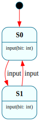
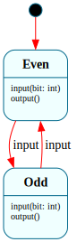
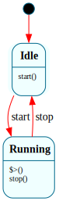
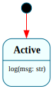

# Frame Cookbook

19 recipes showing how to solve real problems with Frame. Each recipe is a complete, runnable Frame spec with an explanation of the key patterns used.

For language syntax details, see the [Frame Language Reference](frame_language.md). For a tutorial introduction, see [Getting Started](frame_getting_started.md).

## Table of Contents

1. [Traffic Light](#1-traffic-light) — basic states and transitions
2. [Toggle Switch](#2-toggle-switch) — two-state with return values
3. [Turnstile](#3-turnstile) — event-driven guard logic
4. [Login Flow](#4-login-flow) — multi-step form wizard
5. [Connection Manager](#5-connection-manager) — lifecycle with enter/exit handlers
6. [Retry with Backoff](#6-retry-with-backoff) — state variables as counters
7. [Undo/Redo](#7-undoredo) — push/pop for snapshot history
8. [Modal Dialog Stack](#8-modal-dialog-stack) — push/pop with enter args
9. [Video Player](#9-video-player) — HSM with sub-states
10. [Order Processor](#10-order-processor) — business process with branches
11. [Approval Chain](#11-approval-chain) — multi-stage with forwarding
12. [Self-Calibrating Sensor](#12-self-calibrating-sensor) — `@@:self` reentrant dispatch + `@@:system.state`
13. [Switch Debouncer](#13-switch-debouncer) — state vars as counters with thresholds
14. [Early Return](#14-early-return) — `@@:return(expr)` for set-and-exit
15. [Mealy & Moore Machines](#15-mealy--moore-machines) — classical automata in Frame
16. [Session Persistence](#16-session-persistence) — save/restore with `@@persist`
17. [Async HTTP Client](#17-async-http-client) — async interface with two-phase init
18. [Multi-System Composition](#18-multi-system-composition) — two systems interacting
19. [Configurable Worker Pool](#19-configurable-worker-pool-parameterized-systems) — parameterized systems
20. [Subroutine State Returning a Result](#20-subroutine-state-returning-a-result) — decorated pop with fresh enter args

---

## 1. Traffic Light

**Problem:** Cycle through a fixed sequence of states on each event.


```frame
@@target python_3

@@system TrafficLight {
    interface:
        next(): str

    machine:
        $Green {
            next(): str {
                @@:("green")
                -> $Yellow
            }
        }
        $Yellow {
            next(): str {
                @@:("yellow")
                -> $Red
            }
        }
        $Red {
            next(): str {
                @@:("red")
                -> $Green
            }
        }
}

if __name__ == '__main__':
    light = @@TrafficLight()
    for _ in range(6):
        print(light.next())
```

**How it works:** Three states form a cycle. Each `next()` call sets the return value via `@@:(expr)` and transitions to the next state. The return value is delivered to the caller after the transition completes.

**Features used:** transitions (`->`), return values

---

## 2. Toggle Switch

**Problem:** A switch that alternates between on and off.


```frame
@@target python_3

@@system Switch {
    interface:
        toggle(): str
        status(): str

    machine:
        $Off {
            toggle(): str {
                @@:("on")
                -> $On
            }
            status(): str { @@:("off") }
        }
        $On {
            toggle(): str {
                @@:("off")
                -> $Off
            }
            status(): str { @@:("on") }
        }
}

if __name__ == '__main__':
    sw = @@Switch()
    print(sw.status())   # off
    print(sw.toggle())   # on
    print(sw.toggle())   # off
```

**How it works:** Two states, each handling the same events differently. The same `toggle()` call produces different behavior depending on which state the system is in — the core value of state machines.

**Features used:** transitions, return values, multiple states handling the same event

---

## 3. Turnstile

**Problem:** A coin-operated turnstile that locks after each passage.


```frame
@@target python_3

@@system Turnstile {
    interface:
        coin()
        push(): str

    machine:
        $Locked {
            coin() { -> $Unlocked }
            push(): str { @@:("locked - insert coin") }
        }
        $Unlocked {
            coin() { }
            push(): str {
                @@:("welcome")
                -> $Locked
            }
        }
}

if __name__ == '__main__':
    t = @@Turnstile()
    print(t.push())   # locked - insert coin
    t.coin()
    print(t.push())   # welcome
    print(t.push())   # locked - insert coin
```

**How it works:** `coin()` in `$Locked` transitions to `$Unlocked`. `push()` in `$Unlocked` lets you through and re-locks. `coin()` in `$Unlocked` is a no-op (empty handler). `push()` in `$Locked` doesn't transition — just returns a message.

**Features used:** events with no effect (empty handler), guard-by-state

---

## 4. Login Flow

**Problem:** A multi-step login: enter username, enter password, authenticate.


```frame
@@target python_3

@@system LoginFlow {
    interface:
        submit(value: str): str

    machine:
        $EnterUsername {
            submit(value: str): str {
                self.username = value
                @@:("enter password")
                -> "username entered" $EnterPassword
            }
        }
        $EnterPassword {
            submit(value: str): str {
                if self.authenticate(self.username, value):
                    @@:("welcome")
                    -> "authenticated" $LoggedIn
                else:
                    @@:("invalid - try again")
                    -> "bad credentials" $EnterUsername
            }
        }
        $LoggedIn {
            submit(value: str): str { @@:("already logged in") }
        }

    actions:
        authenticate(user, password) {
            return user == "admin" and password == "secret"
        }

    domain:
        username: str = ""
}

if __name__ == '__main__':
    login = @@LoginFlow()
    print(login.submit("admin"))    # enter password
    print(login.submit("wrong"))    # invalid - try again
    print(login.submit("admin"))    # enter password
    print(login.submit("secret"))   # welcome
```

**How it works:** Each state represents a step in the flow. `submit()` means different things in each state. Domain variable `username` persists across states. The action `authenticate` keeps validation logic out of the handler.

**Features used:** domain variables, actions, conditional transitions

---

## 5. Connection Manager

**Problem:** A network connection with proper setup/teardown lifecycle.


```frame
@@target python_3

@@system Connection {
    interface:
        connect(host: str)
        send(data: str): str
        disconnect()

    machine:
        $Disconnected {
            connect(host: str) {
                self.host = host
                -> $Connecting
            }
        }
        $Connecting {
            $>() {
                print(f"Connecting to {self.host}...")
                -> "connected" $Connected
            }
        }
        $Connected {
            $>() { print(f"Connected to {self.host}") }
            <$() { print(f"Disconnecting from {self.host}") }

            send(data: str): str {
                @@:(f"sent '{data}' to {self.host}")
            }
            disconnect() { -> $Disconnected }
        }

    domain:
        host: str = ""
}

if __name__ == '__main__':
    c = @@Connection()
    c.connect("example.com")   # Connecting... Connected
    print(c.send("hello"))     # sent 'hello' to example.com
    c.disconnect()             # Disconnecting...
```

**How it works:** `$>()` (enter) and `<$()` (exit) handlers run automatically during transitions. `$Connecting` transitions immediately in its enter handler — a common "transient state" pattern for setup work. The exit handler on `$Connected` ensures cleanup always happens.

**Features used:** enter/exit handlers, transient states, domain variables

---

## 6. Retry with Backoff

**Problem:** Retry an operation up to N times before failing.


```frame
@@target python_3

@@system Retrier {
    interface:
        start()
        status(): str

    machine:
        $Idle {
            start() {
                self.attempts = 0
                -> $Trying
            }
        }
        $Trying {
            $>() {
                self.attempts = self.attempts + 1
                if self.try_operation():
                    -> "succeeded" $Succeeded
                else:
                    if self.attempts >= self.max_retries:
                        -> "max retries" $Failed
                    else:
                        -> "retry" $Trying
            }
            status(): str { @@:("trying") }
        }
        $Succeeded {
            status(): str { @@:("succeeded") }
        }
        $Failed {
            status(): str { @@:("failed after max retries") }
        }

    actions:
        try_operation() {
            return False
        }

    domain:
        attempts: int = 0
        max_retries: int = 3
}

if __name__ == '__main__':
    r = @@Retrier()
    r.start()
    print(r.status())
```

**How it works:** The retry counter uses a **domain variable** (`self.attempts`), not a state variable, because state variables reset on every state entry. The enter handler increments the counter and either transitions to success, re-enters `$Trying` for another attempt, or gives up after `max_retries`. Each `-> $Trying` triggers a fresh enter handler call — the domain variable persists across re-entries.

**Features used:** domain variables for cross-state persistence, enter handler logic, self-transition for retry

---

## 7. Undo/Redo

**Problem:** Track editing history and allow stepping backward.


```frame
@@target python_3

@@system Editor {
    interface:
        type_char(c: str)
        undo()
        get_buffer(): str

    machine:
        $Init {
            type_char(c: str) {
                push$
                -> (c) $Editing
            }
            undo() { }
            get_buffer(): str { @@:("") }
        }
        $Editing {
            $.buffer: str = ""

            $>(snapshot: str) { $.buffer = snapshot }

            type_char(c: str) {
                push$
                -> ($.buffer + c) $Editing
            }
            undo() {
                -> pop$
            }
            get_buffer(): str { @@:($.buffer) }
        }
}

if __name__ == '__main__':
    e = @@Editor()
    e.type_char("H")
    e.type_char("i")
    print(e.get_buffer())   # Hi
    e.undo()
    print(e.get_buffer())   # H
    e.undo()
    print(e.get_buffer())   # (empty)
```

**How it works:** Each `type_char` does two things: `push$` saves the current compartment onto the state stack, then `-> (new_buffer) $Editing` creates a *new* compartment with the updated buffer. The old compartment on the stack is never modified — it's a snapshot. `undo()` pops the snapshot, restoring `$.buffer` to its previous value.

The `$Init` state handles the empty-editor case: the first `type_char` pushes `$Init` onto the stack and transitions into `$Editing`. Undoing all the way back pops to `$Init`, where `undo()` is a no-op and `get_buffer()` returns `""`.

**Key insight:** `push$` alone saves a *reference* to the current compartment. `push$` followed by a *transition* saves the old compartment and creates a new one — that's the snapshot.

**Features used:** `push$`, `-> pop$`, enter args (`-> (val) $State`), state variable preservation

---

## 8. Modal Dialog Stack

**Problem:** Open nested modal dialogs and return to the previous one on close.


```frame
@@target python_3

@@system DialogManager {
    interface:
        open(name: str)
        close(): str
        current(): str

    machine:
        $Main {
            open(name: str) {
                push$
                -> (name) $Dialog
            }
            current(): str { @@:("main") }
        }
        $Dialog {
            $.name: str = ""

            $>(name: str) { $.name = name }

            open(name: str) {
                push$
                -> (name) $Dialog
            }
            close(): str {
                @@:($.name)
                -> pop$
            }
            current(): str { @@:($.name) }
        }
}

if __name__ == '__main__':
    dm = @@DialogManager()
    print(dm.current())    # main
    dm.open("Settings")
    print(dm.current())    # Settings
    dm.open("Confirm")
    print(dm.current())    # Confirm
    print(dm.close())      # Confirm (closed)
    print(dm.current())    # Settings (restored)
    print(dm.close())      # Settings (closed)
    print(dm.current())    # main (restored)
```

**How it works:** `push$` saves the entire compartment (including state variables) onto the state stack before transitioning. `-> pop$` restores the previously saved compartment. Each dialog instance has its own `$.name` because state variables are per-compartment. This builds on the same `push$ + transition` snapshot pattern from recipe 7, applied to navigation.

**Features used:** `push$`, `-> pop$`, enter args (`-> (name) $Dialog`), state variables

---

## 9. Video Player

**Problem:** A media player with play/pause/stop, where playing and paused are sub-states of "active."


```frame
@@target python_3

@@system VideoPlayer {
    interface:
        play()
        pause()
        stop()
        status(): str

    machine:
        $Stopped {
            play() { -> $Playing }
            status(): str { @@:("stopped") }
        }
        $Playing => $Active {
            pause() { -> $Paused }
            status(): str { @@:("playing") }
            => $^
        }
        $Paused => $Active {
            play() { -> $Playing }
            status(): str { @@:("paused") }
            => $^
        }
        $Active {
            stop() { -> $Stopped }
        }
}

if __name__ == '__main__':
    vp = @@VideoPlayer()
    print(vp.status())   # stopped
    vp.play()
    print(vp.status())   # playing
    vp.pause()
    print(vp.status())   # paused
    vp.stop()             # handled by $Active (parent)
    print(vp.status())   # stopped
```

**How it works:** `$Playing` and `$Paused` are children of `$Active` (declared with `=>`). The `stop()` event is only handled by `$Active` — children forward it via `=> $^` (default forward). This avoids duplicating the `stop()` handler in both child states.

**Features used:** HSM (`=> $Parent`), default forward (`=> $^`), event delegation

---

## 10. Order Processor

**Problem:** Process an order through validation, processing, and completion — with cancellation support.


```frame
@@target python_3

@@system OrderProcessor {
    interface:
        submit(item: str)
        cancel(reason: str)
        status(): str

    machine:
        $Idle {
            submit(item: str) {
                self.item = item
                -> $Validating
            }
            status(): str { @@:("idle") }
        }
        $Validating {
            $>() {
                if self.validate(self.item):
                    -> "valid" $Processing
                else:
                    -> "invalid" $Rejected
            }
            status(): str { @@:("validating") }
        }
        $Processing {
            cancel(reason: str) {
                print(f"Cancelled: {reason}")
                -> "cancelled" $Idle
            }
            status(): str { @@:("processing") }
        }
        $Rejected {
            status(): str { @@:("rejected") }
        }

    actions:
        validate(item) {
            return item is not None and len(item) > 0
        }

    domain:
        item: str = ""
}

if __name__ == '__main__':
    op = @@OrderProcessor()
    op.submit("widget")
    print(op.status())     # processing
    op.cancel("changed mind")
    print(op.status())     # idle
```

**How it works:** `$Validating` is a transient state — its enter handler immediately transitions based on validation. `cancel()` is only handled in `$Processing` — calling it in other states is a no-op (ignored). This is a key benefit of state machines: events are naturally ignored when they don't apply.

**Features used:** transient states, actions, events ignored in wrong state

---

## 11. Approval Chain

**Problem:** A document requires approval from two reviewers before it's published.


```frame
@@target python_3

@@system ApprovalChain {
    interface:
        submit()
        approve(reviewer: str)
        reject(reviewer: str)
        status(): str

    machine:
        $Draft {
            submit() { -> $Review1 }
            status(): str { @@:("draft") }
        }
        $Review1 {
            approve(reviewer: str) {
                print(f"Approved by {reviewer}")
                -> "approved" $Review2
            }
            reject(reviewer: str) {
                print(f"Rejected by {reviewer}")
                -> "rejected" $Draft
            }
            status(): str { @@:("awaiting first review") }
        }
        $Review2 {
            approve(reviewer: str) {
                print(f"Approved by {reviewer}")
                -> "approved" $Published
            }
            reject(reviewer: str) {
                print(f"Rejected by {reviewer}")
                -> "rejected" $Draft
            }
            status(): str { @@:("awaiting second review") }
        }
        $Published {
            status(): str { @@:("published") }
        }
}

if __name__ == '__main__':
    doc = @@ApprovalChain()
    doc.submit()
    print(doc.status())            # awaiting first review
    doc.approve("Alice")
    print(doc.status())            # awaiting second review
    doc.reject("Bob")
    print(doc.status())            # draft (back to start)
```

**How it works:** Each review stage is a separate state. Rejection at any stage returns to `$Draft`. The same `approve`/`reject` interface serves different stages — the state determines what happens. Events like `submit()` are silently ignored in states that don't handle them.

**Features used:** multi-stage workflow, rejection loops, silent event ignoring

---

## 12. Self-Calibrating Sensor

**Problem:** A sensor that calibrates itself by reading its own value through the interface, then applying an offset.


```frame
@@target python_3

@@system Sensor {
    interface:
        calibrate(): str
        reading(): float
        trigger_shutdown()
        attempt_post_shutdown(): str
        status(): str

    machine:
        $Active {
            calibrate(): str {
                # @@:self.reading() dispatches through the full kernel pipeline.
                # It executes in $Active, returns 42.0.
                baseline = @@:self.reading()
                self.offset = baseline * -1
                @@:(f"calibrated: offset={self.offset}")
            }

            reading(): float {
                @@:(self.raw_value + self.offset)
            }

            trigger_shutdown() {
                -> $Shutdown
            }

            attempt_post_shutdown(): str {
                self.trace = "before"

                # This self-call transitions to $Shutdown.
                @@:self.trigger_shutdown()

                # *** SURPRISE: this line does NOT execute. ***
                # The transition guard detects that the system already
                # transitioned during the self-call above. All remaining
                # code in this handler is suppressed — the system is now
                # in $Shutdown, and running $Active code would be wrong.
                self.trace = "after"

                @@:(self.trace)
            }

            status(): str { @@:(@@:system.state) }
        }

        $Shutdown {
            status(): str { @@:(@@:system.state) }
        }

    domain:
        raw_value: float = 42.0
        offset: float = 0.0
        trace: str = ""
}

if __name__ == '__main__':
    # --- Self-call basics ---
    s = @@Sensor()
    print(s.reading())       # 42.0
    print(s.calibrate())     # calibrated: offset=-42.0
    print(s.reading())       # 0.0

    # --- Transition guard ---
    s2 = @@Sensor()
    s2.attempt_post_shutdown()
    print(s2.trace)          # "before" — "after" was suppressed
    print(s2.status())       # "Shutdown" (via @@:system.state)
```

**How it works:** `@@:self.reading()` dispatches through the full kernel pipeline — FrameEvent construction, context push, router, state dispatch, handler execution, context pop. The return value is available as a native expression. Each self-call gets its own context, so `@@:event`, `@@:params`, and `@@:return` are isolated from the calling handler.

The `status()` handlers use `@@:system.state` to return the current state name. This is a read-only accessor on the system runtime — it reads the compartment's `state` field, which holds the state identifier without the `$` prefix.

**Transition guard — the key subtlety:** Look at `attempt_post_shutdown()`. It calls `@@:self.trigger_shutdown()`, which transitions to `$Shutdown`. When control returns from the self-call, the system has already moved to `$Shutdown`. The transition guard detects this: it checks `_transitioned` on the current context and immediately returns, suppressing `self.trace = "after"` and the `@@:` return.

This is intentional. Code after a self-call that triggered a transition was written for `$Active` — but the system is now in `$Shutdown`. Executing that code would violate state assumptions. The guard prevents it.

**When the guard does NOT fire:** If the self-call's handler does NOT transition (like `calibrate()` calling `@@:self.reading()`), code after the self-call executes normally. The guard only activates when a transition actually occurred.

**Features used:** `@@:self.method()`, reentrant dispatch, return value from self-call, transition guard

---

## 13. Switch Debouncer

**Problem:** Filter noisy switch input — only register a press after the signal stabilizes.


```frame
@@target python_3

@@system Debouncer {
    interface:
        raw_high()
        raw_low()
        tick()
        is_pressed(): bool

    machine:
        $Released {
            $.stable_count: int = 0

            raw_high() { $.stable_count = $.stable_count + 1 }
            raw_low() { $.stable_count = 0 }
            tick() {
                if $.stable_count >= 3:
                    -> "stable high" $Pressed
            }
            is_pressed(): bool { @@:(False) }
        }
        $Pressed {
            $.stable_count: int = 0

            raw_low() { $.stable_count = $.stable_count + 1 }
            raw_high() { $.stable_count = 0 }
            tick() {
                if $.stable_count >= 3:
                    -> "stable low" $Released
            }
            is_pressed(): bool { @@:(True) }
        }
}

if __name__ == '__main__':
    d = @@Debouncer()
    # Noisy signal: high, low, high, high, high (stabilizes after 3)
    for signal in [1, 0, 1, 1, 1]:
        if signal:
            d.raw_high()
        else:
            d.raw_low()
        d.tick()
    print(d.is_pressed())   # True
```

**How it works:** State variables `$.stable_count` track consecutive consistent readings. A bouncy signal resets the counter. Only after 3 consecutive stable readings does the state transition. State variables reset on entry, so both directions start clean.

**Features used:** state variables as counters, threshold-based transitions

---

## 14. Early Return

**Problem:** A handler that needs to validate inputs and exit early on failure, without nested if/else chains.


```frame
@@target python_3

@@system Authenticator {
    interface:
        check(token: str): str

    machine:
        $Active {
            check(token: str): str {
                if token == "":
                    @@:return("error: empty token")
                if len(token) < 8:
                    @@:return("error: token too short")
                @@:("valid: " + token)
            }
        }
}

if __name__ == '__main__':
    auth = @@Authenticator()
    print(auth.check(""))                     # error: empty token
    print(auth.check("short"))                # error: token too short
    print(auth.check("valid-token-here"))     # valid: valid-token-here
```

**How it works:** `@@:return(expr)` does two things in one statement: it sets the interface return value AND exits the handler immediately. This replaces the common two-statement pattern of `@@:(expr)` followed by a native `return`.

The three forms for setting return values:

| Form | Effect |
|------|--------|
| `@@:(expr)` | Set return value; handler continues |
| `@@:return = expr` | Same as `@@:(expr)`, more verbose |
| `@@:return(expr)` | Set return value AND exit handler |

`@@:return(expr)` shines in validation chains where each failure case wants to bail out cleanly. The final `@@:("valid: " + token)` handles the success case after all validations pass.

**Features used:** `@@:return(expr)` set-and-exit form, validation chain pattern

---

## 15. Mealy & Moore Machines

**Problem:** Classical automata theory distinguishes two output models — Mealy (output depends on state + input) and Moore (output depends on state only). Both are first-class in Frame.

### Mealy: sequence detector for "10"




```frame
@@target python_3

@@system MealyDetector {
    interface:
        input(bit: int): str

    machine:
        $S0 {
            input(bit: int): str {
                if bit == 1:
                    @@:("0")
                    -> $S1
                else:
                    @@:("0")
            }
        }
        $S1 {
            input(bit: int): str {
                if bit == 0:
                    @@:("1")
                    -> $S0
                else:
                    @@:("0")
            }
        }
}

if __name__ == '__main__':
    m = @@MealyDetector()
    for bit in [1, 0, 1, 1, 0]:
        print(f"in={bit} out={m.input(bit)}")
```

**Mealy semantics:** the `input()` handler in `$S1` returns "1" only when the input is `0` (detected the "10" pattern); other inputs return "0". Output is a function of (state, input).

### Moore: parity checker




```frame
@@target python_3

@@system MooreParity {
    interface:
        input(bit: int)
        output(): str

    machine:
        $Even {
            input(bit: int) {
                if bit == 1:
                    -> $Odd
            }
            output(): str { @@:("even") }
        }
        $Odd {
            input(bit: int) {
                if bit == 1:
                    -> $Even
            }
            output(): str { @@:("odd") }
        }
}

if __name__ == '__main__':
    m = @@MooreParity()
    for bit in [1, 0, 1, 1, 0]:
        m.input(bit)
        print(f"in={bit} parity={m.output()}")
```

**Moore semantics:** `output()` returns the same value regardless of input — it depends only on the current state. `input()` is separate and only mutates state.

**The distinction in Frame:**
- **Mealy:** the input-handling event itself returns the output (`input(bit): str`).
- **Moore:** the input event returns nothing (`input(bit)`); a separate `output()` event reports state.

**Features used:** conditional return values, state-determined output, separation of input handling from output reporting

---

## 16. Session Persistence

**Problem:** Save a user session to disk and restore it later.


```frame
@@target python_3

@@persist
@@system Session {
    interface:
        login(user: str)
        logout()
        who(): str

    machine:
        $LoggedOut {
            login(user: str) {
                self.user = user
                -> $LoggedIn
            }
            who(): str { @@:("nobody") }
        }
        $LoggedIn {
            logout() {
                self.user = ""
                -> $LoggedOut
            }
            who(): str { @@:(self.user) }
        }

    domain:
        user: str = ""
}

if __name__ == '__main__':
    s = @@Session()
    s.login("alice")
    print(s.who())               # alice

    # Save
    data = s.save_state()

    # Restore into a new instance
    s2 = Session.restore_state(data)
    print(s2.who())              # alice (state preserved)
```

**How it works:** `@@persist` generates `save_state()` and `restore_state()`. The saved data includes the current state (`$LoggedIn`), domain variables (`user = "alice"`), and the state stack. Restore does NOT fire the enter handler — it reconstructs the exact state.

**Features used:** `@@persist`, save/restore, domain variables

---

## 17. Async HTTP Client

**Problem:** An HTTP client with async connect/fetch/disconnect.


```frame
@@target python_3

import aiohttp
import asyncio

@@system HttpClient {
    interface:
        async connect(url: str)
        async fetch(path: str): str
        async disconnect()

    machine:
        $Idle {
            $>() {
                print("Ready")
            }
            connect(url: str) {
                self.base_url = url
                -> $Connected
            }
        }
        $Connected {
            $>() { print(f"Connected to {self.base_url}") }
            <$() { print("Closing connection") }

            fetch(path: str): str {
                async with aiohttp.ClientSession() as session:
                    async with session.get(self.base_url + path) as resp:
                        return await resp.text()
            }
            disconnect() { -> $Idle }
        }

    domain:
        base_url: str = ""
}

async def main():
    client = @@HttpClient()
    await client.init()          # async two-phase init
    await client.connect("https://example.com")
    html = await client.fetch("/")
    print(f"Got {len(html)} bytes")
    await client.disconnect()

asyncio.run(main())
```

**How it works:** `async` on interface methods makes the entire dispatch chain async. The constructor is synchronous — `await client.init()` fires the enter event separately (two-phase init). Native `await` in handler bodies works because the generated methods are async.

**Features used:** `async` interface methods, two-phase init, native async code in handlers

---

## 18. Multi-System Composition

**Problem:** A logger and an app as separate systems, with the app using the logger.





```frame
@@target python_3

@@system Logger {
    interface:
        log(msg: str)

    machine:
        $Active {
            log(msg: str) {
                print(f"[LOG] {msg}")
            }
        }
}

@@system App {
    interface:
        start()
        stop()

    machine:
        $Idle {
            start() {
                self.logger.log("App starting")
                -> $Running
            }
        }
        $Running {
            $>() { self.logger.log("App running") }
            stop() {
                self.logger.log("App stopping")
                -> $Idle
            }
        }

    domain:
        logger = @@Logger()
}

if __name__ == '__main__':
    app = @@App()
    app.start()
    app.stop()
```

**How it works:** Two `@@system` blocks in one file generate two independent classes. `@@Logger()` in the domain section instantiates the logger as a domain variable. Systems interact through their public interfaces — they don't share state.

**Features used:** multi-system files, `@@SystemName()` instantiation, domain variable initialization

---

## 19. Configurable Worker Pool (Parameterized Systems)

**Problem:** A task executor whose pool size and retry policy are set at construction time.


```frame
@@target python_3

@@system WorkerPool($(max_retries: int), $>(start_msg: str), pool_size: int) {
    interface:
        submit(task: str)
        get_status(): str

    machine:
        $Idle(max_retries: int) {
            $>(start_msg: str) {
                print(f"Pool ready: {start_msg}")
            }

            submit(task: str) {
                self.pending.append(task)
                if len(self.pending) >= self.pool_size:
                    -> "batch full" $Processing
            }

            get_status(): str {
                @@:(f"idle ({len(self.pending)}/{self.pool_size} pending)")
            }
        }

        $Processing {
            $>() {
                print(f"Processing batch of {len(self.pending)} tasks")
                self.pending.clear()
            }

            submit(task: str) {
                self.pending.append(task)
            }

            get_status(): str {
                @@:("processing")
            }
        }

    domain:
        pool_size: int = pool_size
        pending: list = []
}

if __name__ == '__main__':
    pool = @@WorkerPool($(5), $>("v1.0"), 3)
    # → "Pool ready: v1.0"

    pool.submit("task_a")
    print(pool.get_status())    # "idle (1/3 pending)"

    pool.submit("task_b")
    pool.submit("task_c")       # batch threshold reached
    # → "Processing batch of 3 tasks"

    print(pool.get_status())    # "processing"
```

**How it works:** The system header declares three parameter groups in canonical order — state, enter, domain:

| Parameter | Sigil | Kind | Where it goes |
|-----------|-------|------|---------------|
| `$(max_retries: int)` | `$()` | State | `compartment.state_args["max_retries"]` — readable in the start state's handlers as `max_retries` |
| `$>(start_msg: str)` | `$>()` | Enter | `compartment.enter_args["start_msg"]` — readable in the start state's `$>` handler as `start_msg` |
| `pool_size: int` | (bare) | Domain | `self.pool_size` via `domain: pool_size = pool_size` |

At the call site, the caller tags each argument with the matching sigil:
```python
pool = @@WorkerPool($(5), $>("v1.0"), 3)
```

The framepiler substitutes Frame defaults for missing arguments and routes each to its compartment field. Transitions like `-> $Processing` create a new compartment with its own state_args, so state params are scoped per-state.

**Features used:** system parameters (state, enter, domain), sigil-tagged call-site syntax, `@@:(expr)` context return, state transitions triggered by threshold

---

## 20. Subroutine State Returning a Result

**Problem:** A modal dialog state needs to communicate a status (confirmed/cancelled) back to the state that pushed it.

```frame
@@target python_3

@@system Workflow {
    interface:
        open_dialog()
        confirm()
        cancel()

    machine:
        $Working {
            open_dialog() {
                push$
                -> $Dialog
            }
        }
        $Dialog {
            confirm() {
                ("confirmed") -> pop$
            }
            cancel() {
                ("cancelled") -> pop$
            }
        }
}

if __name__ == '__main__':
    w = @@Workflow()
    w.open_dialog()
    w.confirm()
    w.open_dialog()
    w.cancel()
```

**How it works:** `$Working` pushes itself onto the state stack and transitions to `$Dialog`. When the user confirms or cancels, `("reason") -> pop$` writes exit args on the `$Dialog` compartment before popping. The `<$` handler on `$Dialog` (if present) receives the reason. The saved `$Working` compartment is restored with all its state variables intact.

**Other decorated pop forms:**
- `-> (enter_args) pop$` — replace the popped compartment's enter args (the restored state's `$>` handler receives fresh values instead of the snapshot)
- `-> => pop$` — forward the current event to the restored state instead of sending `$>`
- `(exit) -> (enter) => pop$` — all three combined

**Features used:** state stack (`push$` / `pop$`), decorated pop with exit args

---

